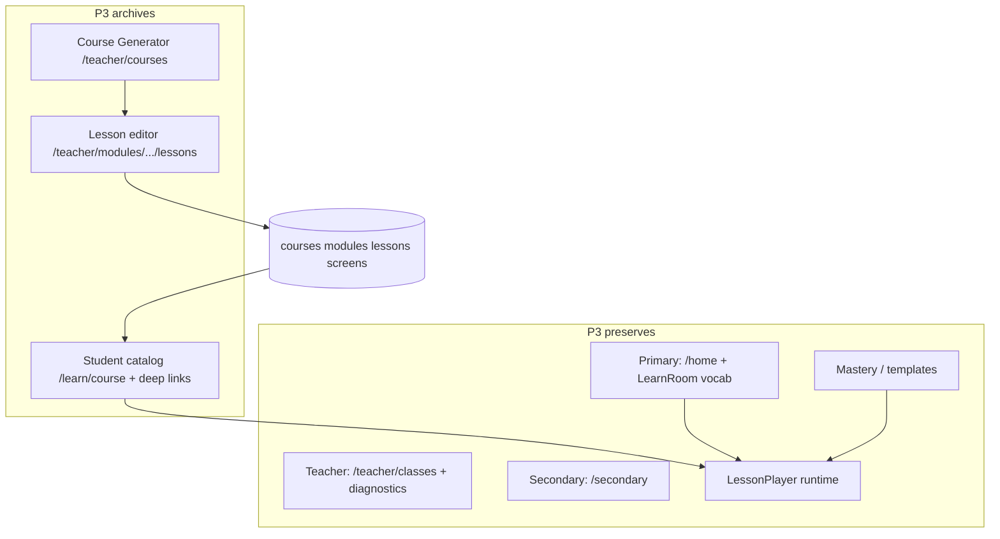

# Proposal: P3 — Archive course CMS & lesson authoring

**Status:** Implemented (2026-07-09)  
**Prepared:** 2026-07-09  
**Track:** Legacy generator sunset — Phase 3 (course management)  
**Depends on:** P2A–P2C ✅ (activity library, Gemini AI, QuizBuilder archived) · T0–T2 ✅ (teacher classes + diagnostics) · Primary hub vocab path ✅  
**Parent:** Org chart (“We Know English eLearning Organization”) · [milestone-1-route-inventory.md](./milestone-1-route-inventory.md)  
**Blocks:** Class-scoped assignments (future) · Secondary learn lane · T3 class insights (unchanged)

---

## 1. Executive summary

**P3** cleanly archives the **legacy course management stack** — teacher **Course Generator** authoring and student **published-course catalog** — so engineering focus shifts to:

| Focus area | Routes / surfaces |
| --- | --- |
| **Primary portal** | `/home` (Learn room vocab hub, pet, garden, quests, grammar link) |
| **Secondary portal** | `/secondary` (vocab quiz today; learn lane later) |
| **Teacher classes** | `/teacher/classes` (roster, join codes, T2 diagnostics) |
| **Knowledge engine** | Mastery P1 sync, vocab/grammar templates (runtime only) |

**Explicitly not archived:**

- `/learn` → `/home?room=learn` redirect and **`LearnRoom`** (vocab hubs + grammar + secondary links)
- **`LessonPlayer`** runtime (vocab overlays, grammar posters, pilots, secondary)
- **`/teacher/media`** (asset library)
- **`/teacher/classes`** and T-track diagnostic UI
- Supabase **`courses` / `modules` / `lessons` / `lesson_screens` tables** (data retained; no destructive migration)

| Deliverable | Student-visible? | Teacher-visible? |
| --- | --- | --- |
| Student course catalog routes → 404 | Yes (removed) | — |
| Student lesson deep links `/learn/.../lesson` → 404 | Yes (removed) | — |
| Teacher Course Generator routes → 404 | — | Yes (removed) |
| Teacher lesson editor routes → 404 | — | Yes (removed) |
| Re-home teacher default path → `/teacher/classes` | — | Yes |
| Remove course CRUD server actions & data helpers | — | — |
| Slim `catalog.ts` to shared screen types only | — | — |
| Remove orphaned clients (`LearnClient`, etc.) | — | — |
| Update route inventory + QA checklist | — | — |

**Effort:** ~2–3 focused sessions (6–10 hours) across phased PRs  
**Risk:** Medium — breaking published lesson URLs; optional `teacher_classes.course_id` display; profile progress stats referenced DB lessons

---

## 2. Problem

The codebase still carries a **parallel product** from an earlier “course CMS” era:

```
Teacher: Course Generator → Module → Lesson → Screen editor → Publish
Student: /learn/course → local enroll → /learn/module/lesson → LessonPlayer
```

Meanwhile the **actual student journey** (per org chart and Milestone 1) is:

```
/home → Learn room (vocab templates) → LessonPlayer overlay
/grammar → grammar posters → LessonPlayer
/secondary → vocab quiz (+ learn lane planned)
```

| Gap today | Impact |
| --- | --- |
| Two meanings of “/learn” | Redirect = vocab hub; deep URLs = DB course catalog |
| Teacher home = course-first wall | Conflicts with classes portal as teacher home |
| `TEACHER_DEFAULT_PATH` = `/teacher/courses` | New teachers land in legacy CMS |
| Local `enrolledCourseIds` | Course enrollment invisible to classes roster |
| Orphan components | `LearnClient`, `CourseSelectionClient`, `ProfileClient` unused |
| Lesson editor still large surface | Distraction from primary/secondary + class management |
| `teacher_classes.course_id` optional FK | Links to CMS courses teachers will no longer manage |

P2 removed activity-library / AI / QuizBuilder **on top of** this CMS. **P3 removes the CMS itself** while keeping the lesson **player** as shared runtime infrastructure.

---

## 3. Goals and non-goals

### 3.1 In scope

1. **404 or redirect** all student **published-course** routes except `/learn` hub redirect
2. **404** all teacher **course/module/lesson editor** routes
3. **Re-home** teacher portal defaults and nav to **Classes**
4. **Remove** course/module/lesson **CRUD** actions and teacher data helpers used only by CMS
5. **Remove** published-catalog fetchers from `lib/data/catalog.ts`; **retain** `LessonScreenRow` and related types (move to `lib/lesson-schemas` or `lib/lesson/types.ts`)
6. **Remove** course-only helpers: `lib/gating.ts`, `lib/activity-library-mirror.ts`, `CourseWallBoard`, course forms, lesson-editor workspace
7. **Stop** surfacing `enrolledCourseIds` / course progress in UI (field may remain in local storage snapshot for backward compat)
8. **Remove** optional **course picker** from class create/edit (FK column stays nullable in DB)
9. **Update** docs: route inventory, teacher README, post-login paths
10. **QA doc:** `QA_P3_COURSE_CMS_ARCHIVE.md`

### 3.2 Out of scope (defer)

| Item | Reason |
| --- | --- |
| Drop `courses` / `modules` / `lessons` / `lesson_screens` tables | Data preservation; no migration in P3 |
| Drop `activity_library_items` table | Already deferred in P2A |
| Class-scoped lesson **assignments** | Future rebuild under classes portal |
| “Light authoring” replacement | Product design not ready |
| Rename student nav “Lessons” → “Learn” | Optional polish in P3D; not blocking |
| Remove `completedLessonIds` from progress snapshot | Still used by vocab/grammar session completion semantics |
| Archive `/pilots/*`, `/teststartpage`, `/board-game` | Separate Tier-A cleanup track |
| Secondary learn lane implementation | Next student track after archive |

### 3.3 Hard preserves (do not break)

| Asset | Used by |
| --- | --- |
| `LessonPlayer` | Vocab overlays, grammar, pilots, secondary |
| `LessonGate` | Only course deep links today — **may be deleted** if lesson route archived; gating logic not needed for template lessons |
| `LearnRoom` + vocab template menus | `/home?room=learn` |
| `VocabularySetOverlay` / `build-screens.ts` | Primary vocab practice |
| `GrammarPosterOverlay` | `/grammar` |
| `DailyBakeryQuestPilot` | Golden reference pilot |
| Mastery P1 sync | All practice lanes |
| T0–T2 classes + diagnostics | Teacher portal core |
| `/teacher/media` | Asset management |

---

## 4. Phased implementation

Phases are ordered so each PR is deployable and testable. **Approve the full P3 plan; implement phase-by-phase.**

### P3A — Teacher portal re-home (low risk)

**Goal:** Teachers land in **Classes**, not Course Generator, before routes are removed.

| Change | Detail |
| --- | --- |
| `TEACHER_DEFAULT_PATH` | `/teacher/courses` → `/teacher/classes` |
| `post-login-path`, `roles.ts`, teacher login `next` default | Same |
| `TeacherPrimaryTabs` | Remove **Course Generator** tab; default active tab logic = classes / media only |
| `/teacher` home page | Replace course-first wall with **classes summary** (list classes, link to create, link to media) |
| `TeacherSecureShell` header link | Point to `/teacher/classes` |
| Secure layout redirect | `next=/teacher/classes` |

**Files (indicative):** `lib/auth/roles.ts`, `lib/auth/post-login-path.test.ts`, `app/teacher/login/LoginForm.tsx`, `app/teacher/(secure)/layout.tsx`, `app/teacher/(secure)/page.tsx`, `components/teacher/TeacherPrimaryTabs.tsx`, `components/teacher/TeacherSecureShell.tsx`

**Tests:** Update `post-login-path.test.ts`

---

### P3B — Teacher CMS routes archive (medium risk)

**Goal:** Course Generator and lesson editor return **404**; no new authoring.

| Route | Action |
| --- | --- |
| `/teacher/courses` | `notFound()` |
| `/teacher/courses/new` | `notFound()` |
| `/teacher/courses/[id]` | `notFound()` |
| `/teacher/courses/[id]/edit` | `notFound()` |
| `/teacher/modules/new` | `notFound()` |
| `/teacher/modules/[id]` | `notFound()` |
| `/teacher/modules/[id]/lessons/new` | `notFound()` |
| `/teacher/modules/[id]/lessons/[lessonId]` | `notFound()` |

**Delete** (after routes stubbed):

- `components/teacher/CourseWallBoard.tsx`
- `components/teacher/CourseCoverMediaFields.tsx`
- `components/teacher/lesson-editor/**` (entire folder)
- `app/teacher/(secure)/courses/**`
- `app/teacher/(secure)/modules/**`
- Orphan `AiLessonPanel.tsx` if still present

**Server layer — remove from `lib/actions/teacher.ts`:**

- `saveCourse`, `saveModule`, `deleteModule`
- `saveLesson`, `deleteLesson`
- `ensureLessonBookendsForEditor`, `duplicateLesson`, `importLessonScreensJson`
- `addScreenTemplate`, `updateScreenPayload`, `deleteScreen`, `moveScreen`, `reorderScreens`, `duplicateScreen`
- `saveLessonSkills`, `saveLessonCompletionPlayground`, `saveLessonLearningGoals`
- `revalidatePublishedCatalog` and `/learn` layout revalidation tied to publish

**Data layer — remove from `lib/data/teacher.ts`:**

- `getAllCourses`, `getCourse`, `getAllModules`, `getModule`, `getAllLessons`, `getLessonsForModule`, `getLessonsForModules`, `getScreens`
- Order-index helpers for course/module/lesson creation

**Classes UI:**

- Remove **course** dropdown from `classes/new` and class detail “linked course” display
- `teacher-classes` actions: stop accepting `course_id` (or ignore)

**Keep:** `/teacher/media`, `/teacher/classes/**`, mastery diagnostic components

---

### P3C — Student course catalog archive (medium risk)

**Goal:** Students cannot browse or play **DB-published course lessons** via catalog URLs. **Vocab Learn room unchanged.**

| Route | Action |
| --- | --- |
| `/learn` | **Keep** redirect → `/home?room=learn` |
| `/learn/course/[courseSlug]` | `notFound()` |
| `/learn/[moduleSlug]/[lessonSlug]` | `notFound()` |
| `/learn/[moduleSlug]` (if exists) | `notFound()` |

**Delete:**

- `app/(student)/learn/course/**`
- `app/(student)/learn/[moduleSlug]/**`
- `app/(student)/learn/LearnClient.tsx`
- `app/(student)/learn/CourseSelectionClient.tsx`
- `app/(student)/learn/loading.tsx` and lesson loading shells (if only used by archived routes)
- `components/lesson/LessonGate.tsx` (only consumed by archived lesson page)
- `lib/gating.ts` (only consumed by catalog clients)

**Optional nav polish (same PR or P3D):**

- `StudentShell`: rename **Lessons** → **Learn** (still `href="/learn"` → hub room)

**Local storage:**

- Stop calling `enrollInCourse` from any UI
- Leave `enrolledCourseIds` in schema; no migration required

---

### P3D — Shared library cleanup (low–medium risk)

**Goal:** Remove dead imports; keep types the live player needs.

| Module | Action |
| --- | --- |
| `lib/data/catalog.ts` | Delete published-catalog fetchers (`getPublishedCatalog*`, `getLessonPageContext`). **Move** `LessonScreenRow`, `LessonRow`, `ModuleRow`, `CourseRow` types to `lib/lesson/types.ts` (or extend `lesson-schemas.ts`) |
| `lib/activity-library-mirror.ts` | Delete (only referenced by archived `saveLesson`) |
| `lib/lesson-editor-checklist.ts` + test | Delete if only used by editor |
| `LessonPlayer.tsx` | Remove “back to teacher courses” link; remove course-catalog-specific copy if any |
| `ProfileClient.tsx` | Delete (orphan; `/profile` already redirects to hub collection) |
| `app/(student)/profile/ProfileClient.tsx` | Delete file |

**Update imports** in live code:

- `LessonPlayer`, `ScreenEditorCard` (if any remain), vocab/grammar `build-screens.ts`, golden references, grammar quiz items

**Tests:** Fix import paths; remove tests for deleted modules

---

### P3E — Docs, inventory, sign-off

| Doc | Update |
| --- | --- |
| `milestone-1-route-inventory.md` | Mark `/learn/course/*` and `/learn/.../lesson` archived; clarify `/learn` = hub redirect only |
| `README.md` (web) | Teacher workflow = classes + media; remove course generator references |
| `CURSOR_LESSON_CREATION_HANDOFF.md` | Add **archived** banner or move to `docs/archive/` |
| `lesson-player-master-document.md` | Note player is template-driven; CMS authoring removed |
| `QA_P3_COURSE_CMS_ARCHIVE.md` | Manual regression checklist (below) |

---

## 5. Database & RLS

**No migration required for P3.**

| Table | P3 behavior |
| --- | --- |
| `courses`, `modules`, `lessons`, `lesson_screens` | Rows remain; no teacher UI writes |
| `teacher_classes.course_id` | Column remains nullable; UI stops setting it |
| RLS on course tables | Unchanged; anon published reads become unused |

Optional **future** migration (not P3): revoke anon `select` on published courses if tables are truly retired.

---

## 6. Risk register

| Risk | Likelihood | Mitigation |
| --- | --- | --- |
| Teachers rely on lesson editor for live content | Medium | Confirm no production dependency; export/SQL snapshot before P3B |
| Bookmarked `/learn/foo/bar` lesson URLs break | High | Expected; communicate to staff; pilots use `/pilots` or hub |
| `teacher_classes.course_id` shows stale course names | Low | Remove course display in P3B |
| Test suite references course fixtures | Medium | Update in P3D |
| `LessonScreenRow` type move breaks many imports | Low | Single PR for type extraction; run full test suite |
| Collection badges counted DB lessons | Low | Audit `collection-badges.ts` / profile stats; scope to template lesson IDs only |

---

## 7. QA checklist (summary)

Full checklist in `QA_P3_COURSE_CMS_ARCHIVE.md`. Minimum bar:

### Teacher

- [ ] Login lands on `/teacher/classes`
- [ ] Classes tab works; create class, join code, roster, T2 diagnostic
- [ ] `/teacher/courses` and lesson editor URLs return 404
- [ ] Media library still loads upload/grid
- [ ] No nav link to Course Generator

### Student — preserved

- [ ] `/learn` → `/home?room=learn` opens vocab hub
- [ ] Vocab set opens overlay → `LessonPlayer` → reward → return hub
- [ ] Grammar link from Learn room works
- [ ] Secondary card / `/secondary` works
- [ ] Mastery sync unchanged after practice

### Student — archived

- [ ] `/learn/course/*` → 404
- [ ] `/learn/[module]/[lesson]` → 404

### Regression

- [ ] `npm test` (or project test command) passes
- [ ] No console errors on `/home` and `/teacher/classes`

---

## 8. Approval questions

Please confirm or adjust before implementation:

1. **Lesson deep links:** Approve **404** for all `/learn/[module]/[lesson]` URLs? (Alternative: redirect to `/home` with toast — not recommended; hides broken assignments.)
2. **Teacher home:** Approve **`/teacher/classes`** as default post-login and `/teacher` landing?
3. **DB data:** Approve **retain** course tables with no UI (no SQL drop)?
4. **Class course link:** Approve removing optional **course picker** from class forms?
5. **Student nav label:** Rename **Lessons** → **Learn** in `StudentShell`? (Recommended small polish.)
6. **Phasing:** Approve **P3A → P3E** sequence as separate PRs?

---

## 9. Relationship to org chart



After P3, the application shape matches the org chart: **teacher dashboard = classes + insight**, **primary = hub vocab/grammar**, **secondary = its own portal**, **knowledge engine = mastery under the hood** — without the legacy CMS spine in the middle.

---

## 10. Suggested approval response

Reply with:

- **Approved** (all phases) or **Approved P3A–P3C only** (defer cleanup/docs)
- Answers to §8 questions
- Any **hard requirement** to keep specific published lesson URLs working (if yes, we need a redirect map before P3C)

---

*End of proposal.*
