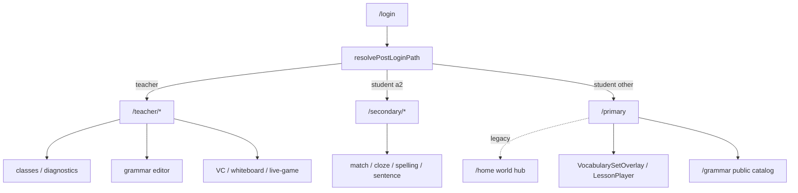

# 01 — System Map

Audit date: 2026-07-20  
Evidence bases: `evidence/route-inventory.md`, `evidence/data-flow-inventory.md`

## 1. Application shape

| Layer | Location | Role |
|-------|----------|------|
| Next.js App Router | `web/app/` | Routes; `(student)` / `teacher/(secure)` groups |
| Client UI | `web/components/` | Lesson player, primary dashboard, secondary practice, kid-ui, teacher tools |
| Domain libs | `web/lib/` | Auth, mastery, vocabulary templates, secondary packs, grammar, progress, rewards |
| Content (files) | `web/content/`, `web/lib/**/*.json` | Grammar posters, secondary vocab pack |
| Supabase | `web/lib/supabase/*`, migrations | Auth, mastery sync, classes, grammar modules, live sessions |
| Docs / specs | `web/docs/` | Mastery, GKE, live-game proposals (not runtime) |

## 2. Portal boundaries



**Confirmed:** Secondary eligibility is `learning_band === "a2"` only (`lib/auth/student-bands.ts`).  
**Confirmed:** Default student path is `/primary` (`STUDENT_DEFAULT_PATH` in `lib/auth/roles.ts`).  
**Confirmed:** Auth enforcement is **page-level**, not middleware (`proxy.ts` / `lib/supabase/middleware.ts` refresh cookies only).

## 3. Primary surfaces (dual hub)

| Surface | Route | Purpose |
|---------|-------|---------|
| Canonical dashboard | `/primary` | Learn, Vocabulary, Grammar link, Games, Review, Progress |
| Legacy hub | `/home` | World rooms, pet, garden, explore, collection |
| Redirects | `/learn`, `/profile`, `/testprimary` | Into `/primary` tabs |

**Architectural risk:** Two student “homes” remain live; Games tab still links to world hub for explore.

## 4. Secondary surfaces

| Surface | Route |
|---------|-------|
| Home / path | `/secondary` |
| Activities | `/secondary/match`, `/cloze`, `/spelling`, `/sentence` |
| Login | `/secondary/login` |

Layout: `SecondaryPracticeLayout` — shared today-session, word images, progress card.

## 5. Shared foundation

| Concern | Module(s) |
|---------|-----------|
| Lesson runtime | `LessonPlayer`, `lib/lesson-schemas.ts`, story phases |
| Mastery engine | `lib/mastery/*` (local + Supabase sync) |
| Rewards / XP | `lib/progress/rewards.ts`, unlock registry |
| Practice session bus | `lib/student-session.ts` (local, unscoped) |
| Kid chrome | `components/kid-ui/*` (Primary + visual bleed to Secondary) |
| Media | Teacher media library; vocab set media loaders |

## 6. Content hierarchy (as enforced today)

```
Primary:
  Topic cluster (file/naming convention only)
    → VocabularySetDefinition (id, words, falseClaims)
      → Screens (learn / T/F / drag_match / fill_blanks / letter_mixup)
        → Word lemma as language target
        → Mastery target ids (vocabulary.*)

Secondary:
  Vocab pack (packId + version)
    → Items (lemma, cefrLevel, gradeBand, activity eligibility)
      → Daily session selection
        → Activity attempts → mastery bridge

Grammar:
  Catalog module → poster JSON (+ optional DB draft/publish)
    → Optional quiz items (1 slug populated) → grammar mastery targets

Not independently modeled in Primary storage:
  grade · learner age · CEFR · strand · unit · learning objective · assessment item bank
```

## 7. Data stores (student learning)

| Store | Scoped? | Sync |
|-------|---------|------|
| Mastery + evidence buffer | Yes (`scopedLocalStorageKey`) | Supabase pull/push |
| Rewards / progress | Yes | Local-first |
| Student practice session events | **No** | Local only |
| Secondary today session | Local keys | Pack-version gated |
| Grammar completion helpers | Via session events | Local |

## 8. Teacher / CMS reality

| Authoring path | Status |
|----------------|--------|
| Course CMS `/activities` | Archived (`notFound`) |
| Grammar poster editor | Live |
| Media library | Live |
| Live-game question sets | Live (parallel evidence model) |
| Primary vocab sets | **Code modules** — deploy to publish |
| Secondary pack | **JSON file** — deploy to publish |

## 9. Major modules (oversized / central)

| Module | Role | Note |
|--------|------|------|
| `LessonPlayer.tsx` / `StoryBookView.tsx` | Interaction runtime | Large; many subtypes |
| `StudentHomeLanding.tsx` / `PrimaryDashboardClient.tsx` | Primary shell | New portal |
| `StudentHubClient` + rooms | Legacy primary world | Still linked |
| `SecondaryPracticeLayout` | Secondary shell | |
| `lib/mastery/*` | Evidence → mastery | Vocab-strong; grammar thin |

## 10. Open product boundaries (for later findings)

1. Is `/home` permanent product or migration residue?
2. Is `/grammar` intentionally public (unauthenticated)?
3. Should Secondary share kid-ui visual tokens?
4. Is unlock-by-level part of curriculum or economy-only?
