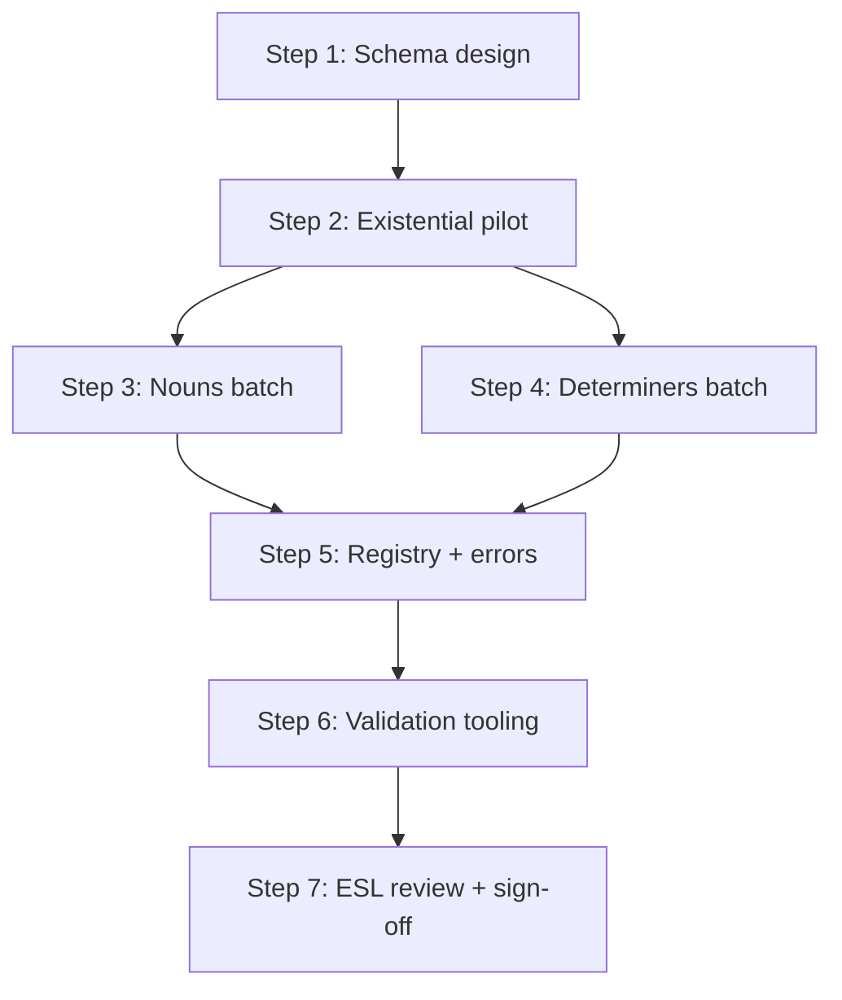

# Phase 1 — Ontology Population Plan

**Status:** Awaiting approval  
**Prepared:** 2026-07-07  
**Prerequisite:** [PHASE-0-SIGNOFF.md](./PHASE-0-SIGNOFF.md) (complete)

---

## Goal

Turn Phase 0 domain research into **validated, machine-readable ontology files** that downstream phases (progression graph, content mapping, mastery evidence, standards index) can consume without rework.

Phase 1 is **docs + JSON exports only**. No runtime wiring, no `catalog.json` changes, no quiz refactors.

---

## Scope boundary

### In scope (v1 A1–A2)

| Layer | Count | Source |
|-------|-------|--------|
| L1 domains | 3 populated + 2 stubs | existential, nouns, determiners (+ verbs, clauses stubs) |
| L2 systems | 4 populated | `there_is_are`, `countability`, `plural`, `quantifiers` |
| L3 concepts | 8 | All live poster slugs |
| L4 micro-skills | ~31 | Poster card tables in domain docs |
| L5 descriptors | ~31 | One paraphrased performance line per L4 |
| Error codes | ~14 | Cross-linked from domain error tables |

### Out of scope (deferred)

| Item | Phase |
|------|-------|
| `progression-edges.json` (full graph file) | 2 |
| `catalog.json` `conceptId` fields | 3 |
| Quiz item → L4 mapping in code | 3 |
| `recordGrammarEvidence()` / mastery wiring | 4 |
| `standards-index.json` (EGP/YLE attribution bundle) | 5 |
| B1+ deep population | Future |
| Thai L1 interference tags | Deferred |
| Hub `sortOrder` alignment with teach order | Product decision (optional in 3) |

---

## Deliverables

```
docs/grammar-knowledge-engine/
  SCHEMA.md                          # Human-readable field reference
  exports/
    schemas/
      concept-record.schema.json     # L1–L3
      micro-skill-record.schema.json # L4 + L5
      errors-record.schema.json      # error.* registry
    domains-index.json               # L1/L2 tree + labels
    concepts-a1-a2.json              # All L3 concept records
    micro-skills-a1-a2.json          # All L4 + embedded L5
    errors-a1-a2.json                # Error families + L4 links
  governance/
    ID-MIGRATIONS.md                 # Empty log (only if IDs change)
  PHASE-1-SIGNOFF.md                 # Exit checklist (end of phase)
```

**Validation (new):**

- `scripts/validate-gke-exports.ts` — JSON Schema + ID uniqueness + parent refs
- `npm run validate:gke` — added to CI path (optional: hook into `prebuild` after Phase 1 stable)

---

## Record shape (proposed)

### L3 concept (in `concepts-a1-a2.json`)

```json
{
  "id": "grammar.existential.there_is_are.affirmative",
  "level": 3,
  "parentId": "grammar.existential.there_is_are",
  "label": { "teacher": "There is / There are — Affirmative", "student": "There is… / There are…" },
  "function": "Say what exists in a place",
  "cefr": ["A1"],
  "yle": ["starters"],
  "strands": ["language_focused_learning", "meaning_focused_input"],
  "teachOrder": 1,
  "posterSlug": "there-is-there-are-affirmative-a1",
  "precursorIds": ["domain_entry"],
  "successorIds": ["grammar.existential.there_is_are.questions"],
  "contrastIds": [],
  "status": "published"
}
```

### L4 micro-skill (in `micro-skills-a1-a2.json`)

```json
{
  "id": "grammar.existential.there_is_are.affirmative.singular_countable",
  "level": 4,
  "parentConceptId": "grammar.existential.there_is_are.affirmative",
  "label": { "teacher": "There is + singular countable", "student": "There is…" },
  "posterCardRef": { "slug": "there-is-there-are-affirmative-a1", "cardIndex": 0 },
  "l5Descriptor": "Can say There is a … for one countable thing",
  "evidenceModes": ["recognition", "production"],
  "errorCodes": ["error.agreement.there_is_with_plural_noun"],
  "status": "published"
}
```

### Design rules

1. **IDs frozen** per [ID-NAMING.md](./governance/ID-NAMING.md) v0.1 — changes go to `ID-MIGRATIONS.md`.
2. **Precursor/successor on L3 only** in Phase 1 (inline arrays). Phase 2 lifts these into `progression-edges.json` with edge metadata (`complexity`, `strandWeight`).
3. **L5 embedded in L4** as `l5Descriptor` string (not separate file in v1).
4. **Paraphrased descriptors only** — no bulk EGP text; optional `standardsRef` stub field for Phase 5.
5. **`posterSlug` + `posterCardRef`** bridge to live content without modifying posters yet.
6. **`targetType: "grammar"`** in mastery layer will use `id` as `targetKey` (Phase 4).

---

## Logical work order

Work proceeds in **dependency order**: schema first, existential pilot second, then parallelizable domain batches, then cross-cutting validation.



---

## Step 1 — Schema design (foundation)

**Why first:** Every later step writes to the same shapes. Changing schema after population is expensive.

| Task | Output |
|------|--------|
| 1.1 Draft `SCHEMA.md` | Field glossary, required vs optional, enums |
| 1.2 Write JSON Schemas | `concept-record`, `micro-skill-record`, `errors-record` |
| 1.3 Define enums | `cefr`, `yle`, `strands` (from `lib/learning-strands.ts`), `evidenceModes`, `status` |
| 1.4 Define `domain_entry` sentinel | Document as valid precursor for first concept in a chain |
| 1.5 Peer self-check | One invalid example per schema that must fail validation |

**Exit:** Schemas validate an empty `[]` file; `SCHEMA.md` reviewed against `lib/mastery/types.ts` (`LearningTargetRef`, `errorCode`).

**Estimated effort:** 1 session (~2–3 h)

---

## Step 2 — Existential pilot (prove the pipeline)

**Why second:** `domains/existential.md` is the reference template (~90%). Validates schema against real data before scaling.

| Task | Records |
|------|---------|
| 2.1 L2 `grammar.existential.there_is_are` | In `domains-index.json` |
| 2.2 L3 × 3 | affirmative, questions, short_answers |
| 2.3 L4 × 10 | All cards from existential.md table |
| 2.4 L5 × 10 | Paraphrased descriptors from domain doc |
| 2.5 Inline progression | `affirmative → questions → short_answers`; `short_answers.successor` includes `grammar.determiners.quantifiers.some_and_any` |
| 2.6 Cross-ref quiz items | Annotate in SCHEMA.md (not code): `sa-tf-1/2/3` → L4 IDs per POSTER-TO-RESEARCH-MAP |

**L4 inventory (frozen):**

| L3 | L4 IDs |
|----|--------|
| affirmative | `singular_countable`, `singular_uncountable`, `plural`, `contractions` |
| questions | `singular_uncountable`, `plural`, `inversion_rule` |
| short_answers | `positive_negative_singular`, `positive_negative_plural`, `summary_matrix` |

**Exit:** `validate-gke-exports.ts` passes on existential-only files; manual diff against `domains/existential.md` shows no missing cards.

**Estimated effort:** 1 session (~2–3 h)

---

## Step 3 — Nouns batch

**Depends on:** Step 2 (schema proven).

| Task | Records |
|------|---------|
| 3.1 L2 systems | `countability`, `plural` |
| 3.2 L3 × 4 | countable, uncountable, plural.spelling, plural.pronunciation |
| 3.3 L4 × ~16 | All rows from nouns.md poster tables |
| 3.4 L5 expansion | Complete descriptors for plural spelling/pronunciation cards (Phase 0 gap) |
| 3.5 Contrast edge | `countable.contrastIds` ↔ `uncountable` (bidirectional) |
| 3.6 Successor chain | countable → plural.spelling → plural.pronunciation |
| 3.7 Cross-domain precursors | countable/uncountable precursors include `existential.affirmative` |

**Open question for ESL review (Step 7):**

- Card `some_any_preview` on uncountable poster — mark as `status: "preview"` L4 pointing forward to determiners?

**Exit:** All 4 noun posters fully represented; error codes from nouns.md in `errors-a1-a2.json`.

**Estimated effort:** 1–2 sessions (~3–4 h)

---

## Step 4 — Determiners batch

**Depends on:** Step 2 (can run parallel with Step 3 after existential pilot).

| Task | Records |
|------|---------|
| 4.1 L2 `grammar.determiners.quantifiers` | In domains-index |
| 4.2 L3 × 1 | `some_and_any` |
| 4.3 L4 × 5 | All cards from determiners.md |
| 4.4 Precursor IDs | countable, uncountable, existential.affirmative, existential.questions |
| 4.5 Card 4 decision | `some_offers` — include with `optional: true` flag or `emphasis: "offers_requests"` |

**Exit:** some-and-any poster fully mapped; precursors resolve to existing L3 IDs.

**Estimated effort:** 1 session (~2 h)

---

## Step 5 — Registry, stubs, and errors

**Depends on:** Steps 3 + 4 complete.

| Task | Output |
|------|--------|
| 5.1 `domains-index.json` | Full L1/L2 tree with labels, CEFR span, publish status |
| 5.2 L1 stubs | `grammar.verbs`, `grammar.clauses` — `status: "stub"`, no L3 children |
| 5.3 `errors-a1-a2.json` | Merge 14 error families; each links `relatedL4Ids[]` |
| 5.4 Teach-order index | Sorted L3 list (1–8) for curriculum tools |
| 5.5 README update | Phase 1 in progress → complete when signed off |

**Exit:** Single source of truth for domain tree; no orphan L4 (every `parentConceptId` exists).

**Estimated effort:** 1 session (~1–2 h)

---

## Step 6 — Validation tooling

**Depends on:** Step 5 (full dataset).

| Task | Detail |
|------|--------|
| 6.1 `validate-gke-exports.ts` | AJV or zod against JSON Schemas |
| 6.2 ID rules | Unique IDs; `grammar.` prefix; snake_case segments |
| 6.3 Referential integrity | L4 parents exist; precursor/successor/contrast IDs exist or are `domain_entry` |
| 6.4 Poster refs | Every `posterSlug` exists in `content/grammar/catalog.json` |
| 6.5 Card indices | `cardIndex` in range for poster JSON section count |
| 6.6 npm script | `"validate:gke": "tsx scripts/validate-gke-exports.ts"` |
| 6.7 Vitest smoke tests | 3–5 tests: teach order, existential chain, error cross-refs |

**Exit:** `npm run validate:gke` passes locally; zero schema violations.

**Estimated effort:** 1 session (~2–3 h)

---

## Step 7 — ESL review and sign-off

| Task | Owner |
|------|-------|
| 7.1 Run [REVIEW-CHECKLIST.md](./governance/REVIEW-CHECKLIST.md) | ESL lead |
| 7.2 Confirm teach order vs hub order | Product |
| 7.3 Resolve determiners card 4 emphasis | ESL |
| 7.4 Confirm L5 wording age-appropriate (6–11) | ESL |
| 7.5 Write `PHASE-1-SIGNOFF.md` | Dev |

**Exit checklist (draft):**

- [ ] All 8 L3 concepts in `concepts-a1-a2.json`
- [ ] ~31 L4 records with L5 descriptors
- [ ] `domains-index.json` complete
- [ ] `errors-a1-a2.json` complete
- [ ] `npm run validate:gke` passes
- [ ] No ID changes without `ID-MIGRATIONS.md` entry
- [ ] ESL sign-off on L5 paraphrases

---

## Session plan (suggested)

| Session | Steps | Focus |
|---------|-------|-------|
| **P1-A** | 1 + 2 | Schema + existential pilot |
| **P1-B** | 3 | Nouns (countability + plural) |
| **P1-C** | 4 + 5 | Determiners + registry/errors |
| **P1-D** | 6 + 7 | Validation + ESL sign-off |

**Total estimate:** 4 focused sessions (~10–14 h)

---

## Alignment with later phases

| Phase 1 output | Consumed by |
|----------------|-------------|
| L3 `precursorIds` / `successorIds` | Phase 2 → `progression-edges.json` |
| `posterSlug` on L3 | Phase 3 → `CONTENT-MAPPING.md` + `catalog.json` |
| L4 `id` | Phase 3 → quiz items, poster card metadata |
| `errorCodes` on L4 | Phase 4 → `EVIDENCE-RULES.md`, mastery updates |
| `l5Descriptor` | Phase 5 → `standards-index.json` paraphrase links |
| L3/L4 IDs | Phase 6 → lesson AI prompts, recommendations |

**Adaptive architecture:** GKE satisfies **Phase A** (canonical grammar target keys) for the grammar portion of `LearningTargetRef`. Vocabulary keys already exist; grammar keys will use GKE L3/L4 IDs.

---

## Risks and mitigations

| Risk | Mitigation |
|------|------------|
| Schema churn after population | Existential pilot in Step 2 before bulk write |
| L4 count mismatch vs poster JSON | Validation checks `cardIndex` against live poster files |
| Hub teach order confusion | Document in concepts; defer catalog change to Phase 3 |
| Over-scoping Phase 1 | No runtime code; no progression graph file yet |
| EGP copyright | Paraphrases only; `standardsRef` stubs deferred to Phase 5 |

---

## Decisions requested (approval)

Please confirm or adjust before implementation:

### A. Phase 1 scope

- [ ] **Recommended:** Full v1 ontology (8 L3, ~31 L4, all 3 domains) in one phase, built incrementally per steps above  
- [ ] **Alternative:** Existential-only Phase 1; nouns/determiners become Phase 1b  

### B. File split

- [ ] **Recommended:** Separate `concepts-a1-a2.json` + `micro-skills-a1-a2.json` + `errors-a1-a2.json`  
- [ ] **Alternative:** Single `ontology-a1-a2.json` bundle  

### C. L5 storage

- [ ] **Recommended:** Embedded `l5Descriptor` on each L4 record  
- [ ] **Alternative:** Separate `performance-descriptors-a1-a2.json`  

### D. Validation in CI

- [ ] **Recommended:** Add `validate:gke` as standalone script first; add to `prebuild` after sign-off  
- [ ] **Alternative:** Add to `prebuild` immediately  

### E. Determiners card 4 (`some_offers`)

- [ ] **Recommended:** Include as full L4 with `tags: ["offers_requests"]`  
- [ ] **Alternative:** Mark `status: "optional"` until ESL confirms emphasis  

### F. Hub sort order

- [ ] **Defer** to Phase 3 (document mismatch only)  
- [ ] **Fix in Phase 1** — reorder `catalog.json` to affirmative → questions → short answers  

---

## Approval

| Role | Name | Date | Approved |
|------|------|------|----------|
| Product / ESL | | | ☐ |
| Dev | | | ☐ |

**Once approved:** Start **Step 1 (Schema design)** — Session P1-A.
