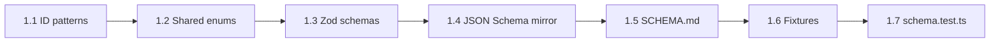

# Phase 1, Step 1 — Schema Design (Detailed Plan)

**Status:** Complete (2026-07-07)  
**Prepared:** 2026-07-07  
**Parent:** [PHASE-1-PLAN.md](./PHASE-1-PLAN.md) → Step 1  
**Prerequisite:** Phase 0 sign-off complete

---

## Objective

Define the **canonical data contract** for all GKE export files before any ontology records are written. Step 1 produces schemas, human documentation, and a minimal validation stub — **no populated ontology data** (that is Step 2).

Success means a developer can write existential pilot records in Step 2 without guessing field names, enums, or ID rules.

---

## Out of scope for Step 1

| Item | When |
|------|------|
| Populated `concepts-a1-a2.json` | Step 2 |
| `domains-index.json` content | Step 5 (schema shell defined here) |
| `validate-gke-exports.ts` full integrity checks | Step 6 |
| `npm run validate:gke` in `prebuild` | After Phase 1 sign-off |
| Runtime TypeScript imports from app code | Phase 4+ |

---

## Deliverables

```
docs/grammar-knowledge-engine/
  SCHEMA.md
  exports/
    schemas/
      gke-envelope.schema.json       # Shared wrapper (version + records[])
      domain-node.schema.json        # L1/L2 tree nodes
      concept-record.schema.json     # L3
      micro-skill-record.schema.json # L4 + L5
      error-record.schema.json       # error.* registry
    fixtures/
      invalid/                       # Must fail validation (Step 1.5)
        bad-concept-missing-id.json
        bad-micro-skill-bad-parent.json
        bad-error-code-format.json
      valid/
        empty-envelope.json          # Must pass (version + [])
lib/gke/
  schema.ts                          # Zod source of truth (matches JSON Schema)
  id-patterns.ts                     # Regex helpers for grammar.* and error.*
```

**Rationale for dual Zod + JSON Schema:**

- **Zod** (`lib/gke/schema.ts`) matches existing project convention (`catalog-schema.ts`, `validate-grammar-content.ts`).
- **JSON Schema** (`exports/schemas/*.schema.json`) is the portable contract for docs, external tools, and Phase 6 AI authoring prompts.

---

## Task breakdown

### 1.1 — File envelope (shared wrapper)

Every export file uses the same top-level shape:

```json
{
  "schemaVersion": 1,
  "generatedAt": "2026-07-07",
  "records": []
}
```

| Field | Type | Required | Notes |
|-------|------|----------|-------|
| `schemaVersion` | `literal(1)` | yes | Bump only on breaking changes |
| `generatedAt` | ISO date `YYYY-MM-DD` | yes | Date of last manual edit |
| `records` | array | yes | Typed per file; may be `[]` in Step 1 |

**Files using envelope:**

| File | `records` item type |
|------|---------------------|
| `concepts-a1-a2.json` | L3 concept record |
| `micro-skills-a1-a2.json` | L4 micro-skill record |
| `errors-a1-a2.json` | Error record |
| `domains-index.json` | L1/L2 domain node (tree, not flat L3) |

---

### 1.2 — ID patterns (`lib/gke/id-patterns.ts`)

Frozen rules from [ID-NAMING.md](./governance/ID-NAMING.md) v0.1:

```typescript
// grammar.<l1>.<l2>.<l3>[.<l4>]
export const GRAMMAR_ID_PATTERN =
  /^grammar\.[a-z][a-z0-9_]*(\.[a-z][a-z0-9_]*){2,4}$/;

// error.<family>.<specific>
export const ERROR_CODE_PATTERN =
  /^error\.[a-z][a-z0-9_]*\.[a-z][a-z0-9_]*$/;

export const DOMAIN_ENTRY_SENTINEL = "domain_entry" as const;
```

**Segment rules (documented in SCHEMA.md):**

- All lowercase, `snake_case` segments
- L3 ID = exactly 4 segments after `grammar.` (e.g. `grammar.existential.there_is_are.affirmative`)
- L4 ID = exactly 5 segments after `grammar.`
- L2 ID = 3 segments; L1 ID = 2 segments
- `domain_entry` is the **only** non-grammar ID allowed in `precursorIds`

**Zod refinements:**

- `grammarConceptIdSchema` — level 3 (4 segments)
- `grammarMicroSkillIdSchema` — level 4 (5 segments); must extend parent L3 prefix
- `grammarDomainIdSchema` — level 1 or 2
- `errorCodeSchema` — `error.*` namespace

---

### 1.3 — Shared sub-schemas

Reused across record types:

#### `LocalizedLabel`

```json
{ "teacher": "…", "student": "…" }
```

| Field | Required | Max length |
|-------|----------|------------|
| `teacher` | yes | 120 chars |
| `student` | yes | 80 chars |

#### Enums (frozen v1)

| Enum | Values | Source |
|------|--------|--------|
| `cefrLevel` | `A1`, `A2`, `B1` | Poster catalog |
| `yleLevel` | `starters`, `movers`, `flyers` | Cambridge YLE |
| `learningStrandId` | 4 values | `lib/learning-strands.ts` `LEARNING_STRAND_IDS` |
| `evidenceMode` | `recognition`, `recall`, `production`, `transfer` | `lib/mastery/types.ts` |
| `publishStatus` | `published`, `draft`, `stub`, `preview`, `optional` | GKE lifecycle |
| `ontologyLevel` | `1`, `2`, `3`, `4` | Record level tag |

**`preview` vs `optional`:**

- `preview` — forward-pointing exposure (e.g. uncountable card `some_any_preview`)
- `optional` — valid L4 but not required for poster completion (e.g. determiners `some_offers` if deferred)

#### `PosterCardRef`

```json
{ "slug": "there-is-there-are-affirmative-a1", "cardIndex": 0 }
```

| Field | Validation |
|-------|------------|
| `slug` | Same regex as `grammarCatalogEntrySchema` slug |
| `cardIndex` | `0 <= cardIndex <= 9` (poster max 3 cards today; headroom for layout lab) |

#### `StandardsRefStub` (optional field, Phase 5 placeholder)

```json
{ "source": "egp", "area": "verbs", "note": "paraphrase only — no bulk text" }
```

All fields optional in v1; presence allowed but not required in Step 1.

---

### 1.4 — `concept-record` (L3)

**File:** `concepts-a1-a2.json` → `records[]`

| Field | Type | Required | Notes |
|-------|------|----------|-------|
| `id` | grammar L3 ID | yes | |
| `level` | `3` | yes | Literal discriminator |
| `parentId` | grammar L2 ID | yes | Must be prefix of `id` |
| `label` | LocalizedLabel | yes | |
| `function` | string | yes | One-line pedagogical function (≤ 120 chars) |
| `cefr` | cefrLevel[] | yes | Min 1 |
| `yle` | yleLevel[] | no | Omit if N/A |
| `strands` | learningStrandId[] | yes | Min 1; posters typically `language_focused_learning` + `meaning_focused_input` |
| `teachOrder` | int 1–99 | yes | Global v1 sequence (1–8 for live posters) |
| `posterSlug` | slug | yes for `published` | Links to `catalog.json` |
| `precursorIds` | string[] | yes | Grammar L3 IDs or `domain_entry` |
| `successorIds` | string[] | yes | Grammar L3 IDs; empty array allowed on terminal concepts |
| `contrastIds` | string[] | yes | Grammar L3 or L4 IDs; empty array allowed |
| `status` | publishStatus | yes | |
| `standardsRef` | StandardsRefStub | no | Phase 5 hook |
| `notes` | string | no | Internal author notes |

**Cross-field rules (Zod `superRefine`):**

1. `id` must start with `parentId + "."`
2. `teachOrder` unique within file (checked in Step 6; documented in Step 1)
3. If `status === "published"`, `posterSlug` required
4. `precursorIds` / `successorIds` / `contrastIds` entries must be valid grammar IDs or `domain_entry` (precursors only)
5. No self-reference in any edge array

**Mastery alignment:**

- L3 evidence (poster read complete) → `LearningTargetRef { type: "grammar", key: <L3 id> }`
- Document in SCHEMA.md; no code wiring yet

---

### 1.5 — `micro-skill-record` (L4 + L5)

**File:** `micro-skills-a1-a2.json` → `records[]`

| Field | Type | Required | Notes |
|-------|------|----------|-------|
| `id` | grammar L4 ID | yes | |
| `level` | `4` | yes | |
| `parentConceptId` | grammar L3 ID | yes | Must be prefix of `id` |
| `label` | LocalizedLabel | yes | |
| `l5Descriptor` | string | yes | Paraphrased performance descriptor (≤ 200 chars) |
| `posterCardRef` | PosterCardRef | yes for `published` | |
| `evidenceModes` | evidenceMode[] | yes | Min 1; poster read = `recognition`; quiz = `recognition` + `production` |
| `errorCodes` | errorCode[] | no | Links to `errors-a1-a2.json` |
| `tags` | string[] | no | e.g. `offers_requests`, `forward_preview` |
| `status` | publishStatus | yes | |
| `standardsRef` | StandardsRefStub | no | |
| `notes` | string | no | |

**Cross-field rules:**

1. `id` must equal `parentConceptId + "." + final_segment` (single L4 segment after L3)
2. `errorCodes` entries must match `ERROR_CODE_PATTERN`
3. If `status === "published"`, `posterCardRef` required
4. Multiple L4 records may share same `posterCardRef.cardIndex` (e.g. affirmative card 1 → countable + uncountable columns)

**Mastery alignment:**

- L4 evidence (quiz item, card drill) → `LearningTargetRef { type: "grammar", key: <L4 id> }`
- `response.errorCode` in evidence events → must exist in `errors-a1-a2.json`

---

### 1.6 — `error-record`

**File:** `errors-a1-a2.json` → `records[]`

| Field | Type | Required | Notes |
|-------|------|----------|-------|
| `id` | error code | yes | `error.<family>.<specific>` |
| `family` | string | yes | Redundant segment for filtering; must match `id` |
| `label` | string | yes | Short teacher-facing name (≤ 80 chars) |
| `wrongExample` | string | no | Illustrative learner error |
| `correctExample` | string | no | Target form |
| `relatedL4Ids` | grammar L4 ID[] | yes | Min 1 |
| `severity` | enum | no | `low`, `medium`, `high` — default `medium` |
| `notes` | string | no | |

**Cross-field rules:**

1. `id` must equal `error.${family}.${specific}` (parsed consistency)
2. Every `relatedL4Ids` entry must match L4 ID pattern

---

### 1.7 — `domain-node` (L1/L2 tree)

**File:** `domains-index.json` — shape differs slightly: tree, not flat L3 list.

```json
{
  "schemaVersion": 1,
  "generatedAt": "2026-07-07",
  "domains": [
    {
      "id": "grammar.existential",
      "level": 1,
      "label": { "teacher": "Existential", "student": "There is / There are" },
      "cefrSpan": ["A1"],
      "status": "published",
      "systems": [
        {
          "id": "grammar.existential.there_is_are",
          "level": 2,
          "label": { "teacher": "There is / There are", "student": "…" },
          "status": "published"
        }
      ]
    }
  ]
}
```

| Field | Notes |
|-------|-------|
| Root uses `domains[]` instead of `records[]` | Avoids mixing tree with flat exports |
| L1 nodes contain nested `systems[]` (L2 only) | L3 lives in `concepts-a1-a2.json` |
| Stub L1 (`verbs`, `clauses`) | `status: "stub"`, `systems: []` |

Schema written in Step 1; **populated in Step 5**.

---

### 1.8 — `SCHEMA.md` (human reference)

Sections to write:

1. **Overview** — hierarchy L1–L5, file map, envelope format  
2. **ID conventions** — link to ID-NAMING.md; regex summary; `domain_entry`  
3. **Record types** — field tables for concept, micro-skill, error, domain-node  
4. **Enums** — full value lists with platform source files  
5. **Cross-file integrity** — rules enforced in Step 6 (parent refs, teach order, poster slugs)  
6. **Mastery mapping** — how L3/L4 IDs become `LearningTargetRef.key`  
7. **Phase boundaries** — what each later phase adds (`progression-edges`, `standards-index`, etc.)  
8. **Examples** — one valid L3, one valid L4, one valid error (existential affirmative)  
9. **Changelog** — `schemaVersion` history starting at v1  

---

### 1.9 — Zod module (`lib/gke/schema.ts`)

Structure:

```typescript
// lib/gke/schema.ts
export const gkeEnvelopeSchema = …
export const conceptRecordSchema = …
export const conceptsExportSchema = …
export const microSkillRecordSchema = …
export const microSkillsExportSchema = …
export const errorRecordSchema = …
export const errorsExportSchema = …
export const domainNodeSchema = …
export const domainsIndexSchema = …

export type ConceptRecord = z.infer<typeof conceptRecordSchema>;
// … etc
```

**No imports from this module in app UI yet** — only validation scripts and tests.

---

### 1.10 — JSON Schema files

Generate or hand-write JSON Schema Draft 2020-12 to mirror Zod (same as `grammar-module.schema.json` style):

- `$schema`, `$id`, `additionalProperties: false` on objects
- `$defs` for shared sub-types (`LocalizedLabel`, enums)
- `$ref` between envelope and record defs

**$id base:** `https://weknowenglish.local/gke/<filename>`

---

### 1.11 — Fixtures and smoke validation (Step 1 exit test)

Create minimal script or vitest file: `lib/gke/schema.test.ts`

| Fixture | Expected |
|---------|----------|
| `fixtures/valid/empty-envelope.json` (×3 files) | Pass |
| `fixtures/invalid/bad-concept-missing-id.json` | Fail |
| `fixtures/invalid/bad-micro-skill-bad-parent.json` | Fail (parent prefix mismatch) |
| `fixtures/invalid/bad-error-code-format.json` | Fail |
| `fixtures/valid/sample-existential-concept.json` | Pass (single L3, for Step 2 template) |
| `fixtures/valid/sample-existential-micro-skill.json` | Pass |

**Not in Step 1:** poster slug existence check against `catalog.json` (Step 6).

---

## Work sequence (order of implementation)



| Order | Task | Time est. |
|-------|------|-----------|
| 1 | `id-patterns.ts` + unit tests for regex | 20 min |
| 2 | Shared Zod sub-schemas (enums, labels, poster ref) | 30 min |
| 3 | `concept-record` + `micro-skill-record` + `error-record` | 45 min |
| 4 | `domain-node` + `domains-index` envelope | 20 min |
| 5 | Export envelope wrappers | 15 min |
| 6 | JSON Schema files (mirror Zod) | 45 min |
| 7 | `SCHEMA.md` | 45 min |
| 8 | Fixtures + `schema.test.ts` | 30 min |
| **Total** | | **~3.5 h** |

---

## Step 1 exit checklist

- [x] `lib/gke/id-patterns.ts` with tests
- [x] `lib/gke/schema.ts` — all record types + envelopes
- [x] `lib/gke/schema.test.ts` — valid/invalid fixtures pass/fail as expected
- [x] `exports/schemas/*.schema.json` — 6 files, Draft 2020-12
- [x] `SCHEMA.md` — complete field reference + mastery mapping note
- [x] `exports/fixtures/` — valid empty envelopes + invalid examples
- [x] Empty export shells committed
- [x] README updated: Step 1 complete → Step 2 ready
- [x] No populated ontology records yet (except fixtures)

---

## Decisions for approval

### S1 — Validation technology

- [ ] **Recommended:** Zod in `lib/gke/schema.ts` as source of truth; JSON Schema as mirrored export  
- [ ] Alternative: JSON Schema only + AJV (diverges from grammar validation pattern)

### S2 — Export root key

- [ ] **Recommended:** `records[]` for flat files; `domains[]` for tree index  
- [ ] Alternative: Uniform `records[]` everywhere (tree flattened with `parentId`)

### S3 — Empty shells in Step 1

- [ ] **Recommended:** Commit empty `concepts-a1-a2.json`, `micro-skills-a1-a2.json`, `errors-a1-a2.json`  
- [ ] Alternative: Create files only when Step 2 starts

### S4 — `preview` / `optional` status values

- [ ] **Recommended:** Add both to `publishStatus` enum now  
- [ ] Alternative: Only `published` / `draft` / `stub` in v1

### S5 — L4 `tags` field

- [ ] **Recommended:** Optional `tags: string[]` for `offers_requests`, `forward_preview`  
- [ ] Alternative: Encode via `status: "preview"` only, no tags

### S6 — Step 1 test runner

- [ ] **Recommended:** `lib/gke/schema.test.ts` via existing vitest (`npm run validate:grammar` path later merges in Step 6)  
- [ ] Alternative: Standalone `tsx` script in Step 1

---

## Handoff to Step 2

Once Step 1 is approved and implemented, Step 2 will:

1. Copy `fixtures/valid/sample-existential-*.json` as templates  
2. Populate 3 L3 + 10 L4 + linked errors into export files  
3. Run `schema.test.ts` against full existential set (new fixture file)  
4. Diff against `domains/existential.md` card table  

No schema changes expected after Step 1 unless ESL review surfaces a gap.

---

## Approval

| Decision | Choice |
|----------|--------|
| S1 Validation | ☐ Zod + JSON Schema mirror ☐ JSON Schema only |
| S2 Root key | ☐ `records` / `domains` split ☐ uniform `records` |
| S3 Empty shells | ☐ commit now ☐ defer |
| S4 Status enum | ☐ include preview/optional ☐ minimal set |
| S5 Tags field | ☐ yes ☐ no |
| S6 Tests | ☐ vitest ☐ standalone tsx |

**Approve Step 1 implementation:** ☐ Yes ☐ Revise (notes below)

---

**Notes:**

_
