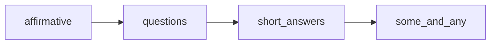

# Domain: Existential (there is / there are)

**L1 ID:** `grammar.existential`  
**L2 system:** `grammar.existential.there_is_are`  
**Status:** Phase 0 complete — reference template for Phase 1

---

## Scope

Learners talk about **what exists** in a place: one thing, many things, uncountable things; statements, questions, and short yes/no answers.

| Field | Value |
|-------|-------|
| **Strand (primary)** | `language_focused_learning` |
| **Strand (secondary)** | `meaning_focused_input` (reading posters/stories) |
| **CEFR span** | A1 |
| **YLE** | Starters (statements) → Movers (questions + short answers) |
| **Typical ages** | 6–9 |

---

## L3 concept chain (frozen v0.1)

| Teach order | L3 ID | Poster slug | Precursor | Successor |
|-------------|-------|-------------|-----------|-----------|
| 1 | `grammar.existential.there_is_are.affirmative` | there-is-there-are-affirmative-a1 | `domain_entry` | questions |
| 2 | `grammar.existential.there_is_are.questions` | there-is-there-are-questions-a1 | affirmative | short_answers |
| 3 | `grammar.existential.there_is_are.short_answers` | short-answers-there-is-a1 | questions | `grammar.determiners.quantifiers.some_and_any` |

### L3 summaries

| L3 | Teacher label | Student label | Function |
|----|---------------|---------------|----------|
| affirmative | There is / There are — Affirmative | There is… / There are… | Say what exists in a place |
| questions | There is / There are — Questions | Is there…? / Are there…? | Ask if something exists |
| short_answers | Short Answers — There is / There are | Yes or No! | Answer yes/no with a short clause |

---

## Poster → L4 micro-skills

### there-is-there-are-affirmative-a1

| Card | kidTitle | L4 ID | L5 descriptor (paraphrased) |
|------|----------|-------|-----------------------------|
| 1 | There is… | `grammar.existential.there_is_are.affirmative.singular_countable` | Can say *There is a …* for one countable thing |
| 1 | (uncountable col) | `grammar.existential.there_is_are.affirmative.singular_uncountable` | Can say *There is some …* for uncountable |
| 2 | There are… | `grammar.existential.there_is_are.affirmative.plural` | Can say *There are …* for two or more things |
| 3 | Remember! | `grammar.existential.there_is_are.affirmative.contractions` | Know *There's* = *There is* (speech) |

### there-is-there-are-questions-a1

| Card | kidTitle | L4 ID | L5 descriptor |
|------|----------|-------|---------------|
| 1 | Is there…? | `grammar.existential.there_is_are.questions.singular_uncountable` | Can ask *Is there a …?* or *Is there any …?* |
| 2 | Are there…? | `grammar.existential.there_is_are.questions.plural` | Can ask *Are there …?* for plural |
| 3 | Remember! | `grammar.existential.there_is_are.questions.inversion_rule` | Put *Is/Are* before *there* in questions |

### short-answers-there-is-a1

| Card | kidTitle | L4 ID | L5 descriptor |
|------|----------|-------|---------------|
| 1 | Is there…? | `grammar.existential.there_is_are.short_answers.positive_negative_singular` | Can answer *Yes, there is* / *No, there isn't* |
| 2 | Are there…? | `grammar.existential.there_is_are.short_answers.positive_negative_plural` | Can answer *Yes, there are* / *No, there aren't* |
| 3 | Remember! | `grammar.existential.there_is_are.short_answers.summary_matrix` | Can match question type to correct short answer |

---

## EGP alignment (paraphrased)

| Descriptor | CEFR | External note | L3/L4 |
|------------|------|---------------|-------|
| *there is* + singular NP complement | A1 | EGP verbs area; Pearson Toolkit presence/absence | affirmative.singular_countable |
| *there are* + plural NP complement | A1 | EGP verbs area | affirmative.plural |
| *Is there* / *Are there* questions | A1 | British Council A1-A2 grammar | questions.* |
| Short answers *Yes, there is* (not *Yes, there's*) | A1 | British Council: full form in answers | short_answers.* |
| *there isn't* / *there aren't* negatives | A1 | British Council negative table | short_answers negative |

**Attribution:** English Grammar Profile / British Council LearnEnglish A1-A2. Internal paraphrases only.

---

## Error families

| errorCode | Wrong example | Correct | Related L4 |
|-----------|---------------|---------|------------|
| `error.agreement.there_are_singular` | Are there a book? | Is there a book? | questions.singular_uncountable |
| `error.agreement.there_is_plural` | Is there two books? | Are there two books? | questions.plural |
| `error.agreement.there_is_with_plural_noun` | There is books. | There are books. | affirmative.plural |
| `error.existential.missing_there` | Is a book on the desk? | Is there a book on the desk? | questions.inversion_rule |
| `error.short_answer.wrong_auxiliary` | Yes, there are. (for Is there…?) | Yes, there is. | short_answers.positive_negative_singular |
| `error.short_answer.contraction_in_yes` | Yes, there's. | Yes, there is. | short_answers.positive_negative_singular |

---

## Contrasts (not sequence)

| Concept A | Concept B | Why |
|-----------|-----------|-----|
| `questions.singular_uncountable` | `questions.plural` | Is vs Are agreement |
| `affirmative` | `it is` (it’s a book) | Existential vs presentational — **defer L3** |
| `some` in affirmative | `any` in question | Cross-link to determiners domain |

---

## Phase 0 completion

- [x] L3 order decided and logged  
- [x] All 9 cards have L4 IDs  
- [x] ≥5 EGP rows filled  
- [x] ≥3 error families documented (6 listed)  
- [x] Oral explanation in EXTRACTION-LOG  
