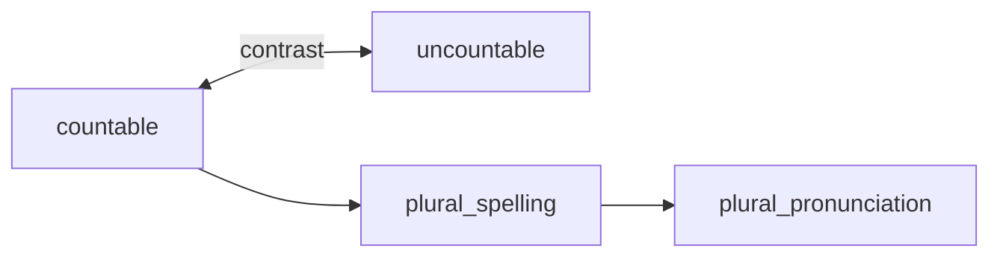

# Domain: Nouns

**L1 ID:** `grammar.nouns`  
**Status:** Phase 1 Step 3 complete — ontology populated in exports

---

## L2 systems (v1)

| L2 ID | Focus | Posters |
|-------|-------|---------|
| `grammar.nouns.countability` | Countable vs uncountable; How many / How much | countable-nouns-a1, uncountable-nouns-a1 |
| `grammar.nouns.plural` | Plural spelling and pronunciation | plural-spelling-a2, plural-pronunciation-a2 |

---

## L3 concepts

| L3 ID | Poster slug | CEFR | YLE | Precursor | Successor |
|-------|-------------|------|-----|-----------|-----------|
| `grammar.nouns.countability.countable` | countable-nouns-a1 | A1 | Starters | existential.affirmative | uncountable (contrast) |
| `grammar.nouns.countability.uncountable` | uncountable-nouns-a1 | A1 | Starters | countable (contrast) | some_and_any |
| `grammar.nouns.plural.spelling` | plural-spelling-a2 | A2 | Movers+ | countable | plural.pronunciation |
| `grammar.nouns.plural.pronunciation` | plural-pronunciation-a2 | A2 | Flyers | plural.spelling | — |

---

## Poster → L4 micro-skills

### countable-nouns-a1

| Card | kidTitle | L4 ID | L5 descriptor |
|------|----------|-------|---------------|
| 1 | How many? | `grammar.nouns.countability.countable.how_many_questions` | Ask *How many …?* with plural count noun |
| 2 | Plural rules | `grammar.nouns.countability.countable.plural_patterns_preview` | Recognize four common plural spelling patterns |
| 3 | Remember! | `grammar.nouns.countability.countable.how_many_rule` | Use *How many* only with countables |

### uncountable-nouns-a1

| Card | kidTitle | L4 ID | L5 descriptor |
|------|----------|-------|---------------|
| 1 | Ask correctly | `grammar.nouns.countability.uncountable.how_much_questions` | Ask *How much … is there?* with uncountables |
| 1 | (good/bad) | `grammar.nouns.countability.uncountable.reject_how_many` | Reject *How many water?* |
| 2 | Some & any | `grammar.nouns.countability.uncountable.some_any_preview` | Exposure: *some* in affirmative (full L3 in determiners) |
| 3 | Remember! | `grammar.nouns.countability.uncountable.how_much_rule` | Use *How much* with uncountables |

### plural-spelling-a2

| Card | kidTitle | L4 ID (draft) |
|------|----------|---------------|
| 1 | Add -s | `grammar.nouns.plural.spelling.regular_s` |
| 2 | Add -es | `grammar.nouns.plural.spelling.es_after_sxch` |
| 3 | y → ies | `grammar.nouns.plural.spelling.consonant_y` |
| 4 | Vowel + y | `grammar.nouns.plural.spelling.vowel_y` |
| 5 | -f/-fe → -ves | `grammar.nouns.plural.spelling.f_fe_ves` |
| 6 | -o endings | `grammar.nouns.plural.spelling.o_endings` |

### plural-pronunciation-a2

| Card | kidTitle | L4 ID (draft) |
|------|----------|---------------|
| 1 | /s/ sound | `grammar.nouns.plural.pronunciation.voiceless_s` |
| 2 | /z/ sound | `grammar.nouns.plural.pronunciation.voiced_z` |
| 3 | /ɪz/ sound | `grammar.nouns.plural.pronunciation.sibilant_iz` |

---

## EGP alignment (paraphrased)

| Descriptor | CEFR | L3/L4 |
|------------|------|-------|
| Singular and plural nouns; count vs mass distinction | A1 | countability.* |
| *How many* + plural countable | A1 | countable.how_many_questions |
| *How much* + uncountable | A1 | uncountable.how_much_questions |
| Regular plural *-s* / *-es* | A2 | plural.spelling.* |
| Irregular plural forms (feet, mice) | A2 | defer detailed L4 to Phase 1+ |

---

## Error families

| errorCode | Wrong | Correct | L4 |
|-----------|-------|---------|-----|
| `error.countability.how_many_uncountable` | How many water? | How much water? | uncountable.how_much |
| `error.countability.how_much_countable` | How much books? | How many books? | countable.how_many |
| `error.countability.much_with_plural` | much books | many books | countable |
| `error.plural.spelling_y_to_s` | babys | babies | spelling.consonant_y |

---

## Age calibration

| L3 | Grade | YLE | Age |
|----|-------|-----|-----|
| countable | 1–2 | Starters | 6–8 |
| uncountable | 2–3 | Starters–Movers | 7–9 |
| plural spelling | 3–4 | Movers | 8–10 |
| plural pronunciation | 4–5 | Flyers | 9–11 |

---

## Phase 0 completion

- [x] L3 list confirmed  
- [x] Contrast edge countable ↔ uncountable  
- [x] Plural successor chain documented  
- [x] Poster card → L4 tables (all cards drafted)  
- [x] L5 descriptors for plural cards (populated in Phase 1 Step 3)
