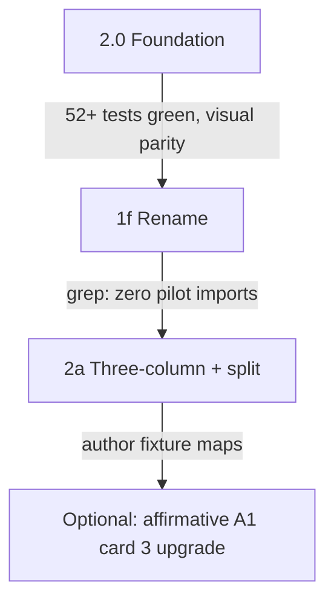

# Detailed Plan: Phase 2.0 + 1f + 2a

**Status:** For approval  
**Date:** 2026-07-06  
**Depends on:** Phase 1d/1e complete (slug routing, 2 live A1 posters, 52+ tests)  
**Parent doc:** [PROPOSAL-PHASE-2.md](./PROPOSAL-PHASE-2.md)

---

## 1. Executive summary

This plan covers three sequential work packages:

| Package | Goal | Effort | Visual change? |
|---------|------|--------|----------------|
| **2.0** | Refactor mapper + view model to explicit layout dispatch | ~½ session | **No** — pixel parity required |
| **1f** | Rename `pilot` → `poster` across components, types, imports, docs | ~½ session | **No** — rename only |
| **2a** | Implement `three-column` + `full-width-split` mappers and UI | ~1–2 sessions | **Yes** — new layouts; optional A1 card 3 upgrade |

**Recommended merge order:** 2.0 → 1f → 2a (three PRs or one branch with three commits).

**Exit criteria for the combined work:**
- Both live A1 posters unchanged at their slugs (unless card 3 upgrade explicitly approved + passes 8D QA)
- `there-is-there-are.json` author fixture maps end-to-end in tests
- All grammar-builder tests pass; `npm run build` succeeds
- No remaining imports from `@/components/grammar/pilot/` (after 1f)

---

## 2. Implementation order & gates



| Gate | Check |
|------|-------|
| After 2.0 | `npm run validate:grammar`; manual compare `/grammar/there-is-there-are-questions-a1` + affirmative slug |
| After 1f | `rg "grammar/pilot" --glob "*.{ts,tsx}"` only allowed in routes/docs/legacy strings |
| After 2a | New tests for three-column + full-width-split; author fixture integration test |

---

# Part A — Phase 2.0 Foundation

## A.1 Goals

1. Replace inferred `layout: 50_50 | 30_70 | banner` as the **primary** routing key with explicit `internalLayout` tied to `layoutType`.
2. Split `map-poster-section.ts` into dispatch + per-layout mappers (only `two-equal` + `banner` implemented in 2.0).
3. Refactor `PilotSectionBody` to route on `internalLayout` (behavior unchanged for live posters).
4. **Zero visual regression** on both published A1 posters.

## A.2 Non-goals (2.0)

- Renaming `Pilot*` types (deferred to 1f)
- New layout types (`three-column`, `full-width-split`) — that's 2a
- Schema changes beyond optional `layoutType` refinements for existing types
- New routes or catalog entries

## A.3 View model changes

**File:** `components/grammar/pilot/pilot-there-is-data.ts` (renamed in 1f)

### New types

```typescript
/** UI routing key — 1:1 with layoutType for implemented mappers. */
export type PosterInternalLayout =
  | "two_equal"
  | "two_equal_narrow"   // two-equal + label-only left item (today's 30_70)
  | "banner";

/** @deprecated Use internalLayout. Kept through 2.0 for backward compat in tests. */
export type PosterLegacyLayout = "50_50" | "30_70" | "banner";
```

### Extended `PilotSection`

```typescript
export type PilotSection = {
  // existing fields unchanged …
  /** Source JSON layoutType (added in 2.0) */
  layoutType: GrammarLayoutType;
  /** Explicit UI dispatch key (added in 2.0) */
  internalLayout: PosterInternalLayout;
  /** @deprecated Read internalLayout. Removed in 2b. */
  layout: PosterLegacyLayout;
};
```

### Legacy layout mapping (computed, not inferred from content alone)

| layoutType | Condition | internalLayout | layout (deprecated) |
|------------|-----------|----------------|---------------------|
| `two-equal` | normal columns | `two_equal` | `50_50` |
| `two-equal` | left item is label-only (`isLabelOnlyText`) | `two_equal_narrow` | `30_70` |
| `banner` | — | `banner` | `banner` |

## A.4 Mapper refactor

### New file structure

```
lib/grammar-builder/map-poster-section/
├── index.ts                 # mapPosterSection() dispatch
├── map-section-base.ts      # buildSectionBase(card) → shared fields
├── map-two-equal-section.ts # two-equal → two_equal | two_equal_narrow
├── map-banner-section.ts    # banner → rememberBanner
└── infer-internal-layout.ts # two-equal narrow heuristic (uses poster-label.ts)
```

### Dispatch (`index.ts`)

```typescript
export function mapPosterSection(card: GrammarCard): PilotSection {
  switch (card.layoutType) {
    case "two-equal":
      return mapTwoEqualSection(card);
    case "banner":
      return mapBannerSection(card);
    default:
      throw new GrammarMapError(
        `Unsupported layoutType for poster mapper: ${card.layoutType}`,
        card.id,
      );
  }
}
```

Move existing logic from monolithic `map-poster-section.ts` into the split files **without behavior changes**.

### Shared base builder (`map-section-base.ts`)

Extracts:
- `number`, `title`, `kidTitle`, `kidSubtitle`, `glanceRule`
- `color`, `theme`, `palette` via `THEME_TO_LEGACY_COLOR`
- Validates `glanceRule` + `kidTitle` (unchanged rules)
- Sets `layoutType: card.layoutType`

### Exports

- `lib/grammar-builder/map-poster-section.ts` becomes re-export barrel OR deleted with imports updated to `./map-poster-section/index`
- `inferPosterLayout()` → rename to `inferTwoEqualLegacyLayout()` and mark `@deprecated`; keep exported for existing tests until 2a updates them

## A.5 UI refactor

**File:** `components/grammar/pilot/PilotSectionBody.tsx`

### Router pattern

```typescript
export function PilotSectionBody({ section, variant = "poster" }: Props) {
  switch (section.internalLayout) {
    case "banner":
      return <BannerBody section={section} variant={variant} />;
    case "two_equal_narrow":
      return <TwoEqualNarrowBody section={section} variant={variant} />;
    case "two_equal":
      return <TwoEqualBody section={section} variant={variant} />;
    default: {
      const _exhaustive: never = section.internalLayout;
      return _exhaustive;
    }
  }
}
```

Extract current JSX blocks into private components in the same file (or `PilotSectionBody/` folder) — **copy-paste move only**, no styling changes.

### Fallback (temporary)

During 2.0 PR only, if `internalLayout` missing (shouldn't happen), fall back to `section.layout` switch — remove in 1f.

## A.6 Tests (2.0)

| File | Change |
|------|--------|
| `map-poster-section.test.ts` | Assert `internalLayout` + `layoutType` on all mapped cards; keep legacy `layout` assertions |
| `map-poster-module.test.ts` | No semantic change to section content |
| **New** `map-poster-section-dispatch.test.ts` | Throws on unsupported `layoutType: "three-column"` |

### Parity test (new)

```typescript
it("preserves legacy layout values for live A1 fixtures", () => {
  for (const slug of [QUESTIONS_POSTER_SLUG, AFFIRMATIVE_POSTER_SLUG]) {
    const view = loadPosterModuleBySlug(slug);
    // snapshot internalLayout + deprecated layout per section
  }
});
```

## A.7 File checklist (2.0)

| Action | Path |
|--------|------|
| Create | `lib/grammar-builder/map-poster-section/index.ts` |
| Create | `lib/grammar-builder/map-poster-section/map-section-base.ts` |
| Create | `lib/grammar-builder/map-poster-section/map-two-equal-section.ts` |
| Create | `lib/grammar-builder/map-poster-section/map-banner-section.ts` |
| Create | `lib/grammar-builder/map-poster-section/infer-internal-layout.ts` |
| Delete or re-export | `lib/grammar-builder/map-poster-section.ts` |
| Edit | `components/grammar/pilot/pilot-there-is-data.ts` |
| Edit | `components/grammar/pilot/PilotSectionBody.tsx` |
| Edit | `lib/grammar-builder/index.ts` |
| Edit | `lib/grammar-builder/map-poster-section.test.ts` |
| Create | `lib/grammar-builder/map-poster-section-dispatch.test.ts` |

## A.8 Acceptance criteria (2.0)

- [ ] `npm run validate:grammar` — all tests pass (52+)
- [ ] Questions + Affirmative slugs render identically (manual or screenshot compare)
- [ ] Every mapped section has `layoutType` + `internalLayout`
- [ ] `inferPosterLayout` deprecated but still passes existing tests
- [ ] Unsupported layoutTypes still throw `GrammarMapError`

---

# Part B — Phase 1f Rename (`pilot` → `poster`)

## B.1 Goals

1. Rename component folder and types to reflect production status (no longer a "pilot").
2. Keep **legacy URLs**: `/grammar/pilot` redirect, `/grammar/pilot/layouts` dev route.
3. Update all imports, docs, and cursor rule in one mechanical pass.

## B.2 Rename map

### Directory

| Old | New |
|-----|-----|
| `components/grammar/pilot/` | `components/grammar/poster/` |

### Files

| Old file | New file |
|----------|----------|
| `pilot-there-is-data.ts` | `poster-view-model.ts` |
| `pilot-types.ts` | `poster-variant.ts` |
| `GrammarPilotPage.tsx` | `GrammarPosterPage.tsx` |
| `GrammarPilotLayoutsPage.tsx` | `GrammarPosterLayoutsPage.tsx` |
| `PilotHero.tsx` | `PosterHero.tsx` |
| `PilotSectionCard.tsx` | `PosterSectionCard.tsx` |
| `PilotSectionBody.tsx` | `PosterSectionBody.tsx` |
| `PilotExampleRow.tsx` | `PosterExampleRow.tsx` |
| `PilotCategoryPill.tsx` | `PosterCategoryPill.tsx` |
| `PilotGlanceRule.tsx` | `PosterGlanceRule.tsx` |
| `PilotNoteBox.tsx` | `PosterNoteBox.tsx` |
| `PilotPatternRow.tsx` | `PosterPatternRow.tsx` |
| `PilotLayoutShowcase.tsx` | `PosterLayoutShowcase.tsx` |

### Types & exports

| Old | New |
|-----|-----|
| `PilotSection` | `PosterSection` |
| `PilotHeroData` | `PosterHeroData` |
| `PilotExample` | `PosterExample` |
| `PilotPattern` | `PosterPattern` |
| `PilotGlanceRule` | `PosterGlanceRule` |
| `PilotSectionColor` | `PosterSectionColor` |
| `GrammarPilotVariant` | `GrammarPosterVariant` |
| `PILOT_HERO` | `POSTER_HERO_FALLBACK` |
| `LAYOUT_SHOWCASE_DEMOS` | `POSTER_LAYOUT_SHOWCASE_DEMOS` |

### Deprecated aliases (optional, 1 release)

In `poster-view-model.ts`:

```typescript
/** @deprecated Use PosterSection */
export type PilotSection = PosterSection;
```

Recommend **no aliases** — update all call sites in same PR for clean break.

### lib/grammar-builder imports

Update all `@/components/grammar/pilot/pilot-there-is-data` → `@/components/grammar/poster/poster-view-model`.

### Routes (keep paths, update components)

| Route | Change |
|-------|--------|
| `app/(student)/grammar/[slug]/page.tsx` | Import `GrammarPosterPage` |
| `app/(student)/grammar/pilot/page.tsx` | Unchanged redirect |
| `app/(student)/grammar/pilot/layouts/page.tsx` | Import `GrammarPosterLayoutsPage` |

### Dev-only link in `GrammarPosterPage`

Keep `href="/grammar/pilot/layouts"` — URL stays for dev bookmarks.

### Catalog

Keep `legacyRoutes: ["/grammar/pilot"]` — no change.

## B.3 Documentation updates (1f)

| File | Updates |
|------|---------|
| `docs/grammar-module/SOURCE_OF_TRUTH_UI_GUIDE.md` | Replace "pilot" with "poster" where referring to components; keep legacy route notes |
| `docs/grammar-module/SCHEMA.md` | `/grammar/pilot/layouts` → note as legacy dev path |
| `docs/lesson-player-master-document.md` | Student route → `/grammar/[slug]` |
| `.cursor/rules/grammar-module-ui.mdc` | `web/components/grammar/poster/**`; remove outdated "hardcoded pilot-there-is-data" note; update route table |
| `docs/grammar-module/PROPOSAL-PHASE-1d-1e.md` | Add "superseded by 1f" note (no rewrite) |

## B.4 Verification (1f)

```powershell
# Must return zero component imports (docs/route strings OK)
rg "components/grammar/pilot" --glob "*.{ts,tsx}"

# Must return zero Pilot type usage (except git history)
rg "PilotSection|GrammarPilotPage|pilot-there-is" --glob "*.{ts,tsx}"

npm run validate:grammar
npm run build
```

## B.5 File checklist (1f)

| Action | Detail |
|--------|--------|
| Move/rename | All 13 files in `components/grammar/pilot/` → `poster/` |
| Edit | ~15 import sites in `lib/grammar-builder/`, `app/`, tests |
| Edit | 4 doc files + cursor rule |
| Delete | Empty `components/grammar/pilot/` directory |

## B.6 Acceptance criteria (1f)

- [ ] No imports from `@/components/grammar/pilot/`
- [ ] `/grammar/[slug]` and redirect still work
- [ ] `/grammar/pilot/layouts` still dev-only + renders showcase
- [ ] `npm run validate:grammar` + `npm run build` pass
- [ ] Zero visual change on live posters

## B.7 Risk: rename + 2.0 conflict

**Mitigation:** Land 2.0 first on `pilot` paths; 1f is pure rename with no logic edits. Do not start 1f until 2.0 gate passes.

---

# Part C — Phase 2a Three-column + full-width-split

## C.1 Goals

1. Map and render `layoutType: "three-column"` (author affirmative cards 1–2).
2. Map and render `layoutType: "full-width-split"` (author affirmative card 3).
3. Render `subHeader` pill above three-column content.
4. Support **text | graphic | caption** example columns per UI guide.
5. Prove with **`there-is-there-are.json`** author fixture (integration test).
6. **Optional:** Upgrade live affirmative A1 card 3 from `banner` → `full-width-split` if 8D QA passes.

## C.2 Non-goals (2a)

- Student author route at `/grammar/[slug]` for raw author JSON (no tags/kidTitle) — test-only + layout lab preview
- `positive-negative`, `comparison`, `summary-grid`
- Page layout changes (still `two-equal-then-full`)
- Visual spec polish (border-2, absolute badge)

## C.3 Schema updates

**File:** `lib/grammar-builder/schema.ts` + `grammar-module.schema.json` + `SCHEMA.md`

### New refinements

```typescript
if (card.layoutType === "three-column") {
  if (!card.items?.length) {
    ctx.addIssue({ message: "three-column requires items", path: ["cards", index, "items"] });
  }
}

if (card.layoutType === "full-width-split") {
  if (!card.leftSide) {
    ctx.addIssue({ message: "full-width-split requires leftSide", ... });
  }
  if (!card.rightSide) {
    ctx.addIssue({ message: "full-width-split requires rightSide", ... });
  }
}
```

### Author fixture handling

`there-is-there-are.json` today fails poster rules (tags, no kidTitle/glanceRule). **Do not** publish it as a student slug.

| Approach | Use |
|----------|-----|
| Tests | `parseGrammarModule(raw, { posterContentRules: false })` |
| Layout lab preview (stretch) | Load fixture with relaxed rules in dev-only preview panel |
| Future | Separate `displayMode: "showcase"` author copy with tags removed |

**2a minimum:** tests only. **Stretch:** add "Author preview" accordion to layout lab.

## C.4 View model extensions

**File:** `components/grammar/poster/poster-view-model.ts`

```typescript
export type PosterSubHeader = {
  label: string;
  badge?: string;
  desc?: string;
  extra?: string;
};

export type PosterSidePanel = {
  title?: string;
  body: string;
  example?: string;
  formula?: string;
  warning?: string;
};

export type PosterInternalLayout =
  | "two_equal"
  | "two_equal_narrow"
  | "banner"
  | "three_column"        // NEW
  | "full_width_split";   // NEW

export type PosterSection = {
  // …existing…
  subHeader?: PosterSubHeader;
  /** three-column: 1–3 example columns */
  columns?: PosterExample[];
  /** full-width-split: left panel (contractions, notes) */
  leftPanel?: PosterSidePanel;
  /** full-width-split: right panel (formula, warning) */
  rightPanel?: PosterSidePanel;
  /** full-width-split: optional pattern stack from card.patterns */
  leftPatterns?: PosterPattern[];
};
```

Remove deprecated `layout` field if 2.0 compat period complete (recommended in 2a).

## C.5 Mappers (2a)

### `map-three-column-section.ts`

Input: `GrammarCard` with `layoutType: "three-column"`.

| JSON field | View model field |
|------------|------------------|
| `subHeader` | `subHeader` |
| `items[]` | `columns[]` via `mapPosterItem()` |
| `glanceRule` | required for poster; optional when `posterContentRules: false` |

`internalLayout: "three_column"`.

**kidTitle fallback for author cards:** use `card.kidTitle ?? card.title` in mapper when poster rules off; for strict poster parse still require kidTitle.

### `map-full-width-split-section.ts`

Input: `GrammarCard` with `layoutType: "full-width-split"`.

| JSON field | View model field |
|------------|------------------|
| `leftSide.title/content/example` | `leftPanel` |
| `rightSide.formula/warning/content/title` | `rightPanel` |
| `patterns[]` | `leftPatterns` via existing pattern mapper |

`internalLayout: "full_width_split"`.

**Highlight for right note:** derive from `rightSide.warning` or `formula` for `PilotNoteBox`-style highlight chip.

### Dispatch update

Add cases to `map-poster-section/index.ts`:

```typescript
case "three-column":
  return mapThreeColumnSection(card);
case "full-width-split":
  return mapFullWidthSplitSection(card);
```

## C.6 UI components (2a)

### C.6.1 `PosterSubHeader.tsx` (new)

Renders category pill from `subHeader`:
- Label uppercase pill with optional badge emoji
- `desc` below in `text-base` minimum
- `extra` as secondary line (e.g. "Contraction: There's")

Reference: UI guide §5 worked example card 1.

### C.6.2 `PosterExampleColumn.tsx` (new)

Single column in three-column layout:
```
[ sentence with highlight ]
[ graphic 80×80+ ]
[ caption in text-sm ]
```
Dashed right border except last column.

### C.6.3 `PosterThreeColumnBody.tsx` (new)

- Optional `PosterSubHeader` at top
- `grid grid-cols-1 sm:grid-cols-3` with dashed dividers
- Maps `section.columns`

### C.6.4 `PosterFullWidthSplitBody.tsx` (new)

Replace dead `leftPatterns || rightNote` branch in `PosterSectionBody`:

```
┌─────────────────────┬─────────────────────┐
│ leftPanel           │ rightPanel          │
│ - title (optional)  │ - formula           │
│ - body              │ - warning callout   │
│ - example line      │                     │
│ - patterns[] stack  │                     │
└─────────────────────┴─────────────────────┘
```

Reuse `PosterNoteBox`, `PosterPatternRow`.

### C.6.5 `PosterExampleRow.tsx` update

Keep row layout for two-equal. Three-column uses `PosterExampleColumn` instead — no change to row component required.

### C.6.6 `PosterSectionBody.tsx` router

Add cases:

```typescript
case "three_column":
  return <PosterThreeColumnBody … />;
case "full_width_split":
  return <PosterFullWidthSplitBody … />;
```

## C.7 Author fixture content spec

**Existing file:** `docs/grammar-module/examples/there-is-there-are.json`

**2a changes (minimal, for validation clarity):**

| Field | Action |
|-------|--------|
| `displayMode` | Add `"showcase"` (author module) |
| `tags` | Keep (allowed when not poster mode) OR remove for consistency |
| `kidTitle` / `glanceRule` | **Not required** for showcase; add in a future author+student unified pass |

**Do not** copy author JSON to `content/grammar/` in 2a — not a published student module.

### Integration test

**File:** `lib/grammar-builder/map-author-affirmative.test.ts`

```typescript
const module = parseGrammarModule(
  readAuthorFixture("there-is-there-are.json"),
  { posterContentRules: false },
);
const view = mapPosterModule(module);

expect(view.sections[0].internalLayout).toBe("three_column");
expect(view.sections[0].columns).toHaveLength(3);
expect(view.sections[2].internalLayout).toBe("full_width_split");
expect(view.sections[2].leftPanel?.body).toContain("THERE'S");
```

## C.8 Optional: affirmative A1 card 3 upgrade

**Only if 8D tablet QA passes** (768×1024 — hero + cards 1–2 visible without scroll).

| Current | Proposed |
|---------|----------|
| `layoutType: "banner"` | `layoutType: "full-width-split"` |
| `leftSide` + `bannerText` | `leftSide` + `rightSide` matching author card 3 (simplified text) |

Update both:
- `content/grammar/there-is-there-are-affirmative-a1.json`
- `docs/grammar-module/examples/there-is-there-are-affirmative-a1.json`

**Default recommendation:** defer upgrade to separate PR after visual QA; ship 2a mappers + author tests first.

## C.9 Layout lab stretch (optional)

Add dev-only section to `PosterLayoutShowcase`:

> **Author preview: There is/are Affirmative** — renders `mapPosterModule(parseAuthorFixture)` in showcase variant.

Not required for 2a approval.

## C.10 Tests (2a)

| File | Cases |
|------|-------|
| `map-three-column-section.test.ts` | subHeader, 3 items, captions, highlights |
| `map-full-width-split-section.test.ts` | leftSide/rightSide, patterns optional |
| `map-author-affirmative.test.ts` | full module map |
| `validate-module.test.ts` | three-column missing items; split missing rightSide |
| `PosterSectionBody` | optional component test if vitest config extended (stretch) |

**Target test count:** 52 → ~65+

## C.11 File checklist (2a)

| Action | Path |
|--------|------|
| Create | `lib/grammar-builder/map-poster-section/map-three-column-section.ts` |
| Create | `lib/grammar-builder/map-poster-section/map-full-width-split-section.ts` |
| Create | `lib/grammar-builder/map-three-column-section.test.ts` |
| Create | `lib/grammar-builder/map-full-width-split-section.test.ts` |
| Create | `lib/grammar-builder/map-author-affirmative.test.ts` |
| Edit | `lib/grammar-builder/map-poster-section/index.ts` |
| Edit | `lib/grammar-builder/schema.ts` + JSON schema + SCHEMA.md |
| Edit | `components/grammar/poster/poster-view-model.ts` |
| Create | `components/grammar/poster/PosterSubHeader.tsx` |
| Create | `components/grammar/poster/PosterExampleColumn.tsx` |
| Create | `components/grammar/poster/PosterThreeColumnBody.tsx` |
| Create | `components/grammar/poster/PosterFullWidthSplitBody.tsx` |
| Edit | `components/grammar/poster/PosterSectionBody.tsx` |
| Edit | `docs/grammar-module/examples/there-is-there-are.json` (add displayMode) |
| Edit | `docs/grammar-module/SOURCE_OF_TRUTH_UI_GUIDE.md` gap table |
| Edit | `docs/grammar-module/reference-index.md` |

## C.12 Acceptance criteria (2a)

- [ ] `parseGrammarModule(there-is-there-are.json, { posterContentRules: false })` succeeds
- [ ] `mapPosterModule()` maps all 3 author cards without throw
- [ ] Card 1–2 render three columns with subHeader in layout lab preview OR isolated test render
- [ ] Card 3 renders left contractions + right formula/warning split
- [ ] Live A1 posters unchanged **unless** card 3 upgrade explicitly included + QA passed
- [ ] `npm run validate:grammar` + `npm run build` pass
- [ ] Gap table updated: `three-column` ✅, `full-width-split` ✅

---

## 3. Combined timeline

| Step | Work | Est. |
|------|------|------|
| 1 | 2.0 mapper split + view model + SectionBody router | 2–3 hrs |
| 2 | 2.0 parity QA + merge | 30 min |
| 3 | 1f rename (mechanical) | 2–3 hrs |
| 4 | 1f verify + merge | 30 min |
| 5 | 2a schema + mappers | 3–4 hrs |
| 6 | 2a UI components | 3–4 hrs |
| 7 | 2a tests + author fixture + docs | 2 hrs |
| **Total** | | **~13–17 hrs (2–3 sessions)** |

---

## 4. Review questions

| # | Question | Recommendation |
|---|----------|----------------|
| Q1 | Single PR vs three PRs (2.0 / 1f / 2a)? | **Three PRs** — easier review and rollback |
| Q2 | Remove deprecated `layout` field in 2a or keep until 2b? | **Remove in 2a** after 1f rename |
| Q3 | Upgrade affirmative A1 card 3 in 2a? | **Defer** — separate PR after 8D QA |
| Q4 | Layout lab author preview in 2a? | **Stretch** — tests required, preview optional |
| Q5 | Update author JSON with `displayMode: showcase`? | **Yes** — clarifies intent |
| Q6 | Run 1f before or after 2a? | **Before 2a** — new components use `Poster*` names |

---

## 5. Sign-off

| Reviewer | Role | Decision | Date | Notes |
|----------|------|----------|------|-------|
| | Product | ☐ Approve ☐ Revise ☐ Reject | | |
| | Content / ESL | ☐ Approve ☐ Revise ☐ Reject | | |
| | Engineering | ☐ Approve ☐ Revise ☐ Reject | | |

**Approved to implement when:** All three approve §4 review questions (or document revisions).

---

## 6. After approval — first implementation prompt

> Implement Phase 2.0: split `map-poster-section` into dispatch modules, add `internalLayout` + `layoutType` to view model, refactor `PilotSectionBody` router with zero visual change. Run validate:grammar and confirm parity on both live slugs. Do not rename pilot yet.

Then 1f, then 2a per this plan.
