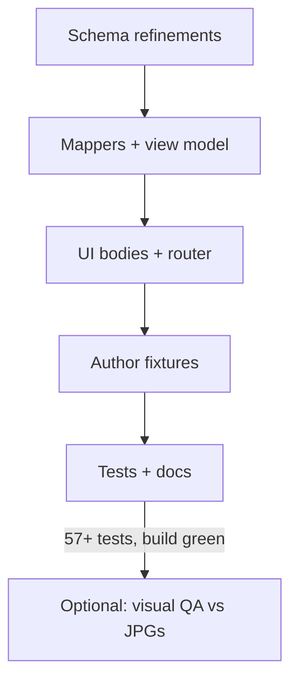

# Detailed Plan: Phase 2b — Positive/Negative + Comparison

**Status:** Implemented (2026-07-06)  
**Date:** 2026-07-06  
**Depends on:** Phase 2.0 + 1f + 2a complete (4/9 layoutTypes mapped, 57 tests green)  
**Parent doc:** [PROPOSAL-PHASE-2.md](./PROPOSAL-PHASE-2.md)

---

## 1. Executive summary

Phase 2b adds two more `layoutType` values to the grammar poster engine:

| layoutType | Reference topic | JSON fields | UI pattern |
|------------|-----------------|-------------|------------|
| `two-column-positive-negative` | Short answers (There is/are) | `positiveSide`, `negativeSide` | Yes/No answer columns |
| `comparison` | Plural spelling (cards 5–6) | `leftColumn`, `rightColumn` | Rule vs exceptions split |

**Effort:** ~1–2 focused sessions (single PR recommended).

**Visual change?** **Yes** — new layouts render only in author fixtures and layout-lab demos until a student poster is promoted in Phase 3+. Both live A1 slugs must remain unchanged.

**Exit criteria:**
- `two-column-positive-negative` and `comparison` map and render in tests
- Author fixtures validate with `posterContentRules: false`
- `npm run validate:grammar` and `npm run build` pass
- layoutType coverage **6 / 9**
- No regression on Questions + Affirmative A1 posters

---

## 2. Context — what exists today

| Layer | State after 2a |
|-------|----------------|
| Mapped layoutTypes | `two-equal`, `banner`, `three-column`, `full-width-split` (4/9) |
| Dispatch | `lib/grammar-builder/map-poster-section/index.ts` |
| View model router | `PosterSectionBody` switches on `internalLayout` |
| Schema fields | `positiveSide`, `negativeSide`, `leftColumn`, `rightColumn` already in Zod + JSON Schema |
| Schema refinements | **Missing** for comparison and positive-negative |
| Showcase prototype | `PosterLayoutShowcase` has hardcoded **Comparison** grid (lines 143–166) |
| Reference JPGs | Short answers: `z8010050137158_…jpg`; Plural spelling: `z8010050175108_…jpg` |

### Key distinction: `two-equal` vs `comparison`

Both use `leftColumn` / `rightColumn` in JSON, but dispatch is by **`layoutType`**, not field presence:

| | `two-equal` | `comparison` |
|---|-------------|--------------|
| Column headers | `PosterCategoryPill` (uppercase pill + badge) | Plain uppercase title text |
| Row content | `PosterExampleRow` (sentence + highlight + emoji) | Compact emoji + text lines (transformations) |
| Typical content | Q/A examples, category labels | Rule list vs exception list |
| internalLayout | `two_equal` / `two_equal_narrow` | `comparison` |

**Do not** merge these into one mapper — keep separate mappers and UI bodies.

---

## 3. Goals & non-goals

### 3.1 Goals

1. Map `layoutType: "two-column-positive-negative"` from `positiveSide` / `negativeSide`.
2. Map `layoutType: "comparison"` from `leftColumn` / `rightColumn` (comparison side shape).
3. Add `internalLayout` values: `positive_negative`, `comparison`.
4. Create `PosterPositiveNegativeBody` and `PosterComparisonBody` UI components.
5. Add schema refinements for required fields per layoutType.
6. Add two author fixtures + integration tests.
7. Update gap table in `SOURCE_OF_TRUTH_UI_GUIDE.md`.

### 3.2 Non-goals (2b)

| Item | Deferred to |
|------|-------------|
| `summary-grid` (Short answers card 3) | Phase 2c |
| Page layout span rules (`two-by-two-then-full`, etc.) | Phase 2c |
| `four-card-grid`, `full-width` | Phase 2d |
| Live student poster for Short answers | Phase 3+ |
| Layout lab author preview panel | Deferred (per prior decision) |
| Visual spec polish (border-2, absolute badge) | Phase 5b |
| Catalog entry / `content/grammar/` promotion | Phase 3+ (author fixtures stay in `docs/examples/` for now) |
| `validate:grammar` in `prebuild` | Optional — still only 2 live content files |

### 3.3 Card 3 strategy for Short answers fixture

The reference infographic’s card 3 is `summary-grid` (Phase 2c). For 2b:

- Ship **`short-answers-there-is-author.json`** as a **3-card author module** where cards 1–2 use `two-column-positive-negative` and card 3 uses a **`banner` stub** (remember strip) until 2c replaces it with `summary-grid`.
- Integration test asserts cards 1–2 map correctly; card 3 maps as existing banner path.
- Document in fixture header comment and `reference-index.md` that card 3 upgrades in 2c.

---

## 4. View model changes

**File:** `components/grammar/poster/poster-view-model.ts`

### 4.1 Extend `PosterInternalLayout`

**File:** `lib/grammar-builder/map-poster-section/infer-internal-layout.ts`

```typescript
export type PosterInternalLayout =
  | "two_equal"
  | "two_equal_narrow"
  | "banner"
  | "three_column"
  | "full_width_split"
  | "positive_negative"   // NEW
  | "comparison";         // NEW
```

### 4.2 New view-model types

```typescript
export type PosterComparisonSide = {
  title: string;
  badge?: string;
  items: PosterExample[];  // mapped via mapPosterItem — text + graphic only
};

export type PosterSection = {
  // … existing fields …
  /** two-column-positive-negative */
  positivePanel?: PosterSidePanel;
  negativePanel?: PosterSidePanel;
  /** comparison */
  comparisonLeft?: PosterComparisonSide;
  comparisonRight?: PosterComparisonSide;
};
```

**Note:** Reuse existing `PosterSidePanel` for positive/negative panels (`content` → mapped to `body` field, same as full-width-split).

### 4.3 Side panel mapping helper

Extract a shared helper (or inline in each mapper):

```typescript
function mapSidePanel(side: GrammarSidePanel): PosterSidePanel {
  return {
    title: side.title,
    body: side.content ?? "",
    example: side.example,
    formula: side.formula,
    warning: side.warning,
  };
}
```

Consider moving to `map-poster-section/map-side-panel.ts` if `map-full-width-split-section.ts` duplicates this logic today.

---

## 5. Schema updates

**Files:** `lib/grammar-builder/schema.ts`, `grammar-module.schema.json`, `SCHEMA.md`

### 5.1 New refinements

Add to `refineGrammarModule()`:

```typescript
if (card.layoutType === "two-column-positive-negative") {
  if (!card.positiveSide) {
    ctx.addIssue({
      code: "custom",
      message: "two-column-positive-negative layout requires positiveSide",
      path: ["cards", index, "positiveSide"],
    });
  }
  if (!card.negativeSide) {
    ctx.addIssue({
      code: "custom",
      message: "two-column-positive-negative layout requires negativeSide",
      path: ["cards", index, "negativeSide"],
    });
  }
  // At least one of content/example/formula on each side
  for (const [sideKey, side] of [
    ["positiveSide", card.positiveSide],
    ["negativeSide", card.negativeSide],
  ] as const) {
    if (side && !side.content?.trim() && !side.example?.trim() && !side.formula?.trim()) {
      ctx.addIssue({
        code: "custom",
        message: `${sideKey} requires content, example, or formula`,
        path: ["cards", index, sideKey],
      });
    }
  }
}

if (card.layoutType === "comparison") {
  if (!card.leftColumn) {
    ctx.addIssue({
      code: "custom",
      message: "comparison layout requires leftColumn",
      path: ["cards", index, "leftColumn"],
    });
  }
  if (!card.rightColumn) {
    ctx.addIssue({
      code: "custom",
      message: "comparison layout requires rightColumn",
      path: ["cards", index, "rightColumn"],
    });
  }
}
```

`leftColumn` / `rightColumn` item arrays already require `min(1)` via `grammarComparisonSideSchema`.

### 5.2 No new Zod object shapes

`positiveSide`, `negativeSide`, `leftColumn`, `rightColumn` are already defined. 2b only adds refinements and mapper wiring.

---

## 6. Mapper refactor

### 6.1 New files

```
lib/grammar-builder/map-poster-section/
├── map-positive-negative-section.ts   # NEW
├── map-comparison-section.ts          # NEW
└── map-side-panel.ts                  # NEW (optional extract)
```

### 6.2 Dispatch update (`index.ts`)

```typescript
case "two-column-positive-negative":
  return mapPositiveNegativeSection(card, options);
case "comparison":
  return mapComparisonSection(card, options);
```

### 6.3 `map-positive-negative-section.ts`

**Input:** `GrammarCard` with `layoutType: "two-column-positive-negative"`.

**Output fields:**

| View model field | Source |
|------------------|--------|
| `internalLayout` | `"positive_negative"` |
| `positivePanel` | `mapSidePanel(card.positiveSide)` |
| `negativePanel` | `mapSidePanel(card.negativeSide)` |

**Validation (mapper-level, in addition to Zod):**

- Throw `GrammarMapError` if either side missing.
- Throw if mapped panel `body` is empty and no `example`/`formula`.

**Poster content rules:** When `requireKidTitle` / `requireGlanceRule` are true (student posters), apply same as other mappers via `buildSectionBase`.

### 6.4 `map-comparison-section.ts`

**Input:** `GrammarCard` with `layoutType: "comparison"`.

**Output fields:**

| View model field | Source |
|------------------|--------|
| `internalLayout` | `"comparison"` |
| `comparisonLeft` | `{ title, badge, items: leftColumn.items.map(mapPosterItem) }` |
| `comparisonRight` | `{ title, badge, items: rightColumn.items.map(mapPosterItem) }` |

**Do not** populate `leftLabel`, `leftExamples`, etc. — those are `two-equal` fields. Keeps router unambiguous.

---

## 7. UI components

### 7.1 `PosterPositiveNegativeBody.tsx` (NEW)

**Layout:** 50/50 grid, dashed vertical divider (match `TwoEqualBody` grid classes).

**Left column (positive / Yes):**
- Optional title from `positivePanel.title` (default visual: “YES” styling if title absent)
- Primary answer line: `body`, `example`, or `formula` — prefer `example` when present for short answers
- Subtle green accent on title or left border (use theme palette, not hardcoded `#15803d` — derive from section `palette` or a fixed “yes” token in theme)

**Right column (negative / No):**
- Mirror structure with warm/red accent for “NO”

**Reference markup:** Short answers JPG (`z8010050137158`). Typical pattern:

```
┌─────────────────────┬─────────────────────┐
│ YES                 │ NO                  │
│ Yes, there is.      │ No, there isn't.    │
│ Yes, there are.     │ No, there aren't.   │
└─────────────────────┴─────────────────────┘
```

**Variant prop:** Respect `GrammarPosterVariant` — `poster` uses `text-base` floor; `showcase` may use slightly smaller text (same as other bodies).

**Reuse:** Consider `PosterNoteBox` for each side if density works on tablet; otherwise plain stacked paragraphs with bold titles.

### 7.2 `PosterComparisonBody.tsx` (NEW)

**Port from showcase** — `PosterLayoutShowcase.tsx` lines 143–166:

```tsx
<div className="grid grid-cols-1 items-start gap-3 sm:grid-cols-2">
  <div className="sm:border-r-2 sm:border-dashed sm:border-kid-ink/30 sm:pr-4">
    <p className="mb-2 text-xs font-extrabold uppercase text-kid-ink">
      {comparisonLeft.title}
    </p>
    {comparisonLeft.items.map((item, i) => (
      <p key={i} className="text-base font-bold text-kid-ink md:text-lg">
        {item.emoji ? <span aria-hidden>{item.emoji} </span> : null}
        {item.sentence}
      </p>
    ))}
  </div>
  <div className="sm:pl-4">
    <p className="mb-2 text-xs font-extrabold uppercase text-kid-ink">
      {comparisonRight.title}
    </p>
    {/* same item loop */}
  </div>
</div>
```

**Do not** use `PosterCategoryPill` or `PosterExampleRow` — comparison rows are compact transformation lines, not full example sentences.

**Optional badge:** If `comparisonLeft.badge` present, render inline before title or as small emoji prefix.

### 7.3 Router update (`PosterSectionBody.tsx`)

```typescript
case "positive_negative":
  return <PosterPositiveNegativeBody section={section} variant={variant} />;
case "comparison":
  return <PosterComparisonBody section={section} variant={variant} />;
```

---

## 8. Author fixtures

### 8.1 `docs/grammar-module/examples/short-answers-there-is-author.json`

| Field | Value |
|-------|-------|
| `moduleTitle` | `SHORT ANSWERS — THERE IS / THERE ARE` |
| `displayMode` | `showcase` |
| `pageLayout` | `two-equal-then-full` |
| `tags` | Optional author hashtags (allowed in showcase) |

**Card 1** — `sky-blue`, `two-column-positive-negative`

- `kidTitle`: `Is there…?`
- `glanceRule`: `Yes or No?`
- `positiveSide`: title `YES`, example `Yes, there is.`
- `negativeSide`: title `NO`, example `No, there isn't.`

**Card 2** — `tangerine`, `two-column-positive-negative`

- `kidTitle`: `Are there…?`
- `glanceRule`: `Yes or No?`
- `positiveSide`: title `YES`, example `Yes, there are.`
- `negativeSide`: title `NO`, example `No, there aren't.`

**Card 3** — `lavender`, `banner` (stub until 2c)

- `kidTitle`: `Remember!`
- `bannerText` + `leftSide.content` — single remember line about short answers
- Comment in file: `# card 3 → summary-grid in Phase 2c`

### 8.2 `docs/grammar-module/examples/plural-spelling-comparison.json`

Minimal **2-card excerpt** module (author-only, no catalog promotion):

| Field | Value |
|-------|-------|
| `moduleTitle` | `PLURAL SPELLING — COMPARISON EXCERPT` |
| `displayMode` | `showcase` |
| `pageLayout` | `two-equal-then-full` |

**Card 1** — `lavender`, `comparison` — nouns ending in **-f / -fe** → **-ves**

- `leftColumn.title`: `Change to -ves`
- `leftColumn.items`: leaf → leaves, wolf → wolves (with graphics)
- `rightColumn.title`: `Exceptions (+s)`
- `rightColumn.items`: roof → roofs, chief → chiefs

**Card 2** — `bubblegum`, `comparison` — **-o** endings (second row from reference)

- Rule vs exceptions split matching JPG bottom row pattern

Content can mirror `POSTER_LAYOUT_SHOWCASE_DEMOS.comparison` for card 1; card 2 authored from JPG during implementation.

---

## 9. Tests

### 9.1 Unit tests

| File | Cases |
|------|-------|
| `map-positive-negative-section.test.ts` | Maps both panels; throws when side missing; respects `buildSectionBase` kidTitle |
| `map-comparison-section.test.ts` | Maps both sides; items via `mapPosterItem`; throws when column missing |
| `validate-module.test.ts` | Rejects positive-negative missing sides; rejects comparison missing columns; rejects empty positiveSide content |
| `map-poster-section-dispatch.test.ts` | `comparison` and `two-column-positive-negative` no longer throw; `summary-grid` still throws |

### 9.2 Integration tests

| File | Cases |
|------|-------|
| `map-author-short-answers.test.ts` | Parse + map `short-answers-there-is-author.json`; cards 0–1 → `positive_negative`; card 2 → `banner` |
| `map-author-plural-comparison.test.ts` | Parse + map `plural-spelling-comparison.json`; all cards → `comparison` |

### 9.3 Regression

| File | Assertion |
|------|-----------|
| `load-poster-module-by-slug.test.ts` | Both live slugs unchanged |
| `grammar-content-sync.test.ts` | Unaffected (no new `content/grammar/` files) |

**Target test count after 2b:** ~65–70 (from 57).

---

## 10. Documentation updates

| File | Change |
|------|--------|
| `SOURCE_OF_TRUTH_UI_GUIDE.md` §6 gap table | Mark `two-column-positive-negative` ✅, `comparison` ✅ |
| `reference-index.md` | Link new example JSON for Short answers + Plural spelling excerpt |
| `SCHEMA.md` | Note refinements for both layoutTypes |
| `PROPOSAL-PHASE-2.md` | Update §2.1 “Mapped today” when 2b lands (optional) |

---

## 11. File checklist

| Action | Path |
|--------|------|
| Edit | `lib/grammar-builder/map-poster-section/infer-internal-layout.ts` |
| Edit | `lib/grammar-builder/map-poster-section/index.ts` |
| Create | `lib/grammar-builder/map-poster-section/map-positive-negative-section.ts` |
| Create | `lib/grammar-builder/map-poster-section/map-comparison-section.ts` |
| Create | `lib/grammar-builder/map-poster-section/map-side-panel.ts` (optional) |
| Edit | `lib/grammar-builder/schema.ts` |
| Edit | `components/grammar/poster/poster-view-model.ts` |
| Create | `components/grammar/poster/PosterPositiveNegativeBody.tsx` |
| Create | `components/grammar/poster/PosterComparisonBody.tsx` |
| Edit | `components/grammar/poster/PosterSectionBody.tsx` |
| Create | `docs/grammar-module/examples/short-answers-there-is-author.json` |
| Create | `docs/grammar-module/examples/plural-spelling-comparison.json` |
| Create | `lib/grammar-builder/map-positive-negative-section.test.ts` |
| Create | `lib/grammar-builder/map-comparison-section.test.ts` |
| Create | `lib/grammar-builder/map-author-short-answers.test.ts` |
| Create | `lib/grammar-builder/map-author-plural-comparison.test.ts` |
| Edit | `lib/grammar-builder/validate-module.test.ts` |
| Edit | `lib/grammar-builder/map-poster-section-dispatch.test.ts` |
| Edit | `docs/grammar-module/SOURCE_OF_TRUTH_UI_GUIDE.md` |
| Edit | `docs/grammar-module/reference-index.md` |

---

## 12. Acceptance criteria

- [ ] `parseGrammarModule(short-answers-there-is-author.json, { posterContentRules: false })` succeeds
- [ ] `parseGrammarModule(plural-spelling-comparison.json, { posterContentRules: false })` succeeds
- [ ] `mapPosterModule()` maps both fixtures without throw
- [ ] Cards with `two-column-positive-negative` render Yes/No columns in isolated component test or manual layout-lab check
- [ ] Cards with `comparison` render rule vs exceptions with dashed divider
- [ ] Live A1 posters at both slugs unchanged
- [ ] `npm run validate:grammar` + `npm run build` pass
- [ ] layoutType coverage **6/9**
- [ ] Gap table updated

---

## 13. Implementation order & gates



| Step | Work | Est. |
|------|------|------|
| 1 | Schema refinements + view model types | 30 min |
| 2 | Mappers + dispatch | 1–1.5 hrs |
| 3 | UI components (port showcase comparison; new positive-negative) | 1.5–2 hrs |
| 4 | Author fixtures (attach JPGs in Cursor during authoring) | 1 hr |
| 5 | Tests + docs | 1 hr |
| **Total** | | **~5–6 hrs (1–2 sessions)** |

---

## 14. Risks & mitigations

| Risk | Mitigation |
|------|------------|
| `two-equal` vs `comparison` field collision | Dispatch strictly on `layoutType`; separate view-model fields |
| Positive-negative styling too heavy for A1 tablet | Use plain text columns first; defer accent colors to visual QA |
| Short answers card 3 blocked on `summary-grid` | Banner stub in fixture; full module completes in 2c |
| Duplicated side-panel mapping | Extract `mapSidePanel` shared with full-width-split |
| Author fixture content drift from JPG | Attach canonical JPG when authoring JSON; manual compare once |

---

## 15. Review questions

| # | Question | Recommendation |
|---|----------|----------------|
| Q1 | Single PR vs split (mapper / UI / fixtures)? | **Single PR** — small scope, one layout batch |
| Q2 | Short answers card 3 in 2b? | **Banner stub** until 2c `summary-grid` |
| Q3 | Promote short answers to live student slug in 2b? | **No** — author/showcase only; Phase 3+ |
| Q4 | Layout lab author preview for new fixtures? | **No** — tests only (prior decision) |
| Q5 | Extract `mapSidePanel` helper? | **Yes** if full-width-split duplicates mapping |
| Q6 | Yes/No accent colors: theme-derived or fixed tokens? | **Theme-derived** from section palette; avoid new hex literals |

---

## 16. Sign-off

| Reviewer | Role | Decision | Date | Notes |
|----------|------|----------|------|-------|
| | Product | ☐ Approve ☐ Revise ☐ Reject | | |
| | Content / ESL | ☐ Approve ☐ Revise ☐ Reject | | |
| | Engineering | ☐ Approve ☐ Revise ☐ Reject | | |

**Approved to implement when:** All three approve §15 review questions (or document revisions).

---

## 17. After approval — first implementation prompt

> Implement Phase 2b: add `two-column-positive-negative` and `comparison` mappers, view-model fields, `PosterPositiveNegativeBody` + `PosterComparisonBody`, schema refinements, author fixtures (`short-answers-there-is-author.json`, `plural-spelling-comparison.json`), and tests. Port comparison markup from `PosterLayoutShowcase`. Do not change live A1 posters. Short answers card 3 stays `banner` until 2c.

---

## 18. What unlocks next (Phase 2c preview)

After 2b merges:

| Unlocked | Still blocked |
|----------|---------------|
| Short answers cards 1–2 (author) | Short answers card 3 (`summary-grid`) |
| Plural spelling comparison row (author excerpt) | Plural spelling top row (`four-card-grid`) |
| 6/9 layoutTypes | `summary-grid`, page grids, `four-card-grid`, `full-width` |

**Next plan doc:** `PLAN-PHASE-2c.md` — summary grid + `two-by-two-then-full` + `four-card-grid-then-split` page spans.
