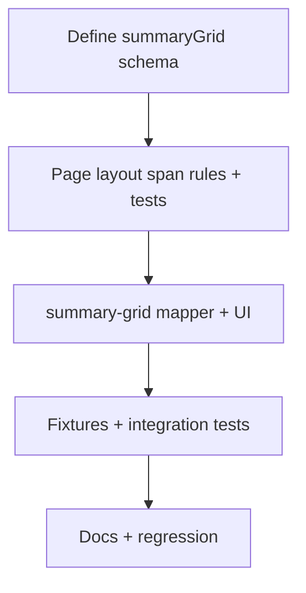

# Detailed Plan: Phase 2c — Summary Grid + Page Layouts

**Status:** Implemented (2026-07-06)  
**Date:** 2026-07-06  
**Depends on:** Phase 2b complete (6/9 layoutTypes mapped, 68 tests green)  
**Parent doc:** [PROPOSAL-PHASE-2.md](./PROPOSAL-PHASE-2.md)

---

## 1. Executive summary

Phase 2c adds the **last card-level layout type** still missing from the enum, plus **real page-grid span rules** so multi-card author modules lay out correctly.

| Work package | What it does | Reference topic |
|--------------|--------------|-----------------|
| **`summary-grid`** | Checkmark / text matrix inside one card | Short answers card 3; Some and Any card 5 |
| **`two-by-two-then-full`** | 2×2 cards, then full-width summary row | Some and Any (5 cards) |
| **`four-card-grid-then-split`** | 2×2 mini cards, then 2 wide cards | Plural spelling page shell (6 cards) |
| **`two-equal` (3 cards)** | Natural wrap in 2-col grid (no extra span) | Plural pronunciation (fixture stub only) |

**Effort:** ~1–2 focused sessions (single PR recommended).

**Visual change?** **Yes** for author/showcase fixtures only. Both live A1 student slugs stay unchanged.

**Exit criteria:**
- `summary-grid` maps and renders in tests
- `getPosterSectionWrapperClass` handles all three new span patterns + existing `two-equal-then-full`
- Author fixtures validate; Short answers card 3 upgraded from banner stub
- layoutType coverage **7 / 9**; pageLayout coverage **4 / 5 wired** (only `custom` remains unimplemented)
- `npm run validate:grammar` + `npm run build` pass; **~80+ tests**

---

## 2. Context — what exists today

| Layer | State after 2b |
|-------|----------------|
| layoutTypes mapped | 6/9 — missing `summary-grid`, `four-card-grid`, `full-width` |
| pageLayout wired | 1/5 — only `two-equal-then-full` has span logic |
| `poster-page-layout.ts` | Returns same 2-col grid class for all multi-col layouts; span only for last card on `two-equal-then-full` |
| Summary grid in schema | Enum value only — **no `summaryGrid` object in Zod or JSON Schema** |
| Short answers fixture | Cards 1–2 ✅ positive-negative; card 3 **banner stub** waiting for 2c |
| Some and Any fixture | None |
| Plural spelling full page | Comparison excerpt only (2 cards); no 6-card page shell |

### What “page layout” means (plain language)

The **page** is the outer grid of cards. The **card** is each colored box. Phase 2c teaches the page grid when to make a card **full width** vs **half width**.

| pageLayout | Card arrangement (desktop) |
|------------|----------------------------|
| `two-equal-then-full` | 2 cards side by side, then 1 wide card below ✅ already works |
| `two-by-two-then-full` | 4 cards in a 2×2 grid, then 1 wide summary card below |
| `four-card-grid-then-split` | 4 cards in a 2×2 grid, then 2 half-width cards on the bottom row |
| `two-equal` | Plain 2-column grid; odd card count wraps naturally (card 3 sits alone on row 2) |

---

## 3. Goals & non-goals

### 3.1 Goals

1. **Define and implement `summaryGrid` JSON shape** (new Zod + JSON Schema block).
2. Map `layoutType: "summary-grid"` → `internalLayout: "summary_grid"`.
3. Build `PosterSummaryGrid` UI component (check ✓, cross ✗, dash —, or text cells).
4. Extend `getPosterSectionWrapperClass` for `two-by-two-then-full` and `four-card-grid-then-split`.
5. Confirm `two-equal` needs no span rule (wrap-only behavior).
6. Add / upgrade author fixtures + page-layout unit tests.
7. **Upgrade** `short-answers-there-is-author.json` card 3 from banner → `summary-grid`.
8. Update docs gap table.

### 3.2 Non-goals (2c)

| Item | Deferred to |
|------|-------------|
| `four-card-grid` layoutType (nested mini cards **inside** one page card) | Phase 2d |
| `full-width` layoutType | Phase 2d |
| Live student posters for Short answers / Some and Any | Phase 3+ |
| Layout lab author preview | Deferred (prior decision) |
| `pageLayout: custom` row editor | Future |
| Hard schema enforcement of card count per pageLayout | Optional stretch (soft test only) |
| Visual spec polish (border-2, absolute badge) | Phase 5b |

### 3.3 Plural spelling page shell strategy

Full plural spelling reference has **6 page-level cards**: 4 mini rule cards + 2 comparison cards.

| Cards | layoutType in 2c | Notes |
|-------|------------------|-------|
| 1–4 | `two-equal` **stubs** (minimal placeholder content) | Real `four-card-grid` inner layout comes in **2d** |
| 5–6 | `comparison` (already mapped in 2b) | Reuse content pattern from `plural-spelling-comparison.json` |

**Purpose:** Prove `four-card-grid-then-split` **page** span rules without waiting for 2d card-level four-grid.

---

## 4. Summary grid — JSON shape (NEW)

Spiked from **Some and Any** and **Short answers** reference JPGs (`z8010050156038`, `z8010050137158`).

### 4.1 Schema definition

**Files:** `lib/grammar-builder/schema.ts`, `grammar-module.schema.json`, `SCHEMA.md`

```typescript
export const grammarSummaryMarkSchema = z.enum(["check", "cross", "dash", "text"]);

export const grammarSummaryCellSchema = z
  .object({
    mark: grammarSummaryMarkSchema,
    text: z.string().optional(),
    graphic: z.string().optional(),
  })
  .strict();

export const grammarSummaryGridSchema = z
  .object({
    columns: z
      .array(
        z
          .object({
            label: z.string().min(1),
          })
          .strict(),
      )
      .min(2),
    rows: z
      .array(
        z
          .object({
            label: z.string().min(1),
            cells: z.array(grammarSummaryCellSchema).min(1),
          })
          .strict(),
      )
      .min(1),
  })
  .strict();
```

Add to `grammarCardSchema`:

```typescript
summaryGrid: grammarSummaryGridSchema.optional(),
```

### 4.2 Refinements

```typescript
if (card.layoutType === "summary-grid") {
  if (!card.summaryGrid) {
    ctx.addIssue({ message: "summary-grid layout requires summaryGrid", path: ["cards", index, "summaryGrid"] });
  } else {
    const { columns, rows } = card.summaryGrid;
    rows.forEach((row, rowIndex) => {
      if (row.cells.length !== columns.length) {
        ctx.addIssue({
          message: `summaryGrid row ${rowIndex + 1} must have ${columns.length} cells`,
          path: ["cards", index, "summaryGrid", "rows", rowIndex, "cells"],
        });
      }
      row.cells.forEach((cell, cellIndex) => {
        if (cell.mark === "text" && !cell.text?.trim()) {
          ctx.addIssue({
            message: "summaryGrid text cells require text",
            path: ["cards", index, "summaryGrid", "rows", rowIndex, "cells", cellIndex, "text"],
          });
        }
      });
    });
  }
}
```

### 4.3 Mark rendering

| `mark` | Renders as |
|--------|------------|
| `check` | ✓ (green-leaning; use theme header color, not fixed hex) |
| `cross` | ✗ |
| `dash` | — (not applicable) |
| `text` | `cell.text` (+ optional `graphic` prefix) |

### 4.4 Example — Some and Any card 5

```json
{
  "layoutType": "summary-grid",
  "summaryGrid": {
    "columns": [
      { "label": "SOME" },
      { "label": "ANY" }
    ],
    "rows": [
      {
        "label": "Affirmative",
        "cells": [{ "mark": "check" }, { "mark": "cross" }]
      },
      {
        "label": "Negative",
        "cells": [{ "mark": "cross" }, { "mark": "check" }]
      },
      {
        "label": "Question",
        "cells": [{ "mark": "cross" }, { "mark": "check" }]
      }
    ]
  }
}
```

### 4.5 Example — Short answers card 3 (upgrade)

Replace banner stub with a **text-heavy** summary grid (3 columns):

```json
{
  "layoutType": "summary-grid",
  "summaryGrid": {
    "columns": [
      { "label": "Question" },
      { "label": "Yes" },
      { "label": "No" }
    ],
    "rows": [
      {
        "label": "Is there…?",
        "cells": [
          { "mark": "text", "text": "Is there a book?" },
          { "mark": "text", "text": "Yes, there is." },
          { "mark": "text", "text": "No, there isn't." }
        ]
      },
      {
        "label": "Are there…?",
        "cells": [
          { "mark": "text", "text": "Are there books?" },
          { "mark": "text", "text": "Yes, there are." },
          { "mark": "text", "text": "No, there aren't." }
        ]
      }
    ]
  }
}
```

---

## 5. View model changes

**File:** `components/grammar/poster/poster-view-model.ts`

```typescript
export type PosterSummaryMark = "check" | "cross" | "dash" | "text";

export type PosterSummaryCell = {
  mark: PosterSummaryMark;
  text?: string;
  graphic?: string;
};

export type PosterSummaryGrid = {
  columns: { label: string }[];
  rows: {
    label: string;
    cells: PosterSummaryCell[];
  }[];
};

// PosterSection additions:
summaryGrid?: PosterSummaryGrid;
```

**File:** `infer-internal-layout.ts`

```typescript
| "summary_grid"
```

---

## 6. Page layout engine

**File:** `lib/grammar-builder/poster-page-layout.ts`

### 6.1 Span rules (extend `getPosterSectionWrapperClass`)

| pageLayout | Index | Wrapper class |
|------------|-------|---------------|
| `two-equal-then-full` | `index === total - 1` && `total > 2` | `sm:col-span-2` ✅ exists |
| `two-by-two-then-full` | `index >= 4` | `sm:col-span-2` |
| `four-card-grid-then-split` | none | `undefined` (all cards half-width) |
| `two-equal` | none | `undefined` (natural wrap) |
| `single-column` | none | `undefined` |

**Implementation sketch:**

```typescript
export function getPosterSectionWrapperClass(
  index: number,
  pageLayout: GrammarPageLayout,
  total: number,
): string | undefined {
  if (pageLayout === "two-equal-then-full" && total > 2 && index === total - 1) {
    return "sm:col-span-2";
  }

  if (pageLayout === "two-by-two-then-full" && index >= 4) {
    return "sm:col-span-2";
  }

  return undefined;
}
```

### 6.2 Expected layouts (5-card Some and Any)

```
┌──────────┬──────────┐
│  Card 1  │  Card 2  │
├──────────┼──────────┤
│  Card 3  │  Card 4  │
├──────────┴──────────┤
│      Card 5         │  ← summary-grid, col-span-2
└─────────────────────┘
```

### 6.3 Expected layouts (6-card plural spelling shell)

```
┌──────────┬──────────┐
│  Card 1  │  Card 2  │  ← two-equal stubs
├──────────┼──────────┤
│  Card 3  │  Card 4  │
├──────────┼──────────┤
│  Card 5  │  Card 6  │  ← comparison (from 2b)
└──────────┴──────────┘
```

### 6.4 Optional card-count guard (stretch)

Add **`poster-page-layout.test.ts`** table-driven cases; optional dev-only warning in mapper if `pageLayout === "two-by-two-then-full" && cards.length !== 5` — **do not** block parse in 2c.

---

## 7. Mapper & UI

### 7.1 New files

```
lib/grammar-builder/map-poster-section/
└── map-summary-grid-section.ts

components/grammar/poster/
└── PosterSummaryGrid.tsx
```

### 7.2 Dispatch

```typescript
case "summary-grid":
  return mapSummaryGridSection(card, options);
```

### 7.3 `map-summary-grid-section.ts`

- `buildSectionBase(card, "summary_grid", options)`
- Copy `summaryGrid` columns/rows/cells to view model (1:1)
- Throw `GrammarMapError` if `summaryGrid` missing

### 7.4 `PosterSummaryGrid.tsx`

Responsive table-like grid:

- Header row: column labels (uppercase, bold)
- Each body row: row label in first column + cell marks
- Dashed internal dividers (match comparison / three-column patterns)
- Mobile: horizontal scroll **or** stack labels above cells if cramped (prefer scroll first to preserve matrix shape)

**No existing showcase prototype** — design from Some and Any JPG. Keep A1 typography floor (`text-base` minimum on poster variant).

### 7.5 Router (`PosterSectionBody.tsx`)

```typescript
case "summary_grid":
  return section.summaryGrid ?
    <PosterSummaryGrid grid={section.summaryGrid} variant={variant} accentColor={section.palette?.header} />
  : null;
```

---

## 8. Author fixtures

### 8.1 Upgrade existing

| File | Change |
|------|--------|
| `docs/grammar-module/examples/short-answers-there-is-author.json` | Card 3: `banner` → `summary-grid` with text matrix (§4.5) |

### 8.2 Create new

**`docs/grammar-module/examples/some-and-any-author.json`**

| Field | Value |
|-------|-------|
| `displayMode` | `showcase` |
| `pageLayout` | `two-by-two-then-full` |
| Cards | 5 total |

| Card | Theme | layoutType | Content sketch |
|------|-------|------------|----------------|
| 1 | sky-blue | `two-equal` | Some in affirmative — left/right examples |
| 2 | tangerine | `two-equal` | Any in questions — left/right examples |
| 3 | mint-green | `two-equal` | Some in questions |
| 4 | sun-gold | `two-equal` | Any in negative |
| 5 | lavender | `summary-grid` | SOME / ANY checkmark matrix (§4.4) |

Cards 1–4 use **existing two-equal mapper** — no new card layout in 2c.

**`docs/grammar-module/examples/plural-spelling-page-shell.json`**

| Field | Value |
|-------|-------|
| `displayMode` | `showcase` |
| `pageLayout` | `four-card-grid-then-split` |
| Cards | 6 total |

| Card | layoutType | Notes |
|------|------------|-------|
| 1–4 | `two-equal` | Minimal stub (“Rule 1” … “Rule 4”); upgraded in 2d |
| 5–6 | `comparison` | Same -f/-fe and -o content as `plural-spelling-comparison.json` |

**`docs/grammar-module/examples/plural-pronunciation-page-stub.json`** (optional, low priority)

| Field | Value |
|-------|-------|
| `pageLayout` | `two-equal` |
| Cards | 3 × `three-column` (already mapped) |

Proves 3-card wrap only if time permits — **not required for 2c approval**.

---

## 9. Tests

### 9.1 Unit

| File | Cases |
|------|-------|
| `map-summary-grid-section.test.ts` | Maps grid; throws when missing; cell count mismatch caught by Zod |
| `poster-page-layout.test.ts` | Span rules for all pageLayouts × representative card counts |
| `validate-module.test.ts` | summary-grid missing grid; row/cell length mismatch; text cell without text |

### 9.2 Integration

| File | Cases |
|------|-------|
| `map-author-short-answers.test.ts` | **Update:** card 3 → `summary_grid` |
| `map-author-some-and-any.test.ts` | 5 cards map; card 5 summary; pageLayout spans |
| `map-author-plural-spelling-page.test.ts` | 6 cards map; cards 5–6 comparison |

### 9.3 Regression

- `load-poster-module-by-slug.test.ts` — live slugs unchanged
- `map-poster-section-dispatch.test.ts` — `four-card-grid` still throws (2d)

**Target:** ~80–85 tests (from 68).

---

## 10. Documentation updates

| File | Change |
|------|--------|
| `SOURCE_OF_TRUTH_UI_GUIDE.md` §6 | `summary-grid` ✅; page layouts ✅ |
| `SCHEMA.md` | Document `summaryGrid` block |
| `grammar-module.schema.json` | Add `summaryGrid` def + card property |
| `reference-index.md` | Link Some and Any + upgraded Short answers; plural spelling page shell |
| `AI_PROMPT_RECIPES.md` | Add summary-grid validation checklist (optional) |

---

## 11. File checklist

| Action | Path |
|--------|------|
| Edit | `lib/grammar-builder/schema.ts` |
| Edit | `docs/grammar-module/grammar-module.schema.json` |
| Edit | `lib/grammar-builder/map-poster-section/infer-internal-layout.ts` |
| Edit | `lib/grammar-builder/map-poster-section/index.ts` |
| Create | `lib/grammar-builder/map-poster-section/map-summary-grid-section.ts` |
| Edit | `lib/grammar-builder/poster-page-layout.ts` |
| Edit | `lib/grammar-builder/poster-page-layout.test.ts` |
| Edit | `components/grammar/poster/poster-view-model.ts` |
| Create | `components/grammar/poster/PosterSummaryGrid.tsx` |
| Edit | `components/grammar/poster/PosterSectionBody.tsx` |
| Edit | `docs/grammar-module/examples/short-answers-there-is-author.json` |
| Create | `docs/grammar-module/examples/some-and-any-author.json` |
| Create | `docs/grammar-module/examples/plural-spelling-page-shell.json` |
| Create | `lib/grammar-builder/map-summary-grid-section.test.ts` |
| Create | `lib/grammar-builder/map-author-some-and-any.test.ts` |
| Create | `lib/grammar-builder/map-author-plural-spelling-page.test.ts` |
| Edit | `lib/grammar-builder/map-author-short-answers.test.ts` |
| Edit | `lib/grammar-builder/validate-module.test.ts` |
| Edit | `docs/grammar-module/SOURCE_OF_TRUTH_UI_GUIDE.md` |
| Edit | `docs/grammar-module/reference-index.md` |
| Edit | `docs/grammar-module/SCHEMA.md` |

---

## 12. Acceptance criteria

- [ ] `summaryGrid` validates in Zod + JSON Schema
- [ ] `summary-grid` layoutType maps and renders check/text cells
- [ ] `two-by-two-then-full` spans card 5+ full width
- [ ] `four-card-grid-then-split` renders 2×2 + bottom row without incorrect spans
- [ ] Short answers author fixture card 3 upgraded; full module maps
- [ ] Some and Any 5-card author fixture maps end-to-end
- [ ] Plural spelling 6-card page shell maps (stubs + comparison)
- [ ] Live A1 posters unchanged
- [ ] `npm run validate:grammar` + `npm run build` pass
- [ ] layoutType **7/9**; pageLayout **4/5** wired

---

## 13. Implementation order



| Step | Work | Est. |
|------|------|------|
| 1 | `summaryGrid` Zod + JSON Schema + refinements | 45 min |
| 2 | Page layout spans + unit tests | 45 min |
| 3 | Mapper + `PosterSummaryGrid` + router | 2 hrs |
| 4 | Fixtures (attach JPGs when authoring) | 1–1.5 hrs |
| 5 | Integration tests + docs | 1 hr |
| **Total** | | **~5–6 hrs (1–2 sessions)** |

---

## 14. Risks & mitigations

| Risk | Mitigation |
|------|------------|
| Summary grid JSON shape wrong vs JPG | Attach canonical JPG when authoring fixtures; manual compare once |
| 5–6 card pages break mobile | Test 768×1024; allow horizontal scroll on summary grid |
| Plural spelling stubs confuse authors | Clear `title` suffix “(stub — 2d)” in JSON |
| `summaryGrid` vs `layoutType: summary-grid` naming | Keep both — enum for dispatch, object for data (document in SCHEMA.md) |

---

## 15. Review questions

Plain-language decisions — recommendations match prior phase patterns.

| # | Question (plain language) | Recommendation |
|---|---------------------------|----------------|
| Q1 | **One PR or split?** Ship all of 2c together or split schema vs UI? | **Single PR** — schema + page spans + summary grid belong together |
| Q2 | **Upgrade Short answers card 3 in place?** Replace the banner stub we added in 2b? | **Yes** — that’s the main payoff for the existing fixture |
| Q3 | **Plural spelling top row (cards 1–4)?** Use simple two-equal placeholders until four-card-grid exists? | **Yes** — page shell only; inner mini cards come in 2d |
| Q4 | **Browser preview in layout lab?** | **No** — tests only (same as 2a/2b) |
| Q5 | **Publish live student routes?** | **No** — showcase/author JSON only |
| Q6 | **Plural pronunciation 3-card stub fixture?** Extra file for `two-equal` wrap demo? | **Optional stretch** — skip unless time remains |
| Q7 | **Schema warn if card count wrong?** e.g. Some and Any must have 5 cards? | **Soft test only** — don’t block parsing |

---

## 16. Sign-off

| Reviewer | Role | Decision | Date | Notes |
|----------|------|----------|------|-------|
| | Product | ☐ Approve ☐ Revise ☐ Reject | | |
| | Content / ESL | ☐ Approve ☐ Revise ☐ Reject | | |
| | Engineering | ☐ Approve ☐ Revise ☐ Reject | | |

**Approved to implement when:** Reviewers approve §15 (or note revisions).

---

## 17. After approval — first implementation prompt

> Implement Phase 2c: define `summaryGrid` schema, add `summary-grid` mapper + `PosterSummaryGrid` UI, extend `poster-page-layout` span rules for `two-by-two-then-full` and `four-card-grid-then-split`, upgrade Short answers card 3, add Some and Any + plural spelling page shell author fixtures with tests. Do not change live A1 posters. No layout lab preview.

---

## 18. What unlocks next (Phase 2d preview)

After 2c merges:

| Unlocked | Still blocked |
|----------|---------------|
| Full Short answers author module | — |
| Some and Any author module (page + summary) | Inner card splits may need density pass |
| Plural spelling page **grid** (6-card layout) | Cards 1–4 inner `four-card-grid` |
| 7/9 layoutTypes | `four-card-grid`, `full-width` |
| 4/5 pageLayouts | `custom` only |

**Next plan doc:** `PLAN-PHASE-2d.md` — `four-card-grid`, `full-width`, `transformationRow`, `goodBadPair`.
