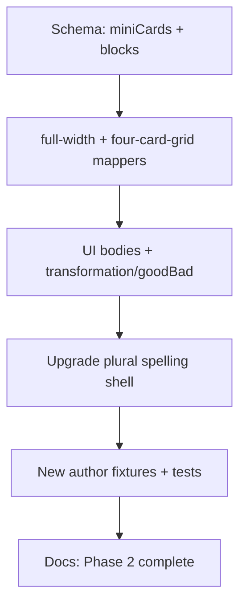

# Detailed Plan: Phase 2d — Four-Grid, Full-Width & Advanced Blocks

**Status:** Implemented (2026-07-06)  
**Depends on:** Phase 2c complete (7/9 layoutTypes, 83 tests green)  
**Parent doc:** [PROPOSAL-PHASE-2.md](./PROPOSAL-PHASE-2.md)

---

## 1. Executive summary

Phase 2d is the **final layout-engine sub-phase**. It closes the remaining `layoutType` values and adds the advanced JSON blocks referenced in the UI guide but not yet in Zod.

| Work package | What it does | Reference topic |
|--------------|--------------|-----------------|
| **`four-card-grid`** | Four nested mini rule cards inside one page card | Countable nouns card 2 |
| **`full-width`** | Vertical stack of examples + optional subHeader | Generic / plural spelling mini cards |
| **`transformationRow`** | Noun + suffix → result (+ optional IPA) | Plural pronunciation |
| **`goodBadPair`** | Correct vs struck-through incorrect Q/A | Uncountable nouns |
| **Fixture upgrades** | Replace plural spelling stubs; add 2–3 author modules | Spelling, countable, uncountable, pronunciation |

**Effort:** ~2 focused sessions (single PR recommended — completes Phase 2).

**Visual change?** **Yes** for author/showcase fixtures only. Both live A1 student slugs stay unchanged.

**Exit criteria:**
- All **9/9** `layoutType` values map without throw
- **4/5** pageLayouts wired (`custom` remains reserved)
- **10+** author JSON fixtures validate under `posterContentRules: false`
- `npm run validate:grammar` + `npm run build` pass; **~95+ tests**
- Phase 2 marked complete in docs

---

## 2. Context — what exists today

| Layer | State after 2c |
|-------|----------------|
| layoutTypes mapped | **7/9** — missing `four-card-grid`, `full-width` |
| pageLayouts wired | **4/5** — `custom` only unimplemented |
| Advanced blocks in Zod | **None** — `transformationRow`, `goodBadPair` UI-guide only |
| Author fixtures | 7 JSON files in `docs/examples/` |
| Showcase prototypes | `PosterLayoutShowcase` has **four-card grid** demo (lines 124–141) |
| Plural spelling shell | 6 page cards; cards 1–4 are `two-equal` **stubs** from 2c |
| `subHeader` | Wired for `three-column` only |

### Plain-language: what 2d adds

| Term | Meaning |
|------|---------|
| **four-card-grid** | One big card on the page contains **4 small rule cards** inside it (2×2 grid) |
| **full-width** | One card with content **stacked top-to-bottom** (examples listed vertically) |
| **transformationRow** | A “cat + s = cats” style row, sometimes with IPA (/s/, /z/) |
| **goodBadPair** | Side-by-side **good** answer vs **crossed-out bad** answer |

### Important distinction: page minis vs `four-card-grid`

The plural spelling reference uses **4 separate page-level cards** in a 2×2 grid (`pageLayout: four-card-grid-then-split`). That is **not** the same as `layoutType: four-card-grid`, which nests 4 minis **inside one** `PosterSectionCard` (used on Countable nouns card 2).

| Pattern | Mechanism | Example |
|---------|-----------|---------|
| 4 minis on the page grid | 4 page cards + pageLayout spans | Plural spelling cards 1–4 |
| 4 minis inside one card | `layoutType: four-card-grid` | Countable nouns card 2 |

**2d strategy:** Upgrade plural spelling stubs to `full-width` (one compact rule per page card). Prove `four-card-grid` on a **separate countable nouns excerpt**.

---

## 3. Goals & non-goals

### 3.1 Goals

1. Map `layoutType: "four-card-grid"` → nested 2×2 mini cards UI.
2. Map `layoutType: "full-width"` → vertical `items[]` stack + optional `subHeader`.
3. Add `transformationRow` and `goodBadPair` to Zod + JSON Schema.
4. Render transformation rows inside `three-column` / `full-width` bodies where present.
5. Render `goodBadPair` in `two-equal` (or dedicated) body path for uncountable topic.
6. Upgrade `plural-spelling-page-shell.json` cards 1–4 from stubs → `full-width`.
7. Add author fixtures: countable nouns excerpt, uncountable nouns, plural pronunciation.
8. Update gap table — **Phase 2 layout engine complete**.

### 3.2 Non-goals (2d)

| Item | Deferred to |
|------|-------------|
| `pageLayout: custom` | Future editor feature |
| Live student posters for new topics | Phase 3+ |
| Layout lab JSON-driven preview | Phase 5a / stretch |
| Grammar hub `/grammar` | Phase 3a |
| Visual spec polish (border-2, absolute badge) | Phase 5b |
| Affirmative A1 card 3 → `full-width-split` | Separate optional PR + 8D QA |
| `validate:grammar` in `prebuild` | Optional — recommend if promoting fixtures to `content/grammar/` |

---

## 4. Schema additions

**Files:** `lib/grammar-builder/schema.ts`, `grammar-module.schema.json`, `SCHEMA.md`

### 4.1 `miniCards` for `four-card-grid`

```typescript
export const grammarMiniCardSchema = z
  .object({
    title: z.string().min(1),
    rule: z.string().min(1),
    formula: z.string().optional(),
    badge: z.string().optional(),
    theme: grammarThemeIdSchema.optional(),
  })
  .strict();

// On grammarCardSchema:
miniCards: z.array(grammarMiniCardSchema).optional();
```

**Refinement:** `layoutType === "four-card-grid"` requires `miniCards` with **exactly 4** entries.

### 4.2 `full-width` refinement

```typescript
if (card.layoutType === "full-width") {
  if (!card.items?.length) {
    ctx.addIssue({ message: "full-width layout requires items", path: ["cards", index, "items"] });
  }
}
```

Reuses existing `items[]` + optional `subHeader` (same fields as three-column).

### 4.3 `transformationRow` block

Attach to **`grammarItemSchema`** as optional nested object (pronunciation columns use `items[]`):

```typescript
export const grammarTransformationRowSchema = z
  .object({
    from: z.string().min(1),
    operator: z.string().min(1),
    suffix: z.string().min(1),
    to: z.string().min(1),
    graphic: z.string().optional(),
    ipa: z.string().optional(),
  })
  .strict();

// Extend grammarItemSchema:
transformationRow: grammarTransformationRowSchema.optional(),
```

**Rule:** If `transformationRow` is set, `text` may be omitted or used as fallback label — document in SCHEMA.md.

### 4.4 `goodBadPair` block

Card-level optional block for uncountable / Q&A correction pattern:

```typescript
export const grammarQaSideSchema = z
  .object({
    text: z.string().min(1),
    graphic: z.string().optional(),
    highlight: z.string().optional(),
  })
  .strict();

export const grammarGoodBadPairSchema = z
  .object({
    good: grammarQaSideSchema,
    bad: grammarQaSideSchema,
  })
  .strict();

// On grammarCardSchema:
goodBadPair: grammarGoodBadPairSchema.optional(),
```

**Refinement (soft):** When `goodBadPair` is present on a `two-equal` card, `leftColumn`/`rightColumn` still required for layout structure OR allow `goodBadPair`-only card with `full-width` — **recommend:** attach `goodBadPair` to `two-equal` card 1 alongside columns (see fixture §8.3).

---

## 5. View model changes

**File:** `components/grammar/poster/poster-view-model.ts`

```typescript
export type PosterMiniCard = {
  title: string;
  rule: string;
  formula?: string;
  badge?: string;
  color: PosterSectionColor;
  palette?: CardPalette;
};

export type PosterTransformationRow = {
  from: string;
  operator: string;
  suffix: string;
  to: string;
  emoji?: string;
  ipa?: string;
};

export type PosterGoodBadPair = {
  good: { sentence: string; emoji?: string; highlight?: string };
  bad: { sentence: string; emoji?: string; highlight?: string };
};

// PosterExample extension:
export type PosterExample = {
  sentence: string;
  highlight?: string;
  emoji: string;
  label?: string;
  transformationRow?: PosterTransformationRow;
};

// PosterSection additions:
miniCards?: PosterMiniCard[];
goodBadPair?: PosterGoodBadPair;
```

**File:** `infer-internal-layout.ts`

```typescript
| "four_card_grid"
| "full_width"
```

---

## 6. Mappers & UI

### 6.1 New files

```
lib/grammar-builder/map-poster-section/
├── map-four-card-grid-section.ts
└── map-full-width-section.ts

lib/grammar-builder/
└── map-poster-item.ts          # extend for transformationRow

components/grammar/poster/
├── PosterFourCardGridBody.tsx
├── PosterFullWidthBody.tsx
├── PosterTransformationRow.tsx
└── PosterGoodBadPair.tsx
```

### 6.2 `map-four-card-grid-section.ts`

- Input: `miniCards[4]` with optional per-mini `theme` (fallback to parent card theme)
- Output: `miniCards[]` on view model with resolved palette per mini
- **Do not** create nested `PosterSectionCard` components with number badges — use compact inner panels (showcase uses full cards; author renderer should use lighter nested chrome per UI guide density)

**UI (`PosterFourCardGridBody`):** Port grid from showcase lines 127–140:

```tsx
<div className="grid grid-cols-2 gap-2 sm:grid-cols-4 sm:gap-3">
  {miniCards.map((mini) => (
    <div key={mini.title} className="rounded-xl border-2 border-dashed border-kid-ink/35 bg-white/60 p-2">
      <p className="text-xs font-extrabold uppercase">{mini.title}</p>
      <p className="text-sm font-bold">{mini.rule}</p>
      {mini.formula ? <p className="font-mono text-xs font-extrabold">{mini.formula}</p> : null}
    </div>
  ))}
</div>
```

Use theme `palette.pill` / header colors when `mini.theme` set.

### 6.3 `map-full-width-section.ts`

- Nearly identical to `map-three-column-section` but `internalLayout: "full_width"`
- Maps `items[]` → `columns` or reuse `leftExamples`-style list — **prefer** dedicated `stackedExamples: PosterExample[]` on section to avoid overloading `columns` (3-col semantic)

```typescript
// PosterSection
stackedExamples?: PosterExample[];
```

### 6.4 `PosterFullWidthBody.tsx`

- Optional `PosterSubHeader` at top
- Vertical stack of `PosterExampleRow` (+ `PosterTransformationRow` when item has transformation)

### 6.5 `goodBadPair` rendering

**Option A (recommended):** Render inside `TwoEqualBody` when `section.goodBadPair` set — show pair above or below columns.

**Option B:** New `internalLayout: "good_bad"` — **avoid** unless layoutType enum adds value.

**UI (`PosterGoodBadPair`):** Two columns; `bad.sentence` with `line-through` + muted color; `good` normal weight.

### 6.6 `PosterTransformationRow.tsx`

Compact row: `{graphic} {from} {operator} {suffix} = {to}` with optional `{ipa}` subline.

Extend `PosterExampleColumn` / `PosterThreeColumnBody` to render transformation row when `example.transformationRow` present.

### 6.7 Dispatch (`index.ts`)

```typescript
case "four-card-grid":
  return mapFourCardGridSection(card, options);
case "full-width":
  return mapFullWidthSection(card, options);
```

After 2d: `default` branch should only throw for unknown future types — **`full-width` and `four-card-grid` are the last layoutType enum values**.

### 6.8 `subHeader` consistency audit

Ensure `PosterSubHeader` renders for:

| layoutType | Status after 2d |
|------------|-----------------|
| `three-column` | ✅ |
| `full-width` | **Add** |
| `four-card-grid` | Optional (usually mini titles suffice) |

---

## 7. Fixture plan

### 7.1 Upgrade existing

**`plural-spelling-page-shell.json`** — cards 1–4:

| Change | Detail |
|--------|--------|
| `layoutType` | `two-equal` → **`full-width`** |
| `items` | Single rule line + formula per card |
| Remove | `leftColumn` / `rightColumn` stub fields |
| Titles | Drop “(stub — 2d)” suffix |

Cards 5–6 unchanged (`comparison`).

### 7.2 Create new

**`countable-nouns-author-excerpt.json`** (1–2 cards, showcase)

| Card | layoutType | Purpose |
|------|------------|---------|
| 1 | `three-column` | Q/A column pattern (already mapped) |
| 2 | `four-card-grid` | 2×2 nested rule minis |

**`uncountable-nouns-author.json`** (3 cards, `two-equal-then-full`, showcase)

| Card | layoutType | Notes |
|------|------------|-------|
| 1 | `two-equal` | Rule panels + **`goodBadPair`** on one side or below columns |
| 2 | `two-equal` | Standard examples |
| 3 | `banner` | Remember strip |

**`plural-pronunciation-author.json`** (3 cards, `pageLayout: two-equal`, showcase)

| Card | layoutType | Notes |
|------|------------|-------|
| 1–3 | `three-column` | Each column item includes **`transformationRow`** + optional `ipa` |

### 7.3 Fixture count after 2d

| # | File |
|---|------|
| 1 | `there-is-there-are.json` |
| 2 | `there-is-there-are-affirmative-a1.json` |
| 3 | `there-is-there-are-poster-a1.json` |
| 4 | `short-answers-there-is-author.json` |
| 5 | `some-and-any-author.json` |
| 6 | `plural-spelling-comparison.json` |
| 7 | `plural-spelling-page-shell.json` (upgraded) |
| 8 | `countable-nouns-author-excerpt.json` **NEW** |
| 9 | `uncountable-nouns-author.json` **NEW** |
| 10 | `plural-pronunciation-author.json` **NEW** |

**10 author fixtures** — meets Phase 2 target.

---

## 8. Tests

### 8.1 Unit

| File | Cases |
|------|-------|
| `map-four-card-grid-section.test.ts` | 4 minis; throws if not exactly 4 |
| `map-full-width-section.test.ts` | items + subHeader; transformation items |
| `map-poster-item.test.ts` | transformationRow mapping |
| `validate-module.test.ts` | four-card-grid count; full-width missing items; goodBadPair shape |

### 8.2 Integration

| File | Cases |
|------|-------|
| `map-author-countable-nouns.test.ts` | Card 2 → `four_card_grid` |
| `map-author-uncountable-nouns.test.ts` | goodBadPair mapped |
| `map-author-plural-pronunciation.test.ts` | transformationRow on items |
| `map-author-plural-spelling-page.test.ts` | **Update:** cards 1–4 → `full_width` |

### 8.3 Regression

- Live A1 slug tests frozen
- All 2c fixtures still parse + map

**Target:** ~95–100 tests (from 83).

---

## 9. Documentation updates

| File | Change |
|------|--------|
| `SOURCE_OF_TRUTH_UI_GUIDE.md` §6 | `four-card-grid` ✅, `full-width` ✅; **Phase 2 complete** note |
| `SCHEMA.md` | `miniCards`, `transformationRow`, `goodBadPair` |
| `grammar-module.schema.json` | New defs |
| `reference-index.md` | Link all new fixtures |
| `PROPOSAL-PHASE-2.md` | Update §2.1 mapped today → 9/9 |
| `AI_PROMPT_RECIPES.md` | Checklists for four-grid, full-width, good/bad (optional) |

---

## 10. File checklist

| Action | Path |
|--------|------|
| Edit | `lib/grammar-builder/schema.ts` |
| Edit | `docs/grammar-module/grammar-module.schema.json` |
| Edit | `lib/grammar-builder/map-poster-item.ts` |
| Create | `lib/grammar-builder/map-poster-section/map-four-card-grid-section.ts` |
| Create | `lib/grammar-builder/map-poster-section/map-full-width-section.ts` |
| Edit | `lib/grammar-builder/map-poster-section/index.ts` |
| Edit | `lib/grammar-builder/map-poster-section/infer-internal-layout.ts` |
| Edit | `components/grammar/poster/poster-view-model.ts` |
| Create | `components/grammar/poster/PosterFourCardGridBody.tsx` |
| Create | `components/grammar/poster/PosterFullWidthBody.tsx` |
| Create | `components/grammar/poster/PosterTransformationRow.tsx` |
| Create | `components/grammar/poster/PosterGoodBadPair.tsx` |
| Edit | `components/grammar/poster/PosterSectionBody.tsx` |
| Edit | `components/grammar/poster/PosterThreeColumnBody.tsx` (transformation support) |
| Edit | `docs/grammar-module/examples/plural-spelling-page-shell.json` |
| Create | `docs/grammar-module/examples/countable-nouns-author-excerpt.json` |
| Create | `docs/grammar-module/examples/uncountable-nouns-author.json` |
| Create | `docs/grammar-module/examples/plural-pronunciation-author.json` |
| Create | `lib/grammar-builder/map-four-card-grid-section.test.ts` |
| Create | `lib/grammar-builder/map-full-width-section.test.ts` |
| Create | `lib/grammar-builder/map-author-countable-nouns.test.ts` |
| Create | `lib/grammar-builder/map-author-uncountable-nouns.test.ts` |
| Create | `lib/grammar-builder/map-author-plural-pronunciation.test.ts` |
| Edit | `lib/grammar-builder/map-author-plural-spelling-page.test.ts` |
| Edit | `docs/grammar-module/SOURCE_OF_TRUTH_UI_GUIDE.md` |
| Edit | `docs/grammar-module/reference-index.md` |
| Edit | `docs/grammar-module/SCHEMA.md` |

---

## 11. Acceptance criteria

- [ ] All **9/9** layoutTypes map without throw
- [ ] `four-card-grid` renders 2×2 nested minis
- [ ] `full-width` renders vertical stack with subHeader
- [ ] `transformationRow` renders on pronunciation fixture items
- [ ] `goodBadPair` renders with struck-through bad line
- [ ] Plural spelling page shell cards 1–4 upgraded from stubs
- [ ] 10 author fixtures validate + map in tests
- [ ] Live A1 posters unchanged
- [ ] `npm run validate:grammar` + `npm run build` pass
- [ ] Phase 2 documented as **complete**

---

## 12. Implementation order



| Step | Work | Est. |
|------|------|------|
| 1 | Schema + refinements | 1 hr |
| 2 | full-width mapper + UI | 1.5 hrs |
| 3 | four-card-grid mapper + UI | 1.5 hrs |
| 4 | transformationRow + goodBadPair | 2 hrs |
| 5 | Fixtures + integration tests | 2 hrs |
| 6 | Docs + regression | 1 hr |
| **Total** | | **~8–9 hrs (2 sessions)** |

---

## 13. Risks & mitigations

| Risk | Mitigation |
|------|------------|
| four-card-grid vs page-level minis confusion | Document in SCHEMA.md; plural spelling uses `full-width` per page card |
| Nested mini cards too tall on tablet | Compact padding; max 1 formula line per mini |
| goodBadPair placement ambiguous | Fixture card 1 demonstrates pattern; document in AI_PROMPT_RECIPES |
| transformationRow on grammarItem bloats item schema | Optional field only; pronunciation fixture proves usage |
| Phase 2 scope creep into Phase 3 content | Author/showcase only; no catalog promotion |

---

## 14. Review questions

Plain-language decisions:

| # | Question | Recommendation |
|---|----------|----------------|
| Q1 | **One PR to finish Phase 2?** | **Yes** — single milestone PR |
| Q2 | **Plural spelling cards 1–4:** upgrade to `full-width` (one rule each) instead of one big `four-card-grid` card? | **Yes** — matches 6-card page layout from 2c |
| Q3 | **Where to prove `four-card-grid`?** | **Separate countable nouns excerpt** (card 2) |
| Q4 | **Layout lab preview?** | **No** — tests only |
| Q5 | **Live student routes?** | **No** — Phase 3+ |
| Q6 | **Affirmative A1 card 3 → full-width-split?** | **Still defer** — out of 2d scope |
| Q7 | **Add `validate:grammar` to prebuild?** | **Optional** — recommend when promoting a 3rd live poster |

---

## 15. Sign-off

| Reviewer | Role | Decision | Date | Notes |
|----------|------|----------|------|-------|
| | Product | ☐ Approve ☐ Revise ☐ Reject | | |
| | Content / ESL | ☐ Approve ☐ Revise ☐ Reject | | |
| | Engineering | ☐ Approve ☐ Revise ☐ Reject | | |

**Approved to implement when:** Reviewers approve §14 (or note revisions).

---

## 16. After approval — first implementation prompt

> Implement Phase 2d: add `four-card-grid` and `full-width` mappers + UI, add `transformationRow` and `goodBadPair` to schema and renderers, upgrade plural-spelling-page-shell cards 1–4 to full-width, add countable/uncountable/pronunciation author fixtures with tests. Complete 9/9 layoutTypes. Do not change live A1 posters. No layout lab preview.

---

## 17. What comes after Phase 2

Phase 2d completes the **layout engine**. Next major tracks:

| Phase | Focus |
|-------|-------|
| **3a** | Grammar hub `/grammar` index + catalog UX |
| **3b** | A2/B1 density rules; promote author → student A1 variants |
| **3c+** | Additional live student posters (Short answers, etc.) |
| **4a** | Lesson Player grammar screen type |
| **5a/5b** | JSON-driven layout lab; visual spec polish |

**Next plan doc:** `PROPOSAL-PHASE-3.md` (hub + content promotion strategy).
