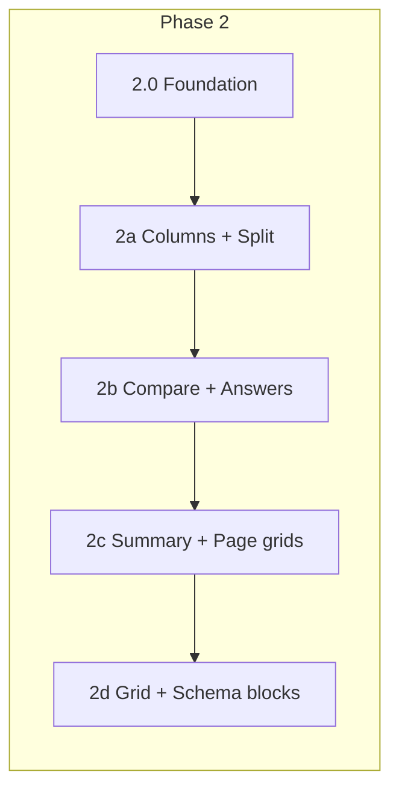

# Proposal: Grammar Builder Phase 2 — Layout Coverage

**Status:** For review  
**Date:** 2026-07-06  
**Depends on:** Phase 1 complete (schema, mappers, slug routing, 2 live A1 posters)  
**Next step after approval:** Detailed sub-step plans for 2.0 → 2a → 2b → 2c

---

## 1. Executive summary

Phase 1 proved the pipeline: **JSON → validate → map → render** for one page layout (`two-equal-then-full`) and two card layouts (`two-equal`, `banner`). Phase 2 expands the **layout engine** so the remaining `layoutType` and `pageLayout` values from the spec can render from JSON — unlocking the other 9 reference infographics.

Phase 2 is **renderer capability**, not a content marathon. Each sub-phase delivers:

1. View-model + mapper support for new layout types  
2. UI components (or extensions) for those layouts  
3. Schema refinements where JSON fields are missing from Zod  
4. At least one **author fixture** + tests proving the layout works  
5. Optional **student poster upgrade** where an existing A1 module benefits (e.g. affirmative card 3 → `full-width-split`)

**Target end state:** All 9 `layoutType` values mapped; all 5 non-custom `pageLayout` values drive page grid; 7+ author JSON fixtures validate and map; layout showcase can reference real fixtures instead of hardcoded demos.

---

## 2. Current state

### 2.1 Mapped today

| Layer | Supported | Notes |
|-------|-----------|-------|
| **pageLayout** | `two-equal-then-full` (partial) | Last card spans full width only |
| **layoutType** | `two-equal`, `banner` | 2 of 9 |
| **Live student posters** | 2 | Questions + Affirmative (simplified) |
| **Author fixtures** | 3 | `there-is-there-are.json`, both A1 poster examples |
| **View model** | `PilotSection.layout`: `50_50` \| `30_70` \| `banner` | Inference hack for two-equal; not 1:1 with `layoutType` |
| **UI dead paths** | `leftPatterns` / `rightNote` in `PilotSectionBody` | Built for `full-width-split`; never populated by mapper |

### 2.2 Not mapped (Phase 2 scope)

| layoutType | Reference topic(s) | JSON fields |
|------------|-------------------|-------------|
| `three-column` | There is/are Affirmative, Countable nouns | `items[]`, `subHeader` |
| `full-width-split` | Affirmative card 3, Questions card 3 (author) | `leftSide`, `rightSide`, `patterns` |
| `two-column-positive-negative` | Short answers | `positiveSide`, `negativeSide` |
| `comparison` | Plural spelling (cards 5–6) | `leftColumn`, `rightColumn` (rule vs exceptions) |
| `summary-grid` | Some and Any card 3 | TBD in schema — cells/rows |
| `four-card-grid` | Plural spelling top row | Nested mini-cards or `items` grid |
| `full-width` | Generic stacked content | `items`, `subHeader` |

| pageLayout | Reference topic(s) | Page grid behavior |
|------------|-------------------|-------------------|
| `two-by-two-then-full` | Some and Any | 2×2 cards, then full-width summary |
| `four-card-grid-then-split` | Plural spelling | 4 mini cards row, then 2 wide cards |
| `two-equal` | Plural pronunciation (3 cards) | 2-col grid; 3rd card wraps |
| `single-column` | — | Vertical stack |

### 2.3 Schema gaps (documented in UI guide, not in Zod)

| Block | In JSON Schema? | In Zod? | Phase 2 action |
|-------|-----------------|---------|----------------|
| `transformationRow` | Mentioned in UI guide | No | Add in 2d if plural pronunciation is in scope |
| `goodBadPair` | Mentioned in UI guide | No | Add in 2d for uncountable nouns |
| `summary-grid` cell structure | Enum only | No | Define in 2c before mapper |
| `subHeader` on three-column cards | Yes | Yes (optional) | Wire in 2a renderer |
| Per-layout required fields | Partial | Partial | Add refinements per layoutType |

---

## 3. Phase 2 goals & success criteria

### Goals

1. **Layout-complete mapper** — every `layoutType` in `grammarLayoutTypeSchema` has a mapper path (or explicit “author-only” escape hatch documented).
2. **Layout-complete page grid** — `getPosterSectionWrapperClass` + `getPosterPageGridClass` handle all `pageLayout` values with tests.
3. **View model aligned to spec** — replace inferred `50_50` / `30_70` with explicit internal layout kinds tied to `layoutType`.
4. **Example row spec** — student poster rows support text + graphic + caption (3-part column) per UI guide §1.
5. **Author fixture library** — at least one validating JSON per layout pattern in `docs/grammar-module/examples/`.
6. **Regression safety** — existing 2 A1 posters unchanged unless explicitly upgraded in a sub-phase.

### Success metrics

| Metric | Phase 1 | Phase 2 target |
|--------|---------|----------------|
| layoutType coverage | 2/9 | 9/9 |
| pageLayout coverage | 1/5 wired | 5/5 wired |
| Author JSON fixtures | 3 | 10+ |
| Live student posters | 2 | 2–4 (content optional per sub-phase) |
| grammar-builder tests | 52 | 90+ |
| Layout showcase | Hardcoded demos | ≥50% driven from fixtures (stretch) |

---

## 4. High-level architecture

### 4.1 Refactor: layout dispatch (Phase 2.0 — foundation)

Today `mapPosterSection()` infers `50_50` vs `30_70` from content heuristics. Phase 2 introduces explicit dispatch:

```
GrammarCard.layoutType
       │
       ▼
mapPosterSection() ──► mapPosterSectionByLayoutType()
       │                        │
       │                        ├── two-equal      → mapTwoEqualSection()
       │                        ├── three-column   → mapThreeColumnSection()
       │                        ├── full-width-split → mapFullWidthSplitSection()
       │                        ├── banner         → mapBannerSection()
       │                        ├── comparison     → mapComparisonSection()
       │                        └── …
       ▼
PosterSection (expanded view model)
       │
       ▼
PosterSectionBody ──► switch(section.internalLayout)
```

**View model change:** Extend `PilotSection` (or rename to `PosterSection` in Phase 1f) with:

```typescript
type PosterInternalLayout =
  | "two_equal"
  | "two_equal_30_70"   // optional: keep as variant of two-equal
  | "three_column"
  | "full_width_split"
  | "banner"
  | "comparison"
  | "positive_negative"
  | "summary_grid"
  | "four_card_grid"
  | "full_width";
```

Keep backward compatibility: existing `two-equal` + `banner` mappers produce the same pixel output for current posters.

### 4.2 Page layout engine (Phase 2c)

Extend `poster-page-layout.ts`:

| pageLayout | Grid classes | Span rules |
|------------|--------------|------------|
| `single-column` | 1 col | none |
| `two-equal` | 2 col | none |
| `two-equal-then-full` | 2 col | last card `sm:col-span-2` |
| `two-by-two-then-full` | 2 col | cards 0–3 normal; card 4+ `sm:col-span-2` |
| `four-card-grid-then-split` | 2 col | cards 0–3 normal (4 mini); cards 4–5 `sm:col-span-1` each or custom row |

**Card count validation (optional):** Refine schema so `pageLayout` + `cards.length` mismatches warn in dev (e.g. `two-by-two-then-full` expects 5 cards for author modules).

### 4.3 Component strategy

| Component | Action |
|-----------|--------|
| `PilotExampleRow` | Add 3-column variant (text \| graphic \| caption) |
| `PilotSubHeader` | **New** — pill + badge + desc + extra from `subHeader` |
| `PilotThreeColumnBody` | **New** — or branch in `PilotSectionBody` |
| `PilotComparisonBody` | **New** — rule vs exceptions (showcase has prototype) |
| `PilotSummaryGrid` | **New** — checkmark matrix |
| `PilotFourCardGrid` | **New** — nested mini cards |
| `PilotPositiveNegativeBody` | **New** — short answer columns |
| `PilotSectionBody` | Becomes thin router on `internalLayout` |

Reuse showcase markup from `PilotLayoutShowcase.tsx` where possible — it already prototypes three-column, four-grid, and comparison layouts.

### 4.4 Content strategy: author vs student

| Mode | Phase 2 focus |
|------|----------------|
| **Author JSON** (`displayMode: showcase` or untagged author fixtures) | Full layout fidelity; may exceed A1 card/example caps |
| **Student A1 poster** | Only ship layout upgrades when 8D density passes; may keep simplified variants |

Phase 2 **does not require** 11 live student posters. It requires **layouts render correctly** when JSON uses them.

---

## 5. Sub-phases (high level)



---

### Phase 2.0 — Foundation (~½ session)

**Goal:** Refactor without visual change to existing posters.

| Deliverable | Detail |
|-------------|--------|
| `PosterInternalLayout` type | Explicit layout enum on view model |
| `map-poster-section/` module split | Dispatch by `layoutType` |
| `PilotSectionBody` router | Switch on `internalLayout` |
| Tests | Existing 52 tests still pass; no pixel regression |

**Exit gate:** Questions + Affirmative A1 posters identical at `/grammar/[slug]`.

---

### Phase 2a — Three-column + full-width-split (~1–2 sessions)

**Goal:** Render the **There is/are Affirmative** author fixture (`there-is-there-are.json`) end-to-end.

| layoutType | Mapper | UI | Fixture |
|------------|--------|-----|---------|
| `three-column` | Map `items[]` + optional `subHeader` | 3-col grid, dashed dividers, `PilotSubHeader` | `there-is-there-are.json` cards 1–2 |
| `full-width-split` | Map `leftSide`, `rightSide`, optional `patterns[]` | Wire existing `leftPatterns` / `rightNote` paths | Card 3 |

**Schema:** Refinements — `three-column` requires `items` (min 1); `full-width-split` requires `leftSide` + `rightSide`.

**Student upgrade (optional):** Replace affirmative A1 card 3 banner with `full-width-split` if 8D density passes.

**Unlocks:** Full affirmative author module; Countable nouns card 1 (author path).

---

### Phase 2b — Positive/negative + comparison (~1–2 sessions)

**Goal:** Support short-answer and rule-vs-exception infographics.

| layoutType | Mapper | UI | Reference topic |
|------------|--------|-----|-----------------|
| `two-column-positive-negative` | `positiveSide`, `negativeSide` | Two panels with Yes/No styling | Short answers |
| `comparison` | `leftColumn`, `rightColumn` as rule/exceptions | Reuse showcase comparison grid | Plural spelling |

**New fixture targets:**

- `docs/grammar-module/examples/short-answers-there-is-a1.json` (author)
- `docs/grammar-module/examples/plural-spelling-comparison.json` (partial card excerpt)

**Unlocks:** Short answers topic; plural spelling bottom row.

---

### Phase 2c — Summary grid + page layouts (~1–2 sessions)

**Goal:** Multi-card page grids and summary matrices.

| Deliverable | Detail |
|-------------|--------|
| `summary-grid` | Define JSON shape (rows/cells/icons); mapper + `PilotSummaryGrid` |
| `two-by-two-then-full` | Page span rules; 5-card author module |
| `four-card-grid-then-split` | Page span rules; 6-card author module |
| `two-equal` (3 cards) | Third card wrap behavior for plural pronunciation page |

**Fixture targets:** Some and Any (author); plural spelling page shell (author).

**Unlocks:** Some and Any; page-level grids for spelling/pronunciation topics.

---

### Phase 2d — Four-card grid, full-width, advanced blocks (~2 sessions)

**Goal:** Close remaining layout types and schema block vocabulary.

| layoutType / block | Detail |
|--------------------|--------|
| `four-card-grid` | Four nested mini rule cards inside one page card |
| `full-width` | Vertical stack of `items` + `subHeader` |
| `transformationRow` | Add to Zod + schema.json; IPA row for pronunciation topic |
| `goodBadPair` | Add to Zod; struck-through bad Q/A for uncountable nouns |
| `subHeader` | Render consistently across all layout mappers |

**Fixture targets:** Plural spelling (full author); uncountable nouns; plural pronunciation.

**Unlocks:** All 11 reference topics have at least partial author JSON.

---

## 6. Topic → sub-phase matrix

| # | Topic | pageLayout | Key layoutTypes | Sub-phase | Student A1 poster? |
|---|-------|------------|-----------------|-----------|-------------------|
| 1 | There is/are Questions | two-equal-then-full | two-equal, banner | ✅ Phase 1 | ✅ Live |
| 2 | There is/are Affirmative | two-equal-then-full | three-column, full-width-split | 2a | ✅ Live (simplified) |
| 3 | Short answers | two-equal-then-full | two-column-positive-negative, summary-grid | 2b, 2c | Phase 3+ |
| 4 | Countable nouns | two-equal-then-full | three-column, four-card-grid | 2a, 2d | Phase 3+ |
| 5 | Uncountable nouns | two-equal-then-full | goodBadPair, sub-panels | 2d | Phase 3+ |
| 6 | Some and Any | two-by-two-then-full | two-equal splits, summary-grid | 2b, 2c | Phase 3+ |
| 7 | Plural spelling | four-card-grid-then-split | four-card-grid, comparison | 2b, 2c, 2d | Author/A2 |
| 8 | Plural pronunciation | two-equal | three-column, transformationRow | 2a, 2d | Author/A2 |
| 9–11 | Unreviewed JPGs | TBD | TBD | After index review | — |

---

## 7. Testing strategy

| Layer | Approach |
|-------|----------|
| **Unit** | One test file per mapper (`map-three-column-section.test.ts`, etc.) |
| **Integration** | `mapPosterModule()` per author fixture — snapshot or field assertions |
| **Layout** | `poster-page-layout.test.ts` — all pageLayout × card count cases |
| **Regression** | Questions + Affirmative A1 semantic tests frozen |
| **Validation** | Each new fixture added to `validate:grammar` via registry when promoted to `content/grammar/` |
| **Visual** | Manual QA vs reference JPG; 8D tablet check for any new student poster |

**Stretch:** Playwright screenshot of `/grammar/pilot/layouts` vs author fixture render.

---

## 8. Documentation updates (each sub-phase)

- `SOURCE_OF_TRUTH_UI_GUIDE.md` §6 gap table — layoutType rows  
- `SCHEMA.md` — new fields (`summaryGrid`, `transformationRow`, etc.)  
- `reference-index.md` — link example JSON per topic  
- `AI_PROMPT_RECIPES.md` — layout-specific validation checklist  
- `.cursor/rules/grammar-module-ui.mdc` — component paths if renamed  

---

## 9. Out of scope (Phase 2)

| Item | Phase |
|------|-------|
| Grammar hub `/grammar` index | 3a |
| `/grammar/pilot/layouts` JSON-driven | 2 stretch or 5a |
| Visual spec polish (border-2, absolute badge) | 5b |
| A2/B1 density enforcement in schema | 3b |
| Lesson Player screen type | 4a |
| Component rename `pilot` → `poster` | 1f (can run parallel to 2.0) |
| Supabase/CMS storage | 4+ |

---

## 10. Risks & mitigations

| Risk | Mitigation |
|------|------------|
| View model refactor breaks live posters | 2.0 exit gate: pixel parity tests before 2a |
| `summary-grid` JSON shape undefined | Design schema in 2c before coding UI |
| Author modules exceed A1 caps | Use `displayMode: showcase` for author fixtures; separate student A1 variants |
| Page layouts with 5–6 cards break mobile | Page layout sub-phase includes responsive QA |
| Scope creep into visual spec | Defer border/badge polish to Phase 5b |
| Heuristic `30_70` vs explicit layoutType | Keep heuristic as two-equal variant until authors encode split in JSON |

---

## 11. Estimated effort

| Sub-phase | Sessions | Cumulative |
|-----------|----------|------------|
| 2.0 Foundation | 0.5 | 0.5 |
| 2a Three-column + split | 1–2 | 1.5–2.5 |
| 2b Positive/negative + comparison | 1–2 | 2.5–4.5 |
| 2c Summary + page grids | 1–2 | 3.5–6.5 |
| 2d Four-grid + advanced blocks | 2 | 5.5–8.5 |

**Total Phase 2:** ~6–9 focused sessions depending on fixture authoring time and visual QA depth.

---

## 12. Recommended implementation order

1. **2.0** — refactor (safe base)  
2. **2a** — highest ROI: unlocks existing `there-is-there-are.json` author fixture  
3. **2b** — two more layout types + short answers fixture  
4. **2c** — page grids (needed before Some and Any / plural spelling pages)  
5. **2d** — remaining types + pronunciation/uncountable blocks  

**Parallel track:** Phase **1f** (rename `pilot` → `poster`) can land anytime after 2.0.

---

## 13. Review questions

| # | Question | Recommendation |
|---|----------|----------------|
| Q1 | Rename `PilotSection` → `PosterSection` in 2.0 or defer to 1f? | Defer rename; expand type in 2.0 |
| Q2 | Author fixtures: `displayMode: showcase` or separate `examples/` only? | Keep in `examples/`; showcase route stays dev-only until JSON-driven lab |
| Q3 | Upgrade affirmative A1 card 3 to `full-width-split` in 2a? | Only if 8D tablet QA passes |
| Q4 | Define `summary-grid` JSON now or spike UI from JPG first? | Spike JSON shape from Some and Any JPG in 2c planning |
| Q5 | Target live student posters by end of Phase 2? | 2 minimum; stretch 4 (add short answers + full affirmative) |
| Q6 | Add `validate:grammar` to `prebuild` after 2a? | Yes, once 3+ fixtures exist |

---

## 14. Sign-off

| Reviewer | Role | Decision | Date | Notes |
|----------|------|----------|------|-------|
| | Product | ☐ Approve ☐ Revise ☐ Reject | | |
| | Content / ESL | ☐ Approve ☐ Revise ☐ Reject | | |
| | Engineering | ☐ Approve ☐ Revise ☐ Reject | | |

**Approved to plan sub-steps when:** All three reviewers Approve Phase 2 scope and sub-phase order (§5, §12).

---

## 15. Next document

After approval, create **`PLAN-PHASE-2a.md`** (and similarly for 2b–2d) with:

- File-by-file checklist  
- Exact JSON shapes  
- Component props  
- Test cases  
- Acceptance criteria per task  
