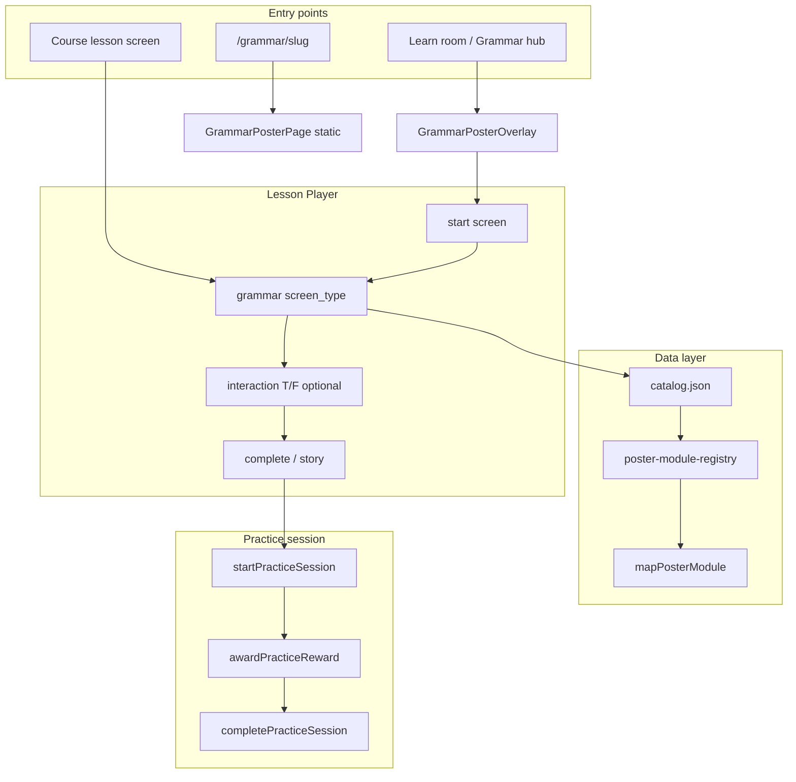

# Proposal: Phase 4 — Grammar in Lesson Player & Practice Rewards

**Status:** Implemented (2026-07-06)  
**Depends on:** Phase 3 complete (hub, 6 published posters, promotion pipeline, 114 tests)  
**Parent docs:** [PROPOSAL-PHASE-3.md](./PROPOSAL-PHASE-3.md), [student-practice-session-contract.md](../../student-practice-session-contract.md)

---

## 1. Executive summary

Phase 3 made grammar **discoverable** (`/grammar` hub + 6 posters). Students can read posters, but grammar is still **outside** the unified practice loop: no Lesson Player shell, no gold/XP, no study-care credit, no course assignment.

Phase 4 connects grammar to the **same practice contract** vocabulary already uses.

| Work package | What it does | Student-visible? |
|--------------|--------------|------------------|
| **4a — Grammar read screen** | New Lesson Player screen type + hub overlay to read a catalog poster inside player chrome | Yes |
| **4b — Practice session & rewards** | `grammar_poster` activity kind, completion gold/XP, study-care hook | Yes |
| **4c — Light follow-up quiz (optional)** | 2–3 `true_false` items after poster read (There is/are track first) | Yes (if approved) |
| **4d — Content & catalog polish** | Publish plural A2 drafts; optional affirmative card 3 upgrade | Yes |

**Defer to Phase 5:** JSON-driven layout lab (5a), visual spec polish (5b), Supabase grammar authoring.

**Target after Phase 4:** Grammar from Learn room feels like a **practice activity** (start → read → complete → rewards), and teachers can embed `grammar` screens in course lessons.

---

## 2. Current state (post Phase 3)

| Area | State |
|------|--------|
| Published posters | 6 — questions, affirmative, short answers, countable, uncountable, some-and-any A2 |
| Draft posters | 2 — plural spelling, plural pronunciation |
| Hub | `/grammar` + Learn tile ✅ |
| Poster routes | `/grammar/[slug]` — read-only, no rewards |
| Lesson Player screen types | `start`, `story`, `interaction` (22 subtypes) — **no grammar** |
| Practice session kinds | `vocabulary_set`, `course_lesson`, … — **no `grammar_poster`** |
| Reference integration | `VocabularySetOverlay` → `buildVocabularySetScreens` → `LessonPlayer` → `student-session.ts` |
| Layout lab | Hardcoded demos in `PosterLayoutShowcase.tsx` (Phase 5a) |
| Affirmative card 3 | Still `banner`; `full-width-split` upgrade optional |
| Grammar unlock gating | None — hub tile always visible |

**Gap:** Reading `/grammar/short-answers-there-is-a1` does not emit `session_started`, award gold, or satisfy study-care.

---

## 3. Goals

1. Grammar poster reads use **Lesson Player chrome** (progress, close, complete) where appropriate.
2. Completing a grammar read awards **gold/XP** via the existing practice session facade (idempotent, same as vocab).
3. Grammar completion counts toward **study-care** (pet) when pending.
4. Teachers can add a **`grammar` screen** to course lessons (Supabase `lesson_screens` row).
5. Keep `/grammar/[slug]` working for direct links; add an optional **“Start practice”** path from hub.

## 4. Non-goals (Phase 4)

| Item | Phase |
|------|-------|
| JSON-driven `/grammar/pilot/layouts` | 5a |
| Border-2 / absolute badge visual spec | 5b |
| Full grammar quiz curriculum (10 topics × N items) | 4c optional / content track |
| Supabase grammar CMS | 4+ |
| Cross-app Student Tracker export | Milestone 3+ |
| `pageLayout: custom` | TBD |
| Per-slug level unlocks on hub | Optional stretch |

---

## 5. Sub-phases

### Phase 4a — Grammar read screen in Lesson Player (~2–3 sessions)

**Goal:** Render a catalog poster inside Lesson Player without inventing a new page shell.

#### Recommended approach: new top-level screen type

Add `screen_type: "grammar"` alongside `start` | `story` | `interaction`.

**Payload schema** (`lesson-schemas.ts`):

```typescript
export const grammarPayloadSchema = z.object({
  type: z.literal("grammar"),
  grammar_slug: z.string().min(1), // catalog slug, e.g. short-answers-there-is-a1
  mode: z.enum(["read"]).default("read"), // future: "read_then_quiz"
});
```

**Why top-level, not interaction subtype?** Poster read is not a graded interaction; it is a content screen like `story`. Keeps interaction union focused on quizzes/games.

#### Runtime wiring

| Layer | File(s) | Change |
|-------|---------|--------|
| Schema | `lib/lesson-schemas.ts`, `lesson-schemas-player.ts` | `grammarPayloadSchema`, extend `parseScreenPayload` |
| Loader | `components/grammar/lesson/GrammarPosterScreen.tsx` | Wrap existing `GrammarPosterPage` body (hero + sections) without hub back link |
| Player | `components/lesson/LessonPlayer.tsx` | Branch `screen_type === "grammar"`; prefetch if needed |
| Outline | `lib/lesson-screen-outline.ts` | Label: “Grammar: {catalog title}” |
| Teacher editor | `ScreenEditorCard.tsx` (if exists) | Slug picker from published catalog |

#### Hub overlay (parallel entry)

Mirror `VocabularySetOverlay`:

| File | Purpose |
|------|---------|
| `components/grammar/GrammarPosterOverlay.tsx` | Full-screen overlay from hub |
| `lib/grammar-templates/build-screens.ts` | `buildGrammarPosterScreens(slug)` → `[start?, grammar, complete?]` |

**Minimal run shape (recommended for 4a):**

1. Optional `start` — “Ready to read?” + emoji from `thumbnailEmoji`
2. **`grammar`** — poster body (reuse mapper + components)
3. Optional `story` or custom complete panel — “Great job!” + Continue

Synthetic lesson id: `grammar-{slug}`.

**Hub UX change:** Topic card offers **Read** (current `/grammar/[slug]`) and **Practice** (opens overlay). Or single tap → overlay only (simpler; direct URL still works).

#### Reuse (do not duplicate)

- `loadPosterModuleBySlug(slug)` → `mapPosterModule`
- `components/grammar/poster/*` section renderers
- `content/grammar/catalog.json` for titles/metadata

**Exit gate:** `LessonPlayer` renders `grammar` screen for a test lesson; overlay opens from hub for one slug; existing `/grammar/[slug]` unchanged.

---

### Phase 4b — Practice session & rewards (~1–2 sessions)

**Goal:** Grammar reads participate in the student practice contract.

#### Activity kind

```typescript
// lib/student-session.ts
export type StudentActivityKind =
  | "vocabulary_set"
  | "grammar_poster"  // NEW
  | ...
```

#### Session lifecycle (mirror vocab)

| Event | When |
|-------|------|
| `session_started` | Overlay/player run begins (`activityKind: "grammar_poster"`, `activityId: slug`) |
| `session_completed` | Student taps Complete after reading (or reaches last card — see completion rule) |
| `reward_awarded` | Completion gold/XP applied once per `{lessonId}:{seed}:complete` |

**Completion rule (pick in review):**

| Option | Rule | Pros |
|--------|------|------|
| **A (recommended)** | Explicit **Complete** button after scroll | Simple, honest, matches study-care |
| **B** | Auto-complete after N seconds on last card | Passive; risk of AFK |
| **C** | Complete after viewing all card anchors | More engineering |

#### Reward formula

New `lib/grammar-templates/grammar-run-session.ts`:

```typescript
export function computeGrammarPosterRewards(input: {
  slug: string;
  difficulty?: "A1" | "A2" | "B1";
  elapsedMs: number;
}): { totalGold: number; experience: number };
```

**Starting formula (align with vocab simplicity):**

| Component | A1 | A2 |
|-----------|----|----|
| Base completion | 5 gold | 8 gold |
| XP | 10 | 15 |
| Time bonus | +0–2 gold if read ≥ 30s | same |

Use `awardPracticeReward` + idempotent `eventId`. Wire `StudentHubClient` refresh (already subscribed).

#### Study-care

`StudentHubClient.handleLearnActivityComplete` → call `completeStudyCareIfPending()` when grammar run completes (same as vocab).

#### Daily quests (stretch)

Pattern from `lib/teststartpage/vocab-daily-quests.ts` — e.g. “Read 1 grammar poster today”. Defer if scope tight.

**Exit gate:** Finish grammar overlay → gold increases; study-care clears when pending; event log shows `grammar_poster` session.

---

### Phase 4c — Read-then-quiz stretch (~2–3 sessions, optional)

**Goal:** One grammar topic with a short graded follow-up inside the same run.

**Pattern:** Extend `buildGrammarPosterScreens`:

1. `start`
2. `grammar` (read poster)
3. `interaction` × 2–3 — `true_false` generated from poster content

**First candidate:** `short-answers-there-is-a1` (3 T/F items: Yes there is / No there isn't patterns).

**New file:** `lib/grammar-templates/grammar-quiz-items.ts` — hand-authored or template-generated items per slug (not full AI).

**Schema extension:**

```typescript
mode: z.enum(["read", "read_then_quiz"]).default("read"),
quiz_item_ids: z.array(z.string()).optional(),
```

**If deferred:** Phase 4 still ships read + rewards only; 4c becomes Phase 4.5.

---

### Phase 4d — Content & catalog polish (~1 session)

| Task | Detail |
|------|--------|
| Publish `plural-spelling-a2` | ESL QA + 8D tablet; flip catalog `draft` → `published` |
| Publish `plural-pronunciation-a2` | Same |
| Affirmative card 3 | Optional `full-width-split` upgrade with regression tests |
| Catalog `legacyRoutes` | Document any redirects needed |

Not blocking 4a/4b engineering.

---

## 6. Architecture diagram



---

## 7. Topic → Phase 4 scope

| Grammar topic | Read in player (4a) | Rewards (4b) | Quiz follow-up (4c) |
|---------------|---------------------|--------------|---------------------|
| There is/are Questions | ✅ | ✅ | Optional |
| Affirmative | ✅ | ✅ | Optional |
| Short answers | ✅ | ✅ | **Best first quiz** |
| Countable / Uncountable | ✅ | ✅ | Later |
| Some and Any A2 | ✅ | ✅ | Later |
| Plural spelling/pronunciation | After 4d publish | ✅ | Later |

---

## 8. Testing strategy

| Layer | Phase 4 additions |
|-------|-------------------|
| **Unit** | `grammarPayloadSchema` parse tests; `computeGrammarPosterRewards` |
| **Unit** | `buildGrammarPosterScreens(slug)` returns valid `LessonScreenRow[]` |
| **Integration** | `loadPosterModuleBySlug` + grammar screen render smoke (RTL optional) |
| **Session** | `student-session.test.ts` — grammar_poster start/complete/reward idempotency |
| **Regression** | All 114+ grammar-builder tests still pass |
| **Manual** | Hub practice run → gold + study-care; course lesson with grammar screen |

**Target test count after Phase 4:** ~130–140.

---

## 9. PR strategy (recommended)

| PR | Scope | Risk |
|----|-------|------|
| **PR 1 — 4a** | `grammar` screen type + `GrammarPosterScreen` + player branch | Medium |
| **PR 2 — 4a hub** | `GrammarPosterOverlay` + `build-screens.ts` + hub “Practice” CTA | Medium |
| **PR 3 — 4b** | `grammar_poster` session + rewards + study-care | Low–medium |
| **PR 4 — 4c** | Short answers read-then-quiz (optional) | Medium |
| **PR 5 — 4d** | Publish plural A2 + content tweaks | Low |

**Alternative:** Combine 4a+4b in one PR if overlay and rewards land together (faster UX, larger diff).

---

## 10. Risks & mitigations

| Risk | Mitigation |
|------|------------|
| Lesson schema change breaks teacher editor | Strict Zod parse; editor shows fallback for unknown types |
| Double reward if static page + overlay both used | Separate flows; only overlay/player emits session |
| Poster too tall for “complete” UX on mobile | Sticky Complete bar; scroll hint on first visit |
| Scope creep into full quiz engine | 4c optional; hand-author 1 topic only |
| `lesson-schemas.ts` already huge | Add grammar schema in isolated block; no refactor |
| Teacher course lessons need slug validation | Validate slug against catalog at parse or render time |

---

## 11. Estimated effort

| Sub-phase | Sessions | Cumulative |
|-----------|----------|------------|
| 4a Grammar screen + player | 2–3 | 2–3 |
| 4b Session + rewards | 1–2 | 3–5 |
| 4c Read-then-quiz (optional) | 2–3 | 5–8 |
| 4d Content publish | 1 | 6–9 |

**Total Phase 4:** ~4–6 sessions without 4c; ~6–9 with quiz stretch.

---

## 12. Review questions

| # | Question | Recommendation |
|---|----------|----------------|
| Q1 | Hub: replace direct read with overlay, or offer both? | **Both** — Read link + Practice button |
| Q2 | Completion: explicit button vs auto? | **Explicit Complete button** |
| Q3 | New top-level `grammar` screen vs interaction subtype? | **Top-level `grammar` screen** |
| Q4 | Include 4c quiz in Phase 4 or defer? | **Defer** unless ESL wants Short answers quiz immediately |
| Q5 | Publish plural -plural A2 in 4d or separate content PR? | **4d after 4a–4b** |
| Q6 | Gate grammar hub by level? | **No** for now; add unlock in Phase 5 if needed |
| Q7 | Combine 4a+4b in one PR? | **Yes** if same sprint — rewards without overlay feels incomplete |
| Q8 | Keep `/grammar/[slug]` static route? | **Yes** — deep links, SEO, simpler QA |

---

## 13. Sign-off

| Reviewer | Role | Decision | Date | Notes |
|----------|------|----------|------|-------|
| | Product | ☐ Approve ☐ Revise ☐ Reject | | |
| | Content / ESL | ☐ Approve ☐ Revise ☐ Reject | | |
| | Engineering | ☐ Approve ☐ Revise ☐ Reject | | |

**Approved to plan sub-steps when:** Reviewers approve §5 order and §12 decisions.

---

## 14. Next document

After approval, create **`PLAN-PHASE-4a.md`** with:

- Exact `grammarPayloadSchema` and `parseScreenPayload` diff
- `GrammarPosterScreen` props and which poster chrome to omit (hub back link, dev layout lab link)
- Overlay wire-up in `StudentHubClient` / `GrammarHubPage`
- Test file list

**First implementation prompt (after approval):**

> Implement Phase 4a: add `grammar` screen type to lesson schemas, render catalog poster inside Lesson Player via `GrammarPosterScreen`, add `buildGrammarPosterScreens` + `GrammarPosterOverlay` with Practice entry from grammar hub. Do not add rewards yet. Keep `/grammar/[slug]` static route unchanged.

---

## 15. What comes after Phase 4

| Phase | Focus |
|-------|-------|
| **5a** | JSON-driven layout lab from author fixtures |
| **5b** | Visual spec polish (theme borders, absolute number badge) |
| **6** | Teacher grammar authoring in course builder UI; Supabase storage |
| **7** | Student Tracker export; parent reporting for grammar sessions |
