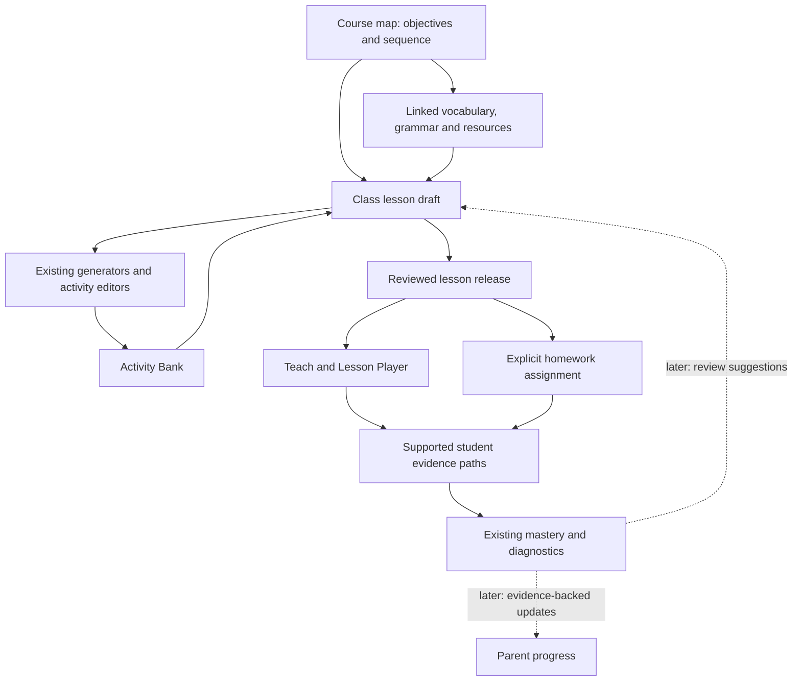

# Libraries and course scope-and-sequence plan

Status: Slices 1 and 2 implemented for the preview pilot. See [implementation and smoke guide](./libraries-course-map-implementation.md) for delivered scope and verification. Later slices remain a roadmap.
Date: 2026-10-08
Primary stakeholders: curriculum author and teacher.

## Purpose and ownership

Give curriculum authors a usable place to define what learners should achieve, how that learning develops, and which resources support it. Give teachers a direct route from that map into a class lesson, with less repeated entry and a clear learning check.

Students benefit from coherent progression, appropriate support, and purposeful review. Parents should eventually see evidence-backed statements about learning and the next step. School leaders need visibility into curriculum coverage and preparation gaps.

Three distinct records underpin the design:

1. **Course map:** the shared intended progression and reusable learning specifications.
2. **Class lesson:** the teacher's adaptation for a particular class, including pace, teaching steps, support, and homework.
3. **Learning evidence:** what a student demonstrated under particular conditions.

Editing a class lesson must not edit the shared map. Completing a lesson must not, by itself, establish mastery.

## Verified repository starting point

| Existing system | What can be reused | Implication |
|---|---|---|
| `components/teacher/TeacherPrimaryTabs.tsx` | Media dropdown already groups Asset Library, WKE Comic, Lexicon review, and Grammar posters | Rename this group Libraries and add Course map; retain existing permission rules and URLs |
| `app/teacher/(secure)/media/page.tsx` | Searchable image/audio assets, metadata, uploads, school/mine shelves | Keep Asset Library as a Libraries destination; map references assets rather than copying them |
| `components/teacher/class-hub/ClassLessonEditor.tsx`, `lib/class-lessons/types.ts` | Class-owned plans, objective, target language, success check, ordered teaching steps | Add a course source reference and an explicit creation/import flow |
| `lib/class-lessons/vocabulary.ts`, `lib/actions/lesson-vocabulary.ts` | Vocabulary source attachment and flashcard/multiple-choice generation | Feed reviewed vocabulary into the existing workflow |
| `lib/studio-activities/`, `lib/activity-library/` | Saved vocabulary lists, authoring documents, activity generation | Link existing resources and open existing editors |
| `lib/learning-tracks/`, `lib/activity-tracks/` | Activity composition and practice/assessment authoring | Attach where supported; avoid equating authoring support with planner delivery support |
| `lib/actions/lesson-delivery.ts`, migration 158 | Reviewed lesson releases and frozen classroom/homework content | Preserve delivery snapshots when curriculum changes |
| `lib/mastery/types.ts`, `lib/learning-strands.ts` | Stable target references, evidence modes, scaffolding, mastery, four learning strands | Reuse this vocabulary for future evidence alignment |
| Migrations 008/009, archived course CMS proposal | Retained `courses -> modules -> lessons` data and free-text standards/outcomes | Review for migration/import; do not restore the retired course generator as the new tool |

The October 6 planner documents describe local implementation with migrations 157/158 pending rollout. This inspection does not establish their live deployment state. The July curriculum audit is historical context, not an up-to-date capability inventory.

## Navigation and information architecture

The requested navigation becomes:

```text
Libraries
  Course map          new
  Asset Library       existing
  WKE Comic           existing, administrator access
  Lexicon review      existing, current tier restrictions
  Grammar posters     existing
```

Keep Activity Builder as the creation workspace. Course map resource pickers can link its vocabulary lists and saved activities; optional shortcuts can point to those same existing pages. A second vocabulary or activity editor is unnecessary.

Proposed map routes: `/teacher/libraries/course-map` and `/teacher/libraries/course-map/[mapId]`. Existing media, grammar, and dictionary URLs stay valid. The Libraries dropdown is active for these new routes and its current destinations. The teacher's default landing page remains Classes.

## Learning structure

Use **Course -> Unit -> Planned lesson** for the initial editor. Course audience metadata includes age/grade range, entry expectations, and intended CEFR range. Grade and CEFR are separate fields. A planned lesson is a curriculum specification, not a date in the timetable and not an individual player screen. One planned lesson may take several class sessions.

If a course spans distinct levels, add an optional level grouping when real content requires it; do not require authors to create an empty hierarchy to begin mapping.

Objectives and language targets are reusable references across this sequence, not children that can only belong to one activity. A target may be introduced in one lesson, practised in several, checked later, and revisited after a gap.

| Layer | Essential authoring fields | Additional planning detail |
|---|---|---|
| Course | Title, intended learners, course outcomes | Entry/exit expectations, level range, estimated hours, source/standards notes |
| Unit | Title, position, intended outcome | Theme or inquiry, prerequisites, estimated sessions, culminating task |
| Planned lesson | Title, position, observable objective, success check | Duration, target language, vocabulary, grammar, skill focus, prerequisites, support and extension |
| Objective | Stable ID, teacher statement, learner-friendly statement, success criteria | Evidence mode, linked targets, assessment method |
| Target occurrence | Target reference, planned lesson reference, role | Introduce / practise / assess / revisit; teacher notes |
| Resource link | Existing source ID/type, purpose, revision/fingerprint where available | Selected vocabulary entry IDs, linked objectives, support notes |

Allow incomplete rows to be saved so authors can build the skeleton before filling every field. Clearly distinguish incomplete mapping from a lesson ready to plan or teach.

Use listening, speaking, reading, and writing as skill focuses. Keep these separate from the existing four learning strands: meaning-focused input, meaning-focused output, language-focused learning, and fluency development. Topic, activity format, learning strand, and evidence mode also serve different purposes.

## The first usable editor

Start with an expandable sequence table and a lesson detail panel. This supports efficient editing and scanning before adding a more elaborate graph.

```text
Course selector | Audience and level | Draft / reviewed revision
Sequence | Coverage

Unit / lesson     Objective       Targets       Resources       Preparation
Unit 1 ...
  Lesson 1 ...    ...             Introduce ... 2 linked        Missing check
  Lesson 2 ...    ...             Practise ...  3 linked        Ready to plan
  Lesson 3 ...    ...             Assess ...    1 linked        Needs resource

Selected lesson:
  Learning goal and success check
  Vocabulary / grammar / skill focus
  Prerequisites and review links
  Resources, support, extension
  Save | Add resource | Create class lesson
```

Required editing actions:

- Create and rename courses, units, and planned lessons; add a lesson between existing rows.
- Edit the selected lesson's fields without leaving the map.
- Move lessons within/between units, with up/down buttons usable by keyboard; drag-and-drop can follow.
- Duplicate a unit or lesson with new IDs for copied nodes and preserved references to reusable targets/resources. Offer reuse or a new objective when its meaning changes.
- Archive rows with confirmation and preserve referenced history; avoid deleting delivered curriculum records.
- Search/filter by title, level, target, skill focus, preparation gap, and linked resource.
- Show an explicit saved/unsaved/error state and prevent silent overwrites between concurrent edits.
- Open a linked source in its existing editor, return to the same selected map lesson, and refresh the source status.

The initial Coverage view is a target-by-lesson matrix: cells show introduce, practise, assess, or revisit. Surface actionable gaps: no success check, no planned assessment for a target, no revisit after introduction, broken resource, or prerequisite placed after its dependent lesson. These are planning warnings, not claims about learning quality or automatic barriers to teacher judgment.

Keep preparation status separate from class delivery and student learning status. Prefer counts such as “6 of 10 lessons have success checks” over a single misleading curriculum completion percentage.

## Connection to the rest of the website



Teacher preview playback is not a student attempt. Teacher-led speaking checks need an observation or rubric record before they can support reporting; unsupported activity paths must not fabricate evidence.

| Website area | Initial connection | Later development |
|---|---|---|
| Plan Lesson | Create a class lesson from a selected map lesson; carry objective, target language, success check, timing, and supported vocabulary references | Reusable teaching-sequence templates, selective updates from map revisions |
| Activity Builder / Bank | Link existing sources and activities; generate through the planner's current adapters | Search by objective/target and recommend suitable formats |
| Asset Library | Attach images/audio by stable reference or through existing content editors | Coverage checks for required media |
| Lexicon / vocabulary lists | Select existing entries/lists with stable IDs; distinguish new and review words | Cross-course progression and target coverage |
| Grammar posters / GKE | Reference a poster and a canonical grammar target where a verified mapping exists | Richer concept prerequisites and assessed grammar generation |
| Teach / homework | Use existing review, release, and explicit assignment flows | Class pacing and multi-session coverage overlays |
| Student portals / mascot | Continue existing activities and assignments | Approved map context for “what next,” informed by actual evidence and teacher overrides |
| Diagnostics / parent views | Preserve existing evidence and reporting contracts | Objective-level summaries with support level, recency, and a next step |

## First end-to-end teacher journey

1. Author opens Libraries -> Course map and creates a course skeleton, one unit, and three planned lessons.
2. Author defines a useful outcome first, then the lesson objectives and observable checks.
3. Author links vocabulary, marks introduce/practise/revisit occurrences, and attaches existing resources.
4. Teacher selects a planned lesson and chooses **Create class lesson**, or opens Plan Lesson and chooses **From course map**.
5. Teacher selects a class. The server loads an authorized source revision and creates a class draft with curriculum provenance and copied planning fields. A retry does not create duplicate lessons.
6. The draft opens in the existing editor. Teacher adjusts pace/support and builds the teaching sequence. Supported vocabulary can generate flashcards and a recognition check. Grammar/resource links that lack planner adapters remain visible planning references.
7. Teacher adds an independent communicative check, previews materials, reviews/releases the lesson, and explicitly teaches/assigns it through existing controls.
8. The class draft and subsequent release retain their source revision. Future map edits do not alter them.

An existing class lesson can be manually linked to a map lesson without replacing its text or steps. Importing additional fields requires a preview of changes. Creating a new lesson from an incomplete map row is allowed with clear warnings; existing release readiness rules still apply.

## Example mapping, not an approved syllabus

Illustrative primary pilot: **My classroom**, with the outcome “Ask a partner about classroom objects and respond understandably.” Actual vocabulary load and expectations must be set from learner age, entry knowledge, and class time.

| Lesson | Purpose and targets | Learning check | Planned reuse |
|---|---|---|---|
| 1: Notice and name | Introduce selected object words; understand a model exchange | Recognize objects and attempt names, recording support needed | Link a vocabulary list, model images, and flashcards |
| 2: Ask and answer | Revisit words; practise “What's this?” / “It's a ...” in a meaningful exchange | Ask and answer about several objects with support gradually removed | Reuse the list; attach a teacher-led pair task |
| 3: Use and transfer | Recall the words and use the exchange with a different partner or objects | Independent exchange against explicit criteria; separate recognition from production evidence | Add a brief recognition check plus a speaking observation |
| Later unit review | Revisit selected words and the exchange after a gap | Delayed recall and a short communicative task | Reference the same stable targets |

A recognition score supports a recognition claim. It cannot establish that the learner independently completed the speaking outcome.

## Data and revision boundaries

Recommended persistence is a small versioned curriculum layer with course-map, unit, planned-lesson, objective, target-occurrence, and resource-link records. Add curriculum provenance to `class_lessons`; retain existing lesson steps, vocabulary sources, generation recipes, releases, and attempt records.

Do not use `lesson_packages`: those records are billing products. Do not repurpose the retained `teacher_classes.course_id` before auditing its legacy foreign key and consumers. Proposed map identity is distinct from the retired playable-course identity; legacy import can record the old IDs explicitly.

Exact table names and whether safe parts of the legacy course tables can be extended require a focused schema/reference audit before migration. The product contract above does not depend on rebuilding the archived CMS.

Minimum contracts:

- Stable node/objective/target IDs survive reordering and renaming. Materially changed objective meanings receive new IDs with an explicit replacement link.
- Course-map revisions retain an immutable snapshot of the selected lesson specification and relevant source selections. Initial class imports also retain copied fields and provenance.
- A class source reference records map ID, map revision, planned lesson ID, and import time. Class-specific notes and student information stay outside shared curriculum.
- Resource references include kind, source identity, selected entry IDs when relevant, revision/fingerprint when available, and educational purpose. Labels and URLs alone are not identity.
- Store both reference identity and the reviewed selected source content when existing resource stores do not provide immutable revisions. Reopening a map revision must not silently resolve different content as if it were reviewed.
- Draft writes and reorder operations are atomic, validated on the server, and use revision checks. Resolve conflicts by reloading/comparing, not last-write-wins.
- A source change offers a reviewed update or replacement draft; it never overwrites a customized plan, released lesson, or assigned homework.
- Objectives may map to existing `LearningTargetRef` records. Adding an objective link does not make an activity emit valid mastery evidence; evidence wiring is a separate verified integration.

## Access and sharing

Begin with teacher-owned drafts and administrator-managed school maps using existing authenticated roles. Curriculum editing is an explicit capability; do not infer it merely from being able to view a school map. Existing teacher tiers still apply to restricted tools.

Check map, class, and resource access on the server and through database policies. A school-visible map must not expose another teacher's private vocabulary list or activity. Existing planner generation expects teacher-owned sources: the first pilot can use one owning teacher's sources. Reuse by another teacher requires an authorized copy/import of reviewed source content or an explicit shared-resource access model, including media access; a visible link alone is insufficient.

School sharing must validate all linked resources or publish approved source snapshots before another teacher can instantiate them. Keep answer keys, teacher notes, and private adaptations out of student and parent projections.

## Build order and acceptance

### 1. Persistent map and simple editing

Rename the navigation group; add Course map routes; implement persisted course/unit/lesson CRUD, ordering, objectives/checks, source linking, target roles, and basic coverage warnings. Keep source editors in their existing workspaces.

Accept when an authorized teacher can create a small map, edit/reorder/link it, leave and reopen on another device, and recover from save/conflict errors. A different teacher cannot access private drafts/resources. Incomplete curriculum is clearly labelled and remains editable.

### 2. Map into lesson planning

Implement Create class lesson and From course map, provenance snapshots, accessible vocabulary-source import, and visible unsupported-resource references. Reuse current generation/review/release/homework flows; verify target-environment migration prerequisites.

Accept when a teacher maps one lesson, creates its class draft without retyping the learning brief, generates supported materials, and completes the existing reviewed delivery journey. Retrying creates no duplicate plan. Later map/source edits leave the imported draft, active release, and homework unchanged. Manual linking of existing plans preserves their work.

**First usable-tool milestone: slices 1 and 2 together.** Prove this with one small course unit before entering the whole programme. The example above is a placeholder until the pilot course is selected.

### 3. Shared curriculum and richer coverage

Add approved school revisions, authorized resource snapshots/copying, a complete coverage matrix, assessment/review gap filters, and class pacing overlays. Add CSV import/export after the editing contract is stable; preview imports and reject invalid references before committing.

Accept when a second teacher can use the shared unit with no private-resource failures, customize the resulting plan, and explain what is being assessed and revisited. Curriculum leaders can identify missing coverage and retain prior revisions.

### 4. Evidence and personalization

Carry verified objective/target links into supported attempts, teacher observations, diagnostics, parent summaries, and mascot context. Adapt review recommendations to actual performance, recency, and support; preserve teacher control. Avoid adding a second mastery engine.

Accept when the platform can trace objective -> class lesson -> delivered activity -> valid evidence -> appropriately limited progress claim. Unassessed objectives show insufficient evidence. Reordering or revising the course preserves historical results.

## Pilot measures and next implementation task

Record time to create a class plan from the map, repeated data entry, missing/broken links, and whether a second teacher understands the objective and check. Inspect planned opportunities for introduction, retrieval, independent use, and delayed review. Learning improvement requires classroom evidence, not just faster authoring or fuller maps.

Recommended pilot is one primary course, one unit, and a few lessons; course choice remains open. Define the unit outcome, learner entry expectations, likely class time, and existing materials before filling the sequence.

The current implementation delivers slices 1 and 2: an editable persistent map under Libraries with a working handoff to Plan Lesson. The next product task is to select a pilot course and build one small unit through this workflow. Whole-programme content entry, advanced graph editing, automated syllabus generation, and automatic mastery/parent reporting follow the proven pilot.

Related planning: [Planner generation roadmap](./lesson-planner-content-generation-plan.md), [Vocabulary slice](./lesson-planner-vocabulary-slice.md), [Reviewed delivery](./lesson-planner-delivery-slice.md), and [platform goals](./CODEX_MASTER_GOALS.md).
