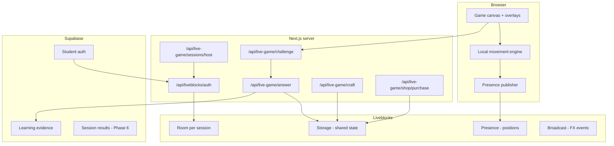
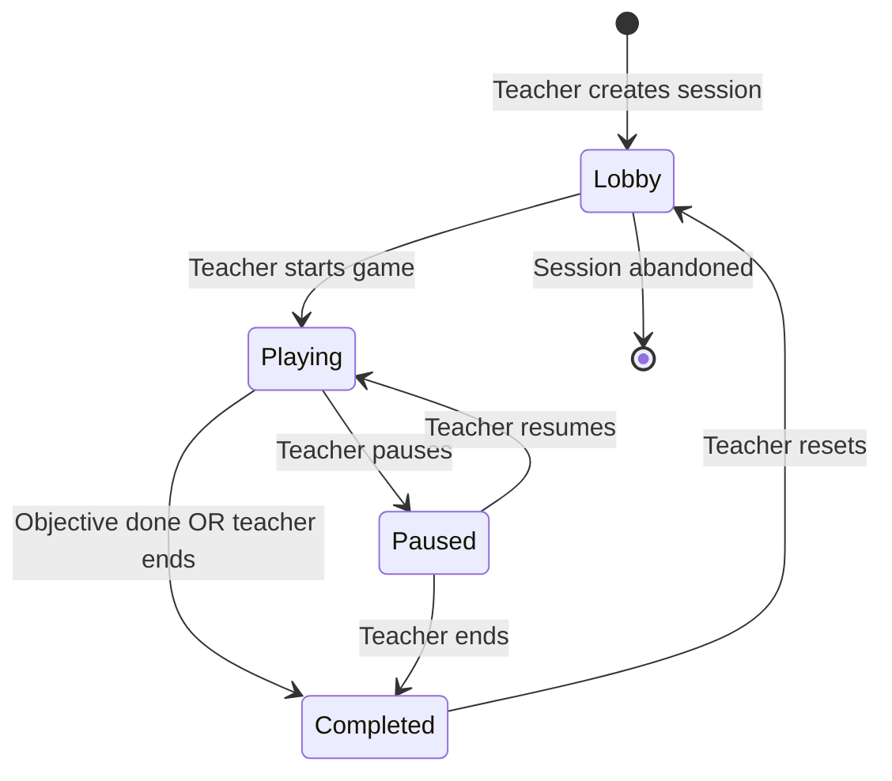

# Live Game — Architecture

**Status:** Phase 1 implemented (2026-07-11)  
**Prepared:** 2026-07-11  
**Module:** Live Game — English Craft first mode  
**Route prefix:** `/live-game`

---

## 0. Three layers

| Layer | Path | Phase |
| --- | --- | --- |
| **SessionManager** | `web/app/live-game/`, lobby, host API | Phase 1 shell |
| **MultiplayerEngine** | `web/lib/live-game/liveblocks/`, `engine/`, `hooks/` | Phase 1 |
| **GameModes** | `web/lib/live-game/modes/english-craft/` | Phase 1 scaffold |

See [product-framing.md](./product-framing.md) for disposable session rules.

---

## 1. Product shape

Hybrid of two models:

| Layer | Model | Player experience |
| --- | --- | --- |
| **Cooperative shell** | Explore → interact → answer → shared pool → craft → unlock | Team progresses the world together |
| **Gimkit economy** | Personal coins → shop → power-ups | Individual rewards and purchases during the same session |

Neither the turn-based board game nor a pure Kahoot clone. Students move freely, answer questions at resource nodes, and spend coins on power-ups while the team builds toward a shared objective.

---

## 2. System context



---

## 3. State ownership

**Rule:** Do not store player movement in Liveblocks Storage.

| State | Owner | Location | Examples |
| --- | --- | --- | --- |
| Immediate local | Browser only | React state / RAF loop | Keys pressed, local position before publish, camera offset |
| Player position | Liveblocks **Presence** | Per-connection | `x`, `y`, `direction`, `isMoving`, `animation` |
| Shared session | Liveblocks **Storage** | Room-wide | Resource pool, node cooldowns, crafted items, unlocked gates, game phase |
| Personal economy | Liveblocks **Storage** | Keyed by student ID | Coin wallet, owned power-ups |
| Temporary FX | Liveblocks **Broadcast** | Ephemeral | Collection sparkle, craft animation, purchase toast |
| Correct answers | Next.js server only | Never sent to client | MC correct option, sentence order validation |
| Learning records | Supabase | Persistent | Attempts, evidence events, session summary |
| Static map | App bundle / JSON | Read-only at runtime | Collision rects, node placements, spawn points |

### Movement pipeline

```
1. Local character moves immediately (explore-scene-engine)
2. Position snapshot published via Presence (throttled ~100ms default)
3. Remote clients receive snapshots
4. Remote avatars interpolate toward latest position
5. Resource interactions validated separately on server
```

Reference: `web/lib/explore/explore-scene-engine.ts` for local movement; new `web/lib/live-game/engine/interpolation.ts` for remote smoothing.

---

## 4. Liveblocks data contract (target)

File: `web/liveblocks.config.ts` — extend with live-game types. Rooms use prefix `wke-live-game-` (distinct from board-game `wke-board-game-`).

### Presence

```ts
type PlayerPresence = {
  x: number;
  y: number;
  direction: "up" | "down" | "left" | "right";
  isMoving: boolean;
  animation: "idle" | "walk" | "interact";
  avatarId: string;
  interactionNodeId: string | null;
  /** Phase 3: active power-up flags */
  speedBoostUntil?: number | null;
};
```

### Storage

```ts
type ResourceType = "wood" | "stone" | "fiber";

type ResourceNodeState = {
  id: string;
  resourceType: ResourceType;
  available: boolean;
  cooldownEndsAt: number | null;
  collectedCount: number;
};

type SharedGameState = {
  phase: "lobby" | "playing" | "paused" | "completed";
  startedAt: number | null;
  endsAt: number | null;
  objectiveId: string;
  objectiveCompleted: boolean;
};

declare global {
  interface Liveblocks {
    Presence: PlayerPresence;
    Storage: {
      game: LiveObject<SharedGameState>;
      resourcePool: LiveMap<ResourceType, number>;
      resourceNodes: LiveMap<string, LiveObject<ResourceNodeState>>;
      playerWallets: LiveMap<string, number>;           // studentId → coins
      ownedPowerUps: LiveMap<string, LiveList<string>>; // studentId → powerUpIds
      craftedItems: LiveMap<string, number>;
      unlockedObjects: LiveMap<string, boolean>;
      lobby: LiveObject<{ joinCode: string; hostUserId: string; mapId: string }>;
      players: LiveMap<string, LiveObject<LobbyPlayer>>;
    };
    UserMeta: {
      id: string; // Supabase user.id
      info: {
        displayName: string;
        avatarId: string;
        role: "student" | "teacher";
      };
    };
    RoomEvent:
      | { type: "RESOURCE_COLLECTED"; playerId: string; nodeId: string; resourceType: ResourceType }
      | { type: "ITEM_CRAFTED"; playerId: string; recipeId: string }
      | { type: "POWER_UP_PURCHASED"; playerId: string; powerUpId: string }
      | { type: "OBJECTIVE_COMPLETED"; objectiveId: string };
  }
}
```

**Note:** Exact Storage layout may be refined in Phase 1. Include `playerWallets` and `ownedPowerUps` keys from Phase 1 even if shop UI ships in Phase 3.

### Room ID

| Constant | Value |
| --- | --- |
| Prefix | `wke-live-game-` |
| Session ID | 6-char join code (reuse alphabet from board-game) |
| Example | `wke-live-game-ABC123` |

Files to create:

- `web/lib/live-game/liveblocks/room-id.ts`
- `web/lib/live-game/liveblocks/join-code.ts` (or import shared helper)

---

## 5. Room lifecycle



### Phase transitions

| Phase | Student can | Server accepts |
| --- | --- | --- |
| `lobby` | Join, see roster, ready up | Auth only |
| `playing` | Move, interact with nodes, shop | Challenges, answers, craft, purchase |
| `paused` | Move (optional — TBD), view world | Nothing new |
| `completed` | View results | Nothing |

### Join flow

```
Teacher → POST /api/live-game/sessions/host
       → receives joinCode, roomId, host cookie
       → navigates to /live-game/teacher/[sessionId] (Phase 5) or /live-game/[sessionId]

Student → logs in (Supabase required)
        → /live-game/join → enter code
        → POST /api/liveblocks/auth with user.id + displayName
        → RoomProvider connects
        → spawn at map spawn point
```

### Reconnection

- Same Supabase `user.id` → same Liveblocks connection identity
- Storage persists world state (pool, nodes, unlocks)
- Presence re-publishes position on reconnect
- Server challenge tokens are one-time; abandoned challenges expire

---

## 6. API contracts

All game-mutating routes require:

1. Valid Liveblocks room membership (verified server-side)
2. Matching `game.phase` (playing, not paused/completed)
3. Supabase student session (for students) or host cookie (for teacher actions)

### `POST /api/live-game/sessions/host`

Creates a new session. Pattern: `web/app/api/board-game/live/host/route.ts`.

**Request:**
```json
{ "displayName": "Ms. Chen", "userId": "teacher-uuid", "mapId": "pilot_island_v1" }
```

**Response:**
```json
{ "sessionId": "ABC123", "joinCode": "ABC123", "roomId": "wke-live-game-ABC123" }
```

Sets httpOnly host cookie (reuse or parallel cookie name).

---

### `POST /api/live-game/challenge`

Issues a one-time challenge for a resource node.

**Request:**
```json
{
  "roomId": "wke-live-game-ABC123",
  "nodeId": "tree-01",
  "playerId": "student-uuid"
}
```

**Server checks:**
- Session active
- Node available (not on cooldown)
- Player within interact radius (optional Phase 2 — trust client initially, harden later)
- No unexpired challenge already issued for this player+node

**Response:**
```json
{
  "challengeId": "ch_abc123",
  "expiresAt": "2026-07-11T12:00:30Z",
  "question": {
    "id": "q-wood-01",
    "type": "multiple_choice",
    "prompt": "What is the opposite of 'hot'?",
    "options": ["cold", "warm", "big", "fast"]
  }
}
```

**Never includes `correctAnswer`.**

---

### `POST /api/live-game/answer`

Validates answer and awards rewards.

**Request:**
```json
{
  "roomId": "wke-live-game-ABC123",
  "challengeId": "ch_abc123",
  "answer": "cold",
  "responseTimeMs": 4200
}
```

**Server transaction:**
1. Verify challenge token (unused, not expired)
2. Validate answer against server-held key
3. Re-check node availability
4. `liveblocks.mutateStorage` — increment pool, set node cooldown, credit coins
5. Mark challenge consumed
6. Record `GameQuestionAttempt` + emit mastery evidence (Phase 2+)
7. Return result

**Response:**
```json
{
  "correct": true,
  "coinsAwarded": 5,
  "resourceAwarded": { "type": "wood", "amount": 1 },
  "poolTotal": { "wood": 4 }
}
```

---

### `POST /api/live-game/shop/purchase`

**Request:**
```json
{
  "roomId": "wke-live-game-ABC123",
  "powerUpId": "speed_boost",
  "playerId": "student-uuid"
}
```

**Server transaction:**
1. Verify sufficient coins in `playerWallets`
2. Deduct coins
3. Grant power-up in `ownedPowerUps`
4. Broadcast `POWER_UP_PURCHASED` event

---

### `POST /api/live-game/craft`

**Request:**
```json
{
  "roomId": "wke-live-game-ABC123",
  "recipeId": "basic_axe",
  "sentenceOrder": ["I", "usually", "play", "football", "after", "school"]
}
```

**Server transaction:**
1. Verify team has enough resources in `resourcePool`
2. Validate sentence order
3. Deduct resources, add crafted item
4. Set `unlockedObjects["fallen_tree_gate"] = true`
5. Broadcast `ITEM_CRAFTED`

---

## 7. Secure resource-collection transaction

```
Client                          Server                         Liveblocks
  │                               │                                │
  │── POST /challenge ───────────►│                                │
  │                               │── verify node available ──────►│
  │◄── question (no answer) ──────│                                │
  │                               │                                │
  │── POST /answer ──────────────►│                                │
  │                               │── validate token + answer      │
  │                               │── mutateStorage (pool, node) ─►│
  │                               │── record evidence ──► Supabase │
  │◄── result + new pool ────────│                                │
  │◄── Storage sync ───────────────────────────────────────────────│
```

Prevents: double collection, answer leaking, client-side pool editing, simultaneous node claims.

---

## 8. Identity and auth

| Role | Liveblocks userId | Auth gate |
| --- | --- | --- |
| Student | Supabase `user.id` | Must be logged in; open join with valid code (Phase 1–5) |
| Teacher (host) | Supabase `user.id` or teacher ID | Host cookie from `/sessions/host` |

**Change from board-game:** Replace `guest-{uuid}` (`web/lib/board-game/liveblocks/identity.ts`) with real student IDs for live-game routes.

Auth endpoint: extend `web/app/api/liveblocks/auth/route.ts` to branch on room prefix:

- `wke-board-game-*` → existing board-game policy
- `wke-live-game-*` → live-game policy (student login required; host cookie for teacher)

---

## 9. Directory structure (target)

```
web/
├── app/
│   ├── live-game/
│   │   ├── page.tsx
│   │   ├── host/page.tsx
│   │   ├── join/page.tsx
│   │   ├── [sessionId]/page.tsx
│   │   └── teacher/[sessionId]/page.tsx
│   └── api/
│       ├── liveblocks/auth/route.ts          (extend)
│       └── live-game/
│           ├── sessions/host/route.ts
│           ├── challenge/route.ts
│           ├── answer/route.ts
│           ├── craft/route.ts
│           └── shop/purchase/route.ts
├── components/live-game/
│   ├── LiveGameProvider.tsx
│   ├── LiveGameRoomShell.tsx
│   ├── LiveGameCanvas.tsx
│   ├── LocalPlayer.tsx
│   ├── RemotePlayer.tsx
│   ├── ResourceHud.tsx
│   ├── QuestionOverlay.tsx
│   ├── ShopOverlay.tsx
│   ├── CraftingOverlay.tsx
│   └── TeacherDashboard.tsx
├── lib/live-game/
│   ├── engine/
│   │   ├── movement.ts          (wrap explore-scene-engine)
│   │   ├── collision.ts
│   │   └── interpolation.ts
│   ├── liveblocks/
│   │   ├── room-id.ts
│   │   ├── initial-storage.ts
│   │   ├── mutations/
│   │   └── selectors.ts
│   ├── schemas/
│   │   ├── game-session.ts
│   │   ├── resources.ts
│   │   ├── power-ups.ts
│   │   └── challenges.ts
│   ├── maps/
│   │   └── pilot-island-v1.ts
│   └── server/
│       ├── challenge-store.ts   (one-time tokens)
│       └── mutate-storage.ts    (shared mutateStorage helpers)
├── lib/liveblocks/              (shared — extracted Phase 1)
│   ├── provider.tsx
│   └── auth-helpers.ts
└── liveblocks.config.ts         (extended types)
```

---

## 10. Map format (MVP)

Based on `ExploreSceneMapDef` (`web/lib/explore/scenes/types.ts`) with live-game extensions:

```ts
type LiveGameMapDef = {
  id: string;
  widthPx: number;
  heightPx: number;
  backgroundUrl: string;
  collisionRects: Rect[];
  spawnPoints: { id: string; x: number; y: number }[];
  resourceNodes: {
    id: string;
    resourceType: ResourceType;
    x: number;
    y: number;
    interactRadius: number;
    questionId: string;
  }[];
  craftingStations: {
    id: string;
    x: number;
    y: number;
    recipeId: string;
  }[];
  gates: {
    id: string;
    bounds: Rect;
    requiresUnlockId: string;
  }[];
  objective: { id: string; label: string; requiresUnlockId: string };
};
```

Pilot map: `pilot_island_v1` — 6–12 wood nodes, 1 crafting station, 1 gate, 1 objective.

---

## 11. Power-ups (MVP)

| ID | Cost | Server effect | Client effect |
| --- | --- | --- | --- |
| `speed_boost` | 15 | Record ownership | `speedBoostUntil` in Presence; 1.5× move speed for 10s |
| `hint` | 10 | Record ownership | Next MC question hides 2 wrong options |
| `team_boost` | 25 | +1 wood to `resourcePool` | Toast + broadcast animation |

---

## 12. What stays isolated

| System | Treatment |
| --- | --- |
| `/board-game/*` | Unchanged; separate prototype |
| Lesson player | No Liveblocks dependency |
| Secondary vocab activities | No Liveblocks dependency |
| Explore solo scenes | Reuse engine only; no multiplayer changes |

---

## 13. Implementation sequence

| Phase | Delivers |
| --- | --- |
| 0 | These docs |
| 1 | Room + Presence movement |
| 2 | One resource node + server answer validation |
| 3 | Coins + shop + 3 power-ups |
| 4 | Crafting + gate unlock + objective |
| 5 | Teacher dashboard |
| 6 | Vocab bank + roster gate + full mastery |

See `mvp-scope.md` for acceptance tests and `liveblocks-limits.md` for capacity planning.
