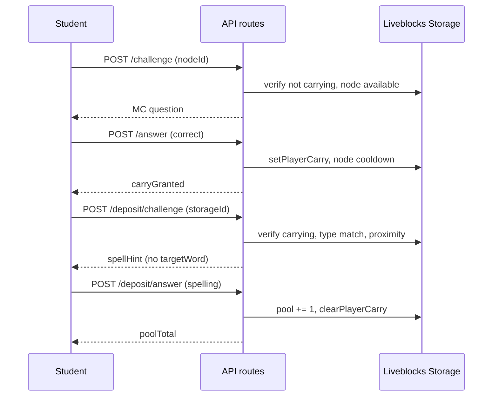

# Live Game — Phase 3D Plan (Deposit + Spell → Pool)

**Status:** Implemented ✅  
**Prepared:** 2026-07-12  
**Implemented:** 2026-07-12  
**Branch:** `codex/english-craft-stabilization`  
**Depends on:** Phase 3C (harvest → carry) — **must follow 3C on the same branch before pilot**  
**Delivers:** Storage deposit interact, spell challenge modal, pool increment, carry clear — **restores v0.1 bridge path for wood**

---

## Approval summary

Phase 3D completes the **carry loop**. A player carrying a resource walks to the matching storage building, opens a **spell challenge** (type the adjective from the harvest question), and on success deposits +1 into the team pool and clears their carry. Wrong spell attempts do not drop the carry.

| | |
| --- | --- |
| **Effort estimate** | 1–1.5 focused implementation sessions |
| **Risk** | Medium — new API surface + spell UX; must link carry `questionId` → `targetWord` server-side |
| **Blocks** | Phase 3E (HUD + storage fill visuals) |
| **Restores** | Wood pool growth → bridge craft → flag (v0.1 win loop) for pilot |

---

## 1. Baseline after Phase 3C

| Area | State |
| --- | --- |
| Harvest | Correct MC → carry on player; node cooldown; pool unchanged |
| Carry | `playerCarry[playerId]` holds `resourceType`, `sourceNodeId`, `questionId` |
| Deposit | Not implemented — storages are visual only |
| Pool | Stays at 0 until deposit |
| Bridge | `wood >= 10` gate still valid but unreachable without deposits |
| Question bank | `targetWord` + `spellHint` stored server-side in `grade56-adjectives-v1` |
| Challenge DB | `live_game_challenges` — reused for harvest; no schema migration |

---

## 2. Goals

1. Add **`POST /api/live-game/deposit/challenge`** — proximity + carry validation; returns spell prompt (hint only).
2. Add **`POST /api/live-game/deposit/answer`** — validate spelled word; increment matching pool key; clear carry.
3. New **`awardDepositForCarry`** server mutator with idempotent receipt (`awardKind: "pool"`).
4. Client **deposit interact** when carrying near matching storage.
5. New **`LiveGameSpellChallengeModal`** — free-text spell input (not garden letter-rack).
6. New **`useLiveGameDepositChallenge`** hook (mirror harvest hook pattern).
7. Restore end-to-end loop: **harvest → carry → walk → spell → pool → craft bridge → flag**.

---

## 3. Explicitly out of scope (Phase 3D)

| Item | Phase |
| --- | --- |
| Storage building fill sprites (empty/half/full) | **3E** |
| Four-resource team HUD | **3E** |
| Stone/wheat/cotton craft requirements | **3F** |
| Coins on deposit | Phase 4 |
| Partial deposit / multi-unit carry | Not in pilot (max carry = 1) |
| Deposit at wrong storage type (auto-routing) | **Rejected** — must match `carry.resourceType` |
| Pronunciation / audio spell | Not in pilot |
| New question bank items | Uses existing 60 adjectives |

---

## 4. Locked rules (deposit)

| Rule | Value |
| --- | --- |
| Deposit trigger | Player carries + within interact radius of **matching** storage |
| Storage matching | `ENGLISH_CRAFT_STORAGE_BY_TYPE[carry.resourceType]` |
| Spell source | `questionId` from carry — same question as harvest MC |
| Client receives | `spellHint` only — **never** `targetWord` or `correctAnswer` |
| Spell validation | Server: normalize input (`trim`, `toLowerCase`) === `targetWord.toLowerCase()` |
| Wrong spell | Carry retained; player may retry (new challenge or same modal) |
| Correct spell | `resourcePool[resourceType] += 1`; `clearPlayerCarry`; Presence `carriedResourceType → null` |
| Challenge TTL | `ENGLISH_CRAFT_CHALLENGE_TTL_MS` (60s) — same as harvest |
| Proximity | Server reads `playerPositions[playerId]`; 5s staleness gate (same as harvest) |
| Interact radius | New constant `ENGLISH_CRAFT_STORAGE_INTERACT_RADIUS_PX = 72` |
| Idempotency | `awardReceipts[challengeId]` with `awardKind: "pool"` |
| Harvest while carrying | Still blocked (3C) |
| Craft while carrying | Client blocked; after deposit, craft available if pool sufficient |

---

## 5. End-to-end loop (after 3D)



---

## 6. Server changes

### 6.1 New `award-deposit.ts`

```ts
export type AwardDepositResult = {
  resourceType: LiveGameResourceType;
  poolCount: number;
  alreadyAwarded: boolean;
};

export async function awardDepositForCarry(input: {
  roomId: string;
  playerId: string;
  challengeId: string;
  expectedQuestionId: string;
}): Promise<AwardDepositResult | null>;
```

**Mutate order:**

1. Idempotency via `awardReceipts[challengeId]` (`awardKind: "pool"`).
2. Read carry — abort if missing or `questionId !== expectedQuestionId`.
3. Increment `resourcePool[carry.resourceType]` by 1.
4. `clearPlayerCarry` for player.
5. Write receipt: `{ awardKind: "pool", resourceType, poolCount, nodeCooldownEndsAt: 0 }` (cooldown N/A — use 0 or omit).

### 6.2 `deposit/challenge/route.ts`

**Request:** `{ roomId, storageId }`

| Validation | Error |
| --- | --- |
| `storageId` in `ENGLISH_CRAFT_STRUCTURES_V1` with `kind` ending `_storage` | 400 |
| `phase === "playing"` | 409 |
| `readPlayerCarry` present | 409 `"Nothing to deposit."` |
| `carry.resourceType === storage.resourceType` | 409 `"Wrong storage for what you are carrying."` |
| Position fresh + within radius of storage def | 409 `"Move closer to storage."` |
| Reuse `findActiveChallengeForPlayerNode` with `nodeId = storageId` | Return existing token if active |

**Question resolution:**

```ts
const question = getQuestionFromSet(questionSetId, carry.questionId);
// Must be adjective question with spellHint + targetWord (server only)
```

**Response:**

```ts
{
  challengeId: string;
  expiresAt: string;
  spell: {
    resourceType: LiveGameResourceType;
    spellHint: string;
    storageLabel: string;
  };
}
```

`toClientDepositSpell()` omits `targetWord`.

### 6.3 `deposit/answer/route.ts`

**Request:** `{ roomId, challengeId, spelling }`

| Step | Action |
| --- | --- |
| Auth | `requireLiveGamePlayerSession` |
| Challenge | Load from DB; verify `playerId`, `roomId`, not expired |
| Carry | Storage snapshot must still have matching carry for player |
| Validate spelling | `isDepositSpellCorrect(questionSetId, challenge.questionId, spelling)` |
| Wrong | `{ correct: false, carryRetained: true, poolTotal }` |
| Correct | `claimLiveGameChallengeAward` → `awardDepositForCarry` → `markChallengeAwarded` |
| Response | `{ correct: true, resourceDeposited: { type, amount: 1 }, poolTotal, carryCleared: true }` |

**Challenge `nodeId` in DB:** storage structure id (e.g. `log-storage-01`). Distinct from harvest `nodeId` values (`tree-01`, etc.) — no collision.

### 6.4 New question helper — `questions-v1.ts`

```ts
export function toClientDepositSpell(input: {
  resourceType: LiveGameResourceType;
  spellHint: string;
  storageLabel: string;
}): EnglishCraftDepositSpellClient;

export function isDepositSpellCorrect(
  questionSetId: LiveGameQuestionSetId,
  questionId: string,
  spelling: string,
): boolean;
```

Normalization: trim, collapse internal whitespace, case-insensitive compare to `targetWord`.

### 6.5 `api-types.ts` extensions

```ts
export type LiveGameDepositAnswerResponse = {
  correct: boolean;
  resourceDeposited: { type: LiveGameResourceType; amount: number } | null;
  poolTotal: LiveGamePoolTotal;
  carryCleared?: boolean;
  carryRetained?: boolean;
  alreadyAwarded?: boolean;
};
```

### 6.6 Challenge store

**No migration.** Reuse `live_game_challenges` table:

| Field | Harvest | Deposit |
| --- | --- | --- |
| `node_id` | `tree-01`, `stone-02`, … | `log-storage-01`, … |
| `question_id` | Picked at harvest | **`carry.questionId`** (fixed at deposit challenge create) |

`createLiveGameChallenge` unchanged — deposit route passes `questionId: carry.questionId`.

---

## 7. Client changes

### 7.1 New `useLiveGameDepositChallenge.ts`

Mirror `useLiveGameHarvestChallenge`:

- `beginChallenge(storage: EnglishCraftStructureDef)`
- `prefetchForStorage(storageId)` when carrying + in range
- `submitAnswer(spelling: string)`
- State: `activeChallenge`, `tokenStatus`, `isSubmitting`, `lastResult`, `error`

### 7.2 New `LiveGameSpellChallengeModal.tsx`

| Element | Spec |
| --- | --- |
| Title | `"Deposit wood — spell the word"` (per resource type) |
| Hint | Show `spellHint` in large text: *"Spell the word that means: very big"* |
| Input | Single text field; submit on Enter or button |
| Feedback | Correct → brief success + auto-close; incorrect → shake + retry |
| Close | Retains carry (same as closing MC modal) |
| A11y | `aria-label` on input; dialog semantics match MC modal |

**Do not reuse** `GardenSpellOverlay` letter-rack — live-game spell is free typing of one adjective word.

### 7.3 `LiveGameCanvas.tsx` interact priority

| State | Priority |
| --- | --- |
| **Carrying** | 1. Matching storage deposit → 2. (nothing else) |
| **Not carrying** | 1. Craft bench if `canCraft` → 2. Nearest harvest node |

**Deposit target resolution:**

```ts
const carry = useLiveGameSelfCarry();
const storageDef = carry ? ENGLISH_CRAFT_STORAGE_BY_TYPE[carry.resourceType] : null;
const depositTarget = carry && storageDef
  ? findNearestInteractable(x, y, [toStorageInteractTarget(storageDef)])
  : null;
```

**Interact labels when carrying:**

| `resourceType` | Label |
| --- | --- |
| `wood` | `Deposit wood` |
| `stone` | `Deposit stone` |
| `wheat` | `Deposit wheat` |
| `cotton` | `Deposit cotton` |

**Subtitle when carrying:** `"Take it to the matching storage and spell the word — E or Interact"`

**Movement lock:** Deposit modal open → same as MC modal (`anyChallengeOpen` includes deposit).

### 7.4 Prefetch

When carrying + `depositTarget` in range → prefetch `POST /deposit/challenge` after debounce (reuse `LIVE_GAME_CHALLENGE_PREFETCH_DEBOUNCE_MS`).

### 7.5 Presence / overlay

On successful deposit, Storage carry clears → existing `useLiveGameCarryPresence` sets `carriedResourceType: null` → overlay hides.

### 7.6 HUD

Still wood-only display (`LiveGameTeamHud`) — student sees wood increment after depositing wood. Full four-resource HUD deferred to 3E.

---

## 8. Storage interact target helper

Add to `map-objects-v1.ts` or `gameplay-v1.ts`:

```ts
export function toStorageInteractTarget(storage: EnglishCraftStructureDef): InteractTarget {
  return {
    id: storage.id,
    label: storage.label,
    x: storage.x,
    y: storage.y,
    interactRadius: ENGLISH_CRAFT_STORAGE_INTERACT_RADIUS_PX,
  };
}
```

---

## 9. File change list

### New files

| File | Purpose |
| --- | --- |
| `web/app/api/live-game/deposit/challenge/route.ts` | Start deposit spell challenge |
| `web/app/api/live-game/deposit/answer/route.ts` | Validate spelling + award pool |
| `web/lib/live-game/server/award-deposit.ts` | Pool increment + clear carry |
| `web/lib/live-game/hooks/useLiveGameDepositChallenge.ts` | Client deposit flow |
| `web/components/live-game/LiveGameSpellChallengeModal.tsx` | Spell UI |
| `web/lib/live-game/modes/english-craft/questions-deposit-client.ts` | Client-safe spell types |
| `web/lib/live-game/english-craft-phase-3d.test.ts` | Deposit + spell tests |
| `web/docs/live-game/phase-3d-plan.md` | This document |

### Modified files

| File | Change |
| --- | --- |
| `web/lib/live-game/api-types.ts` | Deposit response types |
| `web/lib/live-game/modes/english-craft/questions-v1.ts` | `isDepositSpellCorrect`, `toClientDepositSpell` |
| `web/lib/live-game/modes/english-craft/gameplay-v1.ts` | `ENGLISH_CRAFT_STORAGE_INTERACT_RADIUS_PX` |
| `web/components/live-game/LiveGameCanvas.tsx` | Deposit interact + modal + prefetch |
| `web/docs/live-game/README.md` | Link Phase 3D plan |

---

## 10. Tests

### `english-craft-phase-3d.test.ts`

| Test | Asserts |
| --- | --- |
| `isDepositSpellCorrect` | Case-insensitive; trims whitespace |
| `isDepositSpellCorrect` | Rejects wrong word |
| `toClientDepositSpell` | No `targetWord` in payload |
| `awardDepositForCarry` | Pool +1, carry cleared |
| `awardDepositForCarry` | Idempotent on same `challengeId` |
| Wrong storage type | Deposit challenge rejected when carry type mismatch (unit / route test) |
| Question link | Deposit uses `carry.questionId` not a new random question |

### `grade56-adjectives.test.ts` extension

- Every question has non-empty `targetWord` spellable as a single token (no spaces in `targetWord`).

### Regression

- Full `lib/live-game` suite passes.
- Wood bridge craft still works after 10 wood deposits (manual or integration sketch).

---

## 11. Manual smoke (3C + 3D together)

| Step | Expected |
| --- | --- |
| 1. Harvest wood (correct MC) | Carry sprite (log) appears; pool 0 |
| 2. Walk to log storage (south shore) | "Deposit wood" prompt |
| 3. Open deposit | Spell hint shown (e.g. *"very big"*); no answer leaked |
| 4. Wrong spelling | Error feedback; still carrying |
| 5. Correct spelling (`enormous`) | Pool wood +1; carry sprite gone |
| 6. Repeat until wood = 10 | Craft bench prompt returns |
| 7. Craft bridge + flag | v0.1 win loop complete |
| 8. Harvest stone → deposit at stone shed | `pool.stone + 1` (HUD still wood-only until 3E) |
| 9. Round reset | Pool zeroed; carry cleared |

---

## 12. Risks & mitigations

| Risk | Mitigation |
| --- | --- |
| `targetWord` leaked to client | Dedicated `toClientDepositSpell`; grep test forbids `targetWord` in client types |
| Carry cleared before pool increment | Single `mutateStorage` in `awardDepositForCarry` |
| Student deposits at wrong barn | Server type match gate + client only shows matching storage prompt |
| Challenge `nodeId` collision | Harvest uses resource node ids; deposit uses storage ids — disjoint sets |
| Multi-word `targetWord` | Validate bank: all 60 are single adjective tokens; document in test |
| Stale carry after wrong question set change | Carry stores `questionId`; deposit validates against active session set |

---

## 13. Implementation order

```
1. gameplay-v1.ts storage radius + toStorageInteractTarget
2. questions-v1.ts — isDepositSpellCorrect, toClientDepositSpell + tests
3. server/award-deposit.ts + tests
4. deposit/challenge/route.ts
5. deposit/answer/route.ts
6. useLiveGameDepositChallenge + LiveGameSpellChallengeModal
7. LiveGameCanvas — deposit interact, prefetch, subtitles
8. english-craft-phase-3d.test.ts + full suite
9. README; mark phase-3d-plan implemented when done
```

**Recommended:** implement immediately after 3C on the same branch without merging between them.

---

## 14. What comes next

| Phase | Delivers |
| --- | --- |
| **3E** | Four-resource HUD; storage fill sprites from `resolveStorageFillLevel` |
| **3F** | Multi-resource craft thresholds; victory stats for all resource types |

---

## 15. Approval checklist

| # | Decision | Proposed default | Approved? |
| --- | --- | --- | --- |
| 1 | Phase 3D scope: deposit + spell → pool; no HUD/fill visuals | Yes | ☐ |
| 2 | Implement 3D immediately after 3C (same branch, before pilot) | Yes | ☐ |
| 3 | New routes `/deposit/challenge` + `/deposit/answer` | Yes | ☐ |
| 4 | Reuse `live_game_challenges` table (storage id as `node_id`) | Yes | ☐ |
| 5 | Spell uses `carry.questionId` → server-side `targetWord` | Yes | ☐ |
| 6 | Client receives `spellHint` only | Yes | ☐ |
| 7 | Wrong spell retains carry | Yes | ☐ |
| 8 | Must deposit at matching storage type | Yes | ☐ |
| 9 | Free-text spell modal (not garden letter-rack) | Yes | ☐ |
| 10 | `ENGLISH_CRAFT_STORAGE_INTERACT_RADIUS_PX = 72` | Yes | ☐ |

---

**Submitted for approval.** Reply with changes or **approved** to begin Phase 3C → 3D implementation.
