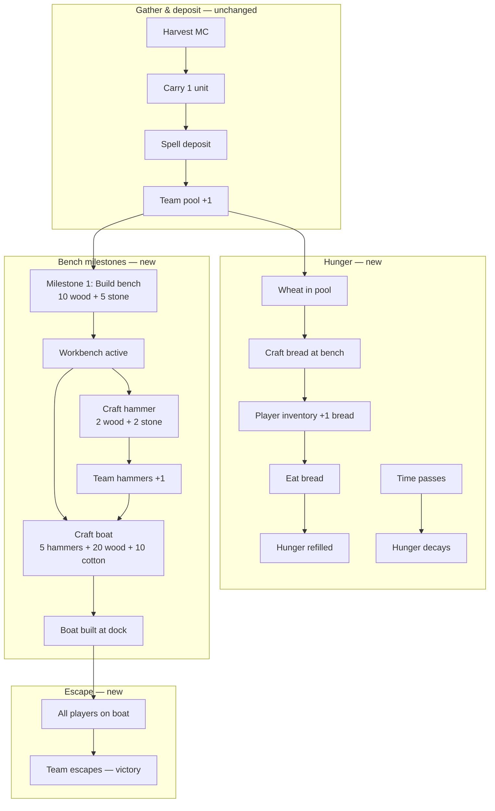

# Live Game — Phase 4 Plan (Milestone Loop: Bench → Tools → Boat Escape)

**Status:** Awaiting approval  
**Prepared:** 2026-07-12  
**Branch:** `codex/english-craft-stabilization` (or follow-on)  
**Depends on:** Phase 3 complete ✅ (harvest → carry → deposit → pool → craft → flag)  
**Delivers:** Milestone crafting, player hunger + bread, team tool inventory, boat escape win, **tile-based deposit spelling**, **larger carry icons** — **replaces bridge/flag as primary win path**

---

## Approval summary

Phase 4 turns English Craft from a single-bridge objective into a **three-milestone survival escape**:

1. **Build the workbench** (10 wood + 5 stone) — unlocks crafting
2. **Craft tools** (hammers) and **survive hunger** (wheat → bread)
3. **Build the boat** (5 hammers + 20 wood + 10 cotton) and **board together** to escape the island

The map becomes a true island surrounded by water. The team pool and deposit loop from Phase 3 stay; we add **crafted-item inventory**, **per-player hunger**, a **multi-recipe bench**, a **tile-based spelling deposit UI**, and **larger carry sprites**.

| | |
| --- | --- |
| **Effort estimate** | 3–4 focused implementation sessions |
| **Risk** | Medium — new win condition, per-player state, recipe graph |
| **Blocks** | Classroom pilot of survival/craft milestone loop |
| **Regression guard** | Harvest → carry → deposit unchanged; session reset still clears all ephemeral state |

---

## 1. Baseline after Phase 3

| Area | State |
| --- | --- |
| Win condition | Craft bridge → cross river → touch flag |
| Team pool | `wood`, `stone`, `wheat`, `cotton` via deposit |
| Carry | 1 unit per player; blocks harvest/craft |
| Carry overlay | `LiveGameCarryOverlay` — **32px** above avatar (local + remote) |
| Deposit spell UI | Free-text input; definition via `spellHint` only |
| Craft | Single recipe at always-available bench; deducts all four resource goals |
| `craftedItems` | `{ bridge: boolean }` |
| `unlockedObjects` | `{ river_crossing: boolean }` |
| Personal state | No hunger, no inventory, no wallets |
| Map border | Grass half-tile collision rim |
| River | Mid-map 2-row water band; removed from collision after bridge craft |
| Victory | Flag touch + trees/resources gathered stats |

---

## 2. Target game loop (locked for planning)



### Milestone table

| # | Milestone | Cost (team pool) | Also consumes | Unlocks |
| --- | --- | --- | --- | --- |
| 1 | **Build workbench** | 10 wood + 5 stone | — | Bench interactable; recipe menu |
| 2a | **Craft hammer** | 2 wood + 2 stone | — | `hammers +1` (team crafted stack) |
| 2b | **Craft bread** | 2 wheat | — | `bread +1` to **crafter's** inventory |
| 3 | **Craft boat** | 20 wood + 10 cotton | 5 hammers | Boat at dock; boarding win enabled |

> **Bread cost proposal:** 2 wheat → 1 bread (tunable). Requires bench active (same as hammers).

> **Hammer stacking:** Team shares one hammer count. Multiple hammer crafts allowed until boat is built.

### Hunger rules (proposed defaults)

| Rule | Value |
| --- | --- |
| Meter | 0–100 per player |
| Start | 100 at round start |
| Decay | −1 every 45 seconds while `phase === "playing"` |
| Low warning | ≤ 30 shows HUD warning |
| Starving | ≤ 0 → movement speed −40% (no elimination in pilot) |
| Restore | Eat 1 bread → hunger = 100 |
| Bread source | Player inventory only (not team pool) |

Decay should be **server-authoritative** (timestamp on `playerHunger` or derived from `session.startedAt` + tick interval) so clients cannot cheat.

### Win condition (replaces flag)

| Rule | Value |
| --- | --- |
| Prerequisite | `craftedItems.boat === true` |
| Boarding zone | Boat dock rectangle (~120×80px) on south shore |
| Win trigger | **All connected players** overlap boarding zone simultaneously for **2 consecutive seconds** |
| Completion | `session.phase = "completed"`; victory overlay shows escape stats |
| Flag / bridge | **Deprecated** from win path; remove or leave as map dressing only |

---

## 3. Map change — water-bordered island

### Visual

| Change | Detail |
| --- | --- |
| Perimeter ring | Replace outermost grass border cells with **water tiles** (1-tile deep on all four sides) |
| Playable area | Shrinks by 1 tile inward; respawn cols may shift |
| Internal river | **Keep for now** as terrain flavor; no longer tied to win. Collision stays until removed in 4F or left as obstacle |
| Dock | New structure south shore (cols 14–16, row 10) — boat sprite anchors here after craft |
| Bench (pre-milestone) | Show **bench rubble / unbuilt stump** until Milestone 1 complete |

### Collision

| Layer | Behavior |
| --- | --- |
| Perimeter water | Always blocked (like current river cells) |
| Internal river | Blocked (optional: bridge craft removed from loop) |
| Boat boarding zone | Non-blocking; used only for win detection |

### Files touched (map)

| File | Change |
| --- | --- |
| `tilemap-v1.ts` | Water cells on perimeter rows/cols 0 and max |
| `map-v1.ts` | Build perimeter water collision rects; export `getEnglishCraftCollisionRects()` without bridge unlock param (or simplify) |
| `map-objects-v1.ts` | Dock structure, bench states, boat placement |
| `EnglishCraftMapLayer.tsx` | Render perimeter water + dock |
| `english-craft-art.ts` | Water tile, dock, boat (built/empty), bench-unbuilt |

---

## 4. Schema changes

### 4.1 Extend `craftedItems`

```ts
type LiveGameCraftedItems = {
  benchBuilt: boolean;   // Milestone 1
  hammers: number;       // Team stack (0–5+; boat consumes 5)
  boat: boolean;         // Milestone 3
  bridge?: boolean;      // Deprecated — remove in 4F cleanup
};
```

### 4.2 New `playerInventory` LiveMap

```ts
type LiveGamePlayerInventory = {
  bread: number;  // Pilot: bread only; expandable later
};
```

Keyed by Liveblocks connection id (same as `playerCarry`).

### 4.3 New `playerHunger` LiveMap

```ts
type LiveGamePlayerHunger = {
  value: number;        // 0–100
  lastUpdatedAt: number; // ms epoch for server decay reconciliation
};
```

### 4.4 Simplify `unlockedObjects` (4F cleanup)

| Key | Phase 4 |
| --- | --- |
| `river_crossing` | Deprecate — no longer unlocks win path |
| `boat_boarding` | New — `true` when boat crafted; enables boarding detection |

### 4.5 Reset (`gameplay-reset.ts`)

On `start` / `return_to_lobby`:

- `craftedItems` → `{ benchBuilt: false, hammers: 0, boat: false }`
- Clear all `playerInventory` entries → `{ bread: 0 }`
- Clear all `playerHunger` → `{ value: 100, lastUpdatedAt: now }`
- Pool, carry, nodes — unchanged from Phase 3

---

## 5. Craft system generalization

Replace single-purpose `award-craft-bridge.ts` with a **recipe-driven craft engine**.

### 5.1 Recipe config (`craft-recipes-v1.ts`)

```ts
type CraftRecipeId =
  | "build_bench"
  | "craft_hammer"
  | "craft_bread"
  | "craft_boat";

type CraftRecipe = {
  id: CraftRecipeId;
  label: string;
  poolCost: Partial<LiveGameResourcePool>;
  craftedCost?: { hammers?: number };
  grants: {
    benchBuilt?: true;
    hammers?: number;
    boat?: true;
    breadToCrafter?: number;
  };
  requires: {
    benchBuilt?: true;
    maxHammersBeforeBoat?: number; // optional cap
  };
  questionKind: "sentence_order" | "mc" | "spell"; // reuse existing validators
};
```

### 5.2 API shape

| Route | Change |
| --- | --- |
| `POST /api/live-game/craft/challenge` | Accept `{ roomId, recipeId }` |
| `POST /api/live-game/craft/answer` | Return `{ correct, poolTotal, craftedItems, inventory?, ... }` |
| New: `POST /api/live-game/consume` | Eat bread: `{ roomId, item: "bread" }` → decrement inventory, set hunger 100 |

Gate checks move to shared helpers:

- `canCraftRecipe(storage, recipeId, playerId)`
- `missingRecipeResources(pool, recipe)`

### 5.3 Bench UI

| Bench state | UI |
| --- | --- |
| `!benchBuilt` | Single prompt: **"Build workbench"** (10 wood + 5 stone) |
| `benchBuilt && !boat` | Recipe list: Hammer, Bread, Boat (boat greyed until 5 hammers + resources) |
| `boat` | **"Board the boat"** prompt at dock (not bench) |

`LiveGameCraftModal` becomes recipe-aware (title + cost chips per recipe).

---

## 6. Client changes

### 6.1 HUD

| Element | Detail |
| --- | --- |
| Team resources | Keep Phase 3 four-resource HUD |
| Team tools | New chip: `Hammers: 3/5` (toward boat) |
| Hunger bar | Per-player bar under name or top-left personal strip |
| Bread count | Small icon + count when `inventory.bread > 0` |
| Milestone subtitle | `LiveGameCanvas` subtitle driven by milestone state machine |

### 6.2 Interact priority (updated)

1. Eat bread (if hungry ≤ 50 and bread > 0) — optional quick action or inventory button
2. Deposit (if carrying)
3. Board boat (if boat built + at dock + all-boarding win in progress)
4. Craft at bench (if near bench + recipe available)
5. Harvest (if not carrying)

### 6.3 Boarding detection

New hook: `useLiveGameBoatBoarding`

- Polls player positions (presence + storage positions)
- When all players in dock zone for 2s → `POST /api/live-game/complete` with `{ kind: "boat_escape" }`
- Show progress overlay: "Waiting for team… 4/6 on boat"

### 6.4 Deposit spelling — letter tiles (replaces free-text input)

Upgrade `LiveGameSpellChallengeModal` for all storage deposits. **Server validation unchanged** — client still submits assembled string to `/api/live-game/deposit/answer`.

#### UI layout

```
┌ Deposit wood — spell the word ─────────────┐
│ Wood pile                                   │
│ Spell the word that means:                  │
│ very big                          ← spellHint (definition — keep)
│                                             │
│ [_] [_] [_] [_] [_] [_] [_] [_]   ← answer slots
│                                             │
│ [m] [o] [r] [u] [s] [n] [e]       ← shuffled letter bank
│                                             │
│              [Hint]  [Deposit]              │
└─────────────────────────────────────────────┘
```

| Element | Spec |
| --- | --- |
| Definition | Keep `spellHint` exactly as today (*"very big"*, etc.) |
| Input mode | **Letter tiles** — tap bank tile → fills leftmost empty slot |
| Lock-in | When slot *i* receives the correct letter, **lock** it (green border, no longer editable; tile removed from bank) |
| Wrong placement | Letter sits in slot but stays unlocked — student can tap slot to return tile to bank |
| Hint button | Places the **next correct letter** into the leftmost empty slot; letter locks immediately |
| Hint cooldown | **2 seconds** between hint uses (client timer; button disabled + countdown) |
| Submit | Enabled when all slots filled and locked; sends joined string (no spaces for single-word pilot bank) |
| Multi-word | Pilot bank is single-word adjectives — spaces out of scope unless content adds them later |

#### Server / token payload

Extend deposit challenge client payload (no `targetWord` leak):

```ts
type EnglishCraftDepositSpellClient = {
  resourceType: LiveGameResourceType;
  spellHint: string;       // definition — unchanged
  storageLabel: string;
  letterBank: string[];    // shuffled chars from targetWord
  slotCount: number;       // targetWord.length
};
```

`letterBank` + `slotCount` generated server-side in `deposit/challenge` from question metadata (same source as `isQuestionSetDepositSpellCorrect`).

#### Files

| File | Change |
| --- | --- |
| `LiveGameSpellChallengeModal.tsx` | Tile slots, bank, hint + cooldown, lock-in logic |
| `questions-deposit-client.ts` | Add `letterBank`, `slotCount` |
| `deposit/challenge/route.ts` | Build shuffled `letterBank` in token |
| `english-craft-phase-4g.test.ts` | Tile lock-in + hint placement unit tests |

---

### 6.5 Carry icon scale-up

Make carried resources easier to read at gameplay zoom (1.85×).

| Surface | Current | Target |
| --- | --- | --- |
| Avatar overlay (`LiveGameCarryOverlay`) | 32px | **48px** |
| HUD carry chip (`LiveGameTeamResourceHud`) | 16px icon | **24px** icon |
| Vertical offset | `top: -sizePx - 4` | Scale with new size (auto via `sizePx` prop) |

Add shared constant:

```ts
export const ENGLISH_CRAFT_CARRY_OVERLAY_SIZE_PX = 48;
export const ENGLISH_CRAFT_CARRY_HUD_ICON_PX = 24;
```

Apply in `LocalPlayer`, `RemotePlayer`, and `LiveGameWoodHud`. No server changes.

---

### 6.6 Lobby & victory copy

**How to play (student lobby):**

1. Gather wood, stone, wheat, and cotton — deposit at storage  
2. Build the workbench (10 wood + 5 stone)  
3. Craft hammers and bread; stay fed while you work  
4. Craft the boat and get everyone aboard to escape  

**Victory overlay:** Escape stats — hammers crafted, bread eaten, hunger lowest point, resources gathered, who was last on the boat.

---

## 7. Explicitly out of scope (Phase 4)

| Item | Later phase |
| --- | --- |
| Coins / shop / power-ups | Phase 5 |
| Personal wood/stone inventory (full RPG bags) | Not planned — pool stays team-shared |
| PvP or stealing bread | Out |
| Persistent cross-session inventory | Out (disposable session) |
| New question banks | Content pass; reuse grade56-adjectives for all challenge types in pilot |
| Teacher resource goal editor | Out |
| Elimination on starvation | Out — slowdown only |

---

## 8. Implementation phases (recommended order)

### Phase 4A — Map & schema foundation
**Goal:** Island look + storage types; no new gameplay yet.

1. Perimeter water tiles + collision  
2. Dock structure placeholder  
3. Extend `craftedItems`, add `playerInventory`, `playerHunger` to initial storage + reset  
4. Types + read helpers  
5. Tests: collision includes perimeter water; reset clears new fields  

**Smoke:** Map renders as island; game still plays Phase 3 loop (temporary).

---

### Phase 4B — Bench milestone & recipe engine
**Goal:** Pay 10 wood + 5 stone to activate bench; generalized craft API.

1. `craft-recipes-v1.ts` with `build_bench` recipe  
2. `award-craft-recipe.ts` replaces bridge-only award  
3. Craft routes accept `recipeId`  
4. Bench visual: unbuilt → active sprite  
5. Client: bench interact shows build prompt; blocks hammer/boat until built  
6. Tests: bench craft deducts pool; idempotent receipts  

**Smoke:** Team deposits 10 wood + 5 stone → bench activates.

---

### Phase 4C — Hammers & boat recipes
**Goal:** Tool chain toward boat.

1. Add `craft_hammer` and `craft_boat` recipes  
2. `craftedItems.hammers` increment / decrement on boat craft  
3. Boat sprite at dock when `boat: true`  
4. HUD hammer chip `n/5`  
5. Remove bridge craft from interact flow (bench recipes only)  
6. Tests: hammer stack, boat consumes 5 hammers + pool costs  

**Smoke:** 5 hammers + resources → boat appears at dock.

---

### Phase 4D — Hunger & bread
**Goal:** Survival pressure during crafting grind.

1. Server hunger decay (reconcile on consume / periodic read)  
2. `craft_bread` recipe (2 wheat → 1 bread to crafter inventory)  
3. `POST /api/live-game/consume` for eating bread  
4. Hunger HUD + movement debuff at 0  
5. Tests: decay math, bread consume, craft adds to player inventory not pool  

**Smoke:** Hunger drops over time; bread restores; starvation slows movement.

---

### Phase 4E — Boat boarding win
**Goal:** Replace flag win with team escape.

1. `useLiveGameBoatBoarding` + dock zone  
2. Update `complete-objective.ts` for `boat_escape` kind  
3. Remove / bypass flag touch win (`useLiveGameFlagTouch` disabled or removed)  
4. Victory overlay + lobby copy  
5. Deprecate `bridge` / `river_crossing` from reset and UI  
6. Full regression suite  

**Smoke:** All players stand on boat 2s → team win overlay.

---

### Phase 4F — Cleanup & pilot polish
1. Remove dead bridge/flag code paths  
2. Update `product-framing.md` loop diagram  
3. README milestone map  
4. Art pass: water edge tiles, boat states, hunger icons  
5. Classroom pilot script (20–25 min target)  

---

### Phase 4G — Deposit spell tiles + carry scale (UX)
**Goal:** Better deposit learning UX and carry readability. **Can ship early** — independent of 4A–4F milestones.

1. Extend deposit challenge payload with `letterBank` + `slotCount`  
2. Rebuild `LiveGameSpellChallengeModal` — tile slots, lock-in, hint (2s cooldown)  
3. Bump `LiveGameCarryOverlay` to 48px; HUD chip to 24px  
4. `english-craft-phase-4g.test.ts` — shuffle helper, lock-in, hint fills next slot  
5. Manual: deposit with hints; verify remote players see larger carry sprite  

**Smoke:** Deposit at storage using tiles + hint; carry icon visibly larger on map and HUD.

**Recommended timing:** 4G can land before or in parallel with 4A (no schema dependency).

---

## 9. File change forecast

### New files

| File | Purpose |
| --- | --- |
| `craft-recipes-v1.ts` | Recipe definitions + helpers |
| `server/award-craft-recipe.ts` | Generalized atomic craft mutate |
| `server/hunger.ts` | Decay + reconcile helpers |
| `server/award-consume.ts` | Eat bread mutate |
| `hooks/useLiveGameBoatBoarding.ts` | All-on-boat win detection |
| `hooks/useLiveGameHunger.ts` | Client hunger display |
| `hooks/useLiveGamePlayerInventory.ts` | Bread count |
| `app/api/live-game/consume/route.ts` | Eat bread endpoint |
| `english-craft-phase-4a.test.ts` … `4e.test.ts` | Per-subphase tests |
| `english-craft-phase-4g.test.ts` | Spell tile + carry constant tests |
| `deposit-spell-tiles.ts` | Shuffle + lock-in + hint helpers (client-safe) |

### Modified files (high touch)

| File | Change |
| --- | --- |
| `tilemap-v1.ts`, `map-v1.ts`, `map-objects-v1.ts` | Water border, dock |
| `liveblocks/config.ts`, `initial-storage.ts`, `gameplay-reset.ts` | New maps |
| `craft/challenge/route.ts`, `craft/answer/route.ts` | `recipeId` |
| `LiveGameCanvas.tsx` | Milestone subtitles, interact priority, boarding |
| `LiveGameWoodHud.tsx` | Hunger + hammers + bread HUD |
| `EnglishCraftObjectsLayer.tsx` | Bench states, boat, dock |
| `LiveGameVictoryOverlay.tsx` | Escape stats |
| `LiveGameStudentLobbyPanel.tsx` | New how-to-play |
| `complete-objective.ts` | Boat escape completion |
| `LiveGameSpellChallengeModal.tsx` | Letter-tile deposit UI (4G) |
| `questions-deposit-client.ts` | `letterBank`, `slotCount` (4G) |
| `deposit/challenge/route.ts` | Shuffled letter bank in token (4G) |
| `LiveGameCarryOverlay.tsx`, `LocalPlayer.tsx`, `RemotePlayer.tsx`, `LiveGameWoodHud.tsx` | 48px / 24px carry (4G) |
| `gameplay-v1.ts` | `ENGLISH_CRAFT_CARRY_OVERLAY_SIZE_PX` constants (4G) |

### Deprecated / remove in 4F

| File / concept | Action |
| --- | --- |
| `award-craft-bridge.ts` | Replace with `award-craft-recipe.ts` |
| `useLiveGameFlagTouch.ts` | Remove or disable |
| `craftedItems.bridge`, `unlockedObjects.river_crossing` | Remove from schema |
| Bridge craft recipe | Remove |

---

## 10. Tests strategy

| Subphase | Key tests |
| --- | --- |
| 4A | Perimeter water collision; new storage fields initialize and reset |
| 4B | `build_bench` gate + deduct; bench blocks other recipes until built |
| 4C | Hammer increment; boat deducts 5 hammers + pool; insufficient hammers → 409 |
| 4D | Hunger decay; bread craft → player inventory; consume restores hunger |
| 4E | Boarding zone detection; all-players-required; completion only when boat built |
| 4G | Tile lock-in logic; hint places next letter; hint 2s cooldown; carry size constants |

**Target:** all `lib/live-game` tests pass after each subphase merge.

---

## 11. Manual smoke (full Phase 4)

| Step | Expected |
| --- | --- |
| 1. Start game | Island surrounded by water; bench unbuilt; hunger 100 |
| 2. Deposit 10 wood + 5 stone | Build bench prompt at stump |
| 3. Build bench | Bench sprite active; recipe menu available |
| 4. Craft 2 hammers | Pool −4 wood −4 stone; hammers = 2 |
| 5. Wait / play | Hunger drops; movement slows at 0 |
| 6. Craft bread, eat | Wheat −2; bread +1; hunger restored |
| 7. Craft 3 more hammers + boat | Hammers hit 5 then boat consumes them; boat at dock |
| 8. All players on boat 2s | Victory — team escaped |
| 9. Play again | All milestones reset |
| 10. Deposit with letter tiles | Definition shown; correct letters lock; hint fills next after 2s |
| 11. Carry resource | 48px sprite above avatar; 24px in HUD chip |

---

## 12. Risks & mitigations

| Risk | Mitigation |
| --- | --- |
| 25+ deposits + hunger feels grindy | Pilot tuning: decay rate, bread cost, session timer |
| All-player boarding hard with absent students | Require all **connected** players only; host can end early |
| Liveblocks storage growth (3 new maps) | Small maps; only bread/hunger per player |
| Recipe API break from Phase 3 craft | `recipeId` required param; migrate in one PR per subphase |
| River + water border confusion | Keep river as inner obstacle; document; remove bridge unlock |
| Students don't understand hammer stack | HUD `3/5 hammers` + lobby copy |

---

## 13. Open decisions (need approval)

| # | Question | Proposed default |
| --- | --- | --- |
| 1 | Bread cost | 2 wheat → 1 bread |
| 2 | Hunger decay rate | −1 per 45 seconds |
| 3 | Starving penalty | Movement −40%, no elimination |
| 4 | Boarding win dwell time | 2 seconds all-on-boat |
| 5 | Internal river | Keep as obstacle; bridge craft removed |
| 6 | Flag on map | Leave as decoration; no win |
| 7 | Hammer crafts | Repeatable until boat built |
| 8 | Bench location | Keep current workbench coordinates |
| 9 | Deposit spell UI | Letter tiles + lock-in; hint 2s cooldown |
| 10 | Carry overlay size | 48px map / 24px HUD chip |

---

## 14. Approval checklist

| # | Decision | Proposed default | Approved? |
| --- | --- | --- | --- |
| 1 | Phase 4 scope: bench milestones + hunger + boat escape | Yes | ☐ |
| 2 | Milestone 1: 10 wood + 5 stone builds bench | Yes | ☐ |
| 3 | Hammer: 2 wood + 2 stone; Boat: 5 hammers + 20 wood + 10 cotton | Yes | ☐ |
| 4 | Bread: 2 wheat → 1 bread; restores hunger fully | Yes | ☐ |
| 5 | Per-player hunger decay + bread in player inventory | Yes | ☐ |
| 6 | Win = all players board boat (not flag) | Yes | ☐ |
| 7 | Map perimeter = water tiles (collision) | Yes | ☐ |
| 8 | Deprecate bridge/flag win path | Yes | ☐ |
| 9 | Implement as subphases 4A → 4G | Yes | ☐ |
| 10 | Team pool stays shared; bread is personal | Yes | ☐ |
| 11 | Deposit spelling: letter tiles, lock-in, hint 2s cooldown | Yes | ☐ |
| 12 | Carry icons: 48px avatar overlay, 24px HUD | Yes | ☐ |

---

**Submitted for approval.** Reply with changes to costs/timing, or **approved** to begin Phase 4A (or 4G first if preferred).
