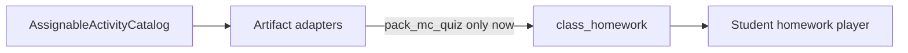

# Proposal: Assignable Activity Catalog (MCQ-first)

**Status:** Done (Phase A — MCQ catalog path)  

**Date:** 2026-07-22  
**Depends on:** Class hub Phases 1–4 (homework + pack quiz assign/play/completions)

## 1. Goal

Teachers can already save pack MCQ quizzes and assign them as homework. We need a **pathway ready for many teacher-created activities**, while **hardwiring only MCQ** for now.

This does **not** merge Create Lesson (live classroom staging) with homework. Live and offline stay separate. Homework gains a thin **assignable activity catalog** that future activity kinds plug into.

## 2. Current pathway (keep)

```text
Word pack → Make quiz → teacher_pack_quizzes (draft)
       ↓
Class hub Homework  OR  Quizzes-tab Assign overlay
       ↓
class_homework.payload.pack_quiz (frozen questions)
       ↓
/primary/homework/[id] → HomeworkPackQuizPlayer → completions
```

| Piece | Location |
| --- | --- |
| Artifact store | `061_teacher_pack_quizzes.sql`, `lib/actions/pack-quiz.ts` |
| Assignment | `class_homework` + `ClassHomeworkPanel` / `AssignPackQuizHomeworkOverlay` |
| Freeze | `lib/class-homework/freeze-pack-quiz.ts` |
| Student play | `/primary/homework/[homeworkId]`, `HomeworkPackQuizPlayer` |

**Do not revive** orphaned `activity_library_items`. Build a new lightweight catalog in app code.

## 3. Product layers

| Layer | Meaning | Today |
| --- | --- | --- |
| **Artifact** | Reusable teacher-created content | Pack MCQ quiz |
| **Assignment** | Class delivery (due, status, freeze) | `class_homework` |
| **Player** | Student experience | `HomeworkPackQuizPlayer` |

Future activities add a new **artifact + player adapter**. Assignment shell stays the same.



## 4. Catalog contract

Proposed module: `web/lib/assignable-activities/`

```ts
type AssignableActivityKind = "pack_mc_quiz"; // extend later

type AssignableActivityCard = {
  kind: AssignableActivityKind;
  artifactId: string;
  title: string;
  subtitle?: string;      // e.g. pack title
  questionCount?: number;
  ready: boolean;
  sourceLabel: string;    // "Pack quiz"
};

type AssignableActivityAdapter = {
  kind: AssignableActivityKind;
  label: string;
  listForClass(classId: string): Promise<AssignableActivityCard[]>;
  /** Build / freeze homework payload from artifact */
  toHomeworkPayload(artifactId: string): Promise<ClassHomeworkPayload>;
  studentRenderer: "pack_mc_quiz";
};
```

Registry registers **only** `pack_mc_quiz` for now. UI must not present unregistered kinds as peers of real activities.

## 5. Payload evolution (compatible)

Keep `class_homework.payload` as jsonb.

**Phase A (this proposal):** Catalog + adapter still **write today’s `pack_quiz` payload** so the student player needs no change.

**Phase B (later):** Dual-read loader accepts `pack_quiz` **or**:

```ts
{
  type: "assignable_activity",
  kind: "pack_mc_quiz",
  artifactId: string,
  title: string,
  freeze: { questions: ...; questionCount: number; frozenAt: string }
}
```

**Phase C:** New assigns write only the new shape; old rows remain readable.

`word_pack_practice` and `external_note` remain **non-catalog** homework tools (reminders / soft practice), not catalog “activities.”

## 6. Teacher UX

### Primary — Class hub → Students & Homework

- **Assign activity** → catalog picker (MCQ cards from adapter)
- Keep secondary: **Note / reminder**, **Word pack practice**

MCQ picker rules:

- Prefer quizzes from class-linked packs (current `listTeacherPackQuizzesForClass`)
- Optionally include other teacher quizzes with “Link pack to this class” (already partly in Quizzes overlay)
- Empty state: “Save a quiz from a word pack, then assign it here”
- Assign freezes questions and may publish (current behavior)

### Secondary — Word packs → Quizzes tab

Keep `AssignPackQuizHomeworkOverlay`, but route freeze/publish through the same adapter so both surfaces stay in sync.

## 7. Student UX

No redesign in Phase A:

- Learn **Assigned** strip unchanged
- `/primary/homework/[id]` still uses frozen `pack_quiz` questions
- Completions unchanged

Phase B adds registry-based `studentRenderer` switching.

## 8. Implementation slices

### Slice 1 — Catalog + MCQ adapter (logic first)

- Add `lib/assignable-activities/{types,registry,adapters/pack-mc-quiz.ts}`
- Adapter wraps list + `freezePackQuizPayload`
- Unit tests: registry exposes only `pack_mc_quiz`; freeze matches current payload

### Slice 2 — Wire assign surfaces

- `ClassHomeworkPanel`: “Assign activity” uses catalog picker for MCQ
- Note + word-pack-practice stay non-catalog
- Quizzes-tab overlay calls adapter (no duplicated freeze/publish)

### Slice 3 — Readiness polish (still MCQ-only)

- Empty states when no class-linked quizzes
- Optional: assign any teacher quiz + auto-link pack to class
- Homework list shows adapter source label (`Pack quiz`)

## 9. Non-goals

- Building TF / scramble / listening players
- Unifying Create Lesson live steps with homework
- Reviving `activity_library_items`
- Changing Primary chrome beyond the existing Assigned strip
- Full scoring analytics beyond Done / finish

## 10. Adding a future activity later

Example: `pack_true_false`

1. Artifact store + teacher create/save UI  
2. Adapter (`listForClass` + `toHomeworkPayload` with freeze)  
3. Register in catalog  
4. Student renderer + homework page switch  
5. Completions fields as needed  

No `class_homework` table rewrite—only jsonb payload conventions.

## 11. Success criteria

- MCQ assign goes through one catalog-backed path (class hub + Quizzes tab share logic)
- A second activity kind needs a new adapter + player, not a homework CRUD rewrite
- Existing `pack_quiz` homework keeps working without remigration
- Unregistered kinds are not selectable
