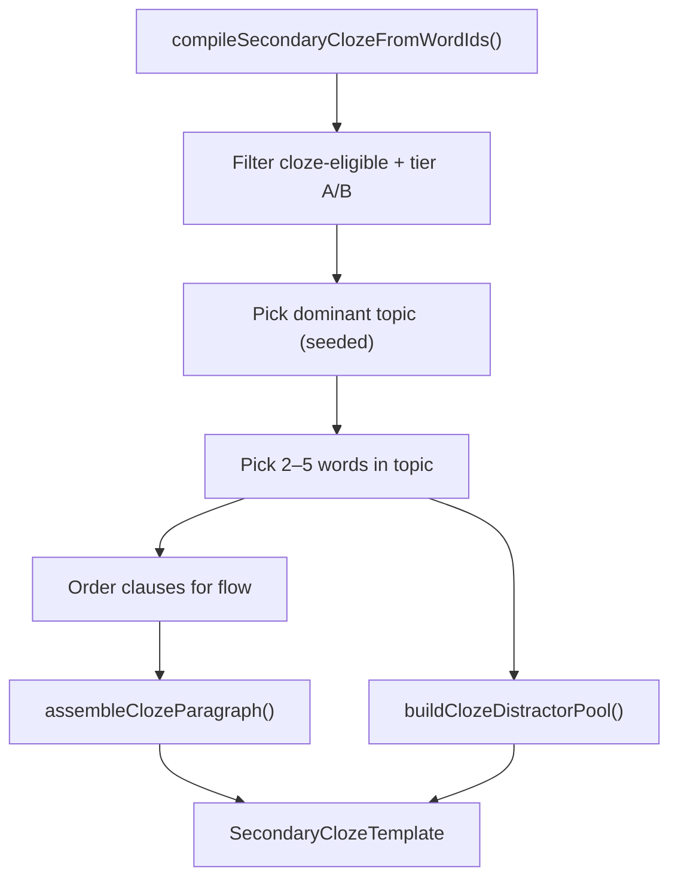

# Proposal: P6B — Secondary cloze compiler v2

**Status:** Implemented (2026-07-09)  
**Prepared:** 2026-07-09  
**Track:** Secondary vocabulary integration — Phase 6B  
**Depends on:** Phases 1–5 ✅ · **P6A** cloze coverage ✅ (100% tier A)  
**Parent:** Phase 6 plan · [QA_P6A_CLOZE_COVERAGE.md](./QA_P6A_CLOZE_COVERAGE.md)  
**Blocks:** Phase 6C (optional polish) · student cloze UX quality sign-off

---

## 1. Executive summary

**P6B** upgrades the dynamic cloze compiler from **v1** (random `sentenceFrame` clauses joined with spaces) to **v2** (topic-coherent mini-paragraphs with connectives and a richer distractor pool).

Phase 6A confirmed **240/240** words have tier **A** `sentenceFrame` values. The content foundation is ready; the remaining gap is **compiler assembly quality**, not bank coverage.

| Deliverable | Student-visible? |
| --- | --- |
| Topic-aware blank selection (same `topicId` when possible) | Yes — paragraph reads as one scene |
| Connective paragraph assembly (`First,` / `Then,` / `Finally,`) | Yes |
| Topic title on cloze card (e.g. "School Life Cloze") | Yes |
| Smarter word bank (distractors + `relatedWords`) | Yes |
| Refactored compiler modules + tests | No |
| `QA_P6B_CLOZE_COMPILER.md` | Engineering |

**Not in P6B:** hand-authored static templates, teacher cloze editor, multi-paragraph stories, listening cloze, Supabase content CMS.

**Effort:** ~2–3 focused sessions  
**Risk:** Low–medium — public API unchanged; main risk is edge cases when today's session spans many topics.

---

## 2. Problem statement (v1)

### 2.1 What v1 does today

```79:86:web/lib/secondary/secondary-cloze-compiler.ts
  const clauses = picked.map(buildClozeClause);
  return {
    id: `cloze-daily-${input.dateKey ?? "session"}`,
    title: "Today's Vocabulary Cloze",
    paragraph: clauses.join(" "),
    blankWordItemIds: picked.map((item) => item.wordItemId),
    distractorWords: collectDistractorWords(picked),
  };
```

| v1 behavior | Student experience |
| --- | --- |
| Seeded shuffle across **all** eligible session words | Blanks may be from unrelated topics |
| Clauses joined with a **single space** | Reads like a list, not a paragraph |
| Generic title **"Today's Vocabulary Cloze"** | No thematic context |
| Distractors from `item.distractors` only (max 6) | Thin word bank for 3–5 blanks |

### 2.2 Example v1 output (illustrative)

> My favorite ____ is science. We looked at a map in ___. I borrowed a book from the ___. The ____ spoke to the students at assembly. We do experiments in ___ class.

Words are fine individually, but the scene jumps (school → library → assembly → lab) because selection ignores `topicId`.

### 2.3 What P6A unlocked

- **100% tier A** — every item has `sentenceFrame` with `___`
- Coverage gate: `secondary-cloze-coverage.test.ts` + `npm run report:secondary-cloze`
- v2 can **require tier A** for picked blanks (fallback to tier B only if pool is thin — unlikely with current pack)

---

## 3. Goals and non-goals

### 3.1 Goals

1. **Topic coherence** — prefer 2–5 blanks from one `topicId` when the session allows.
2. **Readable paragraph** — connectives + punctuation normalization; one flowing passage.
3. **Stable determinism** — same student + date → same paragraph (unchanged seed contract).
4. **Same public API** — `compileSecondaryClozeFromWordIds()` signature and `SecondaryClozeTemplate` shape preserved (additive fields optional).
5. **No activity refactor** — `ClozeActivity.tsx` keeps calling the compiler; repair/scoring unchanged.

### 3.2 Non-goals

| Item | Defer |
| --- | --- |
| AI-generated paragraphs | Never in P6B |
| Cross-sentence anaphora ("He went to the ____") | P6B+ content or v3 |
| `commonChunks` as full narrative glue | Use only as optional connective hints |
| Compiler version flag in UI long-term | Ship v2 as default; keep v1 path only in tests if needed |
| Mastery / evidence changes | None |

---

## 4. Proposed architecture



### 4.1 New modules

| Module | Responsibility |
| --- | --- |
| `secondary-cloze-clause.ts` | `buildClozeClause(item)` — move from compiler; normalize `___` → `____` |
| `secondary-cloze-topic-meta.ts` | `topicTitleForId()`, `listTopicIdsInPool()` from pack |
| `secondary-cloze-paragraph.ts` | Topic pick, clause ordering, connective assembly |
| `secondary-cloze-distractors.ts` | Distractor pool from `distractors`, `relatedWords`, same-topic fillers |
| `secondary-cloze-compiler.ts` | Thin orchestrator — **only** public export surface |

### 4.2 Optional type extension (additive)

```ts
export interface SecondaryClozeTemplate {
  id: string;
  title: string;
  paragraph: string;
  blankWordItemIds: string[];
  distractorWords: string[];
  /** P6B metadata — optional for analytics/debug */
  compilerVersion?: 2;
  topicId?: string;
  topicTitle?: string;
}
```

Consumers that ignore extra fields continue to work.

---

## 5. Algorithm specification

### 5.1 Inputs (unchanged)

```ts
compileSecondaryClozeFromWordIds({
  wordItemIds,      // typically session.allWordItemIds (warmup + focus)
  studentId,
  dateKey,
  minBlanks?,       // default 2
  maxBlanks?,       // default 5
})
```

### 5.2 Step 1 — Eligible pool

1. `filterWordItemIdsForSecondaryActivity(wordItemIds, "cloze")`
2. Resolve items; drop missing
3. **v2 preference:** keep tier **A** only (`classifySecondaryClozeTier === "A"`)
4. If tier A count `< minBlanks`, widen to tier **A + B** (safety valve)
5. If still `< minBlanks`, return `null` (same as v1)

### 5.3 Step 2 — Topic selection

Build `Map<topicId, SecondaryVocabItem[]>` from eligible pool.

| Case | Rule |
| --- | --- |
| One topic has **≥ minBlanks** items | Candidate topics |
| Multiple qualify | Seeded pick: `shuffleWithSeed(candidates, `${seed}:topic`)` [0] |
| None qualify (session is scattered) | **Fallback A:** take top 2 topics by count, pick `ceil(minBlanks/2)` from each |
| Still insufficient | **Fallback B:** v1-style global shuffle (last resort; should be rare) |

**Constants:**

```ts
export const SECONDARY_CLOZE_MAX_TOPICS_IN_PARAGRAPH = 2;
```

### 5.4 Step 3 — Blank selection within topic

```ts
const seed = `${studentId ?? "secondary"}:${dateKey ?? "daily"}:cloze`;
const picked = shuffleWithSeed(topicItems, `${seed}:words`).slice(0, maxBlanks);
```

- Require `picked.length >= minBlanks`
- Sort picked for display order:
  1. Lower `difficulty` first (scaffold easy → harder), tie-break `wordItemId`

### 5.5 Step 4 — Paragraph assembly

**Connective table** (index → prefix):

| Index | Prefix |
| --- | --- |
| 0 | `""` (clause stands alone; capitalize first letter of paragraph) |
| 1 | `"Then "` |
| 2 | `"Also, "` |
| 3 | `"Next, "` |
| 4 | `"Finally, "` |

**Per clause:**

1. `buildClozeClause(item)` from `sentenceFrame`
2. Strip leading connective if frame already has one (dedupe)
3. Ensure clause ends with `.` `!` or `?`
4. Prefix connective when index > 0
5. Join with single space

**Title:**

```ts
title = `${topicTitleForId(topicId)} Cloze`;
// e.g. "School Life Cloze"
// mixed-topic fallback: "Today's Vocabulary Cloze"
```

**Template id:**

```ts
id = `cloze-daily-v2-${dateKey ?? "session"}`;
```

### 5.6 Step 5 — Distractor pool

**Sources (priority order):**

1. Correct answer words (always included)
2. `item.distractors` from picked items
3. `item.relatedWords` from picked items
4. Same-topic **non-picked** eligible words from session pool (same POS when possible)
5. Cap at **8** unique words (case-insensitive dedupe)

**Reject:**

- Empty strings
- Duplicates of correct answers (already in blank list)
- Words not in Latin alphabet (optional — skip if non-matching `/^[a-z'-]+$/i`)

### 5.7 Determinism contract

| Output | Seed component |
| --- | --- |
| Topic choice | `{baseSeed}:topic` |
| Word pick | `{baseSeed}:words` |
| Distractor order | Stable sort by word after set build |

Same `studentId` + `dateKey` + same `wordItemIds` → identical template (regression requirement).

---

## 6. UI impact

| Surface | Change |
| --- | --- |
| `ClozeActivity.tsx` | None required — consumes `template.paragraph` / `blankWordItemIds` |
| `ClozeActivity.tsx` *(optional polish)* | Show `template.topicTitle` under H2: *"School Life · 4 blanks"* |
| `SecondaryHome.tsx` | None — availability check still `compileSecondaryClozeFromWordIds(...) !== null` |
| Locked cloze copy | Unchanged |

---

## 7. Phased delivery (within P6B)

### 7.1 P6B-a — Refactor + topic pick (~1 session)

- [ ] Extract `secondary-cloze-clause.ts`
- [ ] Extract `secondary-cloze-topic-meta.ts`
- [ ] Topic-grouped blank selection
- [ ] Title from topic
- [ ] `compilerVersion: 2` on output
- [ ] Update existing compiler tests

### 7.2 P6B-b — Paragraph + distractors (~1 session)

- [ ] `secondary-cloze-paragraph.ts` connectives
- [ ] `secondary-cloze-distractors.ts`
- [ ] Mixed-topic fallback
- [ ] New unit tests (paragraph + distractors)

### 7.3 P6B-c — QA + docs (~0.5 session)

- [ ] `QA_P6B_CLOZE_COMPILER.md` manual checklist
- [ ] Update `SECONDARY_SESSION_SELECTION.md` cloze section
- [ ] Spot-check 5 seeds in dev `/secondary/cloze`

**Can ship as one PR** if preferred; sub-phases are for review granularity only.

---

## 8. Test plan

### 8.1 Unit tests

| File | Cases |
| --- | --- |
| `secondary-cloze-clause.test.ts` | Frame normalization; tier A/B clause build |
| `secondary-cloze-paragraph.test.ts` | Connective prefixes; capitalization; period ensure |
| `secondary-cloze-distractors.test.ts` | Dedupe; cap 8; includes relatedWords |
| `secondary-cloze-compiler.test.ts` | **Update:** title is topic-based when pool allows; `id` contains `v2`; determinism; same-topic blanks when pool has ≥2 in one topic |

**Fixture strategy:** build synthetic `SecondaryVocabItem[]` inline (no pack mutation) for topic coherence cases; keep full-pack smoke test.

### 8.2 Integration scenarios

| # | Session shape | Expected |
| --- | --- | --- |
| 1 | 8 words, all `school-life` | Title "School Life Cloze"; all blanks school-life |
| 2 | 13 words, 4+ topics represented | Dominant topic wins OR 2-topic fallback |
| 3 | 2 cloze-eligible words only | Minimum 2 blanks; paragraph compiles |
| 4 | 1 cloze-eligible word | `null`; home shows locked cloze |
| 5 | Same student+date twice | Byte-identical template |

### 8.3 Regression

```bash
npx vitest run lib/secondary/secondary-cloze-*.test.ts
npx vitest run lib/secondary/
npm run report:secondary-cloze
```

### 8.4 Manual QA (`QA_P6B_CLOZE_COMPILER.md`)

1. Open `/secondary/cloze` with a typical day — paragraph reads as one scene, not a list
2. Word bank has ≥ blank count distractors
3. Complete cloze — scoring unchanged
4. Change system date — new paragraph, new blanks
5. Two accounts same day — different paragraphs (seed isolation)

---

## 9. Risks and mitigations

| Risk | Mitigation |
| --- | --- |
| Today's session spans many topics (S2 spread) | Dominant-topic pick + 2-topic fallback; rare all-scatter → v1 shuffle fallback |
| `sentenceFrame` clauses don't flow even within topic | Connectives + ordering by difficulty; future content pass for narrative frames |
| Distractor pool too easy/hard | Pull from same-topic session words + item distractors |
| Breaking determinism during refactor | Lock seed tests before merge |
| Scope creep into static templates | Explicit non-goal; v2 is compiler-only |

---

## 10. Success metrics

| Metric | Target |
| --- | --- |
| Cloze available rate | ≥ same as v1 on simulated 1000 random 13-word sessions |
| Same-topic blank share | ≥ **80%** of blanks when dominant topic has ≥3 eligible words |
| Manual readability | ESL sign-off on 5 compiled paragraphs |
| Test coverage | All new modules have ≥3 unit tests each |
| Zero regressions | `lib/secondary/` full suite green |

---

## 11. Open questions (for approval)

| # | Question | Recommendation |
| --- | --- | --- |
| Q1 | Ship v2 as **default** immediately, or `?clozeV2=1` gate for one week? | **Default immediately** — v1 is strictly weaker |
| Q2 | Max **one topic** only, or allow **two-topic** fallback? | **Two-topic fallback** when no single topic has ≥2 blanks |
| Q3 | Order blanks by **difficulty** or **seed order**? | **Difficulty ascending** (easier first) |
| Q4 | Add optional `topicTitle` subtitle in `ClozeActivity`? | **Yes** — low-cost UX win |
| Q5 | Keep v1 implementation for A/B in tests? | **Remove from production path**; keep regression fixture if needed |
| Q6 | Distractor cap **8** or **10**? | **8** (fits mobile word-bank row) |

---

## 12. Definition of done (P6B)

- [ ] `compileSecondaryClozeFromWordIds` produces topic-titled, connective paragraphs
- [ ] Blanks prefer single `topicId`; documented fallback paths
- [ ] Distractor pool uses `distractors` + `relatedWords` + same-topic fillers
- [ ] Determinism tests pass
- [ ] `ClozeActivity` works without code changes (optional subtitle OK)
- [ ] `QA_P6B_CLOZE_COMPILER.md` written
- [ ] `npx vitest run lib/secondary/` green

---

## 13. What comes after P6B

| Track | Next |
| --- | --- |
| **6C** | Content ops pipeline (pack bump script, release checklist) |
| **6D** | Teacher vocabulary lens (topic filter on T2) |
| **6E** | Class topic heatmap (T3 overlap) |
| **Content** | Narrative `sentenceFrame` sets that share a character/setting (optional v3) |

---

## 14. Approval

| Role | Approve P6B? | Notes |
| --- | --- | --- |
| Product / curriculum | ☐ | |
| Engineering | ☐ | |

**Approve sub-phases:**

| Sub-phase | Approve? |
| --- | --- |
| P6B-a Refactor + topic pick | ☐ |
| P6B-b Paragraph + distractors | ☐ |
| P6B-c QA + docs | ☐ |

---

## 15. Cursor implementation prompt (post-approval)

> Implement P6B-a and P6B-b: refactor `secondary-cloze-compiler.ts` into clause/topic/paragraph/distractor modules. Topic-coherent blank selection with two-topic fallback. Connective paragraph assembly. Smarter distractor pool. Keep `compileSecondaryClozeFromWordIds` API stable. Add tests. Optional `topicTitle` subtitle in `ClozeActivity`. Do not change mastery or session selection.
