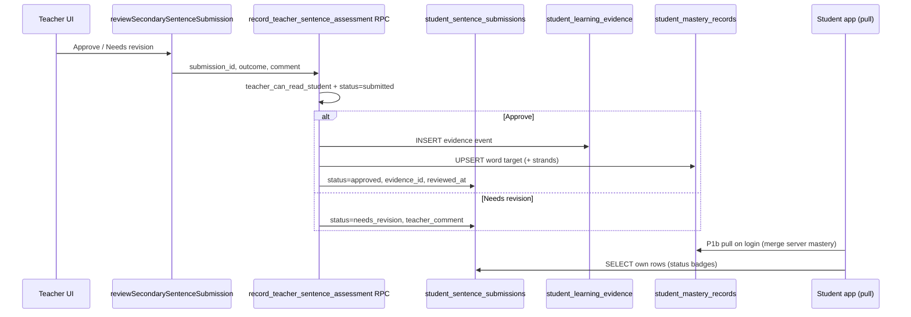

# Proposal: P7B — Teacher sentence review + mastery emit

**Status:** Implemented (2026-07-10)  
**Prepared:** 2026-07-10  
**Track:** P7 Secondary production lane — Phase 2 of 3 (teacher path)  
**Depends on:** P7A ✅ (`029_student_sentence_submissions.sql`, `SentenceActivity`, submit action) · T0 ✅ · T1/T2 ✅ · P1 sync ✅  
**Parent:** [PROPOSAL_P7_SECONDARY_SENTENCE_PRODUCTION.md](./PROPOSAL_P7_SECONDARY_SENTENCE_PRODUCTION.md)  
**Blocks:** P7C (resubmit + QA) · Meaning-Focused Output evidence in production · first teacher → mastery write path

---

## 1. Executive summary

**P7A** lets students submit sentences; rows sit in `student_sentence_submissions` with `status = submitted` and **no mastery change**.

**P7B** gives enrolled teachers a **review workflow** in the existing teacher hub:

- See **pending sentence count** per class and per student  
- **Approve** or **Request revision** (with optional comment)  
- On **approve only**: write `student_learning_evidence` + upsert `student_mastery_records` on the server (`secondary:sentence`, `production` evidence)

This is the product’s **first server-origin mastery write** — teachers assess a concrete artifact; they do not edit arbitrary mastery scores.

| Deliverable | Student-visible? | Teacher-visible? |
| --- | --- | --- |
| Migration `030` — teacher RLS + assessment RPC | No | — |
| `lib/mastery/teacher-sentence-assessment.ts` | No | — |
| `lib/data/teacher-sentence-submissions.ts` | No | — |
| Class roster — pending sentences column/badge | — | Yes |
| Student diagnostic — **Writing** tab | Read-only status (optional thin slice) | Yes |
| Server action `reviewSecondarySentenceSubmission` | — | Yes |
| Bridge doc update | No | — |
| `QA_P7B_TEACHER_SENTENCE_REVIEW.md` | Engineering | Engineering |

**Not in P7B:** resubmit UI (P7C), dismiss/spam, email notifications, grammar tags, batch approve-all, standalone `/teacher/reviews` inbox.

**Effort:** ~1.5–2 focused sessions  
**Risk:** Medium — RPC must be enrollment-scoped, idempotent, and use the same mastery engine rules as the client.

---

## 2. Problem after P7A

| Gap | Impact |
| --- | --- |
| Submissions accumulate with `status = submitted` | Teachers cannot see or act on student writing |
| No teacher SELECT/UPDATE on submissions | RLS blocks teacher reads (student-only policies in `029`) |
| Mastery never updates from sentence work | Production strand unchanged; student pull has nothing new |
| T2 diagnostic has no writing surface | Teachers must use Supabase console to read sentences |
| Voice submission precedent has no review UI | P7B establishes the first teacher review pattern for student output |

---

## 3. Product decisions (proposed — please approve)

| # | Decision | Recommendation | Alternatives |
| --- | --- | --- | --- |
| B1 | **Review surfaces** | Class roster badge + student **Writing** tab (extends T2) | Standalone inbox page first |
| B2 | **Actions in P7B** | Approve · Needs revision (+ optional comment) | Add Dismiss in P7B |
| B3 | **Mastery on approve** | `success: true`, `evidenceMode: production`, `activityId: secondary:sentence` | Also emit miss on needs_revision |
| B4 | **Evidence `source`** | Reuse `teacher_assigned` (existing enum) | Add new `teacher_assessment` enum value |
| B5 | **Write path** | Security-definer RPC + thin server action wrapper | Direct teacher INSERT on mastery tables |
| B6 | **Student status visibility** | **Thin slice:** student can read own submission status (approved / needs revision) on Sentence activity summary — **no resubmit yet** | Fully hidden until P7C |
| B7 | **Needs revision without resubmit** | Teacher can mark revision; student sees comment read-only; **resubmit button = P7C** | Block needs_revision until P7C |
| B8 | **Idempotency** | Re-approve same submission returns success, no duplicate evidence | Allow double evidence |
| B9 | **Class pending count** | Count `submitted` rows for students on roster only | Global teacher pending across all students |

**Copy (teacher):**

- Approve: *“Mark this sentence as good use of the word.”*  
- Needs revision: *“Send back with a short note. The student will see your comment.”*

---

## 4. Goals and non-goals

### 4.1 In scope

1. **Database**
   - Teacher SELECT on `student_sentence_submissions` (enrollment-scoped)
   - RPC `record_teacher_sentence_assessment` (security definer)
   - No direct teacher INSERT on `student_mastery_records` / `student_learning_evidence`

2. **Mastery module**
   - Pure functions: build evidence event, apply to records (reuse `applyEvidenceToMasteryRecords`)
   - Server persistence: insert evidence row + upsert affected mastery rows

3. **Teacher data API**
   - `getPendingSentenceCountsForClass(classId)`
   - `getSentenceSubmissionsForStudent(classId, studentId, filter?)`
   - Guards: teacher owns class, student on roster

4. **Teacher UI**
   - `ClassRosterTable`: pending sentences signal per student + class total in header
   - `StudentDiagnosticTabs`: new **Writing** tab with review table + inline actions
   - `SentenceSubmissionReviewPanel` components

5. **Server action**
   - `reviewSecondarySentenceSubmission({ submissionId, outcome, comment? })`
   - Calls RPC; revalidates teacher pages

6. **Student thin slice (B6)**
   - `getMySentenceSubmissionsForDate(dateKey)` — read own rows
   - `SentenceActivity` complete view shows Approved / Needs revision / Waiting per word

7. **Docs + QA**
   - Update `SECONDARY_TO_PLATFORM_MASTERY_BRIDGE.md` § sentence (teacher approve path)
   - `QA_P7B_TEACHER_SENTENCE_REVIEW.md`

### 4.2 Out of scope (P7C / later)

| Item | Phase |
| --- | --- |
| Resubmit after needs_revision | P7C |
| `supersedes_id` chain on resubmit | P7C |
| Dismiss / supersede spam submissions | P7C |
| Join-class CTA for unenrolled submitters | P7C |
| Email / push notifications | Post-P7 |
| Grammar `errorCode` on needs_revision | P7E |
| Batch approve class | Defer |
| Edit sentence text after submit | Never |

---

## 5. Architecture

### 5.1 End-to-end flow



### 5.2 Layer map

| Layer | Path | Role |
| --- | --- | --- |
| Migration | `supabase/migrations/030_teacher_sentence_review.sql` | RLS + RPC |
| Evidence builder | `lib/mastery/teacher-sentence-assessment.ts` | Pure: event + record apply |
| Server action | `lib/actions/teacher-sentence-review.ts` | Auth guard → RPC |
| Teacher queries | `lib/data/teacher-sentence-submissions.ts` | Class/student queues |
| Student read | `lib/actions/student-sentence.ts` (extend) | `getMySentenceSubmissionsForDate` |
| UI — class | `components/teacher/ClassRosterTable.tsx`, class page header | Pending badges |
| UI — student | `components/teacher/sentence/SentenceReviewTable.tsx` | Review + actions |
| UI — diagnostic | `components/teacher/mastery/StudentDiagnosticTabs.tsx` | Writing tab |
| UI — student | `components/secondary/SentenceActivity.tsx` | Status badges (B6) |
| Bridge | `secondary-mastery-bridge.ts` | Add `buildTeacherSentenceEvidenceEvent` helper or parallel in mastery module |
| Bundle | `lib/data/teacher-mastery.ts` | Optional: include pending sentence count in `needsAttention` |

### 5.3 Evidence shape (on approve)

| Field | Value |
| --- | --- |
| `activityId` | `secondary:sentence` |
| `source` | `teacher_assigned` |
| `evidenceMode` | `production` |
| `response.kind` | `type` |
| `response.success` | `true` |
| `response.firstTry` | `true` (teacher approval = single adjudication) |
| `response.attempts` | `1` |
| `sessionId` | `secondary:{date_key}` |
| `itemId` | submission `uuid` |
| `targetRefs` | `word:{word_item_id}` + strand refs via `vocabularyStrandsForPractice` |
| `context.scaffoldingLevel` | `low` (teacher judged final output) |
| `context.activityMode` | `assessment` |
| `id` | `secondary:{date_key}:{submission_id}:teacher-approve` |

**Needs revision:** no evidence row; submission status + comment only.

### 5.4 Server mastery apply (critical design)

**Problem:** Client path uses `recordVocabularyEvidence` → `localStorage` → P1c push. Teacher path must write **directly to Supabase** for the **student’s** `student_id`.

**Solution:**

```typescript
// lib/mastery/teacher-sentence-assessment.ts (pure)
export function buildTeacherSentenceApprovalEvidence(input: {...}): LearningEvidenceEvent
export function applyTeacherSentenceApprovalToRecords(
  records: Record<string, StudentMasteryRecord>,
  evidence: LearningEvidenceEvent,
): Record<string, StudentMasteryRecord>

// RPC (SQL or plpgsql calling nothing — prefer TS in server action + SQL transaction)
```

**Recommended split:**

| Step | Where |
| --- | --- |
| Build event + apply records | TypeScript (`applyEvidenceToMasteryRecords` from `engine.ts`) |
| Transaction | Server action with service role **or** RPC that receives pre-built JSON **or** RPC in plpgsql duplicating rules (avoid) |

**Preferred:** Server action flow:

1. Teacher auth + enrollment guards (TypeScript)  
2. Fetch submission row; verify `status = 'submitted'`  
3. If `needs_revision`: `UPDATE` submission only  
4. If `approve`:
   - Load student’s existing mastery rows for affected `target_key`s (teacher SELECT via RLS)
   - `applyEvidenceToMasteryRecords` in TS
   - `INSERT` evidence + `UPSERT` mastery rows via teacher’s supabase client **only if** RPC runs as security definer

Because teachers cannot INSERT into `student_learning_evidence` today, **use security-definer RPC** that:

- Validates teacher + enrollment inside RPC  
- Accepts `outcome` + `comment` only (not arbitrary evidence JSON)  
- Calls internal SQL functions OR the server action uses `createClient` with service role for the write step

**Pragmatic v1:** Server action + **single security-definer RPC** `record_teacher_sentence_assessment(submission_id, outcome, comment)` implemented in **plpgsql** that:

1. Locks submission row  
2. Validates teacher  
3. On approve: builds minimal evidence JSON in SQL **or** invokes edge function — **simpler: do mastery math in TypeScript inside server action with elevated client**

Check if project has service role server client...

Actually T0 uses security-definer RPC for `join_class_by_code`. Pattern for P7B:

**Option A (recommended):** RPC wraps all writes; TypeScript helpers tested in vitest generate the evidence payload passed as `jsonb` — RPC validates and inserts (trust but verify shape).

**Option B:** Server action uses Supabase service role for insert only after guards — fewer SQL lines, requires service role env in app.

I'll recommend **Option A lite**: Server action performs guards + evidence building in TS; RPC `record_teacher_sentence_assessment` receives `evidence jsonb` + `mastery_records jsonb[]` pre-computed — RPC only validates teacher and writes. **Risk:** RPC must not trust arbitrary records.

**Better Option C:** RPC takes only `(submission_id, outcome, comment)`; **all evidence logic in plpgsql** — duplicates engine (bad).

**Best Option D:** RPC takes `(submission_id, outcome, comment)`; server action runs as **postgres function calling out** — not available.

**Ship Option E (recommended for this codebase):**

1. `reviewSecondarySentenceSubmission` server action (teacher auth)  
2. `assertTeacherCanReadStudent(studentId)` (reuse T1 pattern)  
3. Fetch submission + student mastery rows via teacher-scoped SELECT  
4. Build evidence + apply records in **TypeScript** (`teacher-sentence-assessment.ts`)  
5. Call RPC `apply_teacher_sentence_assessment_writes(submission_id, outcome, comment, evidence jsonb, records jsonb)` — security definer, verifies teacher, inserts evidence + upserts records + updates submission atomically  

RPC rejects if submission not `submitted` or teacher not enrolled.

---

## 6. Database changes (`030_teacher_sentence_review.sql`)

### 6.1 RLS — teacher read

```sql
create policy "student_sentence_submissions_teacher_select_enrolled"
  on public.student_sentence_submissions for select
  to authenticated
  using (public.teacher_can_read_student(student_id));
```

No teacher direct UPDATE policy — mutations go through RPC only.

### 6.2 RPC signature

```sql
create or replace function public.record_teacher_sentence_assessment(
  p_submission_id uuid,
  p_outcome text,  -- 'approve' | 'needs_revision'
  p_comment text default null
)
returns jsonb
language plpgsql
security definer
set search_path = public
as $$
  -- 1. Load submission; 2. assert teacher_can_read_student; 3. assert status = 'submitted'
  -- 4. Branch approve vs needs_revision
  -- 5. On approve: require p_evidence and p_records passed from app OR compute via helper
$$;
```

**Revised signature (atomic TS-built payload):**

```sql
record_teacher_sentence_assessment(
  p_submission_id uuid,
  p_outcome text,
  p_comment text,
  p_evidence jsonb,          -- null when needs_revision
  p_mastery_records jsonb    -- array of record objects; null when needs_revision
)
```

RPC validates:

- `p_outcome in ('approve', 'needs_revision')`  
- `char_length(coalesce(p_comment, '')) <= 500`  
- On approve: `p_evidence` and `p_mastery_records` not null; `evidence->>'studentId' = submission.student_id`  
- Idempotent: if already `approved`, return `{ ok: true, alreadyReviewed: true }`

### 6.3 Grants

```sql
grant execute on function public.record_teacher_sentence_assessment(...) to authenticated;
```

---

## 7. Teacher UI specification

### 7.1 Class page (`/teacher/classes/[classId]`)

**Header summary (below student count):**

> **N sentences waiting for review** (link scrolls to roster or filters Writing tab)

**Roster table — new column: `Writing`**

| Cell | Content |
| --- | --- |
| Pending | Amber badge `3 pending` |
| None | `—` |
| Link | Click student name → diagnostic Writing tab |

Data: `getPendingSentenceCountsForClass(classId)` → `Record<studentId, number>` + total.

### 7.2 Student diagnostic — Writing tab

**Route:** existing `/teacher/classes/[classId]/students/[studentId]` — add tab **Writing** (5th tab or after Vocabulary).

**Table columns:**

| Word | Sentence | Submitted | Status | Actions |
| --- | --- | --- | --- | --- |
| *subject* (resolved label) | student text | relative date | Submitted / Approved / Needs revision | Approve · Revise |

**Default filter:** `submitted` first, then recent 14 days history.

**Review row actions:**

- **Approve** — primary button; optional confirm if sentence looks empty/gibberish  
- **Request revision** — opens inline textarea (max 500 chars) + Submit  

**After action:** optimistic disable; `router.refresh()` or revalidate.

**Empty state:** *“No sentence submissions yet. Students submit from Secondary → Sentence activity.”*

### 7.3 Word label resolution

Reuse T2 pattern: `parseWordIdFromTargetKey` / vocab bank lookup in `teacher-mastery-display` style helper:

`resolveSecondaryWordLabel(wordItemId)` → `{ word, meaningEn }` from `getSecondaryVocabItemById`.

---

## 8. Student UI (thin slice — B6)

### 8.1 Sentence activity — complete state

For each word on the summary list, show:

| DB status | UI |
| --- | --- |
| `submitted` | Waiting for teacher review |
| `approved` | Approved by teacher |
| `needs_revision` | Needs revision — show `teacher_comment` if present |
| (no row) | Not submitted |

**Data:** extend `getMySentenceSubmissionsForDate(dateKey)` in `student-sentence.ts` (server action or RLS select).

**No resubmit button** in P7B — copy: *“Your teacher asked for a revision. Updated resubmit coming soon.”* or defer comment display only.

### 8.2 Mastery refresh

Student mastery updates when:

1. Student logs in / session refresh triggers P1b pull  
2. Optional P7B stretch: after student opens `/secondary`, call `pullMasteryFromServer` if last pull &gt; N minutes  

Recommend **document in QA** — approve on device A, student sees mastery on device B after login refresh.

---

## 9. Work packages

### 9.1 P7B-1 — Database (~2h)

| Task | File |
| --- | --- |
| Teacher SELECT policy | `030_teacher_sentence_review.sql` |
| Assessment RPC | same |
| Grant execute | same |

### 9.2 P7B-2 — Mastery module (~3h)

| Task | File |
| --- | --- |
| `buildTeacherSentenceApprovalEvidence()` | `lib/mastery/teacher-sentence-assessment.ts` |
| `applyTeacherSentenceApprovalToRecords()` | same (wraps `applyEvidenceToMasteryRecords`) |
| `buildMasteryUpsertPayload()` | uses `masteryRecordToRow`, `evidenceEventToRow` |
| Unit tests | `lib/mastery/teacher-sentence-assessment.test.ts` |

### 9.3 P7B-3 — Server actions + data (~3h)

| Task | File |
| --- | --- |
| `reviewSecondarySentenceSubmission` | `lib/actions/teacher-sentence-review.ts` |
| `getPendingSentenceCountsForClass` | `lib/data/teacher-sentence-submissions.ts` |
| `getSentenceSubmissionsForStudent` | same |
| `getMySentenceSubmissionsForDate` | `lib/actions/student-sentence.ts` |
| Enrollment guards | reuse `assertTeacherOwnsClass` / roster membership |

### 9.4 P7B-4 — Teacher UI (~4h)

| Task | File |
| --- | --- |
| `SentenceReviewTable.tsx` | `components/teacher/sentence/` |
| `SentenceReviewActions.tsx` | same |
| Writing tab in diagnostic | `StudentDiagnosticTabs.tsx` |
| Load submissions in bundle | `teacher-mastery.ts` or parallel fetch on page |
| Roster pending column | `ClassRosterTable.tsx` |
| Class header total | `classes/[classId]/page.tsx` |

### 9.5 P7B-5 — Student status + docs (~2h)

| Task | File |
| --- | --- |
| Status badges on complete view | `SentenceActivity.tsx` |
| Bridge doc § teacher approve | `SECONDARY_TO_PLATFORM_MASTERY_BRIDGE.md` |
| QA checklist | `QA_P7B_TEACHER_SENTENCE_REVIEW.md` |
| Update parent proposal | `PROPOSAL_P7_SECONDARY_SENTENCE_PRODUCTION.md` status |

---

## 10. Testing strategy

### 10.1 Automated

| Area | File / command |
| --- | --- |
| Evidence builder | `teacher-sentence-assessment.test.ts` |
| Production mode + strands | assert `evidenceMode: production`, strand refs present |
| Idempotent approve | mock RPC twice → one evidence id |
| Regression | `npx vitest run lib/mastery/teacher-sentence-assessment.test.ts lib/secondary/` |

### 10.2 Manual (`QA_P7B_TEACHER_SENTENCE_REVIEW.md`)

| # | Scenario | Expected |
| --- | --- | --- |
| M1 | Teacher A views class roster | Pending count only for enrolled students with submissions |
| M2 | Teacher B (not enrolled) | Cannot see student submissions (0 rows / notFound) |
| M3 | Approve submission | `status=approved`, evidence row, mastery upsert for `word:{id}` |
| M4 | Re-click Approve | Idempotent; no duplicate evidence |
| M5 | Needs revision + comment | `status=needs_revision`, comment stored, **no** evidence |
| M6 | Student views sentence summary | Sees Waiting / Approved / Needs revision |
| M7 | Student login after approve | Mastery pull shows updated word score |
| M8 | Match/cloze/spelling | Unchanged |

**Setup:** Two teacher accounts, one class, one student enrolled; migration `030` applied.

---

## 11. Security checklist

| Check | Mitigation |
| --- | --- |
| Teacher reads non-enrolled student | `teacher_can_read_student` on SELECT |
| Teacher writes arbitrary mastery | RPC only; payload tied to `submission_id` |
| Student impersonates teacher approve | RPC checks `is_teacher()` + enrollment |
| SQL injection via comment | Length limit + parameterized queries |
| XSS via student sentence in teacher UI | React escape default; no `dangerouslySetInnerHTML` |
| Double approve race | Row lock in RPC or `status` check in transaction |

---

## 12. Risks and mitigations

| Risk | Mitigation |
| --- | --- |
| Engine drift (TS vs historical client writes) | Single `applyEvidenceToMasteryRecords` import; shared tests |
| Student local stale until pull | QA step M7; optional pull on secondary layout (stretch) |
| Teacher backlog | Pending badges; pilot one class |
| Needs revision without resubmit feels stuck | B6 shows comment; P7C adds resubmit quickly after |
| RPC complexity | Thin RPC; heavy logic in tested TS |

---

## 13. Definition of Done (P7B)

| Criterion | Verified by |
| --- | --- |
| Migration `030` applied | Supabase |
| Teacher sees pending counts on class roster | M1 |
| Writing tab loads submissions | Manual |
| Approve writes evidence + mastery | M3, SQL inspect |
| Needs revision does not write mastery | M5 |
| Student sees status badges | M6 |
| `teacher-sentence-assessment.test.ts` green | CI / local |
| QA doc executed once | Sign-off |
| P7C **not** started | Scope |

---

## 14. Approval checklist

| # | Item | Approve? |
| --- | --- | --- |
| C1 | **P7B overall** — teacher review + mastery on approve | ☐ Yes / ☐ No |
| C2 | **B1** — Class roster + student Writing tab (not standalone inbox) | ☐ Yes / ☐ No |
| C3 | **B2** — Approve + Needs revision only (no Dismiss yet) | ☐ Yes / ☐ No |
| C4 | **B3** — Mastery **only** on approve | ☐ Yes / ☐ No |
| C5 | **B4** — Use `source: teacher_assigned` | ☐ Yes / ☐ Use new enum |
| C6 | **B6** — Student read-only status badges in P7B | ☐ Yes / ☐ Defer to P7C |
| C7 | **B7** — Resubmit deferred to P7C | ☐ Yes / ☐ No |
| C8 | **RPC + TS evidence builder** write path (§5.4 Option E) | ☐ Yes / ☐ Prefer service role only |

**Approver:** _______________  
**Date:** _______________

---

## 15. Post-approval implementation order

1. `030` migration + apply to Supabase  
2. `teacher-sentence-assessment.ts` + tests  
3. `teacher-sentence-review.ts` action + `teacher-sentence-submissions.ts` data  
4. Writing tab + review components  
5. Class roster pending column  
6. Student status thin slice (if C6 approved)  
7. QA pass  

**Cursor kickoff prompt (after approval):**

```
Implement P7B per PROPOSAL_P7B_TEACHER_SENTENCE_REVIEW.md:

1. Migration 030: teacher SELECT policy + record_teacher_sentence_assessment RPC
2. lib/mastery/teacher-sentence-assessment.ts + tests
3. lib/actions/teacher-sentence-review.ts + lib/data/teacher-sentence-submissions.ts
4. Writing tab on student diagnostic + SentenceReviewTable
5. Class roster pending sentence badges
6. If C6 approved: student status on SentenceActivity complete view
7. QA_P7B_TEACHER_SENTENCE_REVIEW.md + bridge doc update

Do not implement P7C resubmit yet.
Do not commit unless asked.
```

---

## 16. Related files (P7A baseline)

| Artifact | Path |
| --- | --- |
| Submissions table | `supabase/migrations/029_student_sentence_submissions.sql` |
| Student submit | `lib/actions/student-sentence.ts` |
| Sentence activity | `components/secondary/SentenceActivity.tsx` |
| Teacher diagnostic | `app/teacher/(secure)/classes/[classId]/students/[studentId]/page.tsx` |
| Enrollment helper | `teacher_can_read_student()` in `027_teacher_mastery_read.sql` |
| Mastery engine | `lib/mastery/engine.ts` |
| Row mappers | `lib/mastery/supabase-rows.ts` |
