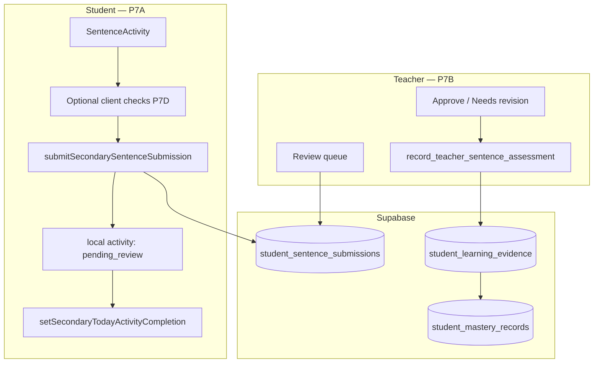

# Proposal: P7 — Secondary sentence production (teacher-mediated)

**Status:** P7A–P7C implemented (2026-07-10) · P7D implemented (2026-07-10) — [PROPOSAL_P7D_SENTENCE_CLIENT_CHECKS.md](./PROPOSAL_P7D_SENTENCE_CLIENT_CHECKS.md)  
**Prepared:** 2026-07-10  
**Track:** P7 Secondary production lane — teacher review → mastery  
**Depends on:** L5 learn lane ✅ · Secondary session v3 ✅ · P1 sync ✅ · T0 classes ✅ · T1/T2 teacher reads ✅  
**Parent:** [SECONDARY_TO_PLATFORM_MASTERY_BRIDGE.md](./SECONDARY_TO_PLATFORM_MASTERY_BRIDGE.md) · [adaptive-learning-architecture-plan.md](../adaptive-learning-architecture-plan.md)  
**Blocks:** Meaning-Focused Output strand balance · first teacher → mastery write path · optional P7D auto-hints later

---

## 1. Executive summary

**P7** adds a **fourth secondary daily activity**: students **write a sentence** using each target word and **submit for teacher review**. Teachers approve or request revision in the **teacher hub**; **mastery evidence is emitted only on teacher approval** — not on submit.

This avoids building a grammar engine or LLM grader for v1 while delivering authentic **production** practice aligned with Paul Nation’s Meaning-Focused Output strand.

| Phase | Deliverable | Student-visible? | Teacher-visible? |
| --- | --- | --- | --- |
| **P7A** | Sentence activity + Supabase submit + “sent for review” completion | Yes | No |
| **P7B** | Review queue + approve / needs revision + mastery emit | Status only | Yes |
| **P7C** | Resubmit loop + class pending badges + QA signoff | Yes | Yes |
| **P7D** (optional) | Light client checks (word present, basic validity) | Yes | — |

**Not in P7:** real-time grammar checking, LLM feedback, speech-to-text, teacher arbitrary mastery editing, parent portal.

**Effort:** P7A ~1 session · P7B ~1–2 sessions · P7C ~0.5 session · **total ~2.5–4 sessions**  
**Risk:** Medium — first **server-origin** mastery write for students; RLS and enrollment scoping must be tight.

---

## 2. Problem

| Gap today | Impact |
| --- | --- |
| Secondary lane ends at **recall** (spelling/cloze) | No structured **production** practice in daily loop |
| `sentence_builder` in pack metadata | Tagged on many words but **no activity route** |
| `evidenceMode: "production"` | Engine supports it; secondary emitters don’t use it |
| Auto grammar grading | No runtime grader; building one delays ship by weeks |
| Teacher voice submissions | Pattern exists (`student_voice_submissions`) but **no teacher review UI** and RLS is global `is_teacher()` |
| T1/T2 teacher mastery | **Read-only**; “teacher assess output → mastery” marked Future |

Students need to **use** vocabulary in original sentences. Teachers need to **see** that output and **validate** it — especially at A2 in a classroom center.

---

## 3. Product decisions (proposed — please approve)

| # | Decision | Recommendation | Alternatives |
| --- | --- | --- | --- |
| D1 | **Daily activity position** | 4th step after Spelling: Match → Cloze → Spelling → **Sentence** | Optional stretch activity (not in daily chain) |
| D2 | **Completion meaning** | Activity complete when all eligible words **submitted** (pending teacher review) | Complete only after teacher approves all |
| D3 | **Mastery timing** | Evidence **only on teacher approve** | Weak evidence on submit + strong on approve |
| D4 | **Auth required** | Logged-in student only (enrolled in ≥1 class for teacher visibility) | Guest submit with local-only queue |
| D5 | **UI pattern** | Sequential one word at a time (like Spelling) | Batch all words then submit |
| D6 | **Client validation** | P7A: none beyond non-empty; P7D: word-present + basic validity | Full grammar in client |
| D7 | **Teacher surface** | Class pending count + student diagnostic **Writing** tab | Standalone `/teacher/reviews` inbox first |
| D8 | **Revision flow** | “Needs revision” + comment; student resubmits (new row, links `supersedes_id`) | Single-shot submit only in v1 |

**Default copy (student):**  
*“Write a sentence using this word. Your teacher will review it.”*

**Default copy (home chip):**  
*“Sent for review”* (not “Complete” / “Mastered”)

---

## 4. Goals and non-goals

### 4.1 In scope

1. **P7A — Student submit path**
   - `SecondaryTodayActivityKey` += `"sentence"`
   - Route `/secondary/sentence` + `SentenceActivity.tsx`
   - Eligibility via `sentence_builder` (+ `exampleSentence` or `sentenceFrame` minimum)
   - Server action `submitSecondarySentenceSubmission`
   - Table `student_sentence_submissions`
   - Local activity state: `submitted` / `pending_review` (no platform mastery on submit)
   - `setSecondaryTodayActivityCompletion` when all words submitted

2. **P7B — Teacher review path**
   - Enrollment-scoped RLS (reuse `teacher_can_read_student`)
   - Class roster: pending sentence count badge
   - Student diagnostic: **Writing** tab (pending + history)
   - Approve / Needs revision + optional comment
   - Server RPC or guarded action: `record_teacher_sentence_assessment` → Supabase evidence + mastery upsert

3. **P7C — Polish & signoff**
   - Student sees revision comments; resubmit flow
   - `QA_P7_SECONDARY_SENTENCE.md`
   - Bridge doc + README index updates

4. **P7D (optional, same release or fast follow)**
   - Client checks: target word present, min length, capital + end punctuation
   - Block submit with friendly message (not “grammar checked”)

### 4.2 Out of scope (defer)

| Item | Track |
| --- | --- |
| Real-time grammar engine / GKE runtime | P7E+ |
| LLM sentence grading | Post-P7 |
| Mastery on submit without teacher | Rejected for v1 (D3) |
| Teacher edit arbitrary mastery scores | Out of product scope |
| Voice / speaking production | Separate lane |
| Auto-notify teacher (email/push) | Post-P7 |
| Content backfill for all 240 words | Content ops |
| Parent view of submissions | Deferred |

---

## 5. Architecture

### 5.1 Flow



### 5.2 Layer map

| Layer | Path (proposed) | Role |
| --- | --- | --- |
| UI | `components/secondary/SentenceActivity.tsx` | Prompt, textarea, submit, status |
| Prompt compiler | `lib/secondary/secondary-sentence-prompt.ts` | Build prompt from `SecondaryVocabItem` |
| Submit action | `lib/actions/student-sentence.ts` | Validate + insert submission row |
| Session | Existing `secondary-scaffold` + `local-activity-*` | Per-word submitted state |
| Types / wiring | `types.ts`, `secondary-practice-types.ts`, `SecondaryHome.tsx` | 4th activity key |
| Teacher data | `lib/data/teacher-sentence-submissions.ts` | Queue queries |
| Teacher UI | `components/teacher/sentence/*` | Review table + actions |
| Mastery emit | `lib/mastery/teacher-sentence-assessment.ts` + RPC | Server-side evidence apply |
| Bridge | `secondary-mastery-bridge.ts` | `secondary:sentence`, `production` |

### 5.3 Mastery evidence (on teacher approve only)

| Field | Value |
| --- | --- |
| `activityId` | `secondary:sentence` |
| `evidenceMode` | `production` |
| `response.kind` | `type` |
| `source` | `teacher_assessment` (new enum value or `vocab_set` + metadata) |
| `target` | `word:{wordItemId}` |
| `success` | `true` on approve; `false` not emitted on needs-revision (optional: emit soft miss in P7E) |
| `itemId` | submission `id` |

**Strand:** Meaning-Focused Output (+ Language-Focused Learning via `learning-strands.ts` routing).

**Student client:** On next login / pull (P1b), merged mastery reflects teacher approval. Optional: `notifySecondarySessionChanged` after student views approved feedback.

### 5.4 First teacher → mastery write

Today mastery rows are **student-client originated** (local write → P1c push). P7B introduces **server-origin** writes when a teacher approves.

**Recommended mechanism:** Security-definer RPC `record_teacher_sentence_assessment(submission_id uuid, outcome text, comment text)`:

1. Assert caller is teacher and `teacher_can_read_student(submission.student_id)`
2. Assert submission `status = 'submitted'`
3. Build `LearningEvidenceEvent` using same shape as `recordVocabularyEvidence`
4. `INSERT` `student_learning_evidence`
5. Read-merge-upsert `student_mastery_records` for affected `target_key` (reuse `applyEvidenceToMasteryRecords` logic — extract shared pure function if needed)
6. Update submission `status`, `reviewed_at`, `teacher_user_id`, `teacher_comment`

**RLS:** Teachers get **no** blanket INSERT on mastery tables. Writes go **only** through this RPC.

---

## 6. Data model

### 6.1 Table: `student_sentence_submissions`

| Column | Type | Notes |
| --- | --- | --- |
| `id` | `uuid` PK | `gen_random_uuid()` |
| `student_id` | `uuid` NOT NULL | FK → `auth.users(id)` — **required** (D4) |
| `word_item_id` | `text` NOT NULL | e.g. `g7-a2-school-life-subject` |
| `sentence_text` | `text` NOT NULL | Trimmed; max 500 chars |
| `activity_key` | `text` NOT NULL | default `secondary_sentence` |
| `date_key` | `text` NOT NULL | Session day `YYYY-MM-DD` |
| `session_word_set_hash` | `text` NULL | Optional fingerprint for audit |
| `status` | `text` NOT NULL | `submitted` \| `approved` \| `needs_revision` \| `superseded` |
| `teacher_user_id` | `uuid` NULL | FK → `auth.users` |
| `teacher_comment` | `text` NULL | Shown to student on revision |
| `submitted_at` | `timestamptz` | default `now()` |
| `reviewed_at` | `timestamptz` NULL | |
| `supersedes_id` | `uuid` NULL | FK → self (resubmit chain) |
| `evidence_id` | `text` NULL | Client event id written on approve |

**Indexes:**

- `(student_id, date_key, activity_key)`
- `(student_id, word_item_id, date_key)` — latest submission lookup
- `(status, submitted_at desc)` — teacher queue (consider partial index `where status = 'submitted'`)

**Uniqueness (soft):** Allow multiple rows per word per day when resubmitting; “current” = latest non-superseded for that word+day.

### 6.2 RLS policies

| Policy | Who | Rule |
| --- | --- | --- |
| `insert_own` | authenticated student | `student_id = auth.uid()` |
| `select_own` | authenticated student | `student_id = auth.uid()` |
| `select_teacher_enrolled` | teacher | `teacher_can_read_student(student_id)` |
| `update_teacher_enrolled` | teacher | same + only via RPC preferred |

**Improvement over voice:** Voice uses `is_teacher()` globally. P7 uses **enrollment-scoped** reads (T1 pattern).

### 6.3 Migration

**File:** `web/supabase/migrations/028_student_sentence_submissions.sql`

Includes table, indexes, RLS, grants, and `record_teacher_sentence_assessment` RPC.

---

## 7. Student experience (P7A)

### 7.1 Activity UX

- Sequential queue over `filterWordItemIdsForSecondaryActivity(sessionWords, "sentence")`
- Per word:
  - Prompt: meaning + optional `sentenceFrame` hint (“Complete: She ____ to school every day.”)
  - Textarea (1–3 sentences max copy; store one sentence v1)
  - Submit → success toast: “Sent to your teacher!”
- After all words submitted → summary + link home
- Home shows Sentence chip: **“Sent for review”** with percent = submitted/eligible

### 7.2 Local state (no mastery on submit)

Extend local activity map:

- `status: "pending_review"` on submit (new terminal state for this activity)
- Do **not** call `recordSecondaryWordAttempt` on submit
- `recordSecondaryWordAttempt({ activityType: "sentence" })` **throws** until teacher approves — mirror `learn` guard pattern

### 7.3 Eligibility

```typescript
ACTIVITY_PRACTICE_TYPES.sentence = ["sentence_builder"];
// Require: exampleSentence OR sentenceFrame (avoid empty prompts)
```

Start with words that have `sentenceFrame` (tier-A overlap with cloze audit ~100 words). Expand as content adds frames.

### 7.4 Guest / offline

| Case | Behavior |
| --- | --- |
| Not logged in | CTA: “Sign in to send sentences to your teacher” |
| Offline | Queue submit in `sessionStorage` (stretch) or block with message — **v1: online required** |
| Not in any class | Allow submit; teacher queue empty until enrolled — **v1: show join-class hint** |

---

## 8. Teacher experience (P7B)

### 8.1 Surfaces

| Surface | MVP content |
| --- | --- |
| `/teacher/classes/[classId]` | Column or badge: **N sentences to review** |
| `/teacher/classes/[classId]/students/[studentId]` | New tab **Writing**: table of submissions |
| Review row | Student name · word · sentence · date · actions |

### 8.2 Review actions

| Action | Submission status | Mastery |
| --- | --- | --- |
| **Approve** | `approved` | Emit `production` success evidence |
| **Needs revision** | `needs_revision` | No evidence; store `teacher_comment` |
| **Dismiss** (optional P7C) | `superseded` | No evidence; for spam/junk |

### 8.3 Batch affordances (P7C nice-to-have)

- Filter: pending only / this week / this student
- Approve all in class (dangerous — defer unless requested)

---

## 9. Phased delivery

### P7A — Student submit (~1 session)

| Task | Files |
| --- | --- |
| Migration `028` table + student RLS | `supabase/migrations/` |
| Types + activity key wiring | `types.ts`, `secondary-practice-types.ts`, `secondary-session-lifecycle.ts` |
| Prompt helper | `secondary-sentence-prompt.ts` + tests |
| Submit server action | `lib/actions/student-sentence.ts` |
| Activity component + route | `SentenceActivity.tsx`, `app/.../sentence/page.tsx` |
| Home 4th card | `SecondaryHome.tsx` |
| Local pending state | `local-activity-types.ts`, `secondary-word-progress.ts` |
| Unit tests | prompt, eligibility, submit validation |

**DoD P7A:** Student can submit sentences; rows in Supabase; home completion updates; **no** mastery change.

### P7B — Teacher review + mastery (~1–2 sessions)

| Task | Files |
| --- | --- |
| RPC `record_teacher_sentence_assessment` | migration `028` or `029` |
| Server assessment module | `lib/mastery/teacher-sentence-assessment.ts` |
| Teacher queries | `lib/data/teacher-sentence-submissions.ts` |
| Class pending badge | `ClassRosterTable.tsx` or class page |
| Student Writing tab | `StudentDiagnosticTabs.tsx` + new components |
| Bridge doc § sentence | `SECONDARY_TO_PLATFORM_MASTERY_BRIDGE.md` |

**DoD P7B:** Teacher approves → `student_learning_evidence` + `student_mastery_records` updated; student pull shows higher mastery on next session.

### P7C — Resubmit + QA (~0.5 session)

| Task | Files |
| --- | --- |
| Student revision UI | `SentenceActivity` or home banner |
| Resubmit with `supersedes_id` | server action |
| `QA_P7_SECONDARY_SENTENCE.md` | docs |
| README index | `docs/mastery/README.md` |

### P7D — Client checks (optional)

| Task | Files |
| --- | --- |
| `secondary-sentence-client-check.ts` | word present, length, punctuation |
| Wire in submit button | `SentenceActivity.tsx` |

---

## 10. Testing strategy

### Automated

| Area | Command / file |
| --- | --- |
| Prompt compiler | `secondary-sentence-prompt.test.ts` |
| Eligibility filter | extend `secondary-practice-types.test.ts` |
| Client checks (P7D) | `secondary-sentence-client-check.test.ts` |
| Assessment pure logic | `teacher-sentence-assessment.test.ts` |
| Regression | `npx vitest run lib/secondary/` |

### Manual (`QA_P7_SECONDARY_SENTENCE.md`)

| # | Scenario |
| --- | --- |
| 1 | Student submits sentence → row in DB, no mastery change |
| 2 | Teacher not enrolled → cannot see submission |
| 3 | Teacher approves → mastery row updates; student sees on reload |
| 4 | Needs revision → student sees comment; resubmit creates new row |
| 5 | Match/cloze/spelling completion unaffected |
| 6 | Learn drawer unaffected |

---

## 11. Risks & mitigations

| Risk | Mitigation |
| --- | --- |
| Teacher workload | Pending badges; start with one class pilot; P7D reduces junk |
| Server mastery write drift from client engine | Shared `applyEvidenceToMasteryRecords` pure function; same row mappers |
| Guest students invisible to teacher | D4: require auth + join-class CTA |
| Duplicate approvals | RPC idempotent on submission status |
| Student never logs back in after approve | Acceptable; mastery syncs on next login (P1b) |
| Legal / safety (student free text) | Max length; teacher-only visiblity; no public sharing |

---

## 12. Success metrics

| Metric | Target (pilot) |
| --- | --- |
| Submit completion rate | ≥50% of students who start Sentence activity |
| Teacher review latency | Median &lt; 48h (manual process) |
| Approval rate | Track; no fixed target |
| Mastery records with `secondary:sentence` evidence | &gt;0 after pilot week |
| Support tickets re “grammar checker” | Zero (copy sets expectation) |

---

## 13. Approval checklist

Please mark each decision before implementation begins:

| # | Item | Approve? |
| --- | --- | --- |
| A1 | **P7 overall** — teacher-mediated sentence production track | ☐ Yes / ☐ No |
| A2 | **D1** — 4th daily activity after Spelling | ☐ Yes / ☐ No / ☐ Optional stretch |
| A3 | **D2** — Complete on submit (pending review) | ☐ Yes / ☐ No |
| A4 | **D3** — Mastery only on teacher approve | ☐ Yes / ☐ No |
| A5 | **D4** — Auth required to submit | ☐ Yes / ☐ Allow guest |
| A6 | **D7** — Review UI on class + student diagnostic tab | ☐ Yes / ☐ Standalone inbox |
| A7 | **D8** — Resubmit with revision comments (P7C) | ☐ Yes / ☐ Defer |
| A8 | **P7D** — Light client checks in v1 | ☐ Yes / ☐ Defer |
| A9 | **Pilot scope** — one class / band first | ☐ Yes / ☐ All students |

**Approver:** _______________  
**Date:** _______________

---

## 14. Post-approval next step

When approved, implementation order:

1. **P7A** — migration + student activity (can ship behind feature flag `secondarySentenceActivity=1` if desired)
2. **P7B** — teacher RPC + review UI
3. **P7C** — resubmit + QA doc

**Cursor kickoff prompt (after approval):**

```
Implement P7A per PROPOSAL_P7_SECONDARY_SENTENCE_PRODUCTION.md:
- Migration 028 student_sentence_submissions
- sentence activity key + SentenceActivity + submit action
- No mastery on submit; completion when all submitted
- Do not start P7B until P7A QA passes.
Do not commit unless asked.
```

---

## 15. Related docs

- [SECONDARY_TO_PLATFORM_MASTERY_BRIDGE.md](./SECONDARY_TO_PLATFORM_MASTERY_BRIDGE.md)
- [SECONDARY_SESSION_SELECTION.md](./SECONDARY_SESSION_SELECTION.md)
- [PROPOSAL_T1_TEACHER_MASTERY_READS.md](./PROPOSAL_T1_TEACHER_MASTERY_READS.md)
- [PROPOSAL_T2_TEACHER_DIAGNOSTIC_UI.md](./PROPOSAL_T2_TEACHER_DIAGNOSTIC_UI.md)
- [QA_L5_SECONDARY_LEARN.md](./QA_L5_SECONDARY_LEARN.md) — learn lane (complementary, not replaced)
- Voice precedent: `web/supabase/migrations/006_student_voice_submissions.sql`
