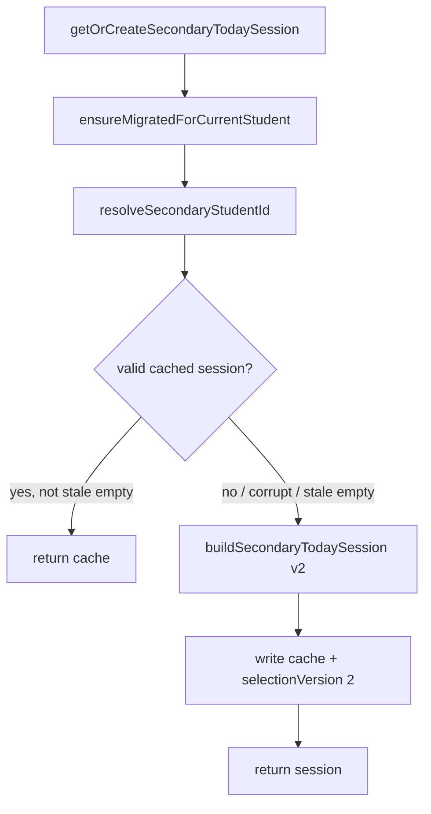

# S1b Implementation Plan: Wire Session Selection v2

**Status:** Implemented (2026-07-09)  
**Prepared:** 2026-07-09  
**Depends on:** S1a ✅ (`secondary-session-selection.ts`, `classifyWordForPractice`) · P0 account-scoped storage ✅  
**Parent:** [PROPOSAL_SECONDARY_SESSION_SELECTION_V2.md](./PROPOSAL_SECONDARY_SESSION_SELECTION_V2.md)

---

## 1. Goal

Replace the v1 heuristic inside `buildSecondaryTodaySession` with the S1a quota engine, while preserving:

- Per-day session cache (`secondary-vocab-today-session-v2:{studentId}:{dateKey}`)
- P0 identity + scoped mastery reads
- M4 cloze-eligible force-include behavior
- Completion / repair / activity filtering (unchanged)
- Same-day cache stability for sessions already stored

**Student-visible outcome:** Returning secondary students get a daily set skewed toward **due**, **fragile**, and **new** words — grounded in platform mastery, isolated per account.

---

## 2. Scope

### In scope (S1b)

| Item | Detail |
| --- | --- |
| Wire selector | `getOrCreateSecondaryTodaySession` → `selectSecondaryTodayWords` |
| Mastery input | `readMasterySnapshot().records` after `ensureMigratedForCurrentStudent()` |
| Cloze blanks | Preserve M4 filter + template walk; pass ids into selector |
| Session metadata | Add optional `selectionVersion: 2` on **new** sessions |
| Constants | Single source of truth from selection module |
| Integration tests | Scoped mastery seeding, account isolation, guest migrate |
| Remove v1 dead code | `WordSignals`, `getWordSignals`, `sortWeakestFirst` |

### Out of scope (defer)

| Item | Track |
| --- | --- |
| S1c debug chips (`?secondaryDebug=1`) | Stretch |
| `selectionReasons` in localStorage | Debug only; omit from persisted payload |
| Same-day invalidation of v1 cached sessions | **No** — keep until calendar day rolls |
| UI copy / Home redesign | None required |
| Activity component changes | Match / Cloze / Spelling untouched |
| Supabase sync | P1 |

---

## 3. Behavioral change (intentional)

| Aspect | v1 (today) | v2 (S1b) |
| --- | --- | --- |
| Today word target | `TARGET_WORDS - warmup` → **≤ 7** today + 3 warmup = **≤ 10 total** | **10 today** + **3 warmup** = **≤ 13 total** (+ cloze extras) |
| Signal source | Display snapshot heuristics (`legacyLevel`, `timesSeen`) | Platform `StudentMasteryRecord` (`state`, `confidence`, `masteryScore`) |
| Mastered words | Can appear in due set | Excluded unless cloze force-include |
| Mix | Due weakest-first + fill unseen | Quota: due / fragile / new / refresh |

**Product note:** Home badge “Today: N words” may show a slightly higher N for returning students. This is expected and aligns with the S1 quota model.

---

## 4. File changes

### 4.1 `lib/secondary/secondary-today-session.ts` (primary)

**Remove (~70 lines):**

- `WordSignals` type
- `getWordSignals()`
- `sortWeakestFirst()`
- v1 selection logic inside `buildSecondaryTodaySession`

**Add:**

```ts
import { readMasterySnapshot } from "@/lib/mastery/local-storage";
import {
  selectSecondaryTodayWords,
  TARGET_TODAY_WORDS,
  WARMUP_WORDS,
} from "@/lib/secondary/secondary-session-selection";

function collectClozeBlankIds(candidateWordItemIds: string[]): string[] {
  const clozeEligible = new Set(
    filterWordItemIdsForSecondaryActivity(candidateWordItemIds, "cloze"),
  );
  const blankIds: string[] = [];
  for (const template of getSecondaryClozeTemplates()) {
    for (const blankId of template.blankWordItemIds) {
      if (!getSecondaryVocabItemById(blankId)) continue;
      if (!clozeEligible.has(blankId)) continue;
      blankIds.push(blankId);
    }
  }
  return blankIds;
}
```

**Replace `buildSecondaryTodaySession`:**

```ts
function buildSecondaryTodaySession(
  now: Date,
  dateKey: string,
  studentId: string,
): SecondaryTodaySession {
  const candidateWordItemIds = getAllSecondaryWordItemIds();
  if (candidateWordItemIds.length === 0) {
    return emptySession(dateKey);
  }

  const selection = selectSecondaryTodayWords({
    candidateWordItemIds,
    studentId,
    dateKey,
    now,
    clozeBlankIds: collectClozeBlankIds(candidateWordItemIds),
    masteryRecords: readMasterySnapshot().records,
  });

  return {
    dateKey,
    warmUpWordItemIds: selection.warmUpWordItemIds,
    todayWordItemIds: selection.todayWordItemIds,
    allWordItemIds: selection.allWordItemIds,
    selectionVersion: 2,
  };
}
```

**Update `getOrCreateSecondaryTodaySession`:**

- Pass `studentId` into `buildSecondaryTodaySession(now, dateKey, studentId)`
- Cache read/write path unchanged
- Keep `isStaleEmptySession` rebuild behavior

**Constants exports:**

```ts
// Re-export for SecondaryHome + tests (avoid duplicate definitions)
export {
  WARMUP_WORDS,
  TARGET_TODAY_WORDS,
} from "@/lib/secondary/secondary-session-selection";

/** @deprecated Use TARGET_TODAY_WORDS — v1 counted warmup inside TARGET_WORDS */
export const TARGET_WORDS = TARGET_TODAY_WORDS;

export { isSecondaryWordMastered } from "@/lib/secondary/secondary-mastery-display";
```

Remove unused import `getSecondaryWordDisplaySnapshot`.

Keep `MASTERED_LEVEL_THRESHOLD` only if still referenced — grep shows it's exported but SecondaryHome uses `isSecondaryWordMastered`. **Remove export** if unused after wire (or keep with comment for legacy).

### 4.2 `lib/secondary/types.ts` (additive)

```ts
export interface SecondaryTodaySession {
  dateKey: string;
  warmUpWordItemIds: string[];
  todayWordItemIds: string[];
  allWordItemIds: string[];
  /** Present on sessions built by selection v2 (S1b+). */
  selectionVersion?: 2;
}
```

`normalizeSession` does not need to require `selectionVersion`; unknown fields are ignored on read.

### 4.3 `lib/secondary/secondary-today-session.test.ts` (expand)

No changes to `use-secondary-today-session.ts` or activity components.

### 4.4 No changes

- `lib/secondary/secondary-session-selection.ts` (unless minor export tweak)
- `components/secondary/*`
- Evidence emitters / repair gates
- Storage key prefixes

---

## 5. Cache policy



| Scenario | Behavior |
| --- | --- |
| Valid session for today | Return as-is (even if `selectionVersion` missing — v1 session from earlier today) |
| Corrupt JSON / missing arrays | Rebuild with v2 |
| Stale empty (`allWordItemIds: []` but bank has words) | Rebuild with v2 (existing `isStaleEmptySession`) |
| New calendar day | New cache miss → v2 build |
| Account switch mid-day | Different `studentId` prefix → separate cache (P0) |
| Deploy S1b mid-day | **Do not** invalidate existing caches (approved open question #5) |

---

## 6. Test plan

### 6.1 Keep (update bounds only)

| Test | Change |
| --- | --- |
| Stable date key | None |
| Creates session + reuses cache | Upper bound: `≤ WARMUP_WORDS + TARGET_TODAY_WORDS + 8` (cloze headroom) |
| Stale empty rebuild | None |
| Corrupted payload rebuild | None |

### 6.2 Add — mastery-driven selection

**Helper** (inline or shared with `local-storage.test.ts` patterns):

```ts
import { scopedLocalStorageKey } from "@/lib/auth/scoped-local-storage";
import { setStudentStorageIdCache } from "@/lib/auth/student-storage-id";
import { learningTargetKey } from "@/lib/mastery/engine";
import { MASTERY_STORAGE_KEY } from "@/lib/mastery/local-storage";
```

**Case: due words surface in session**

1. Seed `PROGRESS_STORAGE_KEY` with `anonymousDeviceId: "guest-1"`
2. Write scoped mastery `wke-student-mastery-v1:guest-1` with 3 words `nextReviewAt` in the past
3. Call `getOrCreateSecondaryTodaySession(now)`
4. Expect `allWordItemIds` intersects due word ids (at least 1 due word present)

**Case: mastered due word excluded**

1. Seed mastery: word A `masteryScore: 0.9`, due; word B `masteryScore: 0.3`, due
2. Expect session contains B, not A (unless A is a cloze blank — skip or use non-cloze ids)

### 6.3 Add — account isolation

1. Seed mastery for `user-a` with due word `due-a-only`
2. Seed empty mastery for `user-b`
3. `setStudentStorageIdCache("user-a")` + seed scoped progress hub → session A
4. `setStudentStorageIdCache("user-b")` + seed → session B
5. Expect `sessionA.allWordItemIds` ≠ `sessionB.allWordItemIds` (or B lacks `due-a-only`)

Use `clearStudentStorageIdCache()` in `afterEach` (already present).

### 6.4 Add — guest → login migrate

1. Guest device `device-guest` practices: seed scoped mastery `wke-student-mastery-v1:device-guest` with fragile word
2. Simulate login: `setStudentStorageIdCache("auth-user-1")`, seed hub progress, call `ensureMigratedForCurrentStudent()` (or rely on `getOrCreateSecondaryTodaySession` which calls migrate)
3. Clear session cache for today (force rebuild)
4. Expect rebuilt session includes fragile word from migrated mastery

### 6.5 Add — selectionVersion on new sessions

After fresh build, read raw localStorage JSON → expect `selectionVersion: 2`.

### 6.6 Regression command

```bash
npx vitest run lib/secondary/ lib/mastery/recommendations.test.ts
```

---

## 7. Manual QA checklist

1. **Fresh guest:** Open `/secondary` → non-empty today set; complete Match on 2–3 words.
2. **Next day (or change date in dev):** Reload Home → set skews toward practiced / due words.
3. **Two accounts, one browser:** User A practices → sign out → User B → different word set same day.
4. **Cloze:** Confirm cloze activity still has paragraph blanks when eligible words exist in bank.
5. **Repair gating:** Partial Match → Cloze/Spelling chips still gated until repair complete.
6. **Cache stability:** Reload same day without clearing storage → identical word set.

---

## 8. Risks and mitigations

| Risk | Mitigation |
| --- | --- |
| More words per day (13 vs 10) feels heavier | Intended; quotas cap fatigue (2 new slots, 1 refresh) |
| v1 session cached on deploy day | Accept until midnight; document in release note |
| `readMasterySnapshot` empty in SSR | Already client-only (`"use client"`); hook runs in browser |
| Legacy words only in `secondary-vocab-word-progress-v1` | `ensureMigratedForCurrentStudent` + platform bridge already dual-read via display; selection uses platform snapshot only — words with **only** legacy rows classify as `new` until M1 evidence exists | 
| Duplicate constants confusion | Re-export from selection module; deprecate `TARGET_WORDS` |

**Legacy-only gap:** Accept for S1b. If needed later, add a thin `legacyRecordsToMasteryShape` adapter — **not** in S1b scope.

---

## 9. Definition of done (S1b)

- [x] `buildSecondaryTodaySession` delegates to `selectSecondaryTodayWords`
- [x] Scoped `readMasterySnapshot().records` is the mastery input
- [x] Cloze blank collection preserves M4 eligibility rules
- [x] New sessions persist `selectionVersion: 2`
- [x] v1 dead code removed from `secondary-today-session.ts`
- [x] Integration tests: mastery seed, account isolation, guest migrate
- [x] `npx vitest run lib/secondary/` passes
- [ ] Manual QA checklist completed
- [x] Parent proposal S1b checklist updated

---

## 10. Effort estimate

| Task | Time |
| --- | --- |
| Wire + cloze helper + types | ~30 min |
| Constants cleanup + import fixes | ~15 min |
| Integration tests (3 new cases) | ~45 min |
| Regression + manual QA | ~30 min |
| **Total** | **~2 hours** |

---

## 11. Open questions (approve before coding)

1. **Session size increase (10 → up to 13)** — Approve intentional behavior? **(Recommended: yes)**
2. **`TARGET_WORDS` alias** — Keep deprecated re-export or rename all consumers to `TARGET_TODAY_WORDS`? **(Recommended: keep alias one release)**
3. **`MASTERED_LEVEL_THRESHOLD` export** — Remove from `secondary-today-session.ts` if unused? **(Recommended: remove)**
4. **Guest migrate test** — Required in S1b or defer to P0 test suite? **(Recommended: include one test in S1b)**
5. **Legacy-only progress rows** — Accept `new` classification until platform evidence exists? **(Recommended: yes, no adapter in S1b)**

---

## 12. Approval

| Role | Decision | Date |
| --- | --- | --- |
| Product / curriculum | ☐ Approve / ☐ Revise | |
| Engineering | ☐ Approve / ☐ Revise | |

**On approval:** implement S1b in Lesson Player `web` only (no ai-tutor changes).
