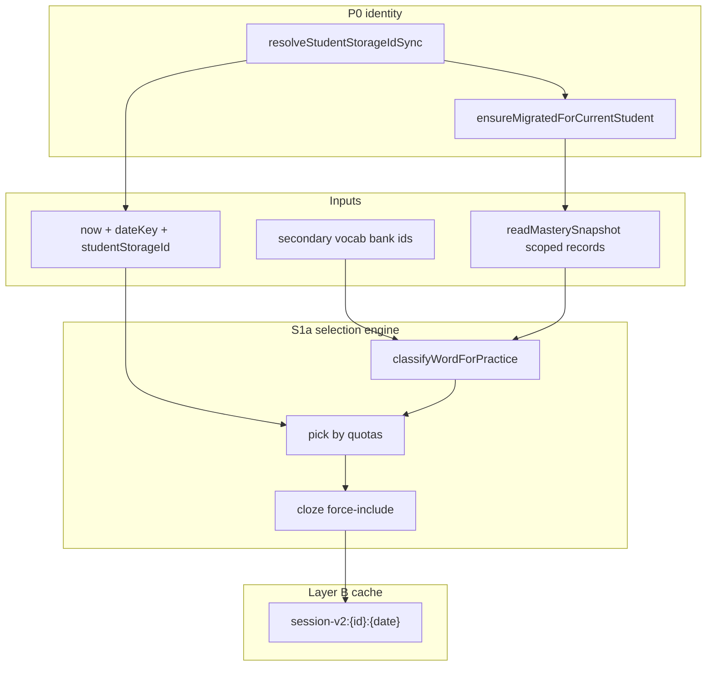

# Proposal: Secondary Session Selection v2 (S1)

**Status:** Implemented (2026-07-09)  
**Prepared:** 2026-07-09  
**Track:** Post-M6 mastery · historical ai-tutor PR4  
**Depends on:** M0–M6 complete · M5 platform-first display · **P0 account-scoped local storage** ✅ · G1 optional (orthogonal)

**Related docs:**

- [PROPOSAL_ACCOUNT_LINKED_LOCAL_STORAGE.md](./PROPOSAL_ACCOUNT_LINKED_LOCAL_STORAGE.md) — P0 implemented (Layers A + B)
- [MASTERY_ROADMAP.md](./MASTERY_ROADMAP.md) — closes “Balanced secondary daily mix”
- [MASTERY_ENGINE_SPEC.md](./MASTERY_ENGINE_SPEC.md) — recommendation patterns
- [SECONDARY_TO_PLATFORM_MASTERY_BRIDGE.md](./SECONDARY_TO_PLATFORM_MASTERY_BRIDGE.md)
- Vocab reference: `components/teststartpage/VocabularySetOverlay.tsx` + `lib/mastery/recommendations.ts`

---

## 1. Executive summary

Secondary’s **daily word set** is still built by a **v1 heuristic** in `secondary-today-session.ts`: due-by-`nextReviewAt`, weakest-first, fill with unseen, then force-include cloze blanks. It does **not** use platform mastery **state** (`needs_review`, `stuck`, `fragile`), **confidence**, or a balanced **due / weak / new / refresh** mix.

Vocabulary sets already solve a similar problem: `recommendVocabularyPracticeWords()` picks review targets, then `buildVocabularyPracticeContext()` merges preferred + seeded fill.

**S1** extracts testable selection logic and upgrades secondary daily session construction to a **quota-based adaptive mix** grounded in `StudentMasteryRecord` from the **account-scoped** mastery snapshot.

| Package | What it does | Student-visible? |
| --- | --- | --- |
| **S1a — Selection engine** | Pure `selectSecondaryTodayWords()` module + vitest fixtures | No |
| **S1b — Wire session** | `getOrCreateSecondaryTodaySession` calls engine; stable per-day cache unchanged | Yes — better daily set |
| **S1c — Home signals (optional)** | “Why today” debug chips behind flag or teacher preview | Low |
| **S1d — Session schema bump** | Optional `selectionVersion` in stored session for one-time rebuild | Migration only |

**Defer:** UI copy overhaul, teacher dashboards, **Supabase Layer C (P1)**, grammar hub recommendations (G2), new quiz content.

**Target after S1:** A returning secondary student sees a daily set that prioritizes **due review** and **fragile** words, limits **mastered** words, introduces a few **new** words, and keeps **one refresh** slot — while preserving cloze viability, per-activity `practiceTypes` filtering (M4), and **per-account isolation** from P0.

---

## 2. Why this pass next (after P0, before P1 / G2)

| Option | Pros | Cons | Verdict |
| --- | --- | --- | --- |
| **S1 Session v2** | Uses mastery data already flowing from M1–M5; **reads correct per-account snapshot after P0**; closes roadmap gap; mirrors proven vocab pattern | Secondary-only | **Recommended next** |
| **P1 Supabase sync** | Cross-device, teacher views | Schema, RLS, write-through — large slice | After S1 proves local adaptive value |
| G2 Grammar recommendations | Continues grammar track | Only 1 poster has quizzes; thin data until G1e content | After S1 or G1e |
| G1e More grammar quizzes | More evidence lanes | Content + registry work; not adaptive selection | Parallel content track |

**P0 changed the calculus:** Selection no longer risks blending two students’ mastery on a shared browser. S1 can safely use `readMasterySnapshot()` and `resolveStudentStorageIdSync()` without waiting for Supabase — but **P1 remains the path** to teacher dashboards and multi-device restore.

---

## 3. Persistence integration (P0 — prerequisite ✅)

S1 **must** align with account-scoped local storage implemented in P0.

### 3.1 Identity

| Concern | P0 behavior | S1 requirement |
| --- | --- | --- |
| Student id | `resolveStudentStorageIdSync()` → auth `user.id` or guest `anonymousDeviceId` | Pass this id into `selectSecondaryTodayWords` and session cache keys |
| Secondary wrapper | `resolveSecondaryStudentId()` delegates to storage id | **Keep** — no parallel id source |
| Auth switch | `StudentStorageBootstrap` / `SignOutForm` clear id cache | Session cache key prefix changes → **correct fresh daily set per account** |

### 3.2 Mastery reads

- **Selector (S1a):** Read `StudentMasteryRecord` from `readMasterySnapshot().records` via `getMasteryRecordForTarget` / `targetKeyForWord`. Use **platform fields** (`state`, `confidence`, `masteryScore`, `nextReviewAt`, `exposureCount`) — not legacy 0–5 display alone.
- **Display (unchanged):** `getSecondaryWordDisplaySnapshot` remains for Home badges and UI; selection engine does not depend on it.
- **Namespace:** `readMasterySnapshot()` already resolves scoped key `wke-student-mastery-v1:{studentStorageId}` after `ensureMigratedForCurrentStudent()`.

### 3.3 Session cache keys (already account-scoped)

```
secondary-vocab-today-session-v2:{studentStorageId}:{dateKey}
secondary-vocab-today-completion-v1:{studentStorageId}:{dateKey}
```

No storage-key bump required for P0. S1 only changes **how** the session payload is built when cache misses.

### 3.4 Guest → login migration

When a guest practices then signs in, `student-storage-migrate.ts` copies mastery into the auth namespace once. S1 selection on the next cache miss must see **migrated** records (integration test in S1b).

### 3.5 Out of S1 scope (unchanged by P0)

- Supabase pull/push (P1)
- Garden / pet / board game scoped keys
- Teacher or parent views

---

## 4. Current state (v1)

### Algorithm today (`getOrCreateSecondaryTodaySession`)

```
candidates = all bank wordItemIds
signals = display snapshot per word (legacyLevel, recentAccuracy, timesSeen, nextReviewAt)

warmup (≤3) = weakest due words with timesSeen > 0
today (≤10 − warmup) = remaining due weakest-first
fill gaps = unseen words weakest-first
force-include = cloze blank ids (cloze-eligible only, M4)
allWordItemIds = warmup ∪ today
```

### What v1 does well

- Stable per student per calendar day (cached in localStorage, **account-scoped since P0**)
- Respects `nextReviewAt` for due ordering
- Cloze blank force-include after M4 filtering
- Platform-first reads via `getSecondaryWordDisplaySnapshot` (M5)

### What v1 misses

| Gap | Impact |
| --- | --- |
| No `state`-aware fragile/stuck boost | Weak words not due yet may be skipped |
| Mastered words can appear in due set | Wasted practice slots |
| No explicit **new** vs **refresh** quotas | Sets feel random day-to-day |
| No shared code with `recommendations.ts` | Two divergent adaptive brains |
| `timesSeen > 0` required for warmup | First-time due words only in main bucket |
| No selection metadata | Hard to debug or explain to teachers |
| Uses display snapshot heuristics | Does not classify on `state` / `confidence` directly |

### Reference: vocab adaptive mix

`VocabularySetOverlay` takes up to **half** of practice slots from `recommendVocabularyPracticeWords`, then seeded-fills the rest. Secondary can be more aggressive (mastery-first product lane) but should **reuse the same reason codes** where possible.

---

## 5. Goals

1. **Balanced daily mix** — explicit quotas for due, fragile, new, refresh.
2. **Platform-native signals** — use `masteryScore`, `state`, `confidence`, `nextReviewAt` from scoped mastery records.
3. **Per-account correctness** — selection and cache keyed by `resolveStudentStorageIdSync()`.
4. **Exclude mastered** from selection unless cloze force-include requires them.
5. **Pure, tested selection** — no UI in the selector module.
6. **Preserve invariants** — same-day session stability; M4 activity filters unchanged; repair/completion logic untouched.
7. **Documented quotas** — constants in one place, tunable later.

## 6. Non-goals (S1)

| Item | Defer |
| --- | --- |
| Change Match/Cloze/Spelling UX | — |
| Secondary Home redesign | S1c optional debug only |
| Cross-student or class analytics | Teacher track |
| Supabase sync (Layer C) | P1 |
| Grammar hub “practice next poster” | G2 |
| Per-topic teacher assignment overrides | Future |
| Decay / engine tuning | Engine team later |
| Scope garden / pet / explore keys | P0 follow-on |

---

## 7. Proposed selection model

### 7.1 Buckets

Each candidate word (from full bank) is classified into **at most one primary bucket** (first match wins):

| Bucket | Inclusion rule (platform record) |
| --- | --- |
| `mastered` | `isSecondaryWordMastered(snapshot)` — **excluded** from selection unless cloze force |
| `due` | `nextReviewAt <= now` |
| `fragile` | `state ∈ { needs_review, stuck }` OR (`confidence < 0.35` AND `exposureCount > 0`) |
| `new` | `exposureCount === 0` (no platform row or zero exposure) |
| `refresh` | seen, not due, not mastered, not fragile |

**Priority order for slot filling:** `due` → `fragile` → `new` → `refresh`

Within bucket, sort by:

1. Lower `masteryScore` first  
2. Lower `recentAccuracy` (retrieval success rate)  
3. Lower `exposureCount`  
4. Stable `wordItemId` tie-break  

### 7.2 Quotas (defaults)

| Slot | Count | Source bucket |
| --- | --- | --- |
| **Warm-up** | `WARMUP_WORDS` (3) | `due` + `fragile`, prefer words with prior exposure |
| **Due** | `DUE_QUOTA` (4) | `due` (not already in warmup) |
| **Fragile** | `FRAGILE_QUOTA` (3) | `fragile` |
| **New** | `NEW_QUOTA` (2) | `new` |
| **Refresh** | `REFRESH_QUOTA` (1) | `refresh` |
| **Fill** | remainder to `TARGET_WORDS` (10) | waterfall: due → fragile → new → refresh |

**Total today target:** `TARGET_WORDS = 10` (unchanged)  
**Grand total:** `warmup + today` ≤ 13 before cloze force-includes (same upper bound as today’s tests).

Constants live in `secondary-session-selection.ts` and are imported by `secondary-today-session.ts`.

### 7.3 Cloze force-include (unchanged intent)

After primary selection:

1. For each cloze template blank id: if cloze-eligible (M4) and in bank, add to **today** if missing.
2. Force-included words may be mastered — **exception** to mastered exclusion.
3. Do not remove words to make room; allow `allWordItemIds.length` to exceed 13 slightly (existing test tolerance).

### 7.4 Seeded variety (refresh bucket only)

For `refresh` and final fill when ties abound, use deterministic shuffle:

```ts
shuffleWithSeed(bucketCandidates, `${studentId}:${dateKey}:refresh`)
```

`studentId` **must** be `resolveStudentStorageIdSync()` so two accounts on the same browser do not share shuffle streams.

Reuse existing seeded shuffle utility if present in repo; otherwise add minimal `hashSeed` helper in selection module (vitest for stability).

---

## 8. Architecture



### New module: `lib/secondary/secondary-session-selection.ts`

```ts
export type SecondaryWordBucket =
  | "due"
  | "fragile"
  | "new"
  | "refresh"
  | "mastered";

export type SecondaryWordCandidate = {
  wordItemId: string;
  bucket: SecondaryWordBucket;
  masteryScore: number;
  state: StudentMasteryRecord["state"];
  confidence: number;
  exposureCount: number;
  recentAccuracy: number;
  nextReviewAtMs: number;
};

export type SecondarySessionSelectionResult = {
  warmUpWordItemIds: string[];
  todayWordItemIds: string[];
  allWordItemIds: string[];
  /** Optional: reason per word for debug/teacher preview */
  reasons?: Record<string, VocabularyRecommendationReason | "new" | "refresh" | "cloze_include">;
};

export function selectSecondaryTodayWords(input: {
  candidateWordItemIds: string[];
  /** From resolveStudentStorageIdSync() — not a separate guest-only id */
  studentId: string;
  dateKey: string;
  now: Date;
  clozeBlankIds: string[];
  /** Pre-loaded scoped mastery records (from readMasterySnapshot) */
  masteryRecords: Record<string, StudentMasteryRecord>;
  quotas?: Partial<SecondarySelectionQuotas>;
}): SecondarySessionSelectionResult;
```

`getOrCreateSecondaryTodaySession` becomes:

1. `ensureMigratedForCurrentStudent()` (already via mastery read path).
2. `studentId = resolveSecondaryStudentId()`.
3. Load cache `secondary-vocab-today-session-v2:{studentId}:{dateKey}` → return if valid.
4. `selectSecondaryTodayWords({ ..., masteryRecords: readMasterySnapshot().records })`.
5. Write session payload.

### Shared recommendations (S1a)

Extend `lib/mastery/recommendations.ts`:

```ts
export function classifyWordForPractice(input: {
  wordId: string;
  record: StudentMasteryRecord | null;
  now: Date;
}): VocabularyRecommendationReason | "new" | "mastered" | null;
```

Map platform record → same reason codes vocab uses. Secondary selection imports this to avoid duplicating fragile/due logic.

**Do not** call `recommendVocabularyPracticeWords` directly for secondary — quotas differ from vocab set overlay (50% fill). Share **classification**, not full selection.

---

## 9. Storage / migration

### Session payload (keep `secondary-vocab-today-session-v2`)

Optional additive field:

```ts
selectionVersion?: 2;  // bump when algorithm changes
selectionReasons?: Record<string, string>;  // debug only, omit in production if size concern
```

**Policy:**

- Sessions created before S1 remain valid until end of day.
- New days use v2 algorithm.
- Corrupted payloads still rebuild (existing behavior).
- **Account switch same day:** different `studentId` prefix → separate session caches (intended).

**No** bump to `v3` storage key unless we need to invalidate same-day sessions on deploy — default **no** (student expectation: set stable all day).

---

## 10. UI impact

### Student-facing (minimal)

- Same Home badges (`Today: N words`, `Mastered: N`).
- Word set may **feel** more review-heavy for returning students — intended.
- No new copy required for S1b.
- Logged-in students see sets driven by **their** mastery, not a sibling’s on the same device.

### S1c optional debug

Behind `?secondaryDebug=1` on `/secondary`:

- Show bucket/reason chip on focus words (reuse reason labels from `vocabularyRecommendationReasonLabel` where applicable).

---

## 11. Phased delivery

### S1a — Selection engine (~1–1.5 sessions)

- [x] `classifyWordForPractice` in `recommendations.ts`
- [x] `secondary-session-selection.ts` with quotas + cloze pass
- [x] `secondary-session-selection.test.ts` — table-driven cases:
  - all new bank → mostly `new` bucket
  - due words fill due quota first
  - fragile excluded from refresh
  - mastered excluded unless cloze force
  - stable output for same inputs
  - warmup pulls from due+fragile with exposure
  - **different `studentId` → different refresh shuffle** (account isolation)

### S1b — Wire + integrate (~0.5–1 session)

- [x] Refactor `secondary-today-session.ts` to call selector with scoped mastery snapshot
- [x] Update `secondary-today-session.test.ts` — seed **scoped** keys via `scopedLocalStorageKey(MASTERY_STORAGE_KEY, studentId)` + `setStudentStorageIdCache` / `resetScopedStorageTestState`
- [x] **Account isolation test:** user A mastery → session A; switch cache to user B → session B differs
- [x] **Guest migrate test:** seed guest mastery → run migrate → selection sees copied records
- [x] Verify `allWordItemIds.length` bounds still pass
- [x] Manual QA checklist (below) — see [QA_S1_SESSION_SELECTION.md](./QA_S1_SESSION_SELECTION.md)

### S1c — Debug surface (stretch, ~0.5 session)

- [ ] `?secondaryDebug=1` reason chips on SecondaryHome focus words
- [ ] Document flag in `docs/mastery/MASTERY_ENGINE_SPEC.md`

### S1d — Docs (~0.25 session)

- [x] `docs/mastery/SECONDARY_SESSION_SELECTION.md` — quotas, buckets, invariants, P0 key shapes
- [x] Update `MASTERY_ROADMAP.md` + bridge doc when done

---

## 12. Test plan

### Unit (`secondary-session-selection.test.ts`)

| Case | Expect |
| --- | --- |
| Empty bank | empty session |
| No mastery rows | all `new`, count ≤ quotas |
| 5 due + 5 fragile | due quota saturated, fragile next |
| Mastered due word | excluded unless cloze blank |
| Same student+date+fixtures | identical ids (determinism) |
| Different studentId, same fixtures | refresh shuffle may differ |
| Cloze blank not in pick | force-included in today |

### Integration (`secondary-today-session.test.ts`)

Use patterns from `lib/mastery/local-storage.test.ts` and `lib/auth/student-storage-id.test.ts`:

```ts
import { resetScopedStorageTestState } from "@/lib/auth/scoped-storage-test-helpers";
import { scopedLocalStorageKey } from "@/lib/auth/scoped-local-storage";
import { setStudentStorageIdCache } from "@/lib/auth/student-storage-id";
import { MASTERY_STORAGE_KEY } from "@/lib/mastery/types";
```

| Case | Expect |
| --- | --- |
| Seed `wke-student-mastery-v1:{userA}` with due records | Session contains due word ids for user A |
| Same day, switch to `userB` with empty mastery | Different session (mostly new words) |
| Cached session for day | Not regenerated on second call |
| Guest device id → login migrate | Post-migrate selection uses auth namespace |

### Regression

- `npx vitest run lib/secondary/`
- `lib/mastery/recommendations.test.ts` still passes
- `lib/auth/student-storage-id.test.ts` still passes

### Manual QA

1. **Two accounts:** Log in as A, practice secondary, note today’s words. Sign out, log in as B — different set (same date).
2. Clear `secondary-vocab-today-session-v2:*` for today if forcing rebuild.
3. Play secondary once to build mastery on 3–5 words.
4. Reload Home next day (or change system date in dev) — set should skew toward practiced words.
5. Complete Match/Cloze/Spelling — repair gating still works.
6. Confirm cloze still has blanks when eligible.
7. **Guest → login:** practice as guest, sign in, confirm today’s set reflects migrated mastery on next miss.

---

## 13. Risks and mitigations

| Risk | Mitigation |
| --- | --- |
| Over-review fatigue | Cap due quota; keep 2 new slots |
| Under-filled set (small bank) | Waterfall fill like v1 |
| Divergence from vocab reason codes | Shared `classifyWordForPractice` |
| Large `selectionReasons` payload | Debug flag only or omit |
| Mastered words disappear entirely | Refresh quota + cloze exception |
| Wrong namespace / stale id cache | Reuse `resolveSecondaryStudentId`; tests call `clearStudentStorageIdCache` in `afterEach` |
| Guest data invisible after login | Rely on `ensureMigratedForCurrentStudent` before read; test migrate path |
| Two students conflated on shared device | **P0 solved** — session + mastery keys include `studentStorageId` |

---

## 14. Definition of done (S1)

- [x] Quota-based selection module landed with ≥8 unit tests
- [x] `getOrCreateSecondaryTodaySession` uses scoped platform mastery records
- [x] Mastered words excluded from normal picks
- [x] Cloze force-include preserved
- [x] **Per-account session isolation verified in tests**
- [x] Roadmap item “Balanced secondary daily mix” checked off
- [x] No changes to evidence emitters or repair gates
- [x] Docs updated

---

## 15. What comes after S1 (preview)

| Pass | Focus | When |
| --- | --- | --- |
| **P1** | Supabase mastery tables + Layer C sync | After S1; unblocks teacher views |
| **G1e** | Quiz registry for 2–3 more grammar posters | Content ready |
| **G2** | `recommendGrammarPractice()` + hub “practice next” | After G1e or enough L4 data |
| **G1d** | L3 poster-read evidence | Optional grammar depth |
| **T1** | Teacher weak-word / grammar summary | After P1 or local export MVP |
| **P0b** | Scope garden / pet / board game keys | Parallel hygiene |

---

## 16. Open questions (for approval)

1. **Quotas** — Approve defaults (4 due / 3 fragile / 2 new / 1 refresh / 3 warmup)?  
2. **Mastered exclusion** — Strict exclude OK? (recommended: yes, cloze exception only)  
3. **S1c debug flag** — Include in S1 scope or defer? (recommended: defer)  
4. **Storage `selectionVersion`** — Add optional metadata? (recommended: yes, lightweight)  
5. **Same-day deploy** — Invalidate existing today sessions on S1 ship? (recommended: **no**)  
6. **Mastery input** — Pass `masteryRecords` into selector vs. internal `readMasterySnapshot()`? (recommended: **inject in production, fixtures in tests** for purity)

---

## 17. Approval

| Role | Decision | Date |
| --- | --- | --- |
| Product / curriculum | ☑ Approve | 2026-07-09 |
| Engineering | ☑ Approve | 2026-07-09 |

**Closed:** S1a + S1b + close-out. Reference: [SECONDARY_SESSION_SELECTION.md](./SECONDARY_SESSION_SELECTION.md) · QA: [QA_S1_SESSION_SELECTION.md](./QA_S1_SESSION_SELECTION.md)
