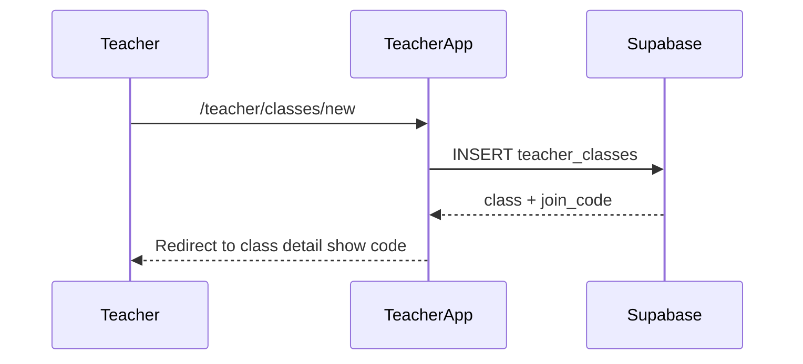
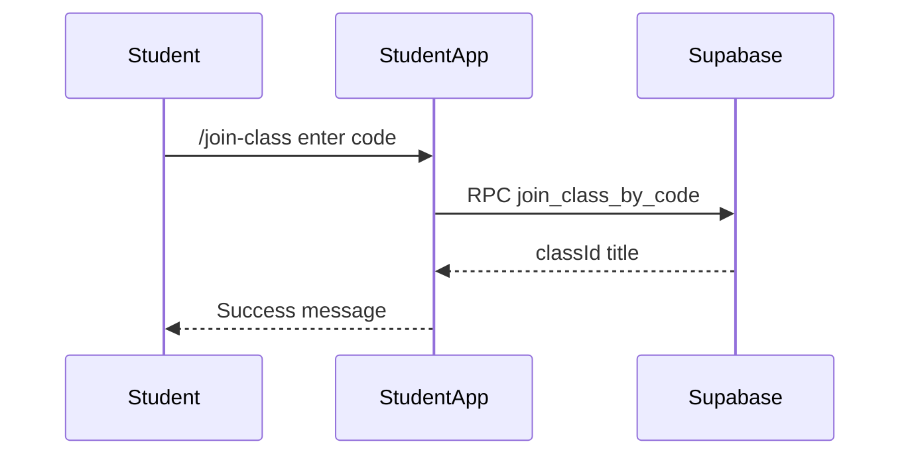
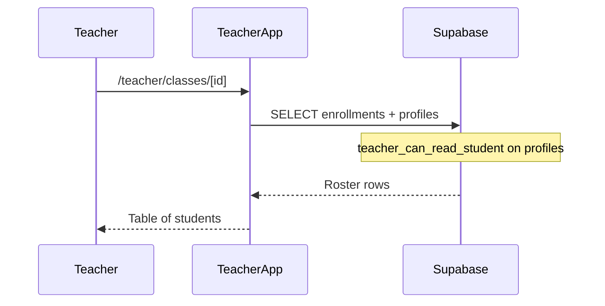

# Proposal: T0 — Teacher classes & student roster foundation

**Status:** Implemented (2026-07-09)  
**Prepared:** 2026-07-09  
**Track:** T-track teacher mastery diagnostics — Phase 0 (foundation)  
**Depends on:** P1 ✅ · student auth (`student_profiles`) ✅ · teacher app shell ✅  
**Parent:** T-track broad plan · [PROPOSAL_NEXT_STEP_POST_S1.md](./PROPOSAL_NEXT_STEP_POST_S1.md) §8  
**Blocks:** T1 teacher mastery reads · T2 diagnostic UI · T3 class insights

---

## 1. Executive summary

**T0** adds the **organizational layer** missing from the mastery stack: **teacher-owned classes** and **student enrollments** in Supabase. Without this, T1 cannot safely expose `student_mastery_records` to teachers — there is no enrollment boundary today (only `student_id = auth.uid()` RLS).

| Deliverable | Student-visible? | Teacher-visible? |
| --- | --- | --- |
| Migration `026_teacher_classes.sql` | No (schema) | No |
| `teacher_classes` + `class_enrollments` tables + RLS | — | — |
| `teacher_can_read_student()` helper | — | — |
| `join_class_by_code()` RPC (students only) | Yes | — |
| Scoped `student_profiles` read for enrolled students | — | Yes (roster names) |
| Teacher: create class, view join code, roster list | — | Yes |
| Student: join class by code | Yes | — |
| Server actions + data helpers | — | — |
| Manual QA checklist | — | — |

**Not in T0:** mastery reads (T1), weak-word UI (T2), class aggregates (T3), parent portal, migrating local `enrolledCourseIds` to server.

**Effort:** ~1–2 focused sessions (4–8 hours)  
**Risk:** Medium-low — RLS must not leak student data across teachers; join-code design must resist enumeration.

**Approved product decisions (from T-track planning):**
- **Roster model:** Classes — teacher creates class; students join via code; teacher sees enrolled students only
- **Audience:** Teacher-only track (no parent portal)

---

## 2. Problem

| Gap today | Impact |
| --- | --- |
| No `classes` / enrollment tables | Teachers cannot be scoped to specific students |
| Mastery RLS = own rows only | Any blanket `is_teacher()` policy would expose **all** students |
| Course enrollment is local-only | `enrolledCourseIds` in `localStorage` — invisible to teachers |
| Teacher app = content authoring only | No `/teacher/classes` or roster surfaces |
| `student_profiles` = own row only | Teachers cannot show student display names in a roster |

P1 put mastery on the server. **T0 puts students on the teacher’s roster** — the prerequisite for diagnostics.

---

## 3. Goals and non-goals

### 3.1 In scope

1. **Schema** — `teacher_classes`, `class_enrollments`
2. **Join codes** — short unique codes per class; teacher can view and regenerate
3. **RLS** — teachers manage own classes; students join and see own enrollments; **no** global teacher read on mastery (T1)
4. **`teacher_can_read_student(student_id)`** — reusable helper for T1 policies
5. **`join_class_by_code(code)`** — security-definer RPC; students only; no public listing of classes by code
6. **Teacher UI (minimal)** — list classes, create class, class detail with code + roster
7. **Student UI (minimal)** — join class by code (dedicated page or hub entry)
8. **Server actions** — create class, regenerate code, remove student (teacher), join class (student)
9. **QA doc** — `QA_T0_TEACHER_CLASSES.md`

### 3.2 Out of scope (defer)

| Item | Phase |
| --- | --- |
| Read `student_mastery_records` / weak words | T1 |
| Teacher diagnostic dashboards | T2 |
| Class-level mastery aggregates | T3 |
| Teacher adds student by username without code | T0b optional |
| Link class → `courses.id` required | Optional FK only |
| Sync local `enrolledCourseIds` to server | Separate track |
| Parent / guardian access | Deferred indefinitely |
| Class chat, assignments, attendance | Out of product scope |
| Admin multi-center management | Later |

---

## 4. Data model

### 4.1 Table: `teacher_classes`

| Column | Type | Notes |
| --- | --- | --- |
| `id` | `uuid` PK | `gen_random_uuid()` |
| `teacher_id` | `uuid` NOT NULL | FK → `auth.users(id)` ON DELETE CASCADE |
| `title` | `text` NOT NULL | e.g. "Tuesday A2 — We Know" |
| `course_id` | `uuid` NULL | Optional FK → `courses(id)` ON DELETE SET NULL |
| `join_code` | `text` NOT NULL | Unique, uppercase, 6 chars (see §4.3) |
| `created_at` | `timestamptz` | default `now()` |
| `updated_at` | `timestamptz` | default `now()` |
| `archived_at` | `timestamptz` NULL | Non-null = hidden from join; teacher can still view |

**Indexes:**
- `(teacher_id, created_at desc)`
- **unique** `(join_code)`

### 4.2 Table: `class_enrollments`

| Column | Type | Notes |
| --- | --- | --- |
| `class_id` | `uuid` NOT NULL | FK → `teacher_classes(id)` ON DELETE CASCADE |
| `student_id` | `uuid` NOT NULL | FK → `auth.users(id)` ON DELETE CASCADE |
| `enrolled_at` | `timestamptz` | default `now()` |

**Primary key:** `(class_id, student_id)`  
**Index:** `(student_id)` — student “my classes” list

### 4.3 Join code generation

- **Format:** 6 characters, uppercase alphanumeric, excluding ambiguous chars (`0`, `O`, `1`, `I`, `L`) → 32-char alphabet ≈ 1B combinations
- **Generation:** DB default via `generate_class_join_code()` or app-side on insert with retry on unique violation
- **Regenerate:** Teacher action sets new code; old code stops working immediately
- **Validation:** `upper(trim(code))` before lookup

### 4.4 Optional `course_id`

- **Recommended:** nullable optional FK
- Teachers can create a free-form group without picking a course
- T2/T3 may filter vocabulary banks by course later — not required for T0

---

## 5. SQL helpers & RPC

### 5.1 `is_student()` (new)

Mirror `is_teacher()` from [`001_initial.sql`](../../supabase/migrations/001_initial.sql):

```sql
create or replace function public.is_student()
returns boolean language sql stable security definer set search_path = public as $$
  select coalesce((select auth.jwt() -> 'app_metadata' ->> 'role'), '') = 'student';
$$;
```

### 5.2 `teacher_can_read_student(p_student_id uuid)`

Used by T0 (`student_profiles` roster) and T1 (mastery policies):

```sql
create or replace function public.teacher_can_read_student(p_student_id uuid)
returns boolean language sql stable security definer set search_path = public as $$
  select public.is_teacher()
    and exists (
      select 1
      from public.class_enrollments ce
      join public.teacher_classes tc on tc.id = ce.class_id
      where ce.student_id = p_student_id
        and tc.teacher_id = auth.uid()
        and tc.archived_at is null
    );
$$;
```

### 5.3 `join_class_by_code(p_join_code text)`

**Security definer** — students cannot `SELECT` from `teacher_classes` by code directly (prevents enumeration).

```sql
-- Returns { classId, title } or raises invalid_code / students_only / not_authenticated
create or replace function public.join_class_by_code(p_join_code text)
returns jsonb ...
```

**Behavior:**
1. Require `auth.uid()` and `is_student()`
2. Normalize code: `upper(trim(p_join_code))`
3. Lookup active class (`archived_at is null`)
4. `INSERT INTO class_enrollments` ON CONFLICT DO NOTHING
5. Return class id + title (for student success UI)

**Grants:** `GRANT EXECUTE ON FUNCTION ... TO authenticated`

### 5.4 `regenerate_class_join_code(p_class_id uuid)` (optional RPC)

Alternative: teacher updates `join_code` via RLS-guarded UPDATE on own class row (simpler — **recommended** over extra RPC).

---

## 6. RLS policies

### 6.1 `teacher_classes`

| Policy | Operation | Rule |
| --- | --- | --- |
| `teacher_classes_teacher_select` | SELECT | `teacher_id = auth.uid()` |
| `teacher_classes_teacher_insert` | INSERT | `teacher_id = auth.uid()` |
| `teacher_classes_teacher_update` | UPDATE | `teacher_id = auth.uid()` |
| `teacher_classes_teacher_delete` | DELETE | `teacher_id = auth.uid()` (or disallow delete; use archive only) |

**No student SELECT** on this table (join via RPC only).

### 6.2 `class_enrollments`

| Policy | Operation | Rule |
| --- | --- | --- |
| `class_enrollments_student_select_own` | SELECT | `student_id = auth.uid()` |
| `class_enrollments_teacher_select` | SELECT | class owned by `auth.uid()` |
| `class_enrollments_teacher_delete` | DELETE | class owned by `auth.uid()` (remove student) |
| `class_enrollments_student_insert` | INSERT | **Defer direct insert** — use `join_class_by_code` RPC only |

**No student direct INSERT policy** — forces join through RPC (validates code + active class).

### 6.3 `student_profiles` (extend existing)

Add policy (T0):

```sql
create policy "student_profiles_teacher_select_enrolled"
  on public.student_profiles for select to authenticated
  using (public.teacher_can_read_student(user_id));
```

Students retain existing own-row policies.

### 6.4 What we explicitly do NOT add in T0

- No `is_teacher()` SELECT on `student_mastery_records` or `student_learning_evidence` → **T1**
- No policy allowing students to list all classes

---

## 7. Application layer

### 7.1 New modules

| File | Role |
| --- | --- |
| [`supabase/migrations/026_teacher_classes.sql`](../../supabase/migrations/026_teacher_classes.sql) | Schema + RLS + functions |
| `lib/data/teacher-classes.ts` | Typed queries: list classes, roster with profiles, enrollment counts |
| `lib/actions/teacher-classes.ts` | Server actions: create, archive, regenerate code, remove student |
| `lib/actions/student-classes.ts` | Server action: `joinClassByCode` → RPC |
| `lib/teacher-classes/join-code.ts` | Client-safe code normalize/validate (length, charset) |

### 7.2 Teacher routes (under existing secure layout)

| Route | Page | Behavior |
| --- | --- | --- |
| `/teacher/classes` | `app/teacher/(secure)/classes/page.tsx` | List teacher’s classes + enrollment counts |
| `/teacher/classes/new` | `.../classes/new/page.tsx` | Form: title, optional course picker |
| `/teacher/classes/[classId]` | `.../classes/[classId]/page.tsx` | Join code (copy button), roster table, remove student |

**Nav:** Add **Classes** tab to [`TeacherPrimaryTabs.tsx`](../../components/teacher/TeacherPrimaryTabs.tsx) — fourth tab alongside Course Generator / Activities / Media.

**Shell:** Reuse [`TeacherSecureShell.tsx`](../../components/teacher/TeacherSecureShell.tsx) — no layout fork.

### 7.3 Student routes

| Route | Page | Behavior |
| --- | --- | --- |
| `/join-class` | `app/(student)/join-class/page.tsx` | Input join code → success shows class title; link to `/home` |

**Entry points (T0):**
- Direct URL `/join-class`
- Link from student hub [`StudentHubClient`](../../components/student-hub/StudentHubClient.tsx) — small “Join a class” button (authenticated students only)

**Guest:** Redirect to student login with `next=/join-class`.

### 7.4 Roster display (T0)

Teacher class detail shows per enrolled student:

| Column | Source |
| --- | --- |
| Display name | `student_profiles.display_name` |
| Username | `student_profiles.username` |
| Learning band | `student_profiles.learning_band` |
| Enrolled at | `class_enrollments.enrolled_at` |

**Placeholder column:** “Mastery” → “Coming soon” (wired in T2) — optional, avoids empty confusion.

### 7.5 Server action sketch

```ts
// teacher-classes.ts
export async function createTeacherClass(input: { title: string; courseId?: string })
export async function regenerateClassJoinCode(classId: string)
export async function removeStudentFromClass(classId: string, studentId: string)
export async function archiveTeacherClass(classId: string)

// student-classes.ts
export async function joinClassByCode(code: string): Promise<
  { ok: true; classId: string; title: string } | { ok: false; error: string }
>
```

All actions: verify role server-side (`isTeacher` / student session), revalidate `/teacher/classes` paths.

---

## 8. UX flows

### 8.1 Teacher creates a class



### 8.2 Student joins by code



### 8.3 Teacher views roster



---

## 9. Security considerations

| Threat | Mitigation |
| --- | --- |
| Teacher sees all students | Enrollment-scoped `teacher_can_read_student` only |
| Student enumerates classes | No SELECT on `join_code`; RPC only |
| Brute-force join codes | 6-char reduced alphabet (~32^6); rate-limit RPC later if needed |
| Teacher impersonation | `teacher_id = auth.uid()` on class mutations |
| Student joins wrong class | Show class title on success; teacher can remove enrollment |
| Archived class | `archived_at` blocks join; existing enrollments remain readable |
| Shared device sign-out | Unchanged — P0 scoped local storage; roster is server-side |

---

## 10. Testing

### 10.1 Automated

```bash
cd web
npx vitest run lib/teacher-classes/   # join-code normalize/validate
```

- Unit: code normalization, invalid length/charset
- Optional: integration test with mocked Supabase RPC

### 10.2 Manual QA — `QA_T0_TEACHER_CLASSES.md`

| # | Step | Expected |
| --- | --- | --- |
| 1 | Apply `026` migration | Tables + functions exist |
| 2 | Teacher creates class | Row in `teacher_classes`; code displayed |
| 3 | Student A joins valid code | Row in `class_enrollments`; success UI |
| 4 | Student A joins again | Idempotent (no duplicate error) |
| 5 | Student B joins same code | Two roster rows for teacher |
| 6 | Teacher sees roster names | `display_name` / `username` visible |
| 7 | Teacher B cannot see Teacher A’s class | RLS deny |
| 8 | Student cannot SELECT `teacher_classes` | Denied via API |
| 9 | Teacher removes student | Enrollment deleted; student off roster |
| 10 | Regenerate code | Old code fails join; new code works |
| 11 | Archive class | Join fails; teacher still sees roster |
| 12 | Guest `/join-class` | Redirect to login |

### 10.3 Fail criteria

- Teacher reads profile of non-enrolled student
- Student joins without authentication
- Any student can list all classes or codes
- Cross-teacher class access

---

## 11. Implementation order (when approved)

1. Migration `026_teacher_classes.sql` + apply to dev Supabase
2. `lib/teacher-classes/join-code.ts` + tests
3. `lib/data/teacher-classes.ts` + `lib/actions/*`
4. Teacher pages + `TeacherPrimaryTabs` update
5. Student `/join-class` + hub link
6. `QA_T0_TEACHER_CLASSES.md`
7. Update [`MASTERY_ROADMAP.md`](./MASTERY_ROADMAP.md) + [`README.md`](./README.md)

**No T1 mastery policies in this migration** — only `teacher_can_read_student` helper and `student_profiles` policy.

---

## 12. Open questions (approve before coding)

| # | Question | Recommendation |
| --- | --- | --- |
| 1 | **Delete class vs archive only?** | **Archive only** in T0 — preserve enrollment history |
| 2 | **Teacher remove student?** | **Yes** — DELETE on `class_enrollments` for own class |
| 3 | **Student “my classes” list UI?** | **Defer** — join success only; list in T2 if needed |
| 4 | **Join entry point** | **`/join-class` page** + hub link |
| 5 | **Optional `course_id` on create?** | **Yes, optional** — dropdown of published courses |
| 6 | **Code length** | **6 chars** |
| 7 | **Teacher add by username (no code)?** | **Defer to T0b** — join code is enough for MVP |

---

## 13. Approval

| Role | Approve T0? | Notes |
| --- | --- | --- |
| Engineering | ☐ | |
| Product | ☐ | |

---

## 14. After T0

1. **T1** — Add scoped SELECT on `student_mastery_records` + `teacher-queries.ts`
2. **T2** — Replace roster “Coming soon” with weak-word diagnostic per student
3. **T3** — Class-level aggregates

See T-track broad plan for full sequence.
