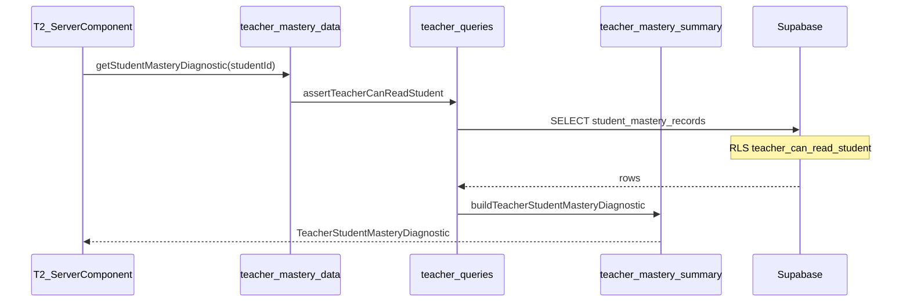

# Proposal: T1 — Teacher mastery read layer

**Status:** Implemented (2026-07-09)  
**Prepared:** 2026-07-09  
**Track:** T-track teacher mastery diagnostics — Phase 1 (server reads)  
**Depends on:** T0 ✅ (migration `026`, `teacher_can_read_student`) · P1 ✅ (`student_mastery_records`)  
**Parent:** T-track broad plan · [PROPOSAL_T0_TEACHER_CLASSES.md](./PROPOSAL_T0_TEACHER_CLASSES.md)  
**Blocks:** T2 per-student diagnostic UI · T3 class-level aggregates

---

## 1. Executive summary

**T1** adds **enrollment-scoped teacher read access** to `student_mastery_records` and a **typed query/summary layer** that reuses existing mastery classification logic (`classifyWordForPractice`, etc.). Teachers can fetch structured diagnostics for enrolled students — weak words, due review, fragile targets, state counts — **without** reading student `localStorage` and **without** a full teacher UI (that is **T2**).

| Deliverable | Teacher-visible UI? |
| --- | --- |
| Migration `027_teacher_mastery_read.sql` — scoped SELECT RLS | No |
| Fix `teacher_can_read_student()` for archived classes | No |
| `lib/mastery/teacher-mastery-summary.ts` — pure aggregation | No |
| `lib/mastery/teacher-queries.ts` — server fetch + guards | No |
| `lib/data/teacher-mastery.ts` — teacher-facing data API | No |
| Unit tests (summary + guards) | No |
| `QA_T1_TEACHER_MASTERY_READ.md` | Engineering |

**Not in T1:** teacher dashboard pages (T2), class-wide aggregate RPC (T3), evidence table reads, lemma resolution in API (word ids only; T2 resolves labels), teacher write/override.

**Effort:** ~1–2 focused sessions  
**Risk:** Medium-low — RLS must stay enrollment-scoped; double-check archived-class edge case.

---

## 2. Problem

T0 answers **who** a teacher may see. T1 answers **what mastery data** they may read for those students.

| Gap today | Impact |
| --- | --- |
| `student_mastery_records` RLS = own student only | Teacher Supabase client gets zero rows |
| No `teacher-queries` module | T2 would duplicate fetch/aggregate logic |
| Roster shows “Coming in T2” | Data path missing |
| `teacher_can_read_student` excludes archived classes | Archived class rosters may lose profile reads (T0 edge case) |

Student-side logic already exists in [`recommendations.ts`](../../lib/mastery/recommendations.ts) and [`SecondaryHome.tsx`](../../components/secondary/SecondaryHome.tsx). T1 **reuses** the same classification on server-fetched records — no second mastery engine.

---

## 3. Goals and non-goals

### 3.1 In scope

1. **RLS policy** — teachers `SELECT` mastery rows where `teacher_can_read_student(student_id)`.
2. **Amend `teacher_can_read_student()`** — allow reads for students enrolled in **any** class the teacher owns (including **archived** classes).
3. **Pure summary module** — build `TeacherStudentMasteryDiagnostic` from `StudentMasteryRecord[]`.
4. **Server query module** — fetch rows (teacher auth + enrollment guard), return summaries.
5. **Class batch helper** — diagnostics for all students in a class (for T2 roster column).
6. **Tests** — pure summary tests with fixture records; mocked Supabase for query guards.
7. **QA checklist** — manual RLS verification with two teachers + enrolled student.

### 3.2 Out of scope (defer)

| Item | Phase |
| --- | --- |
| Teacher UI pages / components | T2 |
| Replace “Coming in T2” roster column | T2 |
| Class-level weak-word frequency aggregates | T3 |
| `student_learning_evidence` teacher read | Post-T1 / audit only |
| Lemma / vocab bank resolution in API | T2 (display layer) |
| Teacher assign / override mastery | Future |
| Pagination / incremental pull | Post-P1 (73 rows/student is fine) |
| Parent portal | Deferred |

---

## 4. Security model

### 4.1 Recommended approach: scoped RLS + app guards (not global RPC)

| Layer | Mechanism |
| --- | --- |
| **Database** | New policy on `student_mastery_records`: `teacher_can_read_student(student_id)` |
| **Application** | `assertTeacherCanReadStudent(studentId)` before fetch |
| **Class batch** | `assertTeacherOwnsClass(classId)` then fetch only enrolled `student_id`s |

**Why not blanket `is_teacher()`?** Would expose every student’s mastery (same rationale as P1a deferral).

**Why not RPC-only?** RLS + typed TypeScript reuse existing [`supabase-rows.ts`](../../lib/mastery/supabase-rows.ts) mappers; RPC can be added in T3 for heavy aggregates.

### 4.2 Amended `teacher_can_read_student` (027)

Remove `tc.archived_at is null` so teachers retain read access for rosters in archived classes:

```sql
create or replace function public.teacher_can_read_student(p_student_id uuid)
returns boolean language sql stable security definer set search_path = public as $$
  select public.is_teacher()
    and exists (
      select 1
      from public.class_enrollments ce
      join public.teacher_classes tc on tc.id = ce.class_id
      where ce.student_id = p_student_id
        and tc.teacher_id = auth.uid()
    );
$$;
```

`student_profiles` policy from T0 automatically benefits from this fix.

### 4.3 New RLS policy

```sql
create policy "student_mastery_records_teacher_select_enrolled"
  on public.student_mastery_records for select
  to authenticated
  using (public.teacher_can_read_student(student_id));
```

**No** teacher INSERT/UPDATE/DELETE on mastery tables.

### 4.4 Access matrix (after T1)

| Actor | `student_mastery_records` | Condition |
| --- | --- | --- |
| Student | SELECT own | `student_id = auth.uid()` |
| Teacher | SELECT enrolled | `teacher_can_read_student(student_id)` |
| Teacher | SELECT non-enrolled | Denied |
| Student | Other student’s rows | Denied |

---

## 5. Data shapes (TypeScript)

### 5.1 `TeacherMasteryTargetRow` (one target, teacher-facing)

```ts
export type TeacherMasteryTargetRow = {
  targetKey: string;
  targetType: LearningTargetType;
  targetLabel?: string;
  state: MasteryState;
  masteryScore: number;
  confidence: number;
  exposureCount: number;
  nextReviewAt: string | null;
  lastSeenAt: string | null;
  updatedAt: string;
  /** Vocabulary lane — from classifyWordForPractice */
  practiceReason?: VocabularyRecommendationReason | "new" | "mastered";
  practiceReasonLabel?: string;
};
```

### 5.2 `TeacherStudentMasteryDiagnostic` (per student)

```ts
export type TeacherStudentMasteryDiagnostic = {
  studentId: string;
  recordCount: number;
  countsByType: Partial<Record<LearningTargetType, number>>;
  countsByState: Partial<Record<MasteryState, number>>;
  latestUpdatedAt: string | null;
  weakWords: TeacherMasteryTargetRow[];      // default top 10 by lowest masteryScore (word targets)
  dueReview: TeacherMasteryTargetRow[];    // classify → due_review
  fragile: TeacherMasteryTargetRow[];        // fragile + low_confidence + stuck/needs_review
  grammarWeak: TeacherMasteryTargetRow[];    // grammar targets, score < 0.5, top 5
};
```

### 5.3 `TeacherClassMasteryOverview` (lightweight batch for T2 roster)

```ts
export type TeacherClassStudentMasteryPreview = {
  studentId: string;
  recordCount: number;
  weakWordCount: number;
  dueReviewCount: number;
  latestUpdatedAt: string | null;
};

export type TeacherClassMasteryOverview = {
  classId: string;
  students: TeacherClassStudentMasteryPreview[];
};
```

---

## 6. Module design

### 6.1 `lib/mastery/teacher-mastery-summary.ts` (pure, no Supabase)

| Function | Role |
| --- | --- |
| `rowsToMasteryRecords(rows)` | Map DB rows → `StudentMasteryRecord[]` via `rowToMasteryRecord` |
| `buildTeacherStudentMasteryDiagnostic(records, options?)` | Full diagnostic object |
| `pickWeakWordTargets(records, limit?)` | `target_type === 'word'`, sort by `masteryScore` asc |
| `pickDueReviewTargets(records, now?)` | Words where `classifyWordForPractice` → `due_review` |
| `pickFragileTargets(records, now?)` | `fragile`, `low_confidence`, `stuck`, `needs_review` |
| `pickGrammarWeakTargets(records, limit?)` | `target_type === 'grammar'`, score < 0.5 |

**Reuse:**
- [`classifyWordForPractice`](../../lib/mastery/recommendations.ts)
- [`vocabularyRecommendationReasonLabel`](../../lib/mastery/recommendations.ts)

**Word id extraction:** `targetKey` format is `word:{id}` per [`learningTargetKey`](../../lib/mastery/engine.ts). Export small helper `parseWordIdFromTargetKey(targetKey)`.

**Options:**
```ts
type BuildDiagnosticOptions = {
  now?: Date;
  weakWordLimit?: number;      // default 10
  grammarWeakLimit?: number;   // default 5
  fragileLimit?: number;       // default 10
  dueReviewLimit?: number;     // default 10
};
```

### 6.2 `lib/mastery/teacher-queries.ts` (server-side fetch)

| Function | Role |
| --- | --- |
| `requireTeacherUser()` | Throws if not `app_metadata.role === 'teacher'` |
| `assertTeacherCanReadStudent(studentId)` | Teacher role + optional direct enrollment check |
| `fetchMasteryRecordsForTeacher(studentId)` | Supabase SELECT all rows for student |
| `getStudentMasteryDiagnosticForTeacher(studentId, options?)` | Fetch + `buildTeacherStudentMasteryDiagnostic` |
| `getClassMasteryOverviewForTeacher(classId)` | Roster student ids → preview per student |

**Fetch query:**
```ts
const { data } = await supabase
  .from("student_mastery_records")
  .select("id, student_id, target_key, target_type, record, updated_at, created_at")
  .eq("student_id", studentId)
  .order("updated_at", { ascending: false });
```

**Empty student:** Return diagnostic with zero counts — not an error (new student).

### 6.3 `lib/data/teacher-mastery.ts` (thin facade for T2)

Wraps `teacher-queries` with `unstable_noStore` / `cache` patterns matching [`teacher-classes.ts`](../../lib/data/teacher-classes.ts):

```ts
export async function getStudentMasteryDiagnostic(studentId: string)
export async function getClassMasteryOverview(classId: string)
```

Verifies class ownership via existing `getTeacherClass(classId)` before batch fetch.

### 6.4 No new server actions in T1

T2 pages call `lib/data/teacher-mastery.ts` directly from Server Components. Actions only if client mutations needed later.

---

## 7. Classification alignment (teacher ↔ student)

Teachers should see **the same reasons** S1 uses for word selection:

| Student S1 / recommendations | Teacher diagnostic bucket |
| --- | --- |
| `due_review` | `dueReview[]` |
| `fragile` | `fragile[]` |
| `low_confidence` | `fragile[]` |
| `developing` | (optional in T2 UI; not primary weak list) |
| Lowest `masteryScore` words | `weakWords[]` (may overlap fragile/due) |

**`weakWords`** = lowest score word targets (like SecondaryHome focus list). **`dueReview` / `fragile`** = reason-based lists (may overlap — T2 UI can dedupe or show separate sections).

---

## 8. Migration `027_teacher_mastery_read.sql`

1. `CREATE OR REPLACE` `teacher_can_read_student` (archived-class fix)
2. `CREATE POLICY` `student_mastery_records_teacher_select_enrolled`
3. Comment header referencing T1 · no grants change (`SELECT` already granted to `authenticated`)

**No changes** to `student_learning_evidence` policies.

---

## 9. Testing

### 9.1 Unit tests — `lib/mastery/teacher-mastery-summary.test.ts`

- Weak word sort order
- Due review detection with `nextReviewAt` in past
- Fragile classification for `stuck` / `needs_review`
- Grammar weak filter
- Empty records → zero diagnostic

### 9.2 Unit tests — `lib/mastery/teacher-queries.test.ts` (mocked Supabase)

- Teacher fetch returns mapped records
- Non-teacher rejected (app guard)
- Class overview returns one preview per enrolled student

### 9.3 Manual QA — `QA_T1_TEACHER_MASTERY_READ.md`

| # | Step | Expected |
| --- | --- | --- |
| 1 | Apply `027` | Policy exists |
| 2 | Teacher A + enrolled student | SQL/API returns mastery rows |
| 3 | Teacher B (not enrolled) | Zero rows / denied |
| 4 | Student token on other student id | Denied |
| 5 | Archived class enrollment | Teacher still reads mastery + profiles |
| 6 | Dev script or temporary route calls `getStudentMasteryDiagnostic` | Weak words match student debug panel |

**Dev verification (T1):** Optional temporary teacher-only dev page `/teacher/classes/[id]/students/[studentId]/mastery-preview` **behind `NODE_ENV=development`** OR run diagnostics via one-off script — **recommended:** skip UI in T1; validate via unit tests + manual Supabase SQL as teacher JWT.

---

## 10. Implementation order (when approved)

1. Migration `027_teacher_mastery_read.sql`
2. `teacher-mastery-summary.ts` + tests
3. `teacher-queries.ts` + tests
4. `lib/data/teacher-mastery.ts`
5. `QA_T1_TEACHER_MASTERY_READ.md`
6. Update [`MASTERY_ROADMAP.md`](./MASTERY_ROADMAP.md) · [`README.md`](./README.md)

**T2 immediately after:** wire `ClassRosterTable` + new student detail route to `getStudentMasteryDiagnostic`.

---

## 11. Performance notes

| Scenario | Scale | Approach |
| --- | --- | --- |
| One student diagnostic | ~73 records today | Single SELECT — fine |
| Class roster preview (20 students) | ~1,500 rows | Parallel `Promise.all` per student OR one `.in('student_id', ids)` query + group in memory |
| Large histories | 500+ records | Defer pagination; monitor in T3 |

**Recommended batch fetch for class overview:**
```ts
.in("student_id", studentIds)
```
Single round-trip; group by `student_id` in TypeScript.

---

## 12. Open questions (approve before coding)

| # | Question | Recommendation |
| --- | --- | --- |
| 1 | **RLS vs RPC** for reads? | **RLS + app layer** |
| 2 | **Include grammar weak list** in T1 diagnostic type? | **Yes** (top 5 grammar targets) |
| 3 | **Fix archived-class read** in same migration? | **Yes** |
| 4 | **Evidence table** teacher SELECT? | **No** — mastery records only |
| 5 | **Dev-only preview page** in T1? | **No** — tests + QA; T2 is first UI |
| 6 | **Default weak word limit** | **10** (SecondaryHome uses 6 — teacher view slightly wider) |
| 7 | **Strand summaries** in diagnostic? | **Defer** — counts by type only; strand rows visible in raw count |

---

## 13. Approval

| Role | Approve T1? | Notes |
| --- | --- | --- |
| Engineering | ☐ | |
| Product | ☐ | |

---

## 14. After T1

**T2 — Teacher diagnostic UI**
- `/teacher/classes/[classId]/students/[studentId]` — weak words, due review, state summary
- Roster column: weak word count + due count from `TeacherClassMasteryOverview`
- Lemma labels via vocab bank loader

**T3 — Class insights**
- Shared weak words across class · students needing attention · optional RPC aggregate

---

## 15. Architecture (target)



T1 ships everything except the T2 box on the left — data layer complete and testable.
