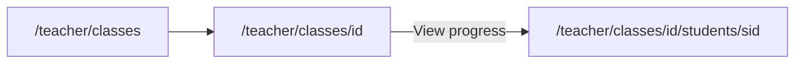

# Proposal: T2 — Teacher student diagnostic UI

**Status:** Implemented  
**Prepared:** 2026-07-09  
**Track:** T-track teacher mastery diagnostics — Phase 2 (teacher UI)  
**Depends on:** T0 ✅ · T1 ✅ (`getStudentMasteryDiagnostic`, `getClassMasteryOverview`)  
**Parent:** T-track broad plan · [PROPOSAL_T1_TEACHER_MASTERY_READS.md](./PROPOSAL_T1_TEACHER_MASTERY_READS.md)  
**Blocks:** T3 class-level insights (optional reuse of overview components)

---

## 1. Executive summary

**T2** gives teachers a **clear, multi-surface view** of how each enrolled student is developing — not raw JSON or `targetKey` strings. It wires T1 data into the existing teacher shell with:

- **Class roster** — at-a-glance mastery signals + link to full profile  
- **Student diagnostic page** — tabbed analysis: Overview, Vocabulary, Grammar, Skills (strands)  
- **Mixed display types** — KPI cards, strand skill map, state distribution bars, prioritized word tables, teacher-facing narrative  

| Deliverable | Student-visible? |
| --- | --- |
| Roster mastery columns + “View progress” links | No |
| `/teacher/classes/[classId]/students/[studentId]` diagnostic page | No |
| Overview tab (summary + strands + narrative) | No |
| Vocabulary / Grammar / Skills tabs | No |
| Small T2 data helpers (strand assessments, labels, narrative) | No |
| `QA_T2_TEACHER_DIAGNOSTIC_UI.md` | Engineering |

**Not in T2:** class-wide aggregate dashboard (T3), assign/reteach workflows, exports/PDF, parent portal, evidence attempt log, lesson progress (T4b).

**Effort:** ~2–3 focused sessions (can ship T2a → T2b in two passes)  
**Risk:** Low-medium — label resolution depends on vocab bank coverage; empty states must be clear for new students.

---

## 2. Product goal

> A teacher opens a student and within **10 seconds** understands: **where they are strong**, **what needs attention now**, and **what type of practice** would help — aligned with the same mastery engine the student app uses.

**Primary user question:** “How is this student developing their English skills?”

**Secondary questions T2 answers:**

| Question | Where in UI |
| --- | --- |
| Are they practicing? | Last active + record count |
| Vocabulary gaps? | Weak / due / fragile lists |
| Grammar gaps? | Grammar tab |
| Broader skill balance? | Skills tab (4 strands + rubric) |
| What should I do next? | Overview narrative + strand `nextMove` hints |

---

## 3. Routes & navigation

### 3.1 Existing (enhance)

| Route | Change |
| --- | --- |
| `/teacher/classes/[classId]` | Roster table: mastery columns + link to student diagnostic |

### 3.2 New

| Route | Purpose |
| --- | --- |
| `/teacher/classes/[classId]/students/[studentId]` | Full student diagnostic (tabbed) |

**Breadcrumb:** Classes → {Class title} → {Student display name}

**Guards:** Teacher secure layout (existing). Server-side: class must exist, student must be on roster (`getClassRoster`), else `notFound()`.



---

## 4. Information architecture — student diagnostic page

### 4.1 Page chrome (persistent above tabs)

| Element | Source |
| --- | --- |
| Student name | `student_profiles.display_name` |
| Username · band | roster / profile |
| Enrolled in class | `class_enrollments.enrolled_at` |
| Last mastery update | `diagnostic.latestUpdatedAt` |
| Record count | `diagnostic.recordCount` |

**Attention badge** (optional pill): show when `dueReview.length > 0` or any strand rubric = `emerging` with sufficient evidence.

---

### 4.2 Tab: **Overview** (default)

Purpose: **Executive summary** — skill development at a glance.

| Section | Display type | Content |
| --- | --- | --- |
| **KPI row** | 4 stat cards | Weak words count · Due review count · Fragile count · Grammar gaps count |
| **Skills at a glance** | 4-column strand cards (mini) | Each strand: short label, rubric level badge, score % bar |
| **Mastery state mix** | Horizontal stacked bar or segmented bar | `countsByState` — introduced / practicing / developing / secure / needs_review / stuck |
| **Progress narrative** | 2–4 sentence prose block | Rule-based teacher summary (see §6.3) |
| **Priority actions** | Bulleted list (max 5) | Actionable items derived from strands + due review |

**Empty state (new student):** “No mastery evidence yet. Student hasn’t practiced while signed in, or data hasn’t synced.” Link hint: ensure student uses authenticated account.

---

### 4.3 Tab: **Vocabulary**

Purpose: **Word-level diagnostic** — what the student struggles with in vocab practice.

**Sub-filter chips (horizontal):** All · Weak · Due review · Fragile · Mastered (optional)

| Column | Display |
| --- | --- |
| Word | Lemma from vocab bank (fallback: `wordItemId`) |
| Score | `masteryScore` as % + thin progress bar |
| State | Chip (`introduced`, `practicing`, …) |
| Signal | Reason chip (`due review`, `fragile`, …) from T1 |
| Exposure | `exposureCount` |
| Last seen | Relative date |
| Next review | Date or “—” |

**Sort default:** lowest score first within active filter.

**Row limit:** Show top 25 with “Showing top 25 of N” if we add full fetch in T2b; T1 lists capped at 10 per bucket — **T2 should extend fetch** to all word records for this tab only (see §7.1).

---

### 4.4 Tab: **Grammar**

Purpose: **Concept-level diagnostic** for GKE / poster quizzes.

| Column | Display |
| --- | --- |
| Concept | `targetLabel` or grammar key |
| Score | % + bar |
| State | Chip |
| Exposure | count |
| Last seen | date |

**Data:** `diagnostic.grammarWeak` prominently; optional full grammar target list from extended fetch.

**Empty state:** “No grammar evidence yet. Grammar practice will appear as students complete poster quizzes.”

---

### 4.5 Tab: **Skills** (learning strands)

Purpose: **Higher-level skill development** — the four strand dimensions from [`learning-strands.ts`](../../lib/learning-strands.ts).

**One card per strand** (vertical stack on mobile, 2×2 grid on desktop):

| Card field | Source |
| --- | --- |
| Title | `LEARNING_STRANDS[id].label` |
| Rubric level | `assessLearningStrand` → `level.label` (Emerging / Developing / Secure / …) |
| Score bar | `masteryScore` 0–100% |
| Confidence | Small secondary metric |
| Evidence | `exposureCount` attempts |
| Teacher meaning | `level.teacherMeaning` |
| Suggested next move | `level.nextMove` |

**Visual:** Rubric level drives badge color (gray → amber → green → blue for extending).

This tab answers “how is the student doing holistically” beyond individual words.

---

### 4.6 Optional tab (defer T2c): **All targets**

Searchable table of every `targetKey` — power-user / debugging. **Recommend defer** unless you want it in v1.

---

## 5. Class roster enhancements

Replace “Coming in T2” column on [`ClassRosterTable.tsx`](../../components/teacher/ClassRosterTable.tsx).

| Column | Content |
| --- | --- |
| **Signals** | Pills: `{dueReviewCount} due` · `{weakWordCount} weak` (from `getClassMasteryOverview`) |
| **Last active** | `latestUpdatedAt` relative |
| **Progress** | Link → `/teacher/classes/[classId]/students/[studentId]` |

**Row highlight (subtle):** amber background when `dueReviewCount > 0`.

**Student name** becomes link to diagnostic page.

**Sort (T2b optional):** by due count descending.

---

## 6. Analysis & narrative layer (new pure helpers)

### 6.1 Strand assessments — `lib/mastery/teacher-mastery-display.ts` (new)

```ts
export function buildTeacherStrandAssessments(
  records: StudentMasteryRecord[],
): LearningStrandAssessment[]

export function resolveTeacherWordLabels(
  wordIds: string[],
): Map<string, { lemma: string; topicLabel?: string }>
```

- Reuse `assessLearningStrands({ records: recordsByKey })` from [`learning-strands.ts`](../../lib/learning-strands.ts)
- Lemma lookup via [`getSecondaryVocabItemsByIds`](../../lib/secondary/secondary-vocab-bank.ts) (default pack; optional class `course_id` pack later)

### 6.2 Attention score (for sorting roster)

```ts
export function teacherAttentionScore(preview: TeacherClassStudentMasteryPreview): number
// dueReviewCount * 3 + weakWordCount + (stale ? 1 : 0)
```

### 6.3 Rule-based progress narrative (Overview tab)

Pure function — **no LLM in T2**:

```ts
export function buildTeacherProgressNarrative(input: {
  diagnostic: TeacherStudentMasteryDiagnostic;
  strands: LearningStrandAssessment[];
  studentDisplayName: string;
}): { summary: string; actions: string[] }
```

**Example output:**

> **Summary:** “Mina has practiced 73 vocabulary targets. Vocabulary is developing, with 4 words due for review. Language-Focused Learning is emerging; other strands have limited evidence.”

> **Actions:**
> - Schedule spaced review for due words
> - Use guided grammar practice (There is / short answers)
> - Collect more evidence in Meaning-Focused Input

**Rules (priority order):**

1. Zero records → onboarding message  
2. Due review > 0 → mention count + spaced review  
3. Weakest strand with evidence → cite rubric + `nextMove`  
4. Fragile / stuck states → mention reteach  
5. Mostly secure → positive + extension suggestion  

---

## 7. Data loading strategy

### 7.1 Extend T1 for full vocabulary tab (recommended in T2)

T1 caps list buckets at 10. Vocabulary tab needs more rows.

| Approach | Recommendation |
| --- | --- |
| Raise T1 limits globally | No — keep T1 summaries lean |
| **T2 fetch all records once** on student page | **Yes** — single `fetchMasteryRecordsForTeacher`, build diagnostic + full word list client-side |
| Pagination | Defer — 73–200 rows is fine |

**Student page loader:**

```ts
const [profile, roster, rows] = await Promise.all([...]);
const records = rowsToMasteryRecords(rows);
const diagnostic = buildTeacherStudentMasteryDiagnostic(studentId, records);
const strands = buildTeacherStrandAssessments(records);
const wordRows = buildVocabularyTableRows(records, wordLabelMap);
```

`getStudentMasteryDiagnostic` remains for quick calls; student page uses lower-level fetch for richness.

### 7.2 Class page

```ts
const [roster, overview] = await Promise.all([
  getClassRoster(classId),
  getClassMasteryOverview(classId),
]);
// merge overview.students by studentId into roster rows
```

---

## 8. Component map

| Component | Type | Role |
| --- | --- | --- |
| `TeacherStudentDiagnosticPage` | Server page | Load data, compose layout |
| `StudentDiagnosticHeader` | Server | Name, meta, badges |
| `StudentDiagnosticTabs` | Client | Tab state (`overview` \| `vocabulary` \| `grammar` \| `skills`) |
| `OverviewTab` | Server children | KPI + strands mini + narrative |
| `KpiStatCard` | Presentational | Single metric |
| `StrandMiniCard` / `StrandDetailCard` | Presentational | Strand visualization |
| `StateDistributionBar` | Presentational | `countsByState` |
| `ProgressNarrative` | Presentational | Summary + actions |
| `VocabularyTargetsTable` | Client | Filter chips + sortable table |
| `GrammarTargetsTable` | Presentational | Grammar rows |
| `SkillsTab` | Presentational | 4 strand cards |
| `MasteryScoreBar` | Presentational | 0–100% bar with color threshold |
| `MasteryStateChip` | Presentational | State / reason badges |
| `ClassRosterTable` | Update existing | Mastery columns + links |

**Styling:** Reuse teacher neutral palette (`border`, `bg-white`, `text-neutral-*`) from [`TeacherSecureShell`](../../components/teacher/TeacherSecureShell.tsx) — **not** kid-ui colors on teacher routes.

---

## 9. Visual language

### 9.1 Score color thresholds (consistent across tabs)

| Range | Color | Label |
| --- | --- | --- |
| 0–34% | Red / rose | Needs support |
| 35–64% | Amber | Developing |
| 65–84% | Green | Secure |
| 85–100% | Teal | Strong |

### 9.2 State chips

Map `MasteryState` to short teacher labels:

| State | Chip |
| --- | --- |
| `introduced` | Introduced |
| `practicing` | Practicing |
| `developing` | Developing |
| `secure` | Secure |
| `needs_review` | Needs review |
| `stuck` | Stuck |
| `new` | New |

### 9.3 Strand rubric badges

Use `StrandRubricLevelId` colors aligned with score bands.

---

## 10. Wireframe (logical layout)

```
┌─────────────────────────────────────────────────────────────┐
│ ← Classes / Tuesday A2                                       │
│ Mina K. · A2 · Enrolled Mar 1 · Last active 2h ago          │
│ [2 due review]                                               │
├─────────────────────────────────────────────────────────────┤
│ [ Overview ] [ Vocabulary ] [ Grammar ] [ Skills ]            │
├─────────────────────────────────────────────────────────────┤
│ OVERVIEW TAB                                                 │
│ ┌────────┐ ┌────────┐ ┌────────┐ ┌────────┐               │
│ │ 8 weak │ │ 2 due  │ │ 3 frag │ │ 1 gram │  KPI cards      │
│ └────────┘ └────────┘ └────────┘ └────────┘               │
│ Skills at a glance                                           │
│ [Input ▓▓░░] [Output ▓░░░] [Study ▓▓▓░] [Fluency ░░░░]      │
│ State mix [introduced|practicing|secure|...]                 │
│ Narrative paragraph...                                       │
│ • Priority action 1                                          │
│ • Priority action 2                                          │
└─────────────────────────────────────────────────────────────┘
```

---

## 11. Implementation phases (when approved)

### T2a — Roster + Overview + Vocabulary (~1.5 sessions)

1. `teacher-mastery-display.ts` + tests (strands, labels, narrative)
2. Extend class detail page data fetch
3. Update `ClassRosterTable`
4. Student diagnostic route — Overview + Vocabulary tabs only
5. QA smoke

### T2b — Grammar + Skills tabs (~1 session)

1. Grammar table + empty states
2. Skills tab with full strand cards
3. Polish: attention badges, name links, relative dates

### T2c (optional) — Roster sort + All targets tab

Defer unless requested.

---

## 12. Testing

| Layer | Coverage |
| --- | --- |
| `teacher-mastery-display.test.ts` | Narrative rules, strand build, attention score |
| Manual QA | `QA_T2_TEACHER_DIAGNOSTIC_UI.md` |
| Visual | Teacher with enrolled student who has 70+ records (your test account) |

---

## 13. Out of scope (T2)

| Item | Track |
| --- | --- |
| Class weak-word frequency heatmap | T3 |
| Compare student vs class average | T3 |
| Export PDF / print | Later |
| Assign word set to student | Later |
| Teacher override mastery | Later |
| Evidence attempt timeline | Post-T1 |
| Lesson completion | T4b |
| Charts library (Recharts) | Use CSS bars in T2; add charts in T3 if needed |

---

## 14. Open questions (approve before coding)

| # | Question | Recommendation |
| --- | --- | --- |
| 1 | **Default tab** | **Overview** |
| 2 | **Vocabulary tab: fetch all word rows?** | **Yes** (one fetch on student page) |
| 3 | **Grammar tab in T2a or T2b?** | **T2b** (T2a = Overview + Vocab + roster) |
| 4 | **Rule-based narrative vs LLM** | **Rule-based** in T2 |
| 5 | **Lemma source** | **Secondary vocab bank** default pack; show id if missing |
| 6 | **“All targets” tab** | **Defer** |
| 7 | **Student name links from roster** | **Yes** |
| 8 | **Charts** | **CSS bars only** in T2 |

---

## 15. Approval

| Role | Approve T2 UI plan? | T2a then T2b? | Notes |
| --- | --- | --- | --- |
| Engineering | ☐ | ☐ | |
| Product | ☐ | ☐ | |

---

## 16. After T2

**T3 — Class insights:** aggregate weak words across roster, “students needing attention” board, shared reteach targets — reuses Overview/Strand components at class scope.
