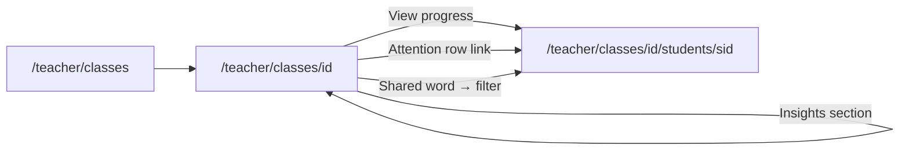
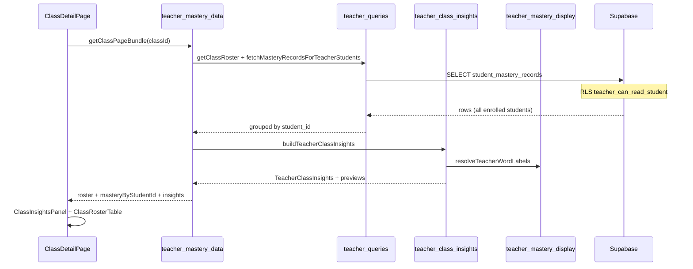

# Proposal: T3 — Class-level mastery insights

**Status:** Awaiting approval  
**Prepared:** 2026-07-09  
**Track:** T-track teacher mastery diagnostics — Phase 3 (class aggregates)  
**Depends on:** T0 ✅ · T1 ✅ · T2 ✅ (`getClassMasteryOverview`, roster signals, student diagnostic UI)  
**Parent:** T-track broad plan · [PROPOSAL_T2_TEACHER_DIAGNOSTIC_UI.md](./PROPOSAL_T2_TEACHER_DIAGNOSTIC_UI.md)  
**Blocks:** T4 optional workflows (assign/reteach) · richer class analytics

---

## 1. Executive summary

**T3** gives teachers a **class-wide view** of skill development — not just per-student drill-down. It answers: *“What is this class struggling with together, and who needs me first?”*

It wires existing batch mastery reads into **aggregates** on the class detail page:

- **Class KPIs** — how many students have data, total due review load, shared weak vocabulary count  
- **Students needing attention** — ranked board with links to T2 student diagnostics  
- **Shared weak vocabulary** — words multiple students struggle with (reteach candidates)  
- **Shared grammar gaps** — concepts weak across the roster  
- **Class strand snapshot** — median rubric level per learning strand across students  
- **Rule-based class narrative** — short summary + prioritized reteach actions  

| Deliverable | Student-visible? |
| --- | --- |
| “Class insights” section on `/teacher/classes/[classId]` | No |
| `lib/mastery/teacher-class-insights.ts` — pure aggregation | No |
| `getClassInsightsBundle()` in `lib/data/teacher-mastery.ts` | No |
| Reuse T2 UI primitives (score bars, rubric badges) | No |
| `QA_T3_CLASS_INSIGHTS.md` | Engineering |

**Not in T3:** assign word sets to students, export/PDF, parent portal, evidence attempt timeline, lesson completion (T4b), LLM-generated insights, new Supabase RPC (unless performance forces it), separate top-level nav item.

**Effort:** ~2 focused sessions (can ship T3a → T3b in two passes)  
**Risk:** Low-medium — duplicate fetch on class page today; T3 consolidates into one bundle. Label coverage same as T2 (vocab bank).

---

## 2. Product goal

> A teacher opens a class and within **15 seconds** understands: **class-wide vocabulary/grammar pressure points**, **which students to check first**, and **what to reteach in the next lesson** — using the same mastery engine as the student app.

**Primary user question:** “What should I focus on with this class?”

**Secondary questions T3 answers:**

| Question | Where in UI |
| --- | --- |
| Who needs me today? | Students needing attention list |
| What words are weak for many students? | Shared weak vocabulary table |
| What grammar should I revisit? | Shared grammar gaps table |
| How balanced is the class on skills? | Class strand snapshot |
| What’s the one-line class story? | Class narrative + reteach actions |
| How does one student compare to peers? | T3b optional (student page context) |

---

## 3. Routes & navigation

### 3.1 Existing (enhance)

| Route | Change |
| --- | --- |
| `/teacher/classes/[classId]` | Add **Class insights** section above roster |

**No new route in T3a.** Insights live on the class detail page teachers already use. Keeps teacher shell simple (Classes → Class → Student).

**Optional T3c:** `/teacher/classes/[classId]/insights` as a dedicated page if the combined page feels crowded — **recommend defer** unless product wants a print-friendly view later.



### 3.2 Breadcrumb / anchors

- Class insights section: `id="class-insights"` for deep links from future T4 workflows  
- Shared weak word rows may link to first struggling student’s vocabulary tab (query `?tab=vocabulary` optional in T3b)

---

## 4. Information architecture — class detail page

### 4.1 Page order (after T3)

```
← Classes
Class title · N students · Course · Archived
Join code panel
─────────────────────────────────────
CLASS INSIGHTS          ← new (T3)
  KPI row
  Students needing attention
  Shared weak vocabulary
  Shared grammar gaps      (T3b)
  Class strand snapshot    (T3b)
  Class narrative + actions
─────────────────────────────────────
ROSTER                  ← existing (T2)
  per-student signals + links
```

### 4.2 Section: Class KPI row

| Card | Source |
| --- | --- |
| Students with data | `studentsWithData` / `studentCount` |
| Total due review | Sum of `dueReviewCount` across roster |
| Shared weak words | Count of words with ≥2 struggling students |
| Shared grammar gaps | Count of grammar targets with ≥2 weak students (T3b) |

**Empty class:** Hide insights section when roster is empty (join code CTA only).

**No class data yet:** Banner — “No mastery data for this class yet. Students need to practice while signed in.”

---

### 4.3 Section: Students needing attention

Purpose: **Prioritized queue** for teacher check-ins.

| Column | Content |
| --- | --- |
| Rank | 1…N by attention score |
| Student | Name → `/teacher/classes/[classId]/students/[studentId]` |
| Signals | Pills: `{due} due` · `{weak} weak` · `{fragile} fragile` |
| Last active | Relative date |
| Score | Attention score (hidden or tooltip — used for sort only) |

**Sort:** `teacherAttentionScore` descending (extend T2 helper with `fragileCount`).

**Row limit:** Top 8; footnote “+N more students” if roster larger and others have score > 0.

**Highlight:** Same amber treatment as T2 roster when `dueReviewCount > 0`.

---

### 4.4 Section: Shared weak vocabulary

Purpose: **Reteach vocabulary** that affects multiple students.

| Column | Display |
| --- | --- |
| Word | Lemma from vocab bank (fallback: `wordItemId`) |
| Students | Count + optional “View” expand list of names |
| Avg score | Class average mastery % + thin bar |
| Min score | Lowest student score (shows severity) |
| Reteach | Implicit — top rows are suggestions |

**Definition (recommended):** Word target where **≥2 enrolled students** have `targetType === "word"`, `exposureCount > 0`, and `masteryScore < 0.5`.

**Sort default:** `studentCount` desc, then `avgScore` asc.

**Row limit:** Top 15 with “Showing top 15 of N shared words.”

**Empty state:** “No shared weak words yet — either the class is doing well or students need more practice data.”

---

### 4.5 Section: Shared grammar gaps (T3b)

| Column | Display |
| --- | --- |
| Concept | `targetLabel` or grammar key |
| Students | Count struggling |
| Avg score | % + bar |
| Min score | Lowest |

**Definition:** Grammar target where **≥2 students** have `exposureCount > 0` and `masteryScore < 0.5` (same threshold as T1 `pickGrammarWeakTargets`).

---

### 4.6 Section: Class strand snapshot (T3b)

Purpose: **Holistic class balance** across the four learning strands.

**One mini card per strand** (reuse T2 `StrandMiniCard` styling):

| Field | Computation |
| --- | --- |
| Title | `LEARNING_STRANDS[id].label` |
| Class rubric | Median student strand score → map to rubric level |
| Score bar | Median `masteryScore` 0–100% |
| Evidence | “N of M students with evidence” |

**Per student:** `buildTeacherStrandAssessments(records)` (T2).  
**Per class:** median of each strand’s `masteryScore` across students with `evidenceCount > 0`; students with no evidence excluded from median but counted in denominator footnote.

---

### 4.7 Section: Class narrative + reteach actions

Rule-based prose (no LLM), parallel to T2 `buildTeacherProgressNarrative`:

**Example summary:**

> “Tuesday A2 has 12 enrolled students; 9 have synced mastery data. 14 words are weak for multiple students. Meaning-Focused Output is the lowest class strand (median 42%). 5 students have vocabulary due for review.”

**Example actions (max 5):**

- Reteach shared words: *environment*, *pollution*, *recycle* (top 3 lemmas)  
- Run a class grammar review on *There is / There are*  
- Check in with Mina and Lin (highest attention scores)  
- Schedule a spaced-review block for due vocabulary  

---

## 5. Data layer design

### 5.1 New module — `lib/mastery/teacher-class-insights.ts`

Pure functions only — no Supabase imports.

```ts
export type SharedWeakWordRow = {
  wordItemId: string;
  lemma: string;
  studentCount: number;
  studentIds: string[];
  avgScore: number;
  minScore: number;
};

export type SharedGrammarGapRow = {
  targetKey: string;
  label: string;
  studentCount: number;
  studentIds: string[];
  avgScore: number;
  minScore: number;
};

export type ClassStudentAttentionRow = {
  studentId: string;
  dueReviewCount: number;
  weakWordCount: number;
  fragileCount: number;
  attentionScore: number;
  latestUpdatedAt: string | null;
};

export type ClassStrandSummaryRow = {
  strandId: LearningStrandId;
  strandLabel: string;
  medianScore: number;
  level: StrandRubricLevel;
  studentsWithEvidence: number;
  studentCount: number;
};

export type TeacherClassInsights = {
  classId: string;
  studentCount: number;
  studentsWithData: number;
  totalDueReview: number;
  totalWeakWordInstances: number;
  sharedWeakWords: SharedWeakWordRow[];
  sharedGrammarGaps: SharedGrammarGapRow[];
  studentsNeedingAttention: ClassStudentAttentionRow[];
  strandSummary: ClassStrandSummaryRow[];
  narrative: { summary: string; actions: string[] };
};

export function buildSharedWeakWords(input: {
  recordsByStudentId: Map<string, StudentMasteryRecord[]>;
  minStudents?: number;
  maxScore?: number;
  limit?: number;
}): SharedWeakWordRow[];

export function buildSharedGrammarGaps(input: {
  recordsByStudentId: Map<string, StudentMasteryRecord[]>;
  minStudents?: number;
  maxScore?: number;
  limit?: number;
}): SharedGrammarGapRow[];

export function buildStudentsNeedingAttention(input: {
  recordsByStudentId: Map<string, StudentMasteryRecord[]>;
  limit?: number;
}): ClassStudentAttentionRow[];

export function buildClassStrandSummary(input: {
  recordsByStudentId: Map<string, StudentMasteryRecord[]>;
}): ClassStrandSummaryRow[];

export function buildTeacherClassNarrative(input: {
  insights: TeacherClassInsights;
  classTitle: string;
  rosterNamesById: Map<string, string>;
}): { summary: string; actions: string[] };

export function buildTeacherClassInsights(input: {
  classId: string;
  studentIds: string[];
  recordsByStudentId: Map<string, StudentMasteryRecord[]>;
  options?: { minSharedStudents?: number; weakMaxScore?: number };
}): TeacherClassInsights;
```

**Lemma resolution:** Reuse `resolveTeacherWordLabels` from [`teacher-mastery-display.ts`](../../lib/mastery/teacher-mastery-display.ts).

**Strand rubric from median:** Reuse score → level mapping from [`learning-strands.ts`](../../lib/learning-strands.ts) (`assessLearningStrand` thresholds) applied to median score.

### 5.2 Extend attention score (T2 helper)

```ts
// teacher-mastery-display.ts — extend, not replace
export function teacherAttentionScore(input: {
  dueReviewCount: number;
  weakWordCount: number;
  fragileCount?: number;
  latestUpdatedAt: string | null;
}): number
// dueReviewCount * 3 + weakWordCount + fragileCount + (stale ? 1 : 0)
```

### 5.3 Extend `TeacherClassStudentMasteryPreview` (optional)

T3 can compute fragile counts in the insights builder without changing T1 types. **Recommend:** keep T1 preview type stable; fragile count computed only in `buildStudentsNeedingAttention` from full records.

### 5.4 Facade — `lib/data/teacher-mastery.ts`

**Problem today:** Class page calls `getClassMasteryOverview`, which batch-fetches all rows. T3 needs the same rows plus aggregates — **do not fetch twice**.

```ts
export type TeacherClassPageBundle = {
  roster: ClassRosterStudent[];
  masteryByStudentId: Record<string, TeacherClassStudentMasteryPreview>;
  insights: TeacherClassInsights;
};

export async function getClassPageBundle(classId: string): Promise<TeacherClassPageBundle | null>;
```

**Loader flow:**

```ts
const teacherClass = await getTeacherClass(classId);
const roster = await getClassRoster(classId);
const studentIds = roster.map((s) => s.studentId);
const rows = await fetchMasteryRecordsForTeacherStudents(studentIds);
const grouped = groupRowsByStudentId(rows);
const recordsByStudentId = new Map(
  studentIds.map((id) => [id, rowsToMasteryRecords(grouped.get(id) ?? [])]),
);
const masteryByStudentId = Object.fromEntries(
  studentIds.map((id) => [
    id,
    buildTeacherClassStudentMasteryPreview(id, recordsByStudentId.get(id)!),
  ]),
);
const insights = buildTeacherClassInsights({ classId, studentIds, recordsByStudentId });
```

`getClassMasteryOverview` remains for callers that only need previews; class page switches to `getClassPageBundle`.

**Export `groupRowsByStudentId`** from `teacher-queries.ts` (currently private) or duplicate minimal grouping in facade — prefer **export** to avoid drift.

---

## 6. Security & performance

### 6.1 Security

| Layer | Mechanism |
| --- | --- |
| **Database** | Unchanged — T1 RLS `teacher_can_read_student` |
| **Application** | `getTeacherClass` + roster membership; only enrolled `student_id`s fetched |
| **Aggregates** | Computed in memory from rows teacher already may read |

**No new migration in T3.**

### 6.2 Performance

| Scenario | Scale | Approach |
| --- | --- | --- |
| Typical class | 15 students × ~80 records ≈ 1,200 rows | Single `.in('student_id', ids)` — same as T1 |
| Large class | 30 students × 150 records ≈ 4,500 rows | Monitor; still OK in TypeScript for v1 |
| Very large | 50+ students or 500+ records/student | **T3c:** Supabase RPC `teacher_class_mastery_aggregate(class_id)` |

**Recommendation:** App-layer aggregation for T3a/T3b. Add RPC only if real classes exceed ~5k rows or page load > 2s.

### 6.3 Caching

`noStore()` on teacher data loaders (existing pattern). No CDN cache.

---

## 7. Component map

| Component | Type | Role |
| --- | --- | --- |
| `ClassInsightsPanel` | Server | Wraps all insight sections |
| `ClassKpiRow` | Presentational | 4 stat cards |
| `StudentsNeedingAttentionTable` | Presentational | Ranked attention list |
| `SharedWeakWordsTable` | Presentational | Shared vocab aggregates |
| `SharedGrammarGapsTable` | Presentational | T3b grammar aggregates |
| `ClassStrandSummaryGrid` | Presentational | T3b — reuse `StrandMiniCard` |
| `ClassProgressNarrative` | Presentational | Summary + bullet actions |
| `ClassRosterTable` | Existing | Unchanged; fed from same bundle |
| `MasteryScoreBar`, `RubricBadge` | T2 reuse | Score visualization |

**Styling:** Teacher neutral palette from T2 — no kid-ui colors.

**Location:** `web/components/teacher/mastery/ClassInsightsPanel.tsx` (+ small presentational children or single file if <200 lines).

---

## 8. Visual language

Reuse T2 thresholds unchanged:

| Range | Color |
| --- | --- |
| 0–34% | Rose |
| 35–64% | Amber |
| 65–84% | Emerald |
| 85–100% | Teal |

**Shared word heat (optional T3b polish):** Student count pill intensity — 2 students = amber, ≥50% of class = rose. CSS only, no chart library.

---

## 9. Wireframe (logical layout)

```
┌─────────────────────────────────────────────────────────────┐
│ ← Classes                                                    │
│ Tuesday A2 · 12 students · Course: Secondary 7              │
│ [Join code panel]                                            │
├─────────────────────────────────────────────────────────────┤
│ CLASS INSIGHTS                                               │
│ ┌──────────┐ ┌──────────┐ ┌──────────┐ ┌──────────┐        │
│ │ 9 / 12   │ │ 18 due   │ │ 14 shared│ │ 3 grammar│  KPIs   │
│ │ w/ data  │ │ review   │ │ weak wrd │ │ gaps     │        │
│ └──────────┘ └──────────┘ └──────────┘ └──────────┘        │
│                                                              │
│ Students needing attention                                   │
│ 1. Mina K.     [3 due] [5 weak]     2h ago        →         │
│ 2. Lin P.      [2 due] [4 weak]     1d ago        →         │
│                                                              │
│ Shared weak vocabulary                                       │
│ pollution    5 students   avg 32%  min 18%   ▓▓░░░░         │
│ environment  4 students   avg 38%  min 22%   ▓▓░░░░         │
│                                                              │
│ Class strand snapshot (T3b)                                  │
│ [Input ▓▓░░] [Output ▓░░░] [Study ▓▓▓░] [Fluency ▓▓░░]      │
│                                                              │
│ Narrative: "Tuesday A2 has 9 students with synced data..."   │
│ • Reteach: pollution, environment, recycle                   │
│ • Grammar review: There is / There are                       │
├─────────────────────────────────────────────────────────────┤
│ ROSTER (existing T2 table)                                 │
└─────────────────────────────────────────────────────────────┘
```

---

## 10. Implementation phases (when approved)

### T3a — Attention board + shared weak words (~1 session)

1. `teacher-class-insights.ts` — `buildSharedWeakWords`, `buildStudentsNeedingAttention`, `buildTeacherClassInsights` (partial), tests  
2. Extend `teacherAttentionScore` with `fragileCount`  
3. `getClassPageBundle` — consolidate fetch; update class detail page  
4. `ClassInsightsPanel` — KPI row + attention table + shared weak words  
5. QA smoke with multi-student test class  

### T3b — Grammar, strands, narrative (~1 session)

1. `buildSharedGrammarGaps`, `buildClassStrandSummary`, `buildTeacherClassNarrative` + tests  
2. Complete `ClassInsightsPanel` sections  
3. Optional: student page “vs class median” footnote on Overview KPIs  
4. `QA_T3_CLASS_INSIGHTS.md`  
5. Update [`README.md`](./README.md) · [`MASTERY_ROADMAP.md`](./MASTERY_ROADMAP.md)

### T3c (optional / defer)

| Item | Trigger |
| --- | --- |
| Roster sort by attention score | Product request |
| Dedicated `/insights` route | Page too long on mobile |
| Supabase aggregate RPC | >5k rows or slow loads |
| Recharts / heatmap | Product wants richer viz |
| `?tab=vocabulary&word=` deep link from shared row | Nice-to-have |

---

## 11. Testing

| Layer | Coverage |
| --- | --- |
| `teacher-class-insights.test.ts` | Shared word grouping (2+ students), attention ordering, median strand math, narrative rules, empty class |
| Regression | Existing `teacher-mastery-display` attention score tests updated for `fragileCount` |
| Manual QA | `QA_T3_CLASS_INSIGHTS.md` — 2+ students sharing weak words, empty class, single-student class |
| Visual | Class with 70+ records/student (your test account) |

**Fixture pattern:** Extend `wordRecordFixture` across 2–3 fake student IDs with overlapping `wordItemId`s.

---

## 12. Out of scope (T3)

| Item | Track |
| --- | --- |
| Assign reteach word set to class | T4 / later |
| Push notifications / email digests | Later |
| Parent portal | Deferred |
| Evidence attempt timeline | Post-T1 |
| Lesson completion per student | T4b |
| Class comparison across multiple classes | Later |
| LLM-generated teaching plans | Later |
| Teacher override mastery | Later |
| Export PDF / print layout | Later |
| Real-time subscriptions | Later |

---

## 13. Open questions (approve before coding)

| # | Question | Recommendation |
| --- | --- | --- |
| 1 | **Where do insights live?** | **Section on class detail page** (no new route in T3a) |
| 2 | **“Shared weak” threshold** | **≥2 students** with score **< 0.5** and exposure **> 0** |
| 3 | **Consolidate class page fetch?** | **Yes** — `getClassPageBundle` replaces duplicate overview + insights fetches |
| 4 | **Grammar + strands in T3a or T3b?** | **T3b** — T3a ships attention + shared vocab + KPIs |
| 5 | **Student vs class median on student page?** | **T3b optional** — small footnote on Overview (“Class median: 62%”) |
| 6 | **Rule-based vs LLM narrative** | **Rule-based** (match T2) |
| 7 | **Lemma source** | **Secondary vocab bank** (same as T2) |
| 8 | **Charts** | **CSS bars only** |
| 9 | **New Supabase RPC?** | **No** unless perf forces T3c |
| 10 | **Show student names on shared word row?** | **Count + tooltip/expand** — avoid cluttering table |

---

## 14. Approval

| Role | Approve T3 plan? | T3a then T3b? | Notes |
| --- | --- | --- | --- |
| Engineering | ☐ | ☐ | |
| Product | ☐ | ☐ | |

---

## 15. After T3

**T4 — Teacher workflows (optional)**  
- “Suggest reteach set” from shared weak words → assign vocab practice (requires student assignment model)  
- Class export / parent summary  

**T4b — Lesson progress reads**  
- Teacher sees lesson completion alongside mastery (separate data source)

---

## 16. Architecture (target)



T3 adds the **Insights** box; T1/T2 data path and RLS stay unchanged.
