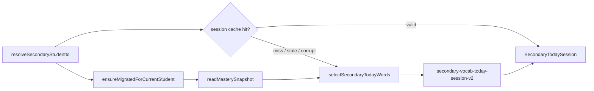

# Secondary Session Selection (v2)

**Status:** Implemented (S1a + S1b, 2026-07-09)  
**Code:** `lib/secondary/secondary-session-selection.ts`, `lib/secondary/secondary-today-session.ts`  
**Parent:** [PROPOSAL_SECONDARY_SESSION_SELECTION_V2.md](./PROPOSAL_SECONDARY_SESSION_SELECTION_V2.md)

Lower Secondary builds a **daily word set** per student per calendar day. Version 2 uses **platform mastery records** and explicit **due / fragile / new / refresh** quotas instead of the v1 due-weakest heuristic.

---

## 1. Flow



**Cache miss triggers:** no row for today, corrupt JSON, or **stale empty** (`allWordItemIds: []` while bank has words).

**Same-day policy:** Valid cached sessions are returned unchanged until the calendar day rolls — including v1 sessions without `selectionVersion`.

---

## 2. Modules

| Module | Role |
| --- | --- |
| `secondary-session-selection.ts` | Pure quota engine; no localStorage |
| `secondary-today-session.ts` | Cache read/write, cloze blank ids, wire to engine |
| `recommendations.ts` | `classifyWordForPractice()` — shared bucket classifier |
| `local-storage.ts` | Scoped `readMasterySnapshot()` |
| `student-storage-id.ts` | `resolveStudentStorageIdSync()` → cache key prefix |
| `secondary-practice-types.ts` | M4 cloze eligibility filter |

---

## 3. Buckets

Each bank word is classified into **one primary bucket** (first match in classifier; secondary overrides mastered):

| Bucket | Rule |
| --- | --- |
| `mastered` | `masteryScore >= 0.75` — **excluded** from normal picks |
| `due` | `nextReviewAt <= now` (classifier; due before mastered for vocab parity) |
| `fragile` | `state ∈ { needs_review, stuck }` or `low_confidence` |
| `new` | No record or `exposureCount === 0` |
| `refresh` | Seen, not due, not mastered, not fragile |

Classifier: `classifyWordForPractice()` in `lib/mastery/recommendations.ts`.  
Secondary maps `low_confidence` → fragile; `developing` / `null` → refresh.

---

## 4. Default quotas

Constants in `secondary-session-selection.ts`:

| Slot | Constant | Default |
| --- | --- | --- |
| Warm-up | `WARMUP_WORDS` | 3 |
| Due (today list) | `DUE_QUOTA` | 4 |
| Fragile | `FRAGILE_QUOTA` | 3 |
| New | `NEW_QUOTA` | 2 |
| Refresh | `REFRESH_QUOTA` | 1 |
| Today target | `TARGET_TODAY_WORDS` | 10 |

**Fill order:** due → fragile → new → refresh (waterfall until `TARGET_TODAY_WORDS`).

**Warm-up:** Up to 3 words from **due + fragile**, preferring words with prior exposure.

**Grand total:** Up to **13** words (warm-up + today) before cloze force-includes. v1 capped at ~10 total.

Within bucket, sort by: lower `masteryScore` → lower `recentAccuracy` → lower `exposureCount` → `wordItemId`.

**Refresh variety:** `shuffleWithSeed(candidates, `${studentId}:${dateKey}:refresh`)` so accounts on one browser do not share the same shuffle stream.

---

## 5. Cloze force-include

After quota selection, `secondary-today-session.ts` collects cloze template blank ids that:

1. Exist in the vocab bank
2. Pass M4 `filterWordItemIdsForSecondaryActivity(..., "cloze")`

Missing blanks are appended to **today** with reason `cloze_include`. Mastered words **may** appear via this path only.

---

## 6. Storage (P0 account-scoped)

| Key | Shape |
| --- | --- |
| Session | `secondary-vocab-today-session-v2:{studentStorageId}:{dateKey}` |
| Mastery | `wke-student-mastery-v1:{studentStorageId}` |
| Evidence | `wke-learning-evidence-v1:{studentStorageId}` |

`studentStorageId` = auth `user.id` when logged in, else guest `anonymousDeviceId`.

Guest → login: `student-storage-migrate.ts` copies legacy namespaces once; selection reads migrated mastery on next cache miss.

---

## 7. Session payload

```ts
interface SecondaryTodaySession {
  dateKey: string;              // YYYY-MM-DD local
  warmUpWordItemIds: string[];
  todayWordItemIds: string[];
  allWordItemIds: string[];   // unique union
  selectionVersion?: 2;       // new builds only
}
```

`selectionReasons` are **not** persisted (debug deferred — S1c).

---

## 8. Invariants (do not break)

- Evidence emitters (`recordSecondaryWordAttempt` → platform) unchanged by S1
- `areSecondaryActivityWordsComplete` + local repair overlay (M2) unchanged
- M4 per-activity `practiceTypes` filtering in Match / Cloze / Spelling unchanged
- No second mastery engine or parallel aggregate store

---

## 9. Relation to vocabulary adaptive mix

Vocab sets use `recommendVocabularyPracticeWords()` (~50% review fill). Secondary uses **stricter quotas** but shares **`classifyWordForPractice`** for reason codes. Do not call vocab recommendation directly for secondary — quotas differ.

---

## 10. Tests

| File | Coverage |
| --- | --- |
| `secondary-session-selection.test.ts` | Buckets, quotas, cloze, determinism, account shuffle |
| `secondary-today-session.test.ts` | Wire, cache, scoped mastery, isolation, migrate |
| `recommendations.test.ts` | `classifyWordForPractice` |

```bash
npx vitest run lib/secondary/ lib/mastery/recommendations.test.ts
```

Manual QA: [QA_S1_SESSION_SELECTION.md](./QA_S1_SESSION_SELECTION.md)

---

## 11. Related docs

- [PROPOSAL_ACCOUNT_LINKED_LOCAL_STORAGE.md](./PROPOSAL_ACCOUNT_LINKED_LOCAL_STORAGE.md) — P0 Layers A + B
- [SECONDARY_TO_PLATFORM_MASTERY_BRIDGE.md](./SECONDARY_TO_PLATFORM_MASTERY_BRIDGE.md) — M0–M6 bridge
- [MASTERY_ENGINE_SPEC.md](./MASTERY_ENGINE_SPEC.md) — evidence + update rules

**Deferred:** `?secondaryDebug=1` reason chips on Secondary Home (S1c).
