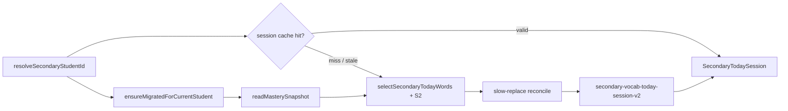

# Secondary Session Selection (v3)

**Status:** Implemented (S1 + S2 + Phases 1–4, 2026-07-09)  
**Code:** `lib/secondary/secondary-session-selection.ts`, `secondary-selection-s2.ts`, `secondary-today-session.ts`  
**Parent:** [PROPOSAL_SECONDARY_SESSION_SELECTION_V2.md](./PROPOSAL_SECONDARY_SESSION_SELECTION_V2.md)

Lower Secondary builds a **daily word set** per student per calendar day. **v3** adds S2 rules (topic spread, stretch word) on top of S1 quota selection. Cloze blanks are compiled dynamically from today's list — not from static MVP templates.

---

## 1. Flow



**Cache miss / rebuild triggers:**

- No row for today
- Corrupt JSON
- Stale empty session (`allWordItemIds: []` while bank has words)
- Pack `packId` / `packVersion` mismatch
- Unknown `wordItemId` in any session field (including slow-replace audit arrays)

**Same-day policy:** Valid cached sessions are returned unchanged until the calendar day rolls — slow-replace may mutate the focus list during the day. Mastered **warm-up** words are pruned on each session reconcile (load, activity completion refresh).

**Warm-up graduation:** When a warm-up word crosses the mastery threshold (`masteryScore >= 0.75`), it is removed from `warmUpWordItemIds` and `allWordItemIds` on the next session reconcile. It no longer appears in the sidebar or activities. Focus words use slow-replace instead.

**Word Helper (learn lane):** The Word Helper drawer (`SecondaryWordLearnDrawer`) is **orthogonal** to daily activity completion. Opening a word chip, reading content, or completing in-drawer practice updates platform mastery via `secondary:learn` evidence but does **not** mark Match, Cloze, or Spelling complete for that word.

---

## 2. Modules

| Module | Role |
| --- | --- |
| `secondary-session-selection.ts` | S1 quota engine + `SECONDARY_SELECTION_VERSION` |
| `secondary-selection-s2.ts` | Topic spread (max 4/topic) + 1 stretch word |
| `secondary-session-slow-replace.ts` | FIFO eviction when ≥3 words mastered on today's list |
| `secondary-cloze-compiler.ts` | Dynamic cloze from today's cloze-eligible words |
| `secondary-today-session.ts` | Cache, reconcile, activity completion hook |
| `secondary-activity-completion.ts` | Home refresh event + Supabase queue flush |
| `secondary-session-lifecycle.ts` | Stale detection + local activity prune |
| `recommendations.ts` | `classifyWordForPractice()` — shared bucket classifier |

---

## 3. Buckets (S1)

| Bucket | Rule |
| --- | --- |
| `mastered` | `masteryScore >= 0.75` — excluded from normal picks |
| `due` | `nextReviewAt <= now` |
| `fragile` | `state ∈ { needs_review, stuck }` or `low_confidence` |
| `new` | No record or `exposureCount === 0` |
| `refresh` | Seen, not due, not mastered, not fragile |

**Fill order:** due → fragile → new → refresh (waterfall to `TARGET_TODAY_WORDS`).

---

## 4. Default quotas

| Slot | Constant | Default |
| --- | --- | --- |
| Warm-up | `WARMUP_WORDS` | 3 |
| Due (today list) | `DUE_QUOTA` | 4 |
| Fragile | `FRAGILE_QUOTA` | 3 |
| New | `NEW_QUOTA` | 2 |
| Refresh | `REFRESH_QUOTA` | 1 |
| Today target | `TARGET_TODAY_WORDS` | 10 |

After quotas: **S2** enforces max **4 words per topic** on today's list and swaps in **1 stretch** word (replaces a refresh slot when possible).

---

## 5. Session model semantics

| Field | Meaning |
| --- | --- |
| `warmUpWordItemIds` | Up to 3 due/fragile words with prior exposure — included in **activities** until mastered, then pruned from list + pools |
| `todayWordItemIds` | **Focus list** (10) — sidebar, daily mastery goal meter, slow-replace FIFO |
| `allWordItemIds` | Unique union of warmup + today — Match / Spelling / Cloze / Sentence word pools |
| `initialTodayWordItemIds` | Snapshot at first build — baseline for analytics |
| `introducedWordItemIds` | Words swapped **onto** today's list via slow-replace (UI **· New** badge) |
| `replacedOutWordItemIds` | Words evicted from today's list (excluded from re-picks) |
| `masteredOnListOrder` | FIFO queue of words that crossed mastered **while on today's list** |
| `selectionReasons` | Per-word reason: `due_review`, `fragile`, `new`, `refresh`, `stretch`, `cloze_include` |
| `selectionVersion` | `3` = S1 + S2; `2` = legacy S1-only cached sessions |
| `packId` / `packVersion` | Invalidates session when bank JSON bumps |

**Cloze:** `compileSecondaryClozeFromWordIds({ wordItemIds: allWordItemIds, masteryRecords, replayIndex })` — **v3** topic-coherent paragraph (target **5** blanks, mastered off-list fillers, topic rotation on replay). See [QA_P6C_CLOZE_V3.md](./QA_P6C_CLOZE_V3.md).

**Activity completion:** `setSecondaryTodayActivityCompletion` → `afterSecondaryActivityCompletion()` → `secondary-session-changed` event + `flushMasterySyncQueueForCurrentStudent()`.

---

## 6. Storage (P0 account-scoped)

| Key | Shape |
| --- | --- |
| Session | `secondary-vocab-today-session-v2:{studentStorageId}:{dateKey}` |
| Completion | `secondary-vocab-today-completion-v1:{studentStorageId}:{dateKey}` |
| Mastery | `wke-student-mastery-v1:{studentStorageId}` |

---

## 7. Tests

| File | Coverage |
| --- | --- |
| `secondary-session-selection.test.ts` | S1 buckets, quotas, determinism |
| `secondary-session-selection-full-pack.test.ts` | 240-word bank, topic spread, stretch |
| `secondary-selection-s2.test.ts` | Topic cap + stretch unit tests |
| `secondary-cloze-coverage.test.ts` | Phase 6A tier A/B floor, no tier D |
| `secondary-cloze-compiler.test.ts` | Dynamic cloze v2 (topic pick, determinism) |
| `secondary-cloze-paragraph.test.ts` | Connectives + topic fallback |
| `secondary-cloze-distractors.test.ts` | Word bank pool |
| `secondary-cloze-clause.test.ts` | Frame → clause |
| `secondary-session-slow-replace.test.ts` | FIFO replacement |
| `secondary-session-warmup-prune.test.ts` | Warm-up graduation on mastery |
| `secondary-today-session.test.ts` | Cache, pack version, isolation |
| `secondary-today-session-completion.test.ts` | Activity complete → sync hook |
| `secondary-activity-completion.test.ts` | Notify + flush |
| `secondary-session-lifecycle.test.ts` | Stale unknown ids, activity prune |

```bash
npx vitest run lib/secondary/
npm run report:secondary-cloze
```

Manual QA: [QA_S1_SESSION_SELECTION.md](./QA_S1_SESSION_SELECTION.md) · [QA_P3_SECONDARY_INTEGRATION.md](./QA_P3_SECONDARY_INTEGRATION.md) · [QA_P6A_CLOZE_COVERAGE.md](./QA_P6A_CLOZE_COVERAGE.md) · [QA_P6B_CLOZE_COMPILER.md](./QA_P6B_CLOZE_COMPILER.md)

---

## 8. Related docs

- [QA_P1_SYNC_E2E.md](./QA_P1_SYNC_E2E.md) — cross-device mastery (includes secondary path)
- [MASTERY_SUPABASE_SYNC.md](./MASTERY_SUPABASE_SYNC.md) — P1 sync architecture
- [SECONDARY_TO_PLATFORM_MASTERY_BRIDGE.md](./SECONDARY_TO_PLATFORM_MASTERY_BRIDGE.md)

**Phase 5 (2026-07-09):** Warm-up / focus sidebar lanes, student reason chips, slow-replace copy, `?secondaryDebug` staff preview.

**Phase 6A (2026-07-09):** Cloze coverage audit — 100% tier A. [QA_P6A_CLOZE_COVERAGE.md](./QA_P6A_CLOZE_COVERAGE.md)

**Phase 6B (2026-07-09):** Cloze compiler v2 — topic paragraphs, connectives, richer distractors. [QA_P6B_CLOZE_COMPILER.md](./QA_P6B_CLOZE_COMPILER.md)

**Learn lane L5 (2026-07-10):** Word Helper drawer signoff — in-drawer practice, hub alignment. [QA_L5_SECONDARY_LEARN.md](./QA_L5_SECONDARY_LEARN.md)

**Deferred (Phase 6C+):** Teacher topic lens (6D), content ops pipeline (6C), class heatmap (6E).
